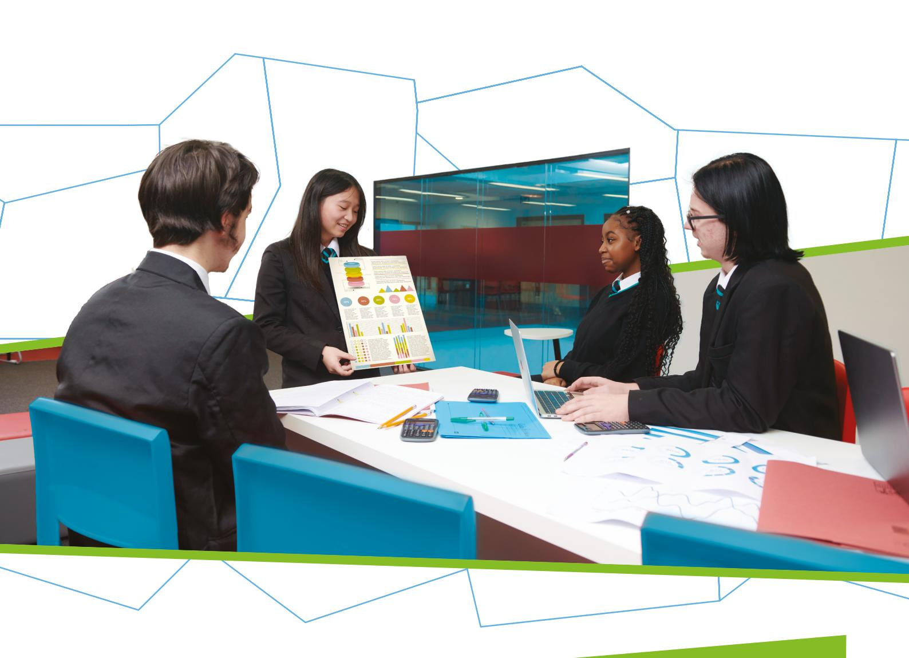

{1}------------------------------------------------

# WJEC GCSE Business

Approved by Qualifications Wales

## Specification

Teaching from 2025 For award from 2027

Version 4 - September 2025

Ready for the world. This Qualifications Wales regulated qualification is not available to centres in England.

Made for Wales.

{2}------------------------------------------------

{3}------------------------------------------------

This specification meets the requirements of the following regulatory documents published by Qualifications Wales:

- [Made for Wales GCSE Qualification Approval Criteria](https://qw-website-prod-master.azurewebsites.net/media/t1lhpbwl/made-for-wales-gcse-qualification-approval-criteria.pdf) which set out requirements for any new GCSE qualification Approved for first teaching from September 2025 and beyond.
- [Standard Conditions of Recognition](https://qualifications.wales/media/p54jkkfe/standard-conditions-of-recognition.pdf) which contains the rules that all awarding bodies and their qualifications must meet when offering qualifications to learners in Wales.
- [Approval Criteria for GCSE Business](https://qualifications.wales/media/yb3l1kkh/gcse-business-approval-criteria.pdf) which sets out the subject specific requirements for GCSE Business qualifications from September 2025 and beyond.

{4}------------------------------------------------

## SUMMARY OF AMENDMENTS

| Version | Description                                                                    | Page number |
|---------|--------------------------------------------------------------------------------|-------------|
| 2       | Number of marks corrected for Unit 2                                           | 20          |
| 3       | Terminal rule change                                                           | 43 and 44   |
| 4       | Terminal rule reference removed from 'Post-16 Candidates' section for clarity. | 43          |

{5}------------------------------------------------

### CONTENTS

| SUMMARY OF ASSESSMENT |                                                                              | 5                                           |    |
|-----------------------|------------------------------------------------------------------------------|---------------------------------------------|----|
| 1.                    | INTRODUCTION                                                                 |                                             | 6  |
|                       | 1.1                                                                          | Aims                                        | 6  |
|                       | 1.2                                                                          | Curriculum for Wales                        | 6  |
|                       | 1.3                                                                          | Prior learning and progression              | 8  |
|                       | 1.4                                                                          | Guided learning hours                       | 8  |
|                       | 1.5                                                                          | Use of language                             | 8  |
|                       | 1.6                                                                          | Equality and fair access                    | 8  |
| 2                     | SUBJECT CONTENT                                                              |                                             | 9  |
|                       | How to read the amplification                                                |                                             | 9  |
|                       | Unit 1                                                                       |                                             | 9  |
|                       | Unit 2                                                                       |                                             | 20 |
|                       | Unit 3                                                                       |                                             | 26 |
|                       | Unit 4                                                                       |                                             | 35 |
|                       | Opportunities for integration of learning experiences                        |                                             | 38 |
| 3                     | ASSESSMENT                                                                   |                                             | 39 |
|                       | 3.1                                                                          | Assessment objectives and weightings        | 39 |
|                       | 3.2                                                                          | Arrangements for non-examination assessment | 40 |
| 4                     | MALPRACTICE                                                                  |                                             | 42 |
| 5                     | TECHNICAL INFORMATION                                                        |                                             | 43 |
|                       | 5.1                                                                          | Entries and awards                          | 43 |
|                       | 5.2                                                                          | Grading, awarding and reporting             | 44 |
|                       | Appendix A: Opportunities for embedding elements of the Curriculum for Wales |                                             | 45 |

{6}------------------------------------------------

## GCSE BUSINESS

## SUMMARY OF ASSESSMENT

**Unit 1: Introduction to the Business World**

Written examination: 1 hour 15 minutes

**30% of qualification**

**60 marks**

Questions requiring objective responses, short and extended answers, with some based around applied situations.

**Unit 2: Key Business Considerations**

Non-examination assessment: 5 hours

**15% of qualification** 

**48 marks**

Set and marked by WJEC.

The assessment will feature tasks based on two themes from the unit content which will be set by WJEC each year.

The assignment, which will include a brief and several tasks, will be available via the WJEC Portal.

**Unit 3: Business Strategies for Success**

Written examination: 1 hour 15 minutes

**30% of qualification** 

**60 marks**

Questions requiring objective responses, short and extended answers, with some based around applied situations.

**Unit 4: Business Creation**

Non-examination assessment: 8 hours

**25**% **of qualification** 

**60 marks**

Set by WJEC, marked by the Centre and moderated by WJEC. The assignment, which will include a brief and several tasks, will be available via the WJEC Portal, and will remain the same for the lifetime of the specification.

This is a unitised qualification.

It is not tiered.

Aside from Unit 1, which is an introductory unit, and Unit 4, which is a synoptic unit, there is no hierarchy implied by the order in which the two other units are presented. Therefore, the order does not imply a prescribed teaching order.

Units 1-3 will be available from 2026, with Unit 4 available in 2027.

The first award of the qualification will be 2027.

Qualification Approval Number: C00/4967/2

{7}------------------------------------------------

## GCSE BUSINESS

## 1. INTRODUCTION

### 1.1 Aims

GCSE Business supports learners to develop:

- an understanding of the activities that make a business successful
- an appreciation of the complex, pluralistic and diverse nature of society by understanding the role and influence of business and innovation on people, places, and community
- an understanding of business processes, incentives, and outcomes, within their cynefin, and how these can influence opportunities for prosperity
- an understanding of the relationship between business and the environment
- an understanding of technology and its impact on business, the environment, and people
- an understanding of the ethical implications of a business.

These aims are set out in Qualifications Wales' Approval Criteria.

### 1.2 Curriculum for Wales

This GCSE Business qualification is underpinned by the Curriculum for Wales framework and has been designed to ensure that learners can continue to make progress towards the four purposes whilst studying for this qualification. Central to this design are the [principles of progression,](https://hwb.gov.wales/curriculum-for-wales/humanities/principles-of-progression/) along with the [statements of](https://hwb.gov.wales/curriculum-for-wales/humanities/statements-of-what-matters/)  [what matters](https://hwb.gov.wales/curriculum-for-wales/humanities/statements-of-what-matters/) and those [subject specific skills and concepts](https://hwb.gov.wales/curriculum-for-wales/humanities/designing-your-curriculum/#specific-considerations-for-this-area) outlined in the '[Designing](https://hwb.gov.wales/curriculum-for-wales/humanities/designing-your-curriculum/)  [your Curriculum](https://hwb.gov.wales/curriculum-for-wales/humanities/designing-your-curriculum/)' section of the Humanities Area of Learning and Experiences.

In developing this qualification, we have considered where there are opportunities to embed the cross-curricular themes and where there are opportunities for integral skills and cross-curricular skills to be developed. Appendix A provides a simple mapping, and information to support teachers will be provided in the Guidance for Teaching.

We have also considered where the qualification can generate opportunities for integrating the learning experiences noted in Opportunities for integration of learning experiences on page 38, the Guidance for Teaching will include further information on integrating these learning experiences into delivery.

The GCSE Business qualification supports the Curriculum for Wales by:

- supporting the statements of what matters*0F* [1](#page-6-3) by giving learners the opportunity to:
  - gain a deeper understanding of the concepts underpinning humanities, and their application in local, national and global contexts
  - gather, justify, present, analyse, and evaluate a range of evidence
  - explore how and why interpretations may differ and by critical understanding of a range of interpretations and representations derived from a variety of evidence
  - understand and appreciate how and why places in their locality and elsewhere in Wales, as well as in the wider world, are changing
  - understand, as producers and consumers, their own impact on the natural world

© WJEC CBAC Ltd 2024. 1 <https://hwb.gov.wales/curriculum-for-wales/humanities/statements-of-what-matters/>

{8}------------------------------------------------

- develop their own identity and an awareness of how they, as individuals, can shape the communities in which they live
- heighten their awareness of how the future sustainability of our world and climate change is influenced by the impact of those actions
- appreciate how the evolution of places, communities and societies is driven by the interplay between a range of factors, including environmental, economic, social, political and cultural processes and human actions
- develop an understanding of their responsibilities as citizens of Wales and the wider interconnected world
- develop as self-aware, informed, ethical global citizens, who critically reflect on their own and others' beliefs, values and attitudes.
- supporting the principles of progression*1F* [2](#page-7-0) by encouraging learners to:
  - ask increasingly sophisticated enquiry questions
  - demonstrate greater independence in finding suitable information, making informed predictions and hypotheses, and making judgements
  - increase their breadth and depth of knowledge and underlying concepts
  - develop an understanding of themselves in the world
  - demonstrate an ability to work with an increasing number and sophistication of sources of information, and a growing understanding of how to resolve contradictory or conflicting accounts
  - demonstrate a growing ability to transfer existing skills and knowledge into new, and increasingly unfamiliar contexts.
- supporting the subject specific considerations for Business*2F* [3](#page-7-1) by:
  - developing an understanding of business and its value to individuals, society and the Welsh national and global economy
  - enabling learners to appreciate that the environment in which business takes place is constantly changing
  - appreciating the impact of business on people's lives and the environment
  - examining ways in which businesses succeed or fail and the strategies required for success
  - developing an understanding of the contribution that business has in shaping the prosperity of communities and thereby people's prospects for the future
  - exploring business creation through enterprise and entrepreneurship
  - developing skills to empower business problem-solving and decision making.

The GCSE Business qualification is based on the following concepts:

- business and society
- business fundamentals
- business strategies for success
- change
- cynefin
- economies
- enquiry and investigation
- enterprise/entrepreneurship
- ethics
- innovation
- opportunities and challenges
- sustainability.

2 <https://hwb.gov.wales/curriculum-for-wales/humanities/principles-of-progression/>

© WJEC CBAC Ltd 2024. 3 <https://hwb.gov.wales/curriculum-for-wales/humanities/designing-your-curriculum/#specific-considerations-for-this-area>

{9}------------------------------------------------

### 1.3 Prior learning and progression

Although there is no specific requirement for prior learning, the qualification is designed primarily for learners between the ages of 14 and 16 and builds on the conceptual understanding learners have developed through their learning from ages 3 – 14.

The qualification allows learners to develop a strong foundation of knowledge, skills and understanding which supports progression to post-16 study and prepares learners for life, learning and work. The qualification provides a suitable foundation for the study of Business at either AS or A level. In addition, the specification provides a coherent, satisfying and worthwhile course of study for learners who do not progress to further study in this subject.

### 1.4 Guided learning hours

GCSE Business has been designed to be delivered within 120 – 140 guided learning hours. The qualification has been primarily designed as a 2-year programme for learners in years 10 and 11.

### 1.5 Use of language

As our understanding of diversity, equity, and inclusion evolves, so must our language. Updated terminology better reflects individual identities and fosters respect and accuracy. Language used should be specific as possible. Staying informed and adaptable is crucial, as inclusive language promotes dignity and equity. Recognising that language will continue to evolve, we will remain open to further amendments to ensure it accurately represents and supports all individuals. WJEC will inform centres of any amendments and the most up to date version of the specification will always be on the website.

### 1.6 Equality and fair access

The specification may be followed by any learner, irrespective of gender, ethnic, religious or cultural background. It has been designed to avoid, where possible, features that could, without justification, make it more difficult for a learner to access and achieve because they have a particular protected characteristic.

The protected characteristics under the Equality Act 2010 are age, disability, gender reassignment, pregnancy and maternity, race, religion or belief, sex and sexual orientation.

Access arrangements and reasonable adjustments are made for eligible learners to enable them to access the assessments and demonstrate their knowledge and skills without changing the demands of the assessment.

Information on access arrangements and reasonable adjustments is found in the following document from the Joint Council for Qualifications (JCQ): Access Arrangements, Reasonable Adjustments: General and Vocational Qualifications. This document is available on the JCQ website [\(www.jcq.org.uk\)](http://www.jcq.org.uk/).

We will be following the principles set out in this document and, as a consequence of provision for reasonable adjustments, very few learners will encounter a complete barrier to any part of the assessment.

{10}------------------------------------------------

## 2 SUBJECT CONTENT

#### How to read the amplification

The amplification provided in the right-hand column uses the following four stems:

- 'Learners should be aware of' is used when learners do not need to understand all aspects of the specified content in detail. Teachers should refer to Guidance for Teaching documents for further guidance on the depth and breadth to which this content should be taught.
- 'Learners should know' is used when learners are required to demonstrate basic knowledge and understanding.
- 'Learners should understand' is used when learners are required to demonstrate greater depth of knowledge and understanding, application of knowledge to familiar or unfamiliar contexts and analysis and evaluation of information for a given purpose.
- 'Learners should be able to' is used when learners need to apply their knowledge and understanding to a practical situation or demonstrate application of practical skills and techniques.

The use of the word 'including' indicates that the specified content must be taught and could be subject to assessment.

The use of the words 'for example' or 'such as' indicates that the specified content is for guidance only, and alternative examples could be chosen.

### Unit 1

#### Introduction to the Business World

Assessment Type: Written examination 30% of qualification 60 marks

#### Overview of unit

The purpose of this unit is to:

- introduce learners to the key concepts to be explored throughout the course
- introduce learners to skills
- introduce learners to business fundamentals
- introduce the business world and build up knowledge to allow for meaningful analysis and investigation of the themes that follow.

The unit will be based on the following concepts:

- business and society
- business fundamentals
- economies
- enterprise
- innovation
- opportunities and challenges
- sustainability.

{11}------------------------------------------------

#### Areas of content

#### 1.1 Business fundamentals

- 1.1.1 The purpose of business activity
- 1.1.2 The nature of business enterprise
- 1.1.3 Types of business aims
- 1.1.4 Different markets
- 1.1.5 Different business sectors
- 1.1.6 The role of the consumer
- 1.1.7 Sustainability

| Section                                                                     | Amplification                                                                                                                                                                                                                                                                                                                                                                                                                                                                                                                                                                   |
|-----------------------------------------------------------------------------|---------------------------------------------------------------------------------------------------------------------------------------------------------------------------------------------------------------------------------------------------------------------------------------------------------------------------------------------------------------------------------------------------------------------------------------------------------------------------------------------------------------------------------------------------------------------------------|
| 1.1.1 The purpose of business activity                                | Learners should understand: the purpose of business activity including its role in:opportunities for prosperitythe provision of goods and servicessatisfying wants and needsthe nature of business activity including the:competitive environmentdynamic environmentinnovative environmentthe role of the private sector and public sector.Learners should be aware of examples of public sector organisations.                                                                                                                                                              |
| 1.1.2 The nature of business enterprise                               | Learners should know what is meant by business enterprise. Learners should understand: the reasons for starting a businesswhy people become entrepreneursthe importance of identifying and responding to business opportunities.                                                                                                                                                                                                                                                                                                                                          |
| 1.1.3 Types of business aims                                             | Learners should understand the main types of business aims, including: customer satisfactionenvironmental and sustainabilityethicalgrowthmarket shareprofit maximisationsocial/communitysurvival.Learners should be aware of: the growing importance of ethical and environmental aimshow business aims differ for different businesseshow business aims can change in a competitive and dynamic environment.                                                                                                                                                             |
| 1.1.4 Different markets                                                  | Learners should know: different markets including: local national global business-to-business (B2B) business-to-consumer (B2C) mass niche seasonal the difference between consumer and producer goods.                                                                                                                                                                                                                                                                                                                                            |
| 1.1.5 Different business sectors                                         | Learners should be aware of the following business sectors at local, national and global levels: agriculture construction energy healthcare hospitality manufacturing retail science technology tourism transport.                                                                                                                                                                                                                                                                                                                          |
| 1.1.6 The role of the consumer                                           | Learners should understand: the diverse nature of consumers the role the consumer plays, such as: consumer feedback creating demand end user knowing consumer rights making informed buying choices paying for goods the growth of consumer choice and power.                                                                                                                                                                                                                                                                                        |
| 1.1.7 Sustainability                                                     | Learners should know what is meant by sustainability. Learners should understand the three pillars of sustainability (economic, environmental and social).                                                                                                                                                                                                                                                                                                                                                                                                                |
| Section                                                                     | Amplification                                                                                                                                                                                                                                                                                                                                                                                                                                                                                                                                                                   |
| 1.2.1 Business careers and employment                                 | Learners should know: • different business careers and employment opportunities available in: • private sector and public sector • different business sectors • what careers advice and guidance are available, such as: • Careers Wales • National Careers Service • UCAS.                                                                                                                                                                                                                                                                          |
| 1.2.2 Exploring job market trends in Wales, UK and the wider world | Learners should be aware of: • current job market trends in Wales, UK and the wider world • how the changing workplace can impact the skills needed by businesses and employers in the future.                                                                                                                                                                                                                                                                                                                                                                      |
| Section                                                                     | Amplification                                                                                                                                                                                                                                                                                                                                                                                                                                                                                                                                                                   |
| 1.3.1 Different scales of business operation                          | Learners should know that businesses can operate at different scales. Learners should understand: the characteristics of businesses operating at local, national and global scalesthe challenges and opportunities at each scale.                                                                                                                                                                                                                                                                                                                                   |
| 1.3.2 The challenge of globalisation                                  | Learners should understand globalisation, including: increased international tradedevelopment of multinational companiesglobal brands and the free movement of goods and services, labour and capital across international borders.Learners should know: the opportunities of global business, such as: entering new marketsgrowthincreased sales and profitsthe challenges of global business, such as: cultural and language differencesethical and environmental damageinternational regulations and lawssupply chain issueswhat is meant by deglobalisation. |
| 1.3.3 The nature of multinational business                            | Learners should know what is meant by a multinational business. Learners should understand: reasons why businesses wish to become a multinational business, such as: avoiding trade barrierscheaper production costsincreasing market share, profit and revenuethe positive impacts of multinationals setting up in Wales and the rest of the UK, such as: contributing to economic growthmultiplier effectcreation of jobs (skilled and unskilled)increased consumer choiceintroducing new technology and innovation                                      |

{12}------------------------------------------------

{13}------------------------------------------------

#### 1.2 Careers and business

- 1.2.1 Business careers and employment
- 1.2.2 Exploring job market trends in Wales, UK and the wider world

{14}------------------------------------------------

#### 1.3 Different scales of business activity

- 1.3.1 Different scales of business operation
- 1.3.2 The challenge of globalisation
- 1.3.3 The nature of multinational business

{15}------------------------------------------------

- the negative impacts of multinationals setting up in Wales and the rest of the UK, such as:
  - deskilling jobs
  - environmental damage
  - exploitation of labour
  - profits not staying in Wales and the UK
  - reduction in cultural identity.

{16}------------------------------------------------

#### 1.4 Stakeholders

- 1.4.1 Internal and external stakeholders
- 1.4.2 The impact of stakeholders on business success
- 1.4.3 The impact of business on stakeholders
- 1.4.4 Types of conflict between stakeholders and business

| 1.4.4 Types of conflict between stakeholders and business                    |                                                                                                                                                                                                                                                                                                                                    |
|------------------------------------------------------------------------------|------------------------------------------------------------------------------------------------------------------------------------------------------------------------------------------------------------------------------------------------------------------------------------------------------------------------------------|
| Section                                                                      | Amplification                                                                                                                                                                                                                                                                                                                      |
| 1.4.1 Internal and external stakeholders                               | Learners should know: internal stakeholders, such as:employees and managersowners and shareholdersexternal stakeholders, such as:competitorscustomersgovernmentlocal communitiessupplierstrade unions.                                                                                                                          |
| 1.4.2 The impact of stakeholders on business success                   | Learners should understand the impact of stakeholders on business success, including: aimscostsdecision-makingoperational issuesprofitssalessocial, ethical and environmental actions.                                                                                                                                       |
| 1.4.3 The impact of business on stakeholders                           | Learners should understand the impact of business on stakeholders, including: employmentenvironmentalethicalfinancialoperationalproducts and servicessocial.                                                                                                                                                                 |
| 1.4.4 Types of conflict between stakeholders and business              | Learners should be aware of types of disagreement and conflict between businesses and stakeholders and between different stakeholders, such as: acting ethicallyenvironmental damagelow priceslow wagesmaximising profitquality of products.                                                                           |
| Section                                                                      | Amplification                                                                                                                                                                                                                                                                                                                      |
| 1.5.1 The features of limited and unlimited liability organisations | Learners should understand the: • concept of limited and unlimited liability • main features of unlimited liability business organisations including sole traders and partnerships • main features of limited liability business organisations including private limited companies and public limited companies. |
| 1.5.2 The features of purpose driven businesses                        | Learners should know what is meant by a purpose driven business. Learners should understand the main features of: • benefit corporations (B Corps) • charities • co-operatives • social enterprises.                                                                                                             |
| 1.5.3 Deciding on business ownership and models                        | Learners should understand the: • advantages and disadvantages of choosing different business ownership and models • impacts of business ownership and models on business success.                                                                                                                                     |

{17}------------------------------------------------

#### 1.5 Business ownership and models

- 1.5.1 The features of limited and unlimited liability organisations
- 1.5.2 The features of purpose driven businesses
- 1.5.3 Deciding on business ownership and models

{18}------------------------------------------------

#### 1.6 The supply chain

- 1.6.1 The importance of effective supply chain management
- 1.6.2 The features of the green and circular economy

| Section                                                            | Amplification                                                                                                                                                                                                                                                                                                                                                    |
|--------------------------------------------------------------------|------------------------------------------------------------------------------------------------------------------------------------------------------------------------------------------------------------------------------------------------------------------------------------------------------------------------------------------------------------------|
| 1.6.1 The importance of effective supply chain management | Learners should know: the role of procurement, logistics and stock control stages of the supply chainhow the supply chain will differ for businesses:selling different goods and servicesoperating at different scales.Learners should understand the impact on businesses and its stakeholders of having an appropriate and effective supply chain. |
| 1.6.2 The features of the green and circular economy         | Learners should know the features of the green and circular economy. Learners should understand the importance of the green and circular economy for: businessespeoplethe economythe environment.                                                                                                                                                    |

{19}------------------------------------------------

#### 1.7 Revenue, costs and break-even

- 1.7.1 Revenue, costs and profit
- 1.7.2 The purpose of break-even
- 1.7.3 Break-even and contribution

| Section                                 | Amplification                                                                                                                                                                                                                                                                                                         |
|-----------------------------------------|-----------------------------------------------------------------------------------------------------------------------------------------------------------------------------------------------------------------------------------------------------------------------------------------------------------------------|
| 1.7.1 Revenue, costs and profit      | Learners should know what is meant by: revenuecostsprofitloss.Learners should be able to: use and interpretfixed costsvariable costscalculate and interpret:total coststotal revenueprofit/loss.Learners should understand the impact of revenues, costs and profits/losses on a business and its stakeholders. |
| 1.7.2 The purpose of break-even      | Learners should understand the purpose of break-even and how it helps a business understand its costs, revenues and potential profit to inform business decisions.                                                                                                                                                    |
| 1.7.3 Break-even and contribution | Learners should be able to calculate and interpret break-even through the contribution method.                                                                                                                                                                                                                        |

{20}------------------------------------------------

#### 1.8 Location and site

- 1.8.1 Influences on location
- 1.8.2 The impact of technology on business location

| Section                                                   | Amplification                                                                                                                                                                                                                                                                                                                                                                              |
|-----------------------------------------------------------|--------------------------------------------------------------------------------------------------------------------------------------------------------------------------------------------------------------------------------------------------------------------------------------------------------------------------------------------------------------------------------------------|
| 1.8.1 Influences on location                           | Learners should understand: the factors influencing the location of a business, including: costs infrastructure labour supply proximity to market supplies/materials the factors influencing the siting of a business within a location, including: accessibility costs footfall personal reasons proximity/closeness to competitors size. |
| 1.8.2 The impact of technology on business location | Learners should know the impact of using the following technology on business location: e-commerce/m-commerce remote working.                                                                                                                                                                                                                                                     |

{21}------------------------------------------------

## Unit 2

#### Key Business Considerations

Assessment Type: Non-examination assessment 15% of qualification 48 marks

#### Overview of unit

The purpose of this unit is to introduce learners to business and society. Learners will apply their knowledge and understanding in the context of one of the key themes that are relevant to the contemporary business environment:

- business ethics
- business and the environment
- business and technology.

The knowledge and understanding gained from Unit 1 will allow learners to fully explore these key themes in the context of real business.

Through this unit learners will be able to develop:

- enquiry and investigation skills
- the ability to present business data
- the ability to analyse and evaluate business data.

The unit will be based on the following concepts:

- business and society
- business fundamentals
- change
- cynefin
- economies
- enquiry and investigation
- ethics
- innovation
- opportunities and challenges
- sustainability.

#### Areas of content

#### 2.1 Business in society

- 2.1.1 The nature of society and business
- 2.1.2 The impact of business on society
- 2.1.3 The impact of society on business

{22}------------------------------------------------

| Section                                               | Amplification                                                                                                                                                                                                                                                                                                                                                                                                                                                                                                                                                                                                             |
|-------------------------------------------------------|---------------------------------------------------------------------------------------------------------------------------------------------------------------------------------------------------------------------------------------------------------------------------------------------------------------------------------------------------------------------------------------------------------------------------------------------------------------------------------------------------------------------------------------------------------------------------------------------------------------------------|
| 2.1.1 The nature of society and business        | Learners should be aware of the: • complex, pluralistic and diverse nature of society • Business Wales Equality Pledge. Learners should understand: • the relationship between business and society • the importance of diversity for businesses • contributions to business from a range of different groups within society, including those of Black, Asian, and minority ethnic communities and individuals • contributions to business from those traditionally underrepresented in business including women, disabled people and those who are socio-economically disadvantaged. |
| 2.1.2 The impact of business on society         | Learners should understand: • the impact of business activity on society, such as: • career opportunities and employment • meeting consumer needs and wants • prosperity and standards of living • economic growth • wealth, wages and salaries • tax contribution • innovation and growth in technology • culture. Learners should be aware of the impact business has on society from a local, national and global perspective.                                                                                                                                                        |
| 2.1.3 The impact of society on business         | Learners should understand: • the impact of society on business activity and behaviour, including: • social factors, such as: • demographics • attitudes and opinions • interests and lifestyles • social change, such as: • addressing social injustice • societal challenges. Learners should be aware of the impact society has on business from a local, national and global perspective.                                                                                                                                                                                            |
| Section                                               | Amplification                                                                                                                                                                                                                                                                                                                                                                                                                                                                                                                                                                                                             |
| 2.2.1 Business enquiry and investigation skills | Learners should be able to:undertake primary and secondary researchcollect appropriate qualitative and quantitative dataexplore business data in the context of:societyethicsthe environmenttechnology.                                                                                                                                                                                                                                                                                                                                                                                                                   |
| 2.2.2 Presenting and analysing business data    | Learners should be able to:present qualitative and quantitative data in appropriate formatsanalyse and interpret business data in the context of:societyethicsthe environmenttechnology.                                                                                                                                                                                                                                                                                                                                                                                                                                  |
| 2.2.3 Evaluating business data                     | Learners should be able to:make reasoned judgements based on analysed business datathink critically about the business datareflect on the business data collected in the context of:societyethicsthe environmenttechnology.                                                                                                                                                                                                                                                                                                                                                                                               |

{23}------------------------------------------------

#### 2.2 Investigating business response to challenges

- 2.2.1 Business enquiry and investigation skills
- 2.2.2 Presenting and analysing business data
- 2.2.3 Evaluating business data

{24}------------------------------------------------

#### 2.3 Key themes

Learners will focus on either 2.3a, 2.3b or 2.3c in line with the pre-released information from WJEC.

#### 2.3a Business ethics

- 2.3.1a Ethical business behaviour
- 2.3.2a The impact of ethical or unethical business behaviour
- 2.3.3a The conflict between ethics and profit

| 2.3.2a The impact of ethical or unethical business behaviour    |                                                                                                                                                                                                                                                                                                                                                                                                                            |
|-----------------------------------------------------------------|----------------------------------------------------------------------------------------------------------------------------------------------------------------------------------------------------------------------------------------------------------------------------------------------------------------------------------------------------------------------------------------------------------------------------|
| Section                                                         | Amplification                                                                                                                                                                                                                                                                                                                                                                                                              |
| 2.3.1a Ethical business behaviour                            | Learners should know what is meant by business ethics. Learners should understand the types of ethical issues for a business, such as: animal rightsdiscrimination in the workplaceethical marketingsocial responsibilitytreatment of customerstreatment of supplierstreatment of workersuse of technology.                                                                                                          |
| 2.3.2a The impact of ethical or unethical business behaviour | Learners should understand: the advantages to a business of making ethical decisions, such as:positive reputation and imageconsumer attractioncompetitive advantageemployee motivation and retentionthe impact on a business of making unethical decisions, such as:reduced salesnegative reputation and imagerisk of legal or regulatory penaltyemployee disengagementsocietal benefits of ethical business behaviour. |
| 2.3.3a The conflict between ethics and profit                | Learners should understand: the impact of ethical business behaviour on costs and profitthe possible trade-off between ethics and profit.                                                                                                                                                                                                                                                                               |

{25}------------------------------------------------

#### 2.3b Business and the environment

- 2.3.1b Environmental issues caused by businesses activity
- 2.3.2b How businesses can act in a sustainable way
- 2.3.3b The impact of businesses acting in a sustainable way

| Section                                                            | Amplification                                                                                                                                                                                                                                                                                                                                                                       |
|--------------------------------------------------------------------|-------------------------------------------------------------------------------------------------------------------------------------------------------------------------------------------------------------------------------------------------------------------------------------------------------------------------------------------------------------------------------------|
| 2.3.1b Environmental issues caused by businesses activity | Learners should understand how business operations and activity can impact the natural environment, such as: climate changecongestiondeforestationpollutionuse of finite resourceswastewildlife.                                                                                                                                                                                 |
| 2.3.2b How businesses can act in a sustainable way           | Learners should understand how businesses can act in a sustainable way, such as: minimising wastepackagingrecyclingrenewable energyresponsible consumption and productionuse of innovation.                                                                                                                                                                                      |
| 2.3.3b The impact of businesses acting in a sustainable way  | Learners should understand: the impact on a business of acting in a sustainable way, such as:increased costincreased salespositive reputationcompetitive advantagethe impact on society of a business acting in a sustainable way, such as:improvements to the natural environmentsupporting the local economyimproving the health and lifestyle of individuals.                 |
| Section                                                            | Amplification                                                                                                                                                                                                                                                                                                                                                                       |
| 2.3.1c Technology available to business                      | Learners should understand the: use of technology in businessimportance of innovative approaches to technologytypes of technology that can be used by businesses, such as:3D printingArtificial Intelligence (AI)automationcloud storagedigitisatione-commerce and m-commerceelectronic point of sale (EPOS)online payment systemsquick response (QR) codesroboticssocial media. |
| 2.3.2c The impact of technology on a business                | Learners should understand the: impact of technology on business activity, such as changes in:the workforceworking practicesmanufacturing processesmarketingfinancial controlcustomer expectationscost of implementing technological changereasons why businesses may not invest in technological changeresistance to implementing technological change.                         |
| 2.3.3c The wider impact of technology used by businesses  | Learners should understand how technology used by businesses can impact on:societycustomersthe natural environmentemployees.                                                                                                                                                                                                                                                        |

{26}------------------------------------------------

#### 2.3c Business and technology

- 2.3.1c Technology available to business
- 2.3.2c The impact of technology on a business
- 2.3.3c The wider impact of technology used by businesses

{27}------------------------------------------------

## Unit 3

#### Business Strategies for Success

Assessment Type: Written examination 30% of qualification 60 marks

#### Overview of unit

The purpose of this unit is to:

- build on the knowledge and understanding gained from Unit 1
- develop greater critical thinking
- develop learner understanding of the critical issues facing business and ways in which these can be solved
- develop learner understanding of external factors affecting businesses
- introduce learners to effective strategies for success.

The unit will explore the following key business functions:

- financial
- marketing
- human resources
- production.

The unit will be based on the following concepts:

- business and society
- business fundamentals
- business strategies for success
- change
- economies
- enterprise
- ethics
- innovation
- opportunities and challenges
- sustainability.

{28}------------------------------------------------

#### Areas of content

#### 3.1 Business growth

- 3.1.1 Why businesses grow
- 3.1.2 Internal and external methods of growth
- 3.1.3 Choice of growth model

| Section                                             | Amplification                                                                                                                                                                                                                                                                                                                                                                                                                                                                                                                                                                                                                                                   |
|-----------------------------------------------------|-----------------------------------------------------------------------------------------------------------------------------------------------------------------------------------------------------------------------------------------------------------------------------------------------------------------------------------------------------------------------------------------------------------------------------------------------------------------------------------------------------------------------------------------------------------------------------------------------------------------------------------------------------------------|
| 3.1.1 Why businesses grow                        | Learners should understand the reasons why businesses grow, such as:access new marketsdiversificationimprove brand loyaltyincrease market shareincrease brand awarenessincrease profitreduce competitionreduce unit costsspread riskstrade globally.                                                                                                                                                                                                                                                                                                                                                                                                            |
| 3.1.2 Internal and external methods of growth | Learners should understand:internal growthexternal growththe internal growth methods a business may use, including:increasing advertising and promotioninvestmentlaunching new productslooking for new marketsselling more of current products in existing marketsthe external growth methods a business may use, including:mergerstakeovers.                                                                                                                                                                                                                                                                                                                   |
| 3.1.3 Choice of growth model                     | Learners should understand:factors affecting the choice of different growth methods, including:scalesectorownership and modelthe competitive and dynamic environmentthe advantages and disadvantages of the different methods of growth.                                                                                                                                                                                                                                                                                                                                                                                                                        |
| 3.2 Legal factors                                   |                                                                                                                                                                                                                                                                                                                                                                                                                                                                                                                                                                                                                                                                 |
| Section                                             | Amplification                                                                                                                                                                                                                                                                                                                                                                                                                                                                                                                                                                                                                                                   |
| 3.2.1 Political factors                          | Learners should understand how businesses may be impacted by authority and government in Wales and the UK, including:government spendingregulationtaxationother government policies, such as:environmentalimmigrationequal opportunitieseducation.                                                                                                                                                                                                                                                                                                                                                                                                              |
| 3.2.2 Legal factors                              | Learners should understand the legal factors which influence a business, including:employees' rights and responsibilities, including:contracts of employmentequalitynational minimum wage and national living wagesafe working conditionsthe right to join a trade unionunfair dismissal.how consumers are protected when buying goods and services, including:unfair selling practicesfaulty goodspayment protectionintellectual property law, including:copyrightpatentstrademarksenvironmental law, including:the need to recycle (such as, Wales's Workplace Recycling Regulations 2024)the journey to net zero (such as the Environment (Wales) Act 2016). |
| 3.2.3 Economic factors                           | Learners should understand how businesses are affected by economic factors, including:disposable incomeinflationinterest ratesunemployment.Learners should be aware of how economic factors change over time.                                                                                                                                                                                                                                                                                                                                                                                                                                                   |
| Section                                             | Amplification                                                                                                                                                                                                                                                                                                                                                                                                                                                                                                                                                                                                                                                   |
| 3.3.1 Sources of finance                         | Learners should understand: the different sources of finance available to a business, including:Internal sources: owners' capitalretained profitselling assets.External sources: bank loansgovernment grantsleasing/hire purchasenew investorsshare issueoverdrafttrade credit.the advantages and disadvantages of different sources of finance.                                                                                                                                                                                                                                                                                                       |
| 3.3.2 Income statements                          | Learners should understand the key components within an income statement: sales revenue (turnover)cost of salesgross profitexpensesnet profit (or loss).Learners should be able to calculate and interpret an income statement.                                                                                                                                                                                                                                                                                                                                                                                                                              |

{29}------------------------------------------------

#### 3.2 How businesses are impacted by external factors

- 3.2.1 Political factors
- 3.2.2 Legal factors
- 3.2.3 Economic factors

{30}------------------------------------------------

#### 3.3 Financial strategies for success

- 3.3.1 Sources of finance
- 3.3.2 Income statements
- 3.3.3 Cashflow and cashflow forecasts
- 3.3.4 Financial performance

{31}------------------------------------------------

| 3.3.3 Cashflow and cashflow forecasts | Learners should know what is meant by cashflow. Learners should understand: why cashflow is important in making a business successfulthe key components within a cashflow forecast: revenuetotal revenueexpensestotal expensesnet cashflowopening balanceclosing balance.Learners should be able to: calculate and interpret a cashflow forecastrecommend improvements to cashflow. |
|---------------------------------------------|----------------------------------------------------------------------------------------------------------------------------------------------------------------------------------------------------------------------------------------------------------------------------------------------------------------------------------------------------------------------------------------------------|
| 3.3.4 Financial performance              | Learners should know why profit is important for success. Learners should be able to calculate and interpret profitability ratios to evaluate financial performance, including: gross profit marginnet profit margin.Learners should understand how a business can improve its profit.                                                                                              |

{32}------------------------------------------------

#### 3.4 Marketing strategies for success

- 3.4.1 Market research
- 3.4.2 Segmentation
- 3.4.3 Marketing mix

| 3.4.3 Marketing mix      |                                                                                                                                                                                                                                                                                                                                                                                                                                                                                                                                                                                                                                          |
|--------------------------|------------------------------------------------------------------------------------------------------------------------------------------------------------------------------------------------------------------------------------------------------------------------------------------------------------------------------------------------------------------------------------------------------------------------------------------------------------------------------------------------------------------------------------------------------------------------------------------------------------------------------------------|
| Section                  | Amplification                                                                                                                                                                                                                                                                                                                                                                                                                                                                                                                                                                                                                            |
| 3.4.1 Market research | Learners should know what is meant by market research. Learners should understand the difference between primary and secondary market research and the different methods businesses may use to undertake market research, including: Primary research: consumer panelsfocus groupsinterviewsobservationsurveys.Secondary research (internal): financial dataloyalty card datasales information.Secondary research (external): competitor informationgovernment sourcesinternetmagazinesnewspaperstrade publications.Learners should understand the advantages and disadvantages of primary and secondary market research. |
| 3.4.2 Segmentation    | Learners should understand: why businesses use market segmentationthe different ways a business may segment its market, including:demographic (such as age, race, sex and gender)geographicincomelifestyle.                                                                                                                                                                                                                                                                                                                                                                                                                           |

{33}------------------------------------------------

#### 3.4.3

#### Marketing mix

Learners should understand the marketing mix (4Ps):

#### Product:

Learners should understand how businesses use product strategies to succeed, including:

- branding
- packaging
- product differentiation
- product innovation
- product portfolio
- unique selling point (USP).

#### Price:

Learners should understand how businesses use pricing strategies to succeed, including:

- cost-plus
- penetration pricing
- skimming pricing
- psychological pricing
- competitive pricing.

#### Promotion:

Learners should understand how businesses use:

- advertising (including different media)
- sales promotion (such as customer loyalty schemes, discounts, multi-buys, special offers)
- direct marketing.

Learners should know how technology has impacted on promotional activities, such as:

- Artificial Intelligence (AI)
- augmented and virtual reality
- digital adverts
- mobile advertising
- pop-up adverts
- search engine advertising
- social media marketing/blogs.

#### Place:

Learners should understand:

- the channels that are used to distribute products to the customer, including:
  - direct distribution
  - retailing
  - wholesalers
  - multi-channel distribution
- the growing importance of e-commerce and mcommerce in the distribution of goods.

Learners should understand that different businesses adapt the 4Ps to create their own marketing mix.

{34}------------------------------------------------

#### 3.5 Human resources strategies for success

- 3.5.1 Recruitment
- 3.5.2 Training
- 3.5.3 Motivation

| 3.5.3 Motivation                       |                                                                                                                                                                                                                                                                                                                                                                                                                                                                                                                                                        |
|----------------------------------------|--------------------------------------------------------------------------------------------------------------------------------------------------------------------------------------------------------------------------------------------------------------------------------------------------------------------------------------------------------------------------------------------------------------------------------------------------------------------------------------------------------------------------------------------------------|
| Section                                | Amplification                                                                                                                                                                                                                                                                                                                                                                                                                                                                                                                                          |
| 3.5.1 Recruitment                   | Learners should know the importance of effective recruitment for business success. Learners should understand the stages involved in the recruitment process, including: identifying job vacanciesjob descriptions and person specificationsadvertising job vacanciesjob applicationsshort-listing and selectionreferencesinterviewsappointment.                                                                                                                                                                                           |
| 3.5.2 Training                      | Learners should understand: the benefits of providing training for both the business and the employeedifferent types of training, including:on-the-job (such as coaching, job shadowing)off-the-job (such as off-site, external trainers).Learners should know the situations in which training is required, including: inductiondiversity and equalitylegislated training (such as health and safety)responding to changes in the workplacefuture proofing the workplacenew technology and the changing workplace (reskilling)upskilling. |
| 3.5.3 Motivation                    | Learners should know what is meant by motivation. Learners should understand: the different ways in which a business can motivate its workers, both financial (such as wages, bonuses, commission, fringe benefits) and non-financial (such as training, job rotation, job enrichment, empowerment)the benefits of a motivated workforce to the business and the employee.                                                                                                                                                           |
| 3.6.2 | Quality                                                                                                                                                                                                                                                                                                                                                                                                                                                                                                                                                |

{35}------------------------------------------------

#### 3.6 Methods of production

In this topic learners will gain knowledge, understanding and skills in the following areas:

3.6.1 Production

| Section             | Amplification                                                                                                                                                                                                                                                                                                                                                                                                                                     |
|---------------------|---------------------------------------------------------------------------------------------------------------------------------------------------------------------------------------------------------------------------------------------------------------------------------------------------------------------------------------------------------------------------------------------------------------------------------------------------|
| 3.6.1 Production | Learners should understand: the different methods of production, including:jobbatchflowhow changes in technology have influenced the production process, such as:3D printingautomationcomputer-aided design (CAD)computer-aided manufacture (CAM)robotics.                                                                                                                                                                                     |
| 3.6.2 Quality    | Learners should know the concept of quality in relation to providing physical goods and services. Learners should understand how quality can be achieved, such as: employing the right peoplehaving the best production processesimplementing quality assurancepurchasing the right raw materials/componentsseeking customer feedbacktraining employeesLearners should understand the importance of quality to a business and stakeholders. |

{36}------------------------------------------------

## Unit 4

#### Business Creation

Assessment Type: Non-examination assessment 25% of qualification 60 marks

#### Overview of unit

The purpose of this unit is to:

- allow for synoptic links to be made to the other three units
- allow learners to consider a wide range of business concepts and themes in a practical sense
- allow learners to consider how businesses are created
- develop a wide range of business skills.

Through this unit learners will be able to further develop:

- enquiry and investigation skills
- creativity skills
- the ability to present business data
- the ability to analyse and evaluate business data

in the context of planning an entrepreneurial activity.

The unit will be based on the following concepts, due to the synoptic nature:

- business and society
- business fundamentals
- business strategies for success
- change
- cynefin
- economies
- enquiry and investigation
- enterprise/entrepreneurship
- ethics
- innovation
- opportunities and challenges
- sustainability.

#### Areas of content

#### 4.1 Entrepreneurial activity

In this topic learners will develop knowledge, understanding and skills in:

- 4.1.1 Opportunities for entrepreneurial activity
- 4.1.2 Entrepreneurial characteristics and skills
- 4.1.3 Elkington's triple bottom line model

{37}------------------------------------------------

| Section                                                                | Amplification                                                                                                                                                                                                                                                                                                                                                                                                                     |
|------------------------------------------------------------------------|-----------------------------------------------------------------------------------------------------------------------------------------------------------------------------------------------------------------------------------------------------------------------------------------------------------------------------------------------------------------------------------------------------------------------------------|
| 4.1.1 Opportunities for entrepreneurial activity                 | Learners should understand: • the role of enterprise in society • how entrepreneurial activity can meet the needs of people and society.  Learners should be able to identify entrepreneurial opportunities.                                                                                                                                                                                                          |
| 4.1.2 Entrepreneurial characteristics and skills                 | Learners should understand the characteristics of an entrepreneur, such as: • initiative • innovation • risk taking • resilience • determination and commitment.  Learners should understand the skills of an entrepreneur, such as: • creativity • leadership • problem solving • organisation • decision making.                                                                            |
| 4.1.3 Elkington's triple bottom line model                       | Learners should understand Elkington's triple bottom line model.  Learners should be able to apply Elkington's triple bottom line model to entrepreneurial opportunities.  Learners should be able to give reasoned judgements on: • the potential success of entrepreneurial opportunities • how entrepreneurial opportunities can impact people, the community, society and the natural environment.          |
| 4.2.4 Marketing mix for entrepreneurial opportunities                  |                                                                                                                                                                                                                                                                                                                                                                                                                                   |
| Section                                                                | Amplification                                                                                                                                                                                                                                                                                                                                                                                                                     |
| 4.2.1 Business proposals for entrepreneurial opportunities    | Learners should be able to propose and outline entrepreneurial opportunities, including: the product/servicethe market/sectorlocationthe scalethe target marketthe ownership modelmeeting the needs of the localityobtaining suitable sources of financesourcing raw materials/stockcalculating costs, revenues and profitcreating a cash flow forecast.                                                                    |
| 4.2.2 Addressing key issues for entrepreneurial opportunities | Learners should be able to consider the following key issues when proposing entrepreneurial opportunities: being innovativecontribution to the local economycreating prosperityethical behaviourimpact on people, the community and societythe natural environmentuse of technology.                                                                                                                                        |
| 4.2.3 Market research for entrepreneurial opportunities       | Learners should be able to: carry out different forms of primary and secondary market research methods to inform entrepreneurial opportunitiesuse an appropriate sampledesign and use appropriate market research tools to collect data for entrepreneurial opportunities, such as: questionnairesinterview questionssecondary research logpresent data from market research data, including graphs and charts. |
| 4.2.4 Marketing mix for entrepreneurial opportunities      | Learners should be able to create a marketing mix for entrepreneurial activities: productpriceplacepromotion.Learners should be able to identify appropriate market segments for entrepreneurial activities.                                                                                                                                                                                                             |

{38}------------------------------------------------

#### 4.2 Preparing for entrepreneurial opportunities

In this topic learners will develop knowledge, understanding and skills in:

- 4.2.1 Business proposals for entrepreneurial opportunities
- 4.2.2 Addressing key issues for entrepreneurial opportunities
- 4.2.3 Market research for entrepreneurial opportunities

{39}------------------------------------------------

## Opportunities for integration of learning experiences

GCSE Business generates opportunities for the following learning experiences to be developed (experiences will not be directly assessed):

- engage in out of classroom learning (either in person or online) in contrasting business sectors
- explore enterprise and innovation in action for example through engaging with business mentors in person or online
- develop confidence to take risks and overcome creative challenges
- develop empathy, tolerance, compassion, and curiosity through engaging with different and diverse business contexts, and perspectives
- engage in collaborative working
- gain awareness and appreciation of some of the different careers and work-related areas, linked to the subject content

The Guidance for Teaching will include further information on the opportunities provided by the qualification for teachers/centres to integrate these learning experiences into delivery.

For opportunities to develop cross-cutting themes, cross-curricular skills and integral skills please see Appendix A.

{40}------------------------------------------------

## 3 ASSESSMENT

The Assessment Pack will include all detailed information relating to assessment.

#### 3.1 Assessment objectives and weightings

Below are the assessment objectives for this specification. Learners must:

#### AO1

Demonstrate knowledge and understanding of business terms, concepts, and theories

#### AO2

Apply knowledge and understanding of business terms, concepts, and theories to different contexts

#### AO3

Analyse, evaluate, or make judgements on business issues using business concepts, theories, and business data

#### AO4

Select, use and apply skills and techniques in practice to undertake enquiries relevant to business

The table below shows the weighting of each assessment objective for each unit and for the qualification as a whole.

|                   | AO1 | AO2 | AO3 | AO4 | Total |
|-------------------|-----|-----|-----|-----|-------|
| Unit 1            | 15% | 10% | 5%  | -   | 30%   |
| Unit 2            | -   | 5%  | 5%  | 5%  | 15%   |
| Unit 3            | 10% | 10% | 10% | -   | 30%   |
| Unit 4            | -   | 5%  | 5%  | 15% | 25%   |
| Overall weighting | 25% | 30% | 25% | 20% | 100%  |

{41}------------------------------------------------

## 3.2 Arrangements for non-examination assessment

#### Unit 2

For this assessment learners are required to investigate a business that operates in their locality. The business they investigate can be a local scale business only operating in the locality or a national or global business that has a presence in the locality.

Learners will be required to undertake research on their chosen business and to use their research findings to produce a report. Part A of the report will be compulsory, but for part B, WJEC will select two themes from the specification content (Business ethics, Business and the environment and Business and Technology) and centres and/or learners will choose **one** of the selected themes.

The assignment, featuring the two selected themes and associated tasks, will be released during the first week of September for assessment for that academic year and will change annually. The themes are published in the Assessment Pack for Unit 2 for five years. This will be updated to ensure there are always five years' worth of themes to allow for forward planning. Centres have the flexibility to decide when, during the assessment year, learners undertake the assignment. However, it is important that centres select the topic from the year that they plan to submit the work for marking as this may be different to the year that the candidates undertake the assessment.

This assessment contributes to 15% of the overall qualification grade and will take 5 hours to complete. The assignment could be completed in one sitting, or in multiple, shorter sessions. The assignment will be marked out of a total of 48 marks.

This unit will be assessed through an externally set assignment and will be set and marked by WJEC. Assessments must be submitted digitally (they may be hand written and scanned, or completed digitally).

#### Unit 4

For this assessment learners are required to identify an opportunity for an entrepreneurial activity in their locality. This opportunity must meet the needs of people and society.

Learners will be required to carry out primary and secondary market research to collect information for their entrepreneurial opportunity, and to use the research to produce a report that covers key aspects of their proposal.

The assignment, which will include a brief and several tasks will be issued to centres in an Assessment pack via the WJEC Portal. Tasks are not intended to change for the lifetime of the qualification. If candidates choose to resit this unit at a later date, they must choose another entrepreneurial opportunity to explore. Centres have the flexibility to decide when, during the assessment year, learners undertake the assignment.

This assessment contributes to 25% of the overall qualification grade and will take 8 hours to complete. The assignment could be completed in one sitting, or in multiple, shorter sessions. The assignment will be marked out of a total of 60 marks.

{42}------------------------------------------------

This unit will be assessed through an externally set assignment and will be marked by the centre and moderated by WJEC. Assessments must be submitted digitally (they may be hand written and scanned, or completed digitally).

{43}------------------------------------------------

## 4 MALPRACTICE

Before the course starts, the teacher is responsible for informing candidates of WJEC's regulations concerning malpractice. Candidates must not take part in any unfair practice in the preparation of work for GCSE Business.

Information regarding malpractice is available in our [Guide to preventing, reporting and](https://www.wjec.co.uk/media/0pjats1l/guide-to-preventing-reporting-and-investigating-malpractice-april-2022-002.pdf)  [investigating malpractice.](https://www.wjec.co.uk/media/0pjats1l/guide-to-preventing-reporting-and-investigating-malpractice-april-2022-002.pdf)

All cases of suspected or actual malpractice must be reported immediately to WJEC [\(malpractice@wjec.co.uk\)](mailto:malpractice@wjec.co.uk). If candidates commit malpractice, they may be penalised or disqualified from the examinations.

In all cases of malpractice, centres are advised to consult the JCQ booklet [Suspected](https://www.jcq.org.uk/exams-office/malpractice)  [Malpractice: Policies and Procedures.](https://www.jcq.org.uk/exams-office/malpractice)

{44}------------------------------------------------

## 5 TECHNICAL INFORMATION

#### 5.1 Entries and awards

This is a unitised qualification. Candidates are entered for each unit separately.

Assessment opportunities will be available in the summer assessment period each year, for the lifetime of the specification.

Unit 1, Unit 2 and Unit 3 will be available in 2026 (and each year thereafter). Unit 4 will be available in 2027 (and each year thereafter) and the qualification will be awarded for the first time in summer 2027.

Pre-16 Candidates (i.e. candidates who are 16 or under on 31st August in the academic year in which they were entered)

The terminal rule is set at 40% of the overall qualification for Pre-16 Candidates for GCSE Business.

If the assessment being re-taken contributes to the 40% terminal rule requirement, the mark for the new assessment will count regardless of previous results in that assessment.

Candidates may resit an individual unit once only. The better uniform mark score from the two attempts will be used in calculating the final overall grade subject to the terminal rule being satisfied first, i.e. that candidates must complete 40% of the assessment for a qualification in the series in which they are cashing in.

If any unit has been attempted twice and a candidate wishes to enter the unit for the third time, the candidate will have to re-enter all units and the appropriate cash-in(s). This is referred to as a 'fresh start'. When retaking a qualification (fresh start), a candidate may have up to two attempts at each unit. However, no results from examination units taken prior to the fresh start can be used in aggregating the new grade(s).

If a candidate has been entered for but is absent for a unit, the absence does not count as an attempt. The candidate would, however, qualify as a resit candidate in the final resit series.

Marks for non-examination assessment may be used for the life of the specification.

Post-16 Candidates (i.e. candidates who are 16 or over on 1st September in the academic year in which they are entered)

There is no terminal rule that applies to Post-16 Candidates for GCSE Business.

There is no limit on the number of times a candidate can resit an individual unit; however, the better uniform mark score from the most two recent attempts will be used in calculating the final overall grade.

The 'fresh start' rule does not apply to post-16 candidates.

If a candidate has been entered for but is absent for a unit, the absence does not count as an attempt. The candidate would, however, qualify as a resit candidate in the final resit series.

{45}------------------------------------------------

Marks for non-examination assessment may be used for the life of the specification.

The entry codes appear below:

|                    |                                       | Entry codes    |              |
|--------------------|---------------------------------------|----------------|--------------|
|                    |                                       | English medium | Welsh medium |
| Unit 1             | Introduction to the Business World | 3160U1         | 3160N1       |
| Unit 2             | Key Business Considerations           | 3160U2         | 3160N2       |
| Unit 3             | Business Strategies for Success    | 3160U3         | 3160N3       |
| Unit 4             | Business Creation                     | 3160U4         | 3160N4       |
| WJEC GCSE Business |                                       | 3160QS         | 3160CS       |

The current edition of our Entry Procedures and Coding Information gives up-to-date entry procedures.

## 5.2 Grading, awarding and reporting

GCSE qualifications are reported on an eight point scale from A\*-G, where A\* is the highest grade. Results not attaining the minimum standard for the award will be reported as U (unclassified).

Individual unit results are reported on a uniform mark scale (UMS) with the following grade equivalences:

|                  | MAX. | A*  | A   | B   | C   | D   | E   | F   | G  |
|------------------|------|-----|-----|-----|-----|-----|-----|-----|----|
| Unit 1           | 120  | 108 | 96  | 84  | 72  | 60  | 48  | 36  | 24 |
| Unit 2           | 60   | 54  | 48  | 42  | 36  | 30  | 24  | 18  | 12 |
| Unit 3           | 120  | 108 | 96  | 84  | 72  | 60  | 48  | 36  | 24 |
| Unit 4           | 100  | 90  | 80  | 70  | 60  | 50  | 40  | 30  | 20 |
| Subject Award | 400  | 360 | 320 | 280 | 240 | 200 | 160 | 120 | 80 |

{46}------------------------------------------------

## Appendix A: Opportunities for embedding elements of the Curriculum for Wales

| Curriculum for Wales Strands                                                                                                                         | Unit 1 | Unit 2 | Unit 3 | Unit 4 |
|---------------------------------------------------------------------------------------------------------------------------------------------------------|--------|--------|--------|--------|
| Cross-cutting Themes                                                                                                                                    |        |        |        |        |
| Local, National & International Contexts                                                                                                             | ✓      | ✓      | ✓      | ✓      |
| Sustainability aspect of Local, National & International Contexts                                                                                 | ✓      | ✓      | ✓      | ✓      |
| Relationships and Sexuality Education                                                                                                                | ✓      | ✓      | ✓      | ✓      |
| Human Rights                                                                                                                                            | ✓      | ✓      | ✓      | ✓      |
| Diversity                                                                                                                                               | ✓      | ✓      | ✓      | ✓      |
| Careers and Work- Related Experiences                                                                                                                | ✓      | ✓      | ✓      | ✓      |
| Cross-curricular Skills - Literacy                                                                                                                      |        |        |        |        |
| Listening                                                                                                                                               | ✓      | ✓      | ✓      | ✓      |
| Reading                                                                                                                                                 | ✓      | ✓      | ✓      | ✓      |
| Speaking                                                                                                                                                | ✓      | ✓      | ✓      | ✓      |
| Writing                                                                                                                                                 | ✓      | ✓      | ✓      | ✓      |
| Curriculum for Wales Strands                                                                                                                         | Unit 1 | Unit 2 | Unit 3 | Unit 4 |
| Cross-curricular Skills - Numeracy                                                                                                                      |        |        |        |        |
| Developing Mathematical Proficiency                                                                                                                  | ✓      |        | ✓      |        |
| Understanding the number system helps us to represent and compare relationships between numbers and quantities                              | ✓      | ✓      | ✓      | ✓      |
| Learning about geometry helps us understand shape, space and position and learning about measurement helps us quantify in the real world |        |        |        |        |
| Learning that statistics represent data and that probability models chance help us make informed inferences and decisions                   | ✓      | ✓      | ✓      | ✓      |
| Digital Competence                                                                                                                                      |        |        |        |        |
| Citizenship                                                                                                                                             |        |        | ✓      |        |
| Interacting and Collaborating                                                                                                                        |        |        |        |        |
| Producing                                                                                                                                               |        | ✓      |        | ✓      |
| Data and Computational Thinking                                                                                                                      |        | ✓      |        | ✓      |
| Curriculum for Wales Strands                                                                                                                         | Unit 1 | Unit 2 | Unit 3 | Unit 4 |
| Integral Skills                                                                                                                                         |        |        |        |        |
| Creativity and Innovation                                                                                                                               |        | ✓      | ✓      | ✓      |
| Critical Thinking and Problem Solving                                                                                                                | ✓      | ✓      | ✓      | ✓      |
| Planning and Organisation                                                                                                                            |        | ✓      |        | ✓      |
| Personal Effectiveness                                                                                                                                  | ✓      | ✓      | ✓      | ✓      |

{47}------------------------------------------------

{48}------------------------------------------------

