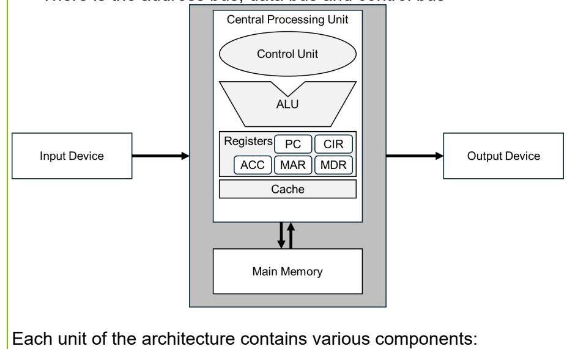
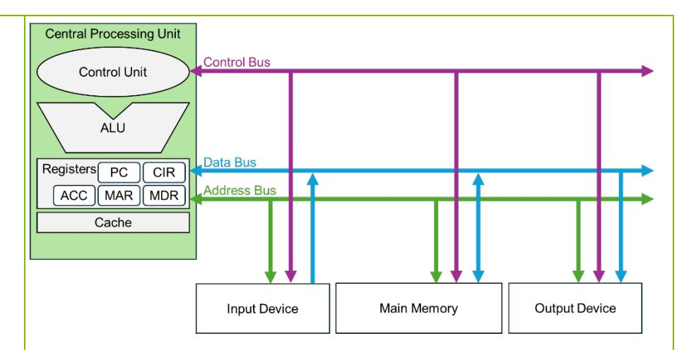
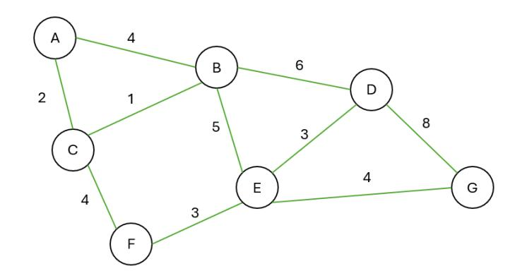

{1}------------------------------------------------


# WJEC GCSE Computer Science

Approved by Qualifications Wales

Guidance for Teaching: Unit 1

Teaching from 2025 For award from 2027


Ready for the world. This Qualifications Wales regulated qualification is not available to centres in England.

Made for Wales.

{2}------------------------------------------------


{3}------------------------------------------------

## Contents

| Introduction                                                     | 1   |
|------------------------------------------------------------------|-----|
| Aims of the Guidance for Teaching                                | 3   |
| Additional ways that WJEC can offer support:                     | 3   |
| Qualification Structure                                          | 4   |
| Assessment                                                       | 5   |
| Summary of Assessment Unit 1                                     | 5   |
| Overview of Unit 1                                               | 6   |
| Unit 1 Assessment objectives and weightings                      | 7   |
| Unit 1 Teacher Guidance                                          | 8   |
| Learning Experiences                                             | 95  |
| Opportunities for embedding elements of the Curriculum for Wales | 99  |
| Glossary for Unit 1                                              | 121 |

{4}------------------------------------------------

## <span id="page-3-0"></span>SUMMARY OF AMENDMENTS

| Version | Description                                                                                                                   | Page number |
|---------|-------------------------------------------------------------------------------------------------------------------------------|-------------|
| 1       | page 13 on page number (page 15 on PDF):<br>Hexa-core will have 8 cores<br>Should read:<br>Hexa-core will have <b>6</b> cores | 13          |

{5}------------------------------------------------

## Introduction

The WJEC GCSE Computer Science has been approved by Qualifications Wales and is available to all centres in Wales. It will be awarded for the first time in Summer 2027, using grades A\* to G.

<span id="page-4-0"></span>

### Aims of the Guidance for Teaching

The principal aim of the Guidance for Teaching is to support teachers in the delivery of WJEC GCSE Computer Science and to offer guidance on the requirements of the qualification and the assessment process. The Guidance for Teaching is **not intended as a comprehensive reference**, but as support for teachers to develop stimulating and exciting courses tailored to the needs and skills of their learners. The guide offers possible classroom activities and links to useful resources (including our own, freely available digital materials and some from external sources) to provide ideas for immersive and engaging lessons.

<span id="page-4-1"></span>

### Additional ways that WJEC can offer support:

- sample assessment materials and mark schemes
- professional learning events
- examiners' reports on each unit
- direct access to the subject officer
- free online resources
- Exam Results Analysis
- Online Examination Review.

{6}------------------------------------------------

## <span id="page-5-0"></span>Qualification Structure

WJEC GCSE Computer Science consists of two units. The qualification is unitised and does not contain tiering. There is no hierarchy to the order the units should be taught.

| Unit title | Type of Assessment             | Weighting                                                 |     |
|------------|--------------------------------|-----------------------------------------------------------|-----|
| Unit 1     | Understanding Computer Science | Digital examination                                       | 50% |
| Unit 2     | Computer Programming           | On-screen examination<br>based on a pre-released<br>brief | 50% |

{7}------------------------------------------------

## <span id="page-6-0"></span>Assessment

## <span id="page-6-1"></span>Summary of Assessment Unit 1

**Unit 1: Understanding Computer Science Digital examination: 1 hour 30 minutes 50% of qualification**

**80 marks**

Questions requiring objective responses, short and extended answers.

{8}------------------------------------------------

## <span id="page-7-0"></span>Overview of Unit 1

## **Understanding Computer Science**

(50% of the qualification)

The purpose of this unit is to:

- introduce learners to the key concepts and computational processes to be explored throughout the course
- consider the broad legal, social, ethical, environmental and professional consequences relevant to the use of technology
- consider the evolution of technologies that are relevant to the topics.

## The unit will be based on the following:

- computer architecture:
  - components
  - peripheral devices
  - storage
- structure of systems and functions:
  - data types, including representation, storage and compression
  - data and file structures
  - automated systems
- how systems communicate:
  - networks and infrastructure
  - cybersecurity and personal privacy
- algorithms
- software:
  - principles of programming
  - software development, including the software development lifecycle (SDLC)
  - program construction
- logical operations
- operating systems
- systems development lifecycle.

Legal, social, ethical, environmental and professional dimensions and reference to the evolution of technologies will be integrated where appropriate into the above topics.

{9}------------------------------------------------

| In this unit, learners will develop knowledge, skills and understanding in: |                                         |  |
|-----------------------------------------------------------------------------|-----------------------------------------|--|
| 1.1                                                                         | Computer architecture                   |  |
| 1.2                                                                         | How systems are structured and function |  |
| 1.3                                                                         | How systems communicate                 |  |
| 1.4                                                                         | Algorithms                              |  |
| 1.5                                                                         | Software                                |  |
| 1.6                                                                         | Logical operations                      |  |
| 1.7                                                                         | Operating systems                       |  |
| 1.8                                                                         | Systems development life cycle          |  |

## <span id="page-8-0"></span>Unit 1 Assessment objectives and weightings

| AO1 | Demonstrate knowledge and understanding of the key concepts and principles of computer science.                            | 30% |
|-----|----------------------------------------------------------------------------------------------------------------------------|-----|
| AO2 | Apply knowledge and understanding of key concepts and principles of computer science.                                      | 15% |
| AO3 | Analyse problems in computational terms:<br>to make reasoned judgementsto design, program, evaluate, and refine solutions. | 5%  |

{10}------------------------------------------------

## Unit 1 Teacher Guidance

<span id="page-9-0"></span>

| 1.1<br>Computer architecture<br>Content Amplification                                                                                                                                                                                                                                                                                                                                                                                                                                                                                                                                                                                                                                                                                                                                                                                                                                         |                                                                                                                                                                                                                                                                                                                                                                                                                                                                                                                                                                                                                                                                                                                                                                                                                                                                                                                                                                                                                                                                                                                                                                                                                                                                                                                                                                                                                                                                                                                                                                                                                                                               |  |
|-----------------------------------------------------------------------------------------------------------------------------------------------------------------------------------------------------------------------------------------------------------------------------------------------------------------------------------------------------------------------------------------------------------------------------------------------------------------------------------------------------------------------------------------------------------------------------------------------------------------------------------------------------------------------------------------------------------------------------------------------------------------------------------------------------------------------------------------------------------------------------------------------|---------------------------------------------------------------------------------------------------------------------------------------------------------------------------------------------------------------------------------------------------------------------------------------------------------------------------------------------------------------------------------------------------------------------------------------------------------------------------------------------------------------------------------------------------------------------------------------------------------------------------------------------------------------------------------------------------------------------------------------------------------------------------------------------------------------------------------------------------------------------------------------------------------------------------------------------------------------------------------------------------------------------------------------------------------------------------------------------------------------------------------------------------------------------------------------------------------------------------------------------------------------------------------------------------------------------------------------------------------------------------------------------------------------------------------------------------------------------------------------------------------------------------------------------------------------------------------------------------------------------------------------------------------------|--|
| 1.1.1<br>Learners should know:<br>Components<br>•<br>the role of components, including:<br>•<br>motherboard<br>•<br>central processing unit (CPU)<br>•<br>power supply unit (PSU)<br>•<br>input devices<br>•<br>output devices<br>•<br>expansion cards, including:<br>•<br>graphics cards<br>•<br>sound cards<br>•<br>network interface cards (NICs) both wired and<br>wireless<br>•<br>Graphics Processing Unit (GPU)<br>•<br>cooling systems<br>•<br>connectivity ports, including Universal Serial Bus<br>(USB) ports, Display ports, Ethernet ports<br>and<br>audio<br>ports.<br>Learners should know:<br>•<br>the purpose of the CPU<br>•<br>the main components of the Von Neumann CPU<br>Architecture<br>•<br>the role of different components in the fetch-decode<br>execute cycle, including:<br>•<br>control unit (CU)<br>•<br>arithmetic and logic unit (ALU)<br>•<br>cache memory | Teacher Guidance<br>Computer systems require all<br>the following components to perform a<br>wide range of tasks<br>and to function correctly. Each of the<br>components has its own purpose.<br>•<br>-<br>is the main printed<br>circuit board and<br>the central<br>Motherboard<br>component that connects all other components of the computer. It<br>allows for communication between the CPU, RAM and memory<br>devices, as well as peripheral devices. Along with expansion slots<br>for additional RAM, graphics cards, sound cards and other<br>components.<br>•<br>Central Processing Unit (CPU)<br>-<br>is considered the brain of the<br>computer. It executes instructions from programs and performs<br>calculations necessary<br>for the system to function.<br>It handles all<br>the main processing tasks by using the fetch-decode-execute<br>cycle<br>to complete program instructions.<br>•<br>-<br>converts external electrical<br>power<br>Power Supply Unit (PSU)<br>into usable power for the components, ensuring the system<br>operates effectively and safely.<br>•<br>Input devices<br>-<br>in most instances these are components that<br>allow the user to interact with the computer. For example,<br>keyboard, mouse, touchpad, camera and microphone.<br>You can also have input devices that are sensors that detect<br>changes in the environment and convert this data into electrical<br>signals. For example;<br>temperature sensors, motion sensors and<br>light sensors.<br>•<br>-<br>these devices present data from the computer<br>Output devices<br>to the user. For example,<br>monitor, speakers<br>and printer. |  |

{11}------------------------------------------------

- registers:
  - program counter (PC)
  - current instruction register (CIR)
  - accumulator (ACC)
  - memory address register (MAR)
  - memory data register (MDR).

Learners should know how performance of a CPU is affected by:

- cache size and levels of cache
- clock speed
- number of cores.

Learners should be aware of:

- the legal, ethical and social consideration surrounding designing, manufacturing and disposing of computer hardware
- historical development of computers
- the ethical considerations in designing and manufacturing components
- the environmental impact of manufacturing and disposing of hardware
- strategies for designing more energy-efficient architectures
- historical development of components, from early transistors to modern microprocessors
- advancements in materials and manufacturing have influenced the design and efficiency of components over time.

- **Expansion cards** these add additional functionality to the computer by plugging into the expansion slots on the motherboard. They provide extra capabilities for the computer systems. Examples include:
  - **Graphic cards** responsible for rendering images, videos and animations on the monitor. These are essential for gaming, video editing and graphic intensive tasks.
  - **Sound cards** manage the input and output of audio signals. They improve sound quality, receive audio signals from microphones and musical instruments and provide audio for speakers.
- **Network Interface Card (NIC) -** allows a computer to connect to a network, such as internet or local area network (LAN):
  - **Wired NICs** use cable, such as ethernet, to connect a computer to a network
  - **Wireless NICs** uses Wi-Fi technology to connect to a network without the need for wires.
- **Graphics Processing Unit (GPU) -** responsible for rendering images, videos and animations. It processes graphical data and is essential for tasks like gaming, video editing and 3D rendering. There are two types of GPUs:
  - **Integrated** is built into the processor chip and shares the memory with the CPU. It uses less power than dedicated GPUs.
  - **Dedicated** has its own memory, known as VRAM, and doesn't share it with the CPU. It consumes more power and has higher performance when compared to integrated GPUs.
- **Cooling Systems -** provide a way of regulating the temperature of key components, such as the CPU and GPU. This prevents overheating and therefore damage to the components. There are two main types:
  - **Liquid Cooling** uses liquid to transfer heat away from the components.

{12}------------------------------------------------

- **Air Cooling** - uses fans and/or heat sinks to dissipate the heat.
- **Connectivity ports** allow the computer to interact with external devices and peripherals.
  - **Universal Serial Bus (USB)** - used to connect external devices like, keyboards, mice, headsets and storage devices. USB ports are versatile and support data transfer and power supply. USB connectors are assigned letter s to indicate their type, Type -A, Type -B, Type -C. USB ports also have numbers included to specify the USB generation. Currently , there are 4: USB 1.x, USB 2.0, USB 3.x, and USB 4. Each generation allows for faster transmission speeds and power delivery.
  - **Display ports** - connect monitors or display devices to the system, providing high -definition video outputs. The main display ports are VGA , DVI, HDMI and DisplayPort .
    - VGA: Older analogue video port.
    - Digital Video Interface (DVI): Supports both analogue and digital video signals.
    - HDMI: High -definition multimedia interface for video and audio.
    - DisplayPort: Popular for high -resolution displays.
  - **Ethernet ports** - allow for wired network connections, typically used for stable and fast internet or network connectivity.
  - **Audio ports –** provide connections for audio input/output devices like headphones, microphones and speakers. Common audio ports include:
    - **3.5 mm Connector:** Used for headphones, microphones, and speakers.
    - **S/PDIF / TOSLINK:** For digital audio transmission.
    - **RCA Connector:** Commonly used for stereo audio and video connections.

{13}------------------------------------------------

Understanding the CPU and its components is essential to grasp how computers perform complex tasks and respond to user commands with incredible speed and accuracy.

**The CPU** is the brain of the computer. Its purpose is to execute instructions from programs, manage data, perform calculations and control the flow of data.

**Von Neumann architecture** is a design model which is used in modern computers and holds both instructions and data. Its key units include:

- CPU Central Processing Unit executes instructions
- Memory Primary storage: Random Access Memory stores both instructions and data. Secondary Storage: SSD, HDD store data for retrieval at a later date.
- Input/Output Devices such as keyboards, mice, monitors.
- Buses The bus system transfers data between components. There is the address bus, data bus and control bus



{14}------------------------------------------------

## **The CPU**

- **Control Unit (CU)**  - The **control unit** directs the operation of the processor by controlling the flow of data between the CPU, memory, and peripherals. It decodes the instruction and signals other parts of the CPU to perform actions during the execute phase.
- **Arithmetic and Logic Unit (ALU) -** The **ALU** performs all arithmetic, such as addition and subtraction, and logical comparison operations.
- **Registers** are small, fast storage areas inside the CPU that hold data temporarily.

The following registers are key to the fetch -decode -execute cycle :

- **Program Counter (PC) -** Holds the memory address of the next instruction to be fetched. After each fetch, the PC is incremented to point to the next instruction.
- **Current Instruction Register (CIR) -** Stores the instruction that has just been fetched from memory and is about to be decoded and executed.
- **Accumulator (ACC) -** Temporarily holds data being used during calculations in the ALU. It also stores the result of operations performed by the ALU.
- **Memory Address Register (MAR) -** Holds the memory address of the data or instruction that needs to be fetched from or written to memory.
- **Memory Data Register (MDR) -** Temporarily stores the data being fetched from or written to memory. It works in alongside the MAR. The MDR holds the actual data being transferred to or from the address specified by the MAR.
- **Cache memory** is a small, fast memory located in or near the CPU. It stores frequently used instructions and data to reduce the time needed to access data from the main memory (RAM). It speeds up the fetch process in the cycle.

There are three levels of cache:

{15}------------------------------------------------

- **Level 1:** The smallest and fastest cache which is located inside the CPU.
- **Level 2:** Larger than level 1 but slower. It ser ves as bridge between level 1 and level 3 or main memory (RAM) . It can either be located inside the CPU or outside, depending on the architecture of the motherboard.
- **Level 3:** Found outside the CPU. It is shared among cores, this cache is larger and slower than L1 and L2 caches, but faster than RAM. It helps improve performance when multiple cores are trying to access the same data.
- The **fetch -decode -execute cycle** is the basic process the CPU uses to execute instructions. It involves fetching the instruction from memory, decoding it, and then executing it. Each part of the cycle is managed by a different component of the CPU. The main operations which occur during each phase of the Fetch -Decode - Execute cycle are:
  - Fetch phase:
    - Load the **MAR** with the address of the next instruction to be executed.
    - Check if the instruction is in the **cache memory**. If it is, fetch it directly from the cache.
    - If the instruction is not in the cache, fetch it from main memory into the **MDR**, then transfer it to the **CIR**. Store the fetched instruction in the **cache** .
- Increment the **PC** to point to the address of the next instruction.
  - Decode phase:
    - The **CU** translates the instruction in the **CIR**.
    - The **CU** determines the required operations and selects the necessary machine resources. Check the **cache** for any required data. If the data is not in the **cache**, fetch it from main memory into the **MDR** .
  - Execute phase:

{16}------------------------------------------------

- The instruction is executed, which may involve mathematical or logical operations in the **ALU**, memory access, or I/O operations.
- Use the **ACC** to store intermediate results. The **MDR** may be used to transfer data between the **CPU** and memory.

## Factors that affect CPU performance

- : • Clock speed : is the frequency with which the CPU can execute instructions , one clock tick per second would be measured as 1 Hz . The clock speed is commonly measured in gigahertz (GHz) which means that if there is a clock speed of 3 GHz it can execute 3 billion instructions per second.
- Number of cores: A core is an independent processing unit within a CPU. Modern CPUs can have multiple cores, allowing them to perform multiple tasks **simultaneously:**
- Dual -core will have 2 cores
- Quad -core will have 4 cores
- Hexa -core will have 6 cores
- Deca -core will have 10 cores
- it is also possible to get 12, 16, 24 and 64 cores within a CPU
- Cache size: Larger cache sizes reduce the average memory access time; more frequently accessed data is stored closer to the CPU cores. This allows for faster execution of instructions since the CPU spends less time waiting for data to be fetched from slower main memory.
- Parallel processing : More cores enable better multitasking and can significantly improve performance in applications designed for parallel processing.
- Threading : is how the processor handles and executes multiple sequences of instructions (called **threads**) simultaneously. Each thread represents a single sequence of operations that the CPU can execute independently.
- Single threading can only execute one thread at a time.

{17}------------------------------------------------

• Multilevel threading allows a single CPU core to manage more than one thread at a time, which improves performance in multi tasking and parallel processing.

### **RAM**

- **Temporary Storage**: RAM holds data that the computer's processor needs right now or in the near future. When you turn off your computer, all data in RAM is lost.
- **Speed**: RAM is much faster than other types of storage like hard drives or SSDs. This speed helps your computer run smoothly and quickly.
- **Volatile Memory**: This means that RAM needs power to keep the data. Once the power is off, the data is gone.
- **Capacity**: The amount of RAM in a computer can affect its performance. More RAM allows a computer to handle more tasks at once without slowing down. RAM can range from gigabytes to terabytes.
- **Types** of RAM:
- **DRAM (Dynamic RAM)**: This is the most common type of RAM used in computers.
- **SRAM (Static RAM)**: Faster and more expensive than DRAM, used in smaller amounts for cache memory.

### **Buses**

- **Data Bus:** Carries the actual data being processed. For example, when you open a file, the data bus transfers the file's data from the hard drive to the RAM.
- **Address Bus:** Carries information about where the data should go. It tells the computer where to find or store data in memory.
- **Control Bus:** Carries control signals that manage the operations of the computer. These signals ensure that all parts of the computer work together smoothly.

{18}------------------------------------------------



## **Legal Considerations:**

- **Intellectual Property:** Protecting the patents and designs used in creating hardware.
- **Data Privacy:** Ensuring hardware design doesn't compromise user privacy or lead to security breaches.
- **Regulations:** Following environmental and safety standards during manufacturing, including hazardous material use and disposal.

### **Ethical Considerations:**

- **Labour Practices:** Making sure workers in factories that produce computer hardware have fair conditions, without exploitation or unsafe environments.
- **Conflict Minerals:** Not using minerals from areas where mining money supports human rights abuses.
- **Planned Obsolescence:** Considering the lifecycle of products to ensure that devices are not designed to force consumers to buy new products more frequently.

{19}------------------------------------------------

## **Social Considerations:**

- **Digital Divide:** Designing affordable and accessible hardware to reduce the gap between those with and without access to technology.
- **E -waste:** The growing volume of electronic waste due to the short lifecycle of devices and the need for better recycling systems to prevent environmental issues.

## **Historical Development of Computers**

From early mechanical devices to modern computing, computers have evolved drastically.

- **Early Transistors:** Replaced vacuum tubes in the mid -20th century, making computers smaller, faster, and more reliable.
- **Integrated Circuits (ICs):** Allowed multiple transistors to be placed on a single chip, further reducing size and increasing computing power.
- **Microprocessors:** Introduced in the 1970s, integrating the CPU onto a single chip, revolutionising personal computing.
- **Modern Multi -core CPUs:** Modern processors have multiple cores, each capable of handling tasks simultaneously, improving efficiency and performance.

Understand how the advancements in materials and manufacturing have influenced the design and efficiency of components over time .

- **Silicon and Semiconductor Technology**: Silicon is used to create tiny electrical circuits on chips, enabling the development of smaller and faster computers with integrated circuits. Making these components smaller , increases processing power in addition to lowering costs and energy consumption.
- **Nanotechnology**: Nanotechnology involves manipulating materials at an atomic level to create nano transistors, enabling smaller, faster, and more efficient processors. This makes the transistors more packed and denser therefore increasing speed and energy efficiency.

{20}------------------------------------------------

| 1.1.2<br>Peripheral<br>devices | Learners should know the function and appropriate use of:<br>• input devices<br>• output devices.                                                                                                                                                                                                                                                                                                                                                                                                               | 3D Chip Architecture: 3D chip architecture stacks layers of<br>chips vertically, allowing more components in less space. This<br>design shortens the distance for electrical signals, enhancing<br>data transfer speeds and reducing power consumption.<br>Quantum Computing Materials: Quantum computers use<br>superconductors to leverage quantum effects, solving complex<br>problems far more efficiently than classical computers.<br>Advanced Cooling Systems: New cooling materials and<br>systems, such as liquid cooling, prevent overheating of high<br>speed components.<br>Photonic Materials: Photonic materials use light instead of<br>electricity for data transmission, offering faster speeds and<br>greater bandwidth.                                                                                                                                                                                                                          |
|--------------------------------|-----------------------------------------------------------------------------------------------------------------------------------------------------------------------------------------------------------------------------------------------------------------------------------------------------------------------------------------------------------------------------------------------------------------------------------------------------------------------------------------------------------------|---------------------------------------------------------------------------------------------------------------------------------------------------------------------------------------------------------------------------------------------------------------------------------------------------------------------------------------------------------------------------------------------------------------------------------------------------------------------------------------------------------------------------------------------------------------------------------------------------------------------------------------------------------------------------------------------------------------------------------------------------------------------------------------------------------------------------------------------------------------------------------------------------------------------------------------------------------------------|
|                                |                                                                                                                                                                                                                                                                                                                                                                                                                                                                                                                 | Input Devices Definition: Input devices are hardware components<br>that allow users to enter data and control signals into a computer<br>system.<br><br>Common Input Devices:<br>• Keyboard: Used for typing text and commands.<br>• Mouse: A pointing device that allows users to interact with<br>graphical elements on the screen.<br>• Scanner: Converts physical documents and images into digital<br>format.<br>• Microphone: Captures audio input useful for voice command<br>and audio recording.<br>• Touchscreen: Allows users to interact with a device by touching<br>the screen. The monitor element of a touch screen device is both<br>the input and output component.<br>• Game Controller: Allows users to control video games. Game<br>controllers can have a range of input methods, including buttons,<br>motion sensors, joysticks and paddles. Game controllers can also<br>act as an output by receiving haptic feedback through vibrations. |
|                                |                                                                                                                                                                                                                                                                                                                                                                                                                                                                                                                 | • Sensors: Used to receive input from environment, such as light, temperature, accelerometer and pressure.<br>Output Devices Output devices are hardware components that send information from a computer to the user.<br>Common Output Devices:<br>• Monitor: Displays visual output from the computer.<br>• Printer: Produces physical copies of digital documents.<br>• Speakers: Output sound from the computer.<br>• Headphones: Personal audio output device for outputting sound.<br>• Projector: Projects computer visuals onto a larger surface.<br>• Braille Display: A device that gives physical feedback in Braille for people who cannot see.                                                                                                                                                                                                                                                                                                         |
| 1.1.3<br>Storage               | Learners should know the use and functional<br>characteristics of primary storage technologies, including:<br>• the use and functional characteristics of primary storage<br>technologies, including:<br>• random access memory (RAM)<br>• read only memory (ROM)<br>• flash memory<br>• cache memory<br>• virtual memory.<br>Learners should know:<br>• the use and functional characteristics of secondary<br>storage technologies, including:<br>• optical<br>• magnetic<br>• solid state<br>• cloud storage | Primary Storage Definition: Primary storage, also known as main<br>memory, is where data is temporarily stored for quick access by the<br>computer's processor.<br>Random Access Memory (RAM)<br>• Stores data and programs that the computer is currently using.<br>• Volatile memory, thus data is lost when the power is off.<br>• Allows fast read and write operations, enabling smooth<br>multitasking.<br>Read-Only Memory (ROM)<br>• Stores essential data that does not change, such as firmware.<br>• Non-volatile memory, thus data remains even when the power is<br>off.<br>• Used to boot up the computer and perform hardware initialisation.<br>Flash Memory<br>• Stores data in portable devices like USB drives and SSDs.<br>• Non-volatile memory.<br>• Offers fast access speeds and is durable against physical<br>shocks.                                                                                                                     |

{21}------------------------------------------------

{22}------------------------------------------------

- the general features of secondary storage media in terms of:
  - capacity
  - durability
  - reliability
  - read/write speed
  - cost per unit of storage.

Learners should be aware of developments in storage technologies and capacity over time.

## **Cache Memory**

- Provides quick access to frequently used data and instructions for the processor.
- Very fast, smaller than RAM, and located either in or close to the CPU.
- Temporarily stores copies of data from main memory to speed up processing.

## **Virtual Memory**

- Extends the computer's RAM by using part of the hard drive as additional memory.
- Allows more applications to run simultaneously by swapping data in and out of RAM.
- Slower than actual RAM since it relies on hard disk speed.
- The process of moving data between RAM and the hard drive is called paging.
- The operating system breaks down the data into small chunks and manages which pages are in RAM and which are in virtual memory.
- Thrashing occurs when a computer's virtual memory system overused, causing a significant slowdown in performance.
- This happens when the system spends more time swapping pages between the RAM and the hard drive than executing actual instructions.

### **Secondary Storage Media**

There are various secondary storage technologies that exist and when trying to understand examples of use, it is important to understand the characteristics that will affect the decision.

## **General characteristics of Secondary Storage Media**

- **Capacity**: The amount of data a storage device can hold. It varies widely among different types of storage.
- **Durability**: How well a storage medium can withstand physical damage and environmental conditions. Solid state storage is typically more durable than magnetic storage.

{23}------------------------------------------------

- **Reliability**: The likelihood that the storage device will perform correctly without failure. Magnetic and optical media can be prone to wear over time.
- **Read/Write Speed**: The speed at which data can be read from or written to the storage device. SSDs generally offer faster speeds than HDDs and optical storage.

### **Optical Storage**

- CDs, DVDs, Blu -ray discs.
- Uses laser technology to read and write data.
- Generally, has lower capacity compared to other storage types.

### **Optical Storage Characteristics:**

- Capacity:
  - CDs (Compact Discs):
    - Standard capacity is typically **700 MB**
    - Can hold audio, data, or other digital formats.
  - DVDs (Digital Versatile Discs) :
    - Standard single -layer DVDs hold **4.7 GB**, while dual -layer DVDs can hold **8.5 GB** .

.

- Suitable for video content, software, and data storage.
- Blu -ray Discs :
  - Single -layer Blu -ray discs can hold **25 GB**, and dual -layer discs can hold **50 GB** .
  - Designed for high -definition video and large data storage.
- Durability :
  - Optical discs are generally more resistant to environmental factors like humidity and temperature than magnetic media. However, they can be scratched, which may affect data retrieval.
- Reliability:
  - Optical storage is considered reliable for long -term storage, as data is less susceptible to magnetic fields compared to magnetic storage.

{24}------------------------------------------------

- Read/Write Speeds :
  - The read/write speeds vary by format, with newer technologies like Blu -ray offering faster performance and greater capacity than traditional CDs and DVDs. However, it is slower than other methods of secondary storage.

### **Magnetic Storage**

- Hard drives (HDDs), magnetic tapes.
- Uses magnetic fields to store data.
- Offers large capacity and is cost-effective for extensive data storage.

## **Magnetic Storage Characteristics:**

- Capacity:
  - HDDs offer capacities ranging from 500 GB to over 20 TB.
  - Magnetic tapes are often used for backup and archival purposes in data centres. A single tape can hold up to 20 TB or more.
- Durability :
  - HDDs contain moving parts (platters and read/write heads), making them vulnerable to physical damage from drops, shocks, or vibrations.
  - Over time, mechanical components can wear out, especially with constant use.
  - Magnetic tapes are more durable for long -term storage and can last for many years if stored correctly.
  - Tapes can be damaged by dust or strong magnetic fields but are generally more durable than HDDs in static environments.
- Reliability
  - Generally reliable for storing large amounts of data, but they have a higher risk of failure compared to solid -state storage due to moving parts.
  - Tapes are considered highly reliable for long -term archive storage.

{25}------------------------------------------------

- Read/Write Speeds:
  - HDD speeds are dependent on the rotation speeds measured in RPM.
  - Magnetic tape is slower and because data is stored sequentially, accessing specific data can be slow.
  - HDD and Magnetic tape have faster read/write speeds than optical storage.

### **Solid State Storage**

- Solid State Drives (SSDs).
- Uses flash memory technology for data storage.
- Faster than magnetic drives and more durable, as they have no moving parts.

## **Solid State Storage Characteristics:**

- Capacity:
  - SSDs can range from 128 GB to 4 TB for personal devices, with larger capacities available of 100 TB or more, but these come at a very high price.
- Durability :
  - SSDs have no moving parts, making them much more durable than HDDs.
  - They are more resilient to drops, shocks and vibrations.
  - SSDs do have a limited number of read/write cycles, but modern SSDs are designed to last for many years.
- Reliability :
  - SDs are highly reliable for storing data, as they don't suffer from mechanical failure like HDDs.
  - SSDs are generally more reliable than HDDs, but data recovery from a failed SSD is often more difficult.
  - Read/Write Speeds:
    - SSDs have extremely low latency compared to HDDs, meaning they can access and transfer data almost instantly.

{26}------------------------------------------------

### **Cloud Storage**

- Services like Google Drive, Dropbox, and iCloud.
- Stores data on remote servers accessed via the internet.
- Provides flexibility and accessibility from anywhere with an internet connection, with various subscription plans for different storage needs.

## **Cloud Storage Characteristics:**

- Capacity:
  - This could be considered unlimited, there is scalable options of data capacity, but often at a price, usually through a subscription.
- Durability:
  - Highly durable due to the responsibility of the cloud company to ensure the access of data. This is done through data backup systems.
- Reliability:
  - Cloud data is distributed across multiple servers, therefore even if one server fails, users can still access their data from another. This makes cloud storage more reliable than local drives that could fail without warning.
- Read/Write Speeds:
  - This is internet dependent, the read (download) and write (upload) speeds are based on the connection of the individual.

As data is transmitted to remote servers, latency is possible and higher than SSD or HDD but is generally not noticeable by the users.

{27}------------------------------------------------

| 1.2 How systems are structured and function                                        |                                                                                                                                                                                                                                                                                                                                                                                                                                                                                                                                                                                                                                                                                                                                                                                                                                                                                 | Content Amplification                                                                                                                                                                                                                                                                                                                                                                                                                                                                                                                                                                                                                                                                          |                                                     |                                          | Teacher Guidance |  |  |  |
|------------------------------------------------------------------------------------|---------------------------------------------------------------------------------------------------------------------------------------------------------------------------------------------------------------------------------------------------------------------------------------------------------------------------------------------------------------------------------------------------------------------------------------------------------------------------------------------------------------------------------------------------------------------------------------------------------------------------------------------------------------------------------------------------------------------------------------------------------------------------------------------------------------------------------------------------------------------------------|------------------------------------------------------------------------------------------------------------------------------------------------------------------------------------------------------------------------------------------------------------------------------------------------------------------------------------------------------------------------------------------------------------------------------------------------------------------------------------------------------------------------------------------------------------------------------------------------------------------------------------------------------------------------------------------------|-----------------------------------------------------|------------------------------------------|------------------|--|--|--|
|                                                                                    |                                                                                                                                                                                                                                                                                                                                                                                                                                                                                                                                                                                                                                                                                                                                                                                                                                                                                 | Data Types                                                                                                                                                                                                                                                                                                                                                                                                                                                                                                                                                                                                                                                                                     | Characteristics                                     | Example                                  |                  |  |  |  |
| 1.2.1<br>Data types,<br>including<br>representation,<br>storage and<br>compression | Learners should know:<br>• appropriate use of data types<br>• the function of data types used in programming<br>• the characteristics of different data types,<br>including:<br>• Boolean<br>• character<br>• integer<br>• real<br>• string.<br>Learners should know how to:<br>• convert between, denary, binary and<br>hexadecimal counting systems<br>• perform binary addition<br>• use arithmetic shift functions and explain their<br>effect<br>• use the concept of overflow and underflow.<br>Learners should understand:<br>• the digital storage of characters<br>• standardised character sets, including:<br>• Unicode<br>• American Standard Code for Information<br>Interchange (ASCII).<br>Learners should understand:<br>• the digital storage of graphics<br>• the effect of different resolutions, bit depths<br>and colour depths on the quality of graphics | Boolean                                                                                                                                                                                                                                                                                                                                                                                                                                                                                                                                                                                                                                                                                        | Logical comparisons or conditions (if statements)   | if Valid = True:<br>print ('Welcome')    |                  |  |  |  |
|                                                                                    |                                                                                                                                                                                                                                                                                                                                                                                                                                                                                                                                                                                                                                                                                                                                                                                                                                                                                 | Character                                                                                                                                                                                                                                                                                                                                                                                                                                                                                                                                                                                                                                                                                      | Single number, letter or symbol                     | letter = 'A'                             |                  |  |  |  |
|                                                                                    |                                                                                                                                                                                                                                                                                                                                                                                                                                                                                                                                                                                                                                                                                                                                                                                                                                                                                 | Integer                                                                                                                                                                                                                                                                                                                                                                                                                                                                                                                                                                                                                                                                                        | Whole numbers (positive and negative)               | age = 15                                 |                  |  |  |  |
|                                                                                    |                                                                                                                                                                                                                                                                                                                                                                                                                                                                                                                                                                                                                                                                                                                                                                                                                                                                                 | Real                                                                                                                                                                                                                                                                                                                                                                                                                                                                                                                                                                                                                                                                                           | Numbers with decimal points                         | temperature = 36.4                       |                  |  |  |  |
|                                                                                    |                                                                                                                                                                                                                                                                                                                                                                                                                                                                                                                                                                                                                                                                                                                                                                                                                                                                                 | String                                                                                                                                                                                                                                                                                                                                                                                                                                                                                                                                                                                                                                                                                         | A sequence of characters (number, letter or symbol) | email =<br>'computer.science@wjec.co.uk' |                  |  |  |  |
|                                                                                    |                                                                                                                                                                                                                                                                                                                                                                                                                                                                                                                                                                                                                                                                                                                                                                                                                                                                                 | Converting between, denary, binary and hexadecimal:<br>• Denary (Decimal): The standard base-10 system (0–9).<br>• Binary: The base-2 system, which uses only 0 and 1.<br>• Hexadecimal: The base-16 system, using digits 0–9 and letters A–F (where A = 10, B = 11, C=12, D=13, E=14 and F=15).<br>There are various methods to convert between binary, hexadecimal and denary, below are common methods:<br><b>Conversion Steps:</b><br>• Denary to Binary: Divide the denary value by 2 and include the remainder, which will always be either a 0 or 1. Repeat this process until 0 is reached<br>Then reverse the order of the remainders.<br>$37 \div 2 = 18 r 1$<br>$18 \div 2 = 9 r 0$ |                                                     |                                          |                  |  |  |  |

{28}------------------------------------------------

how to calculate the storage requirements for graphics using different dimensions, bit depths and colour depths.

### Learners should understand:

- the digital storage of sound
- the effect of different sampling rates on the quality of sound
- how to calculate the storage requirements for sound using different sampling rates and bit depths.

### Learners should understand:

- the relationship between data storage units using the base 2 prefixes, including:
  - bit
  - nibble
  - byte
  - kilobyte (i.e. 1,024 bytes)
  - megabyte (i.e. 1,024 kilobytes)
  - gigabyte (i.e. 1,024 megabytes)
  - terabyte (i.e. 1,024 gigabytes)
  - petabyte (i.e. 1,024 terabytes)
- the calculation of data capacity requirements.

### Learners should understand:

- the principles of data compression and the use of different compression types, including:
  - lossy
  - lossless
- calculation of compression ratios and the reduction in file sizes following compression.

$$4 \div 2 = 2 r 0$$
  
 $2 \div 2 = 1 r 0$   
 $1 \div 2 = 0 r 1$ 

Starting from the bottom put the remainders in order.

Therefore binary = 100101

**Binary to Denary**: Multiply each bit by 2 to the power of its position and add the results of the outcome.

Binary: 1 0 1 0 1 Position: 4 3 2 1 0

Multiply each bit by 2position

$$1 \times 2^{4} = 1 \times 16 = 16$$

$$0 \times 2^{3} = 0 \times 9 = 0$$

$$1 \times 2^{2} = 1 \times 4 = 4$$

$$0 \times 2^{1} = 0 \times 2 = 0$$

$$1 \times 2^{0} = 1 \times 1 = 1$$

Sum the results:

$$16 + 0 + 4 + 0 + 1 = 21$$

**Denary to Hexadecimal**: Divide the number by 16 and include the remainder. Any value of the remainder that is greater than 9 will become the Hexadecimal value represented by a letter A-F.

213 ÷ 16 = 13 r 5

 $13 
div 16 = 0 r 13 (13 = D)$ D5

{29}------------------------------------------------

• **Hexadecimal to Denary**: Multiply each bit by 16 to the power of its position and add the results of the outcome.

> **Hexadecimal:** 9 B *Position: 1 0*

Multiply each hexadecimal value by 16position

The first equation is:

$$9 \times 16^{1} = 9 \times 16 = 144$$
  
The second equation is:

 $(B = 11)$   
The third equation is:

$$11 \div 16^{0} = 11 \times 1 = 11$$

Sum the results:

$$144 + 11 = 155$$

• **Binary to Hexadecimal**: Group binary digits in sets of 4 (from right to left) and convert each group to its hexadecimal equivalent.

```
10100101
(1010) (0101)
1010 = 10 = A
0101 = 5
A5
```

• **Hexadecimal to Binary**: Convert each hexadecimal digit to its 4-bit binary equivalent then join them together.

9D  
9 = 1001  
D = 13 = 1101  
**10011101**

## **Binary Addition**

Use the following rules to correctly add binary values.

{30}------------------------------------------------

- 0 + 0 = 0
- 0 + 1 = 1
- 1 + 0 = 1
- 1 + 1 = 10 (which is 0 with a carry of 1)
- 1 + 1 + 1 = 11 (which is 1 with a carry of 1)
- If there is a carry, add it to the next column.

## *Example:*

01101011

10001011 +

**11110110**

1 11 carry

## **Digital Storage of Graphics**

### **Vector graphics are stored using mathematics**

- A vector uses mathematical representations of geometrically primitive objects (lines, curves etc.) to represent images.
- Vector graphics can be scaled up without loss of apparent quality.
- They are smaller than bitmap graphics in terms of the memory required to store them.
- Vectors can be edited easily and are used for graphical designs such as, logos and icons.

### **Raster graphics are stored in pixels:**

- Each pixel has a colour value that is stored as a binary value.
- Each image will have a bit depth, which impacts on the size and quality of the image.
- The greater the bit depth the more colour information, detail and greater quality, but also a larger file size.

## **Resolution**

- This refers to the number of pixels in an image, represented by width and height.
- The higher the resolution the greater the quality and detail of the images.

{31}------------------------------------------------

• The higher the resolution the higher the file size.

### **Bit Depth**

- The number of bits used to represent the colour of **each pixel** in an image.
- It specifies how many bits are used to store information about a pixel's colour.
- An 8-bit bit depth means that 8 bits will be allocated **per pixel**. Allowing for 256 different combinations.
- The higher the bit depth, the larger the file size and increased quality.

### **Colour Depth:**

- The number of colours that an image can represent affected by the bit depth.
- Higher values allow for more colours to be represented.
- When referred to, this will be as "bits per channel" (bpc).
- Example: 8-bit colour depth for "RGB" would be:
  - 8-bits for **R**, 8-bits for **G** and 8-bits for **B**.

Note: Historical lower-depth systems mainly used bits per pixel (bpp). This specification uses modern conventions of bits per component (also known as bits per channel) (bpc)

## **Colour Model:**

- A mathematical model describing the way that colours can be represented as tuples of numbers.
- These are typically three or four values or colour components (e.g., RGB, CMYK)

#### **Calculating Image Storage Requirements**

To calculate the storage requirement for an image, you need to know:

- 1. Resolution: The width and height of the image in pixels.
- 2. Colour Depth: The number of bits used per channel.
- 3. Bit Depth: The number of bits used per pixel.

{32}------------------------------------------------

### **Step-by-Step Calculation**

## **Formula for calculation:**

Storage Size = (Width × Height × Bits Per Pixel)

## **Determine the Total Number of Pixels:**

- Multiply the width by the height of the image.
- Example: For an image with a resolution of 1920x1080 pixels:

$$Total\ Pixels = 1920 \times 1080 = 2,073,600\ pixels$$

## **Calculate Bits Per Pixel (bpp):**

- Multiply the bit depth by the number of channels.
- Example: For an 8-bit RGB image:

$$Bits \ Per \ Pixel = 8 \ (bits - Red) + 8 \ (bits - Green) + 8 \ (bits - Blue)$$
  
= 24 bits

## **Calculate Total bits:**

- Multiply the total number of pixels by the bits per pixel.
- Example:

$$\textit{Total bits} = 2,073,600 \ \textit{pixels} \times 24 \ \textit{bits} = 49,766,400 \ \textit{bits}$$

## **Convert bits to bytes:**

- Divide the total bits by 8 (1 byte = 8 bits).
- Example:

$$Total\ bytes = \frac{49,766,400\ bits}{8} = 6,220,800\ bytes$$

### **Convert bytes to kilobytes (KB):**

• Divide the total bytes by 1024 (since 1 KB = 1024 bytes).

{33}------------------------------------------------

• Example:

$$Total\ KB = \frac{6,220,800\ bytes}{1024} \approx 6075\ KB$$

### **Convert kilobytes to megabytes (MB):**

- Divide the total KB by 1024 (since 1 MB = 1024 KB).
- Example:

$$Total\ MB = \frac{6075\ KB}{1024} \approx 5.93\ MB$$

## **The digital storage of sound**

Sound must be converted from analogue to digital to be stored. The sound waves are sampled at time intervals. The sound sample points are converted to the nearest numerical value.

- **Sample**: A single measurement of sound taken at a specific point in time
- **Channels**: The number of audio channels, mono being 1 channel and stereo being 2 channels.
- **Sample Rate**: The number of samples of audio carried per second, measured in Hz or kHz. - also known as Sample Frequency
- **Bit Depth**: For audio, this is the number of bits used to record each sample. Higher bit depths allow for more precise representation of a sound's amplitude
- **Bit Rate**: The amount of data processed per second of sound. It is calculated by multiplying the sample rate by the bit depth
- **Sample Quality**: The term used to describe the effect of the sample rate/frequency.

## **Calculating Sound Storage Requirements Formula:**

Storage Size = �Sample Rate × Bit Depth × Channels × Duration (seconds)�

{34}------------------------------------------------

### **Calculate Total bits:**

- Multiply the given Sample Rate, Bit Depth, Number of Channels and Duration
- Example: A stereo (2 channels) audio file with a sample rate of 44.1 kHz (44,100 samples per second), a bit depth of 16 bits, a duration of 3 minutes (180 seconds):

Total bits = 
$$44100 \times 16 \times 2 \times 180 = 254,016,000$$
 bits

### **Convert bits to bytes**

• Divide the total bits by 8 (1 byte = 8 bits).

Total bytes = 

$$\frac{\text{(Sample Rate } \times \text{ Bit Depth } \times \text{Channels } \times \text{ Duration )}}{8}$$
Total bytes = 

$$\frac{254,016,000}{8} = 31,752,000 \text{ bytes}$$

### **Convert bytes to kilobytes (KB):**

- Divide the total bytes by 1024 (since 1 KB = 1024 bytes).
- Example:

Total bytes = 
$$\frac{31,752,000 \ bytes}{1024} \approx 31,008 \ kilobytes$$

### **Convert kilobytes to megabytes (MB):**

- Divide the total KB by 1024 (since 1 MB = 1024 KB).
- Example:

Total bytes = 
$$\frac{31,008 \ kilobytes}{1024} \approx 30.2 \ megabytes$$

{35}------------------------------------------------

### **Data Storage Units**

| Data storage     | Equivalent | Number of bits        | Number of bytes       |
|------------------|------------|-----------------------|-----------------------|
| bit              |            | 1                     |                       |
| nibble           |            | 4                     |                       |
| byte             |            | 8                     | 1                     |
| Kilobyte<br>(KB) | 1024 bytes | 8,192                 | 1024                  |
| Megabyte<br>(MB) | 1024 KB    | 8,388,608             | 1,048,576             |
| Gigabyte<br>(GB) | 1024 GB    | 8,589,934,592         | 1,073,741,824         |
| Terabyte<br>(TB) | 1024 TB    | 8,796,093,022,208     | 1,099,511,627,776     |
| Petabyte<br>(PB) | 1024 PB    | 9,007,199,254,740,992 | 1,125,899,906,842,624 |

### **Compression**

Compression is the process of decreasing file sizes but still preserving the data so that it is usable. There are two types of compression techniques:

- **Lossy:** 
  - This method will generally reduce the size by a greater amount but will also reduce the quality.
  - The data removed is often considered less important or detectable by the user.
  - Examples: MP3, JPEG, MPEG

{36}------------------------------------------------

### • **Lossless:**

- This method will maintain the quality but is less likely to reduce the file size by as much as lossy. It enables the file to be uncompressed to original form.
- Reduces file sizes by finding non-essential information and redundancies in the data and encoding them more efficiently using things such as an index file.
- Examples: WAV, PNG, BMP, FLAC

## **Compression Calculations**

**Calculate the size of files based on the compression ratio:**

$$compression \ ratio = \frac{original \ data \ size}{compressed \ data \ size}$$

• Example: Original data size = 1000, Compressed data size = 200

Therefore, the ratio is: 
$$\frac{1000}{200}$$
 or  $\frac{10}{2}$  or 10: 2

**Calculating the compressed file size based on ratio:**

$$compressed\ file\ size\ =\ rac{original\ file\ size}{compression\ ratio}$$

• Example: if the original data size is 2000 KB and the compression ratio is 10:2

compressed file size 
$$=\frac{2000}{10 \div 2} = 400kb$$

**Calculating the original file size based on ratio:**

= ×

{37}------------------------------------------------

2 34 78 44 19

|                                      |                                                                                                                                                                                                                                                                                                                                                                                       | Example if the compressed data size is 400 KB and the compression ratio is 10:2                                                                                                                                                                                                                                                                                                                                                                                                                                                                                                                                                                                                                                                                                                                                                                                                                                                                                                                                                                                                                                                           |   |    |    |    |    |
|--------------------------------------|---------------------------------------------------------------------------------------------------------------------------------------------------------------------------------------------------------------------------------------------------------------------------------------------------------------------------------------------------------------------------------------|-------------------------------------------------------------------------------------------------------------------------------------------------------------------------------------------------------------------------------------------------------------------------------------------------------------------------------------------------------------------------------------------------------------------------------------------------------------------------------------------------------------------------------------------------------------------------------------------------------------------------------------------------------------------------------------------------------------------------------------------------------------------------------------------------------------------------------------------------------------------------------------------------------------------------------------------------------------------------------------------------------------------------------------------------------------------------------------------------------------------------------------------|---|----|----|----|----|
|                                      |                                                                                                                                                                                                                                                                                                                                                                                       | original file size = 400 × (10 ÷ 2) = 2000kb                                                                                                                                                                                                                                                                                                                                                                                                                                                                                                                                                                                                                                                                                                                                                                                                                                                                                                                                                                                                                                                                                              |   |    |    |    |    |
| 1.2.2<br>Data and file<br>structures | Learners should understand:<br>• the design, interpretation and manipulation of<br>data structures including:<br>• records<br>• one-dimensional arrays<br>• two-dimensional arrays<br>• the selection, identification and justification of<br>appropriate data structures for different<br>situations<br>• the design of files and records appropriate for<br>different applications. | Understand the following data structures:<br><b>Records:</b> this data structure consists of several fields. A field consists of a single data item, and this can be any data type.<br>A record would be used when trying to store data about an object or person that might require more than one data type. For example, student information, vehicle information and product information.<br><b>One-dimensional arrays:</b> an array of similar data types. The data items within the array are called elements.<br>• 1D arrays are stored in linear fashion and are identified by a unique index (starting at 0).<br>• Example: Name[David, Joe, Sarah]<br>• Name[0] = David<br>• Name[1] = Joe<br>• Name[2] = Sarah<br><b>Two-dimensional array:</b> an array of similar data types stored in columns and rows. The data items within the array are called elements.<br>• The data is stored in rows and columns and when identifying location, rows go first (starting at index 0) and columns go next (starting at 0).<br>• Example: Student exam marks<br>• <b>NOTE:</b> grey row and column represent the index of the elements) |   |    |    |    |    |
|                                      |                                                                                                                                                                                                                                                                                                                                                                                       | Marks Array:                                                                                                                                                                                                                                                                                                                                                                                                                                                                                                                                                                                                                                                                                                                                                                                                                                                                                                                                                                                                                                                                                                                              |   |    |    |    |    |
|                                      |                                                                                                                                                                                                                                                                                                                                                                                       |                                                                                                                                                                                                                                                                                                                                                                                                                                                                                                                                                                                                                                                                                                                                                                                                                                                                                                                                                                                                                                                                                                                                           |   | 0  | 1  | 2  | 3  |
|                                      |                                                                                                                                                                                                                                                                                                                                                                                       |                                                                                                                                                                                                                                                                                                                                                                                                                                                                                                                                                                                                                                                                                                                                                                                                                                                                                                                                                                                                                                                                                                                                           | 0 | 57 | 23 | 15 | 46 |
|                                      |                                                                                                                                                                                                                                                                                                                                                                                       |                                                                                                                                                                                                                                                                                                                                                                                                                                                                                                                                                                                                                                                                                                                                                                                                                                                                                                                                                                                                                                                                                                                                           | 1 | 46 | 72 | 25 | 67 |

{38}------------------------------------------------

|                               |                                                                                                                                                                                                                                                                                                         | Marks[Row][Column]<br>Marks[0][2] = 15<br>Marks[2][3] = 19<br>Marks[0][1] = 23                                                                                                                                                                                                                                                                                                                                 |  |
|-------------------------------|---------------------------------------------------------------------------------------------------------------------------------------------------------------------------------------------------------------------------------------------------------------------------------------------------------|----------------------------------------------------------------------------------------------------------------------------------------------------------------------------------------------------------------------------------------------------------------------------------------------------------------------------------------------------------------------------------------------------------------|--|
| 1.2.3<br>Automated<br>systems | Learners should understand:<br>the structure of automated systems, including:sensorsactuatorscontrollers/processorscommunication networkshuman-machine interfacethe function of automated systems, including:data acquisitionprocessing and decision-makingcontrolcommunicationfeedback and adaptation. | Automated systems are made up of different parts that work together.<br><b>Sensors</b><br>Sensors are devices that find and measure physical properties like temperature, light, and movement. They take this information and turn it into signals that a system can understand. For example, a sensor that measures temperature in a smart thermostat or a sensor that detects movement in a security system. |  |
|                               | Learners should be aware of:<br>the ethical, social and legal implications of automated systems, such as Artificial Intelligence (AI).                                                                                                                                                                  | <b>Actuators</b><br>Mechanical or electrical devices that will perform physical actions based on the requirement of the signals from the system. For example, motors that control robot arms or open windows in automated greenhouses.                                                                                                                                                                         |  |
|                               |                                                                                                                                                                                                                                                                                                         | <b>Controllers/processors</b><br>The central part of the system, which processes input data from sensors, runs algorithms, and sends instructions to actuators. It makes decisions based on the programmed logic. For example, a microprocessor in a robot or CPU in a computer system that controls automated greenhouses.                                                                                    |  |
|                               |                                                                                                                                                                                                                                                                                                         | <b>Communication networks</b><br>The infrastructure that allows different parts of the automated system (sensors, actuators, controllers) to communicate with each other, often in real-time. For example, wired or wireless networks, such as Ethernet, Wi-Fi, or Bluetooth, which enable communication between components.                                                                                   |  |
|                               |                                                                                                                                                                                                                                                                                                         | <b>Human-Machine Interface (HMI)</b><br>The user interface which humans interact with automated systems. It displays system status and allows input or control from the user. For example, a touchscreen control panel for controlling machines in manufacturing or mobile phones to control smart home devices at home.                                                                                       |  |

{39}------------------------------------------------

### **The function of automated systems**

- **Data Acquisition:** The storing of data collected from sensors or other devices and inputted into the system for processing. For example, storing temperature form a nuclear power chamber.
- **Processing and decision-making:** The system analyses the data it gets, interprets it and makes decisions based on programming rules, algorithms or machine learning. For example, a greenhouse turning on sprinklers when the humidity is too low or temperature too high.
- **Control:** Control signals are sent to actuators to perform necessary tasks based on decisions made during the processing stage. For example, starting a motor to control a window in an automated greenhouse.
- **Communication:** This means sending data between different parts of the system or different systems, ensuring everything works together. For example, a self-driving car's sensor talking to its main computer to avoid obstacles or a smart fridge sending data to a mobile app.
- **Feedback and adaption:** The system keeps track of how it is doing and adjusts to improve and optimise its performance. A Greenhouse example: **Feedback:**
  - **User Input**: The user of a greenhouse sets the desired conditions for growing tomatoes, such as temperature at 25°C, humidity at 60%, and light exposure for 12 hours a day.
  - **System Response**: The greenhouse control system adjusts the heating, cooling, humidifiers, and lighting to meet these conditions.
  - **Sensor Data**: The system continuously monitors the temperature, humidity, and light levels using various sensors placed throughout the greenhouse.

## **Adaptation:**

• **Feedback Analysis**: The system notices that during the afternoon, the temperature tends to rise above 25°C due to intense sunlight, and humidity drops below 60%.

{40}------------------------------------------------

- **System Adjustment**: The system adapts by activating additional cooling measures, such as opening vents or increasing the operation of fans and turning on misting systems to maintain the desired humidity levels.
- **Learning Over Time**: Over time, the system learns the daily and seasonal patterns of temperature and humidity changes. It starts to pre emptively adjust the conditions before they deviate from the set parameters, ensuring a more stable environment for the tomatoes.

### **Ethical Implications**

- Job Displacement: Some jobs may disappear because machines can do them instead of people or staff will have to retrain to adapt to new technology.
- Privacy Concerns: Automated systems collect a lot of personal data, which can lead to privacy issues if not stored correctly and securely.
- Bias: AI can show unfair results based on wrong data in its training, like biased facial recognition.

### **Social Implications**

- Economic Inequality: Automation can widen the gap between rich and poor, as skilled workers may gain more benefits than those in vulnerable jobs.
- Accessibility: Automated systems can help people access services better, like AI diagnostics in healthcare for people with disabilities that stop them from attending medical appointments.
- Impact on Human Interaction: Overusing automated systems may reduce face -to -face contact in areas such as customer service and reduce that personal element that comes from human interaction.
- Digital divide: Systems that use automated systems, such as call centres that require navigation and processing through automated systems, may be more difficult for elderly customers.

## **Legal Implications**

• Liability and Accountability: Who is responsible if an automated system causes harm? This is crucial for systems like self-driving cars.

{41}------------------------------------------------

|  |  | Regulation and Compliance: Laws are needed to ensure AI and automation<br>are safe and ethical.<br>Intellectual Property Rights: Questions arise about who owns what AI<br>creates, especially in fields like art and literature. |
|--|--|-----------------------------------------------------------------------------------------------------------------------------------------------------------------------------------------------------------------------------------|
|--|--|-----------------------------------------------------------------------------------------------------------------------------------------------------------------------------------------------------------------------------------|

{42}------------------------------------------------

| 1.3 How systems communicate             |                                                                                                                                                                                                                                                                                                                                                                                                                                                                                                                                                                                                                                                                                                                                                                                                                                                                                |                                                                                                                                                                                                                                                                                                                                                                                                                                                                                                                                                                                                                                                                                                                                                                                                                                                                                                                                                                                                                                                                                                                                                                                                                                                                                                                                                                                                                                                                                                                                                                                        |
|-----------------------------------------|--------------------------------------------------------------------------------------------------------------------------------------------------------------------------------------------------------------------------------------------------------------------------------------------------------------------------------------------------------------------------------------------------------------------------------------------------------------------------------------------------------------------------------------------------------------------------------------------------------------------------------------------------------------------------------------------------------------------------------------------------------------------------------------------------------------------------------------------------------------------------------|----------------------------------------------------------------------------------------------------------------------------------------------------------------------------------------------------------------------------------------------------------------------------------------------------------------------------------------------------------------------------------------------------------------------------------------------------------------------------------------------------------------------------------------------------------------------------------------------------------------------------------------------------------------------------------------------------------------------------------------------------------------------------------------------------------------------------------------------------------------------------------------------------------------------------------------------------------------------------------------------------------------------------------------------------------------------------------------------------------------------------------------------------------------------------------------------------------------------------------------------------------------------------------------------------------------------------------------------------------------------------------------------------------------------------------------------------------------------------------------------------------------------------------------------------------------------------------------|
|                                         | Content Amplification                                                                                                                                                                                                                                                                                                                                                                                                                                                                                                                                                                                                                                                                                                                                                                                                                                                          | Teacher Guidance                                                                                                                                                                                                                                                                                                                                                                                                                                                                                                                                                                                                                                                                                                                                                                                                                                                                                                                                                                                                                                                                                                                                                                                                                                                                                                                                                                                                                                                                                                                                                                       |
| 1.3.1<br>Networks and<br>infrastructure | Learners should understand:<br>the characteristics of networks, and their advantages and disadvantagescommon network topologies, including bus, ring, star and mesh, and their relative advantages and disadvantagesthe hardware required to establish wired and wireless connectivity, including:routershubsswitchesbridgesgatewayswireless access points (WAPs).Learners should know the purpose of networking protocols, including:Transmission Control Protocol (TCP)Internet Protocol (IP)Hypertext Transfer Protocol (HTTP)Hypertext Transfer Protocol Secure (HTTPS)File Transfer Protocol (FTP)Simple Mail Transfer Protocol (SMTP)Post Office Protocol (POP3)Internet Message Access Protocol (IMAP)Border Gateway Protocol (BGP)Domain Name System (DNS)packet switching and the typical contents of a TCP / IP packetcost calculation of routing data on a network. | Characteristics of Networks:<br>Size: Networks can vary in size from PAN (Personal Area Network) to WAN (Wide Area Network).Scalability: This is the ability to add additional devices to the network without losing its integrity or performance.Reliability: How strong the network it is, without the network failing.Latency: The delay before data transfers after a request has been made.Bandwidth: This refers to the data transfer rate of the network meaning how much data can be transferred. Bandwidth is measure in bps (bits per second)Types of Networks:<br>Learners should understand the characteristics of each of the following types of networks:<br>PAN (Personal Area Network): A small network used to connect devices usually within a household. It has a limited range. It is relatively easy to set up and can connect through Wi-Fi, Bluetooth and wired network technology.LAN (Local Area Network): A network that connects devices within a small geographical area, usually a single building. Typically, a small home or office network that shares peripheral such as printers. It is relatively easy to set up and does not require great costs.MAN (Metropolitan Area Network): Smaller than a WAN but larger than a LAN. Usually covers a range such as a city or a campus. Can be expensive to set up but does allow for connections over wider ranges as opposed to a LAN.WAN (Wide Area Network): A network that connects over a large geographical area. It connects multiple LANs over a large range. The internet is an example of a WAN. |

{43}------------------------------------------------

### Learners should be aware of:

• the evolution of communication networks, from traditional telecommunication systems to modern high-speed broadband and networks.

• **VPN (Virtual Private Network):** A secure network that allows user to access private networks remotely over the internet. They use encrypted tunnels to protect data. As it uses the internet, the range is extensive but can be slower due to the encryption process.

### **Advantages of networks:**

- **Resource Sharing:** People can share things like printers and files easily over a network.
- **Communication**: Networks make it easy to communicate through emails, video calls, or text messages.
- **Central Data Management**: Information can be stored in one place, so it is easier to access and avoids duplication.
- **Scalability**: Networks can grow to meet increased demands by adding more devices.
- **Collaboration**: Many people can work on a project together at the same time.

### **Disadvantages of networks**:

- **Security Issues**: Networks can be at risk from hacking or unwanted access.
- **Setup and Maintenance Costs**: Building a network, especially a big one, can be very expensive.
- **Complexity**: Keeping a large network running well needs advanced skills, and fixing problems can be difficult.
- **Performance Problems**: When many people use the network at once, it may slow down.
- **Dependency:** If the network stops working, everything linked to it can also stop.

## **Network Topologies Bus Topology:**

All devices are connected to a single central cable, which has terminators at each end to ensure proper operation.

{44}------------------------------------------------

### **Advantages:**

- Easy and inexpensive to install for small networks.
- Uses less cable compared to other topologies.

### **Disadvantages:**

- If the main cable fails, the whole network goes down.
- Difficult to troubleshoot.
- Performance degrades as more devices are added due to data collisions.

### **Ring Topology** :

Devices are connected in a loop, with each device connected to the next, forming a ring.

### **Advantages:**

- Data travels in one direction, reducing the chances of collisions.
- Better performance than bus topology when handling many devices.

### **Disadvantages** :

- A failure in any cable or device breaks the entire network.
- Adding or removing devices can disrupt the network.

### **Star Topology:**

All devices are connected to a central hub or switch, creating a star shaped network.

### **Advantages:**

- Easy to install and manage.
- Failure of one device doesn't affect the others.
- Easy to add new devices without disrupting the network.

### **Disadvantages:**

- If the central hub or switch fails, the whole network goes down.
- Requires more cable than bus topology, increasing installation costs.

## **Mesh Topology:**

Every device is connected to every other device, providing multiple pathways for data.

{45}------------------------------------------------

### **Advantages:**

- It is highly reliable, as there are many paths for data to travel.
- If one path fails, data can take another route.
- Can expand and modify the topology without disrupting other nodes.

### **Disadvantages:**

- It is expensive and more complicated to install due to the high number of connections required.
- Usually needs specific staff employed for maintenance and management.

### **Hardware Needed for Connectivity**

- Routers:
  - Connects different networks and sends data between them.
  - Stores the addresses of computers on a network using a routing table and transfers data between networks and devices.

**:**

- Helps devices access the internet, directs traffic and manages IP addresses.
- Hubs:
  - A basic device that links devices in a LAN and sends data to all of them.
  - Hubs are inexpensive but not efficient since it slows down the network, due to data be sent to all devices across a network.
- Switches:
  - More advanced than hubs .
  - Analyses each packet of data and sends it to the computer it was intended for.
  - Improves network performance in LANs by managing traffic better and improving network performance .
- Bridges:
  - Connects parts of different networks so they work together as a single network .
  - Helps reduce data collisions and can filter data.

{46}------------------------------------------------

- Gateways:
  - Connects different networks that may use different protocols. Gateways can translate data from one network type to another, such as connecting a WAN to a LAN.
  - Helps different networks communicate even if they have different protocols, like a home network to the internet.
- Wireless Access Points (WAPs):
  - Allows wireless devices connect to wired networks using Wi -Fi.
  - Help extend the reach of networks by enabling wireless connectivity.
  - Common in homes and offices for mobile access to the internet.

### **Network Protocols**

Network protocols are established sets of rules that help determine how the data is transmitted across a network. They are essential for consistent communication with all devices on a network regardless of their differences.

There are several protocols that support network communication , including:

- **Transmission Control Protocol (TCP):** Is the first protocol of the Internet Protocol suite. It ensures a reliable transmission of data across a network. There are four main characteristics of the TCP; reliable transmission, error checking, order delivery and congestion management.
- **Internet Protocol (IP) :** Is responsible for getting packet s from one location to another through routing. It uses IP addresses to locate the destination.
- **Hypertext Transfer Protocol (HTTP):** A protocol which allows webpages to be shared across different computers and browsers. It explains how messages are set up and sent between web browsers and servers.
- **Hypertext Transfer Protocol Secure (HTTPS) :** HTTPS is a more secure version of HTTP. It helps keep information safe when you use the internet. It uses encryption methods such as SSL/TLS. This

{47}------------------------------------------------

- coding makes your information unreadable to anyone trying to steal it. Finally, authentication is used to verify the website's identity.
- **File Transfer Protocol (FTP):** Is normally used for transfer files between client and server.
- **Simple Mail Transfer Protocol (SMTP):** SMTP is the standard protocol for sending emails across the internet.
- **Post Office Protocol (POP3):** POP is used to receive emails from a remote server. They are downloaded to a local email client and are viewed offline.
- **Internet Message Access Protocol (IMAP):** IMAP enables emails to be downloaded from the server to multiple client devices. However, unlike POP, the email can be set to remain on the server after being downloaded.
- **Border Gateway Protocol (BGP):** BGP stands for Border Gateway Protocol. It is a system used to share information about the best routes for data to travel on the Internet.
- **Domain Name System (DNS):** DNS changes website domain names into IP addresses that computers use to find each other. This is important for using the internet because it makes it easier to find websites.

**Packet switching and the typical contents of a TCP/IP packet** A packet is a unit of data that is transmitted over a network. When data is sent, it is segmented into smaller packets. These packets travel through the network independently to the destination computer, where they are reassembled in the correct order.

Segmenting the data into packets enhances efficiency and reliability. In the event of a network issues, routers dynamically find alternative routes for the packets to travel. If a packet is lost, the receiving computer will request for a re-transmission of the lost packet.

{48}------------------------------------------------

### **Packet Content**

| The source IP address                                         | The destination IP address                                        |
|---------------------------------------------------------------|-------------------------------------------------------------------|
| Information which enables the data to be reassembled into its |                                                                   |
| original form                                                 |                                                                   |
| Other tracking information                                    |                                                                   |
| The data<br>itself                                            | A checksum that checks that<br>the data has not been<br>corrupted |

### **Cost calculation of routing data on a network**

• Routing Cost: A way to measure and determine the best path to a destination on a network.

Network hardware devices store measurements of network routing costs, there are various routing costs that can be stored, the most common are:

- **Bandwidth Cost:** The data transfer capacity of a link. Routing protocol may prefer higher bandwidths.
- **Delay Cost:** The time it takes for a packet to travel from the source to the destination. Lower delay is generally preferred
- **Hop Count:** The number of networks or nodes a packet must pass through to reach the destination.
- **Load Cost:** The amount of traffic over a network link. Routing decisions may consider the load to avoid congestion.
- **Reliability Cost:** The error rate of a link; more stable links are preferred in routing decisions.

{49}------------------------------------------------



| Route             | Cost calculations | Total cost |
|-------------------|-------------------|------------|
| A > B > D > G     | 4 > 6 > 8         | 18         |
| A > B > E > G     | 4 > 5 > 4         | 13         |
| A > C > F > E > G | 2 > 4 > 3 > 4     | 14         |
| A > C > B > E > G | 2 > 1 > 5 > 4     | 12         |
| A > C > B > D > G | 2 > 1 > 6 > 8     | 17         |

## **The evolution of communication networks:**

- **Traditional Telecommunication Systems**:
  - Telegraph and Telephone: These systems marked the beginning of communication networks, enabling point-to-point communication through electrical signals transmitted over wires.
  - PSTN (Public Switched Telephone Network): Used for landline phones, PSTN is based on circuit-switching, where a dedicated connection is made for each call. Voice communication is carried via analogue signals.
  - Dial-up Internet: Early internet access used telephone lines with limited speeds (up to 56 kbps). Since dial-up shared the phone

{50}------------------------------------------------

line, telephone calls could not be made at same time.

### • **Broadband Technology** :

- ADSL (Asymmetric Digital Subscriber Line): An improvement over dial -up, ADSL provides faster internet speeds and continuous access without interrupting the phone line. It uses the same telephone line but separates voice and data into different frequency channels.
- Cable Broadband: This technology delivers internet coaxial cables originally intended for TV, offering greater bandwidth and higher speeds than ADSL.

### • **Fibre Optics and High -Speed Networks**

- : • Fibre Optic Networks: Fibre -optic cables transmit data as light, providing much faster speeds and greater bandwidth than traditional copper -based systems. They form the foundation of modern broadband, enabling high -speed services like FTTH (Fibre to the Home).
- 4G/5G Mobile Networks: Wireless networks have advanced, with 4G and now 5 G enabling high -speed internet on mobile devices. 5G offers ultra -low latency, higher speeds, and supports a vast number of connected devices (IoT).

### • **Wi -Fi :**

• Wi -Fi Evolution: Wireless local area networks (WLANs) have evolved from early Wi -Fi 802.11 standards with limited range and speed to the modern Wi -Fi 6, which provides faster speeds, reduces network congestion, and enhances connectivity in crowded areas.

### • **Emerging Trends** :

- Low Earth Orbit Satellites: Initiatives like Starlink and OneWeb aim to deliver high -speed broadband via satellites : by orbiting the earth at lower heights makes for higher speeds and lower latency.
- 6G and Beyond: Research into 6G networks is progressing, promising even faster speeds, lower latency, and the potential to support cutting -edge technologies.

{51}------------------------------------------------

### 1.3.2 Cybersecurity and personal privacy

Learners should know the characteristics and definitions of threats to computer systems, including:

- malware such as viruses, trojan horses, ransomware, worms and spyware
- social engineering such as phishing, pretexting, baiting, quid pro quo and impersonation
- brute force attacks such as simple brute force, dictionary attacks, hybrid brute force, reverse brute force and credential stuffing
- denial of service attacks such as distributed denial-of-service (DDoS), volume-based attacks, protocol attacks and application-layer attacks
- data interception and theft such as man-in-themiddle (MiTM) attacks, packet sniffing, keylogging, session hijacking and IP spoofing
- SQL injection such as error-based, unionbased, blind Boolean-based and blind timebased.

Learners should be aware of the legal and ethical aspects of network security, including privacy concerns related to data transmission over networks.

Learners should know the purpose of different methods of protecting against threats during system design, creation, testing and use, including:

- penetration testing
- network forensics
- anti-malware software

Online networks are vital for business communication and data management but are vulnerable to attacks aimed at accessing sensitive data.

Ensuring data is secure and free from loss or corruption is essential for business reputation and legal implications. Cybersecurity are the methods and measures a business will use to safeguard computer systems, networks and data from unauthorised access or cyberattacks.

Cyberattacks typically involve different forms of malware, also known as malicious software. There are various types:

## **Malware:**

- **Viruses**: A computer program that can copy itself onto other programs often with the intention of maliciously damaging data. Transmitted by 'piggybacking' on another program known as a 'vector'.
- **Trojan horse:** this malware that pretends to be harmless but contains harmful code. It tricks users into activating it, allowing unauthorised activities. Once installed it can create range of issues, from stealing data, providing a backdoor to cyber criminals who wish to gain remote access or the monitoring of activity on a system. This type of malware can sit undetected without appropriate protection and monitoring.
- **Ransomware:** software that will restrict the access of data or systems to the user unless a ransom is paid. This is often done through encryption, blocking, or locking the data.
- **Worms:** malware, like a virus, but is a standalone program that replicates itself to spread to other computers. It does not need a vector. This will find vulnerabilities in the system and then replicate itself to attack these vulnerabilities. They will then corrupt, delete or install back door access.
- **Spyware:** Malware that secretly monitors a user's activities, collecting information without user consent or knowledge. Usually installed by opening attachments or downloading infected software. It can track browsing habits, messages and keystrokes using Keyloggers.

{52}------------------------------------------------

- firewalls
- user access levels
- passwords
- backups
- Multifactor Authentication (MFA)
- secure by design
- encryption.

Keyloggers can be used to track keystrokes and therefore capture passwords and account numbers for fraudulent use.

**Social engineering** is the method of capturing data and information by manipulating information out of people due to naivety or human error. There are various methods of social engineering, including:

- **Phishing:** the method of gathering information from a recipient of a text, email or phone call by pretending to be a legitimate company. Phishing documents will often have telltale signs that ask the recipient to give private information as a matter of urgency.
- **Pretexting:** the act of setting up the context of a fictious story to make the user more likely to believe a phishing attack scenario. This may not always be done via the computer but can be done in person by pretending to be someone from a legitimate company.
- **Baiting:** the act of luring a recipient into giving out information or installing malware by clicking on or installing software by giving an incentive. This could be something as simple as entry to a competition or something free if they click on the link.
- **Quid pro quo:** the act of convincing the recipient to give information not for financial gain or because they will receive something, but because the recipient is made to feel that they are being helpful. This method of social engineering is done by effective social skills of manipulation to make the recipient feel like they are doing the right thing.
- **Impersonation:** when the attacker pretends to be a friend, colleague or employee of a business to get the recipient to give out private information to gain access to accounts or data.

In addition to accessing data and information through malware and social engineering, cybersecurity issues can occur through **brute force attacks.**  This is a form of hacking that uses trial and error to correctly find out login details, passwords and encryption keys. There are various ways these attacks can take place, such as:

• **dictionary attacks:** a method of trying to work out passwords or encryption keys by using common dictionary wors or word lists

{53}------------------------------------------------

- **hybrid brute force:** a combination of a traditional brute force attack and a dictionary attack
- **reverse brute force:** this type of attack is when commonly used passwords are used against username and login details to gain access to accounts
- **credential stuffing:** uses stolen username and password details to try and access other accounts using the same credentials .

**Denial of service attacks** is a method of attack that attempts to render the system unusable or unavailable for a period of time. This is often done by overloading the system with requests that it is unable to handle and thus the system will effectively crash on the server side.

- **Distributed denial-of-service (DDoS):** This method will send requests frequently and simultaneously from different systems to the same location to effectively overwhelm the system.
- **Volume -based attacks :** This type of attack focusses on volume of data being sent in order to overwhelm the system or server. The concept is to exhaust the bandwidth to it and thus rendering it usable.
- **Protocol attacks :** This method looks for vulnerabilities in the communication protocols of the protocol stack. The aim is to overwhelm specific resources such as firewalls to make the server and system redundant.
- **Application -layer attacks :** These attacks focus on the application layer of communication and thus stop the webserver communicating with the users. Ther are various types of application -layer attacks such as: low and slow, HTTP(s) flooding and BGP hijacking .

**Data Interception and theft** is the process of the capturing of sensitive data at the point it is transmitted over a network. There are various ways of these cyber -attacks taking place including the following:

- **Man -in -the -middle (MiTM) attacks:** This method of attacks finds weaknesses in the communication channel between server and user and will intercept the data being sent.
- **Packet sniffing :** This method of attack will intercept packets being

{54}------------------------------------------------

sent along a communication network, regardless of their destination. These packets are then analysed, and the information is used to gather data. Packet sniffing is only able to analyse packets that are either unencrypted or with weak encryption. There are two types of packet sniffing, active and passive.

- **Keylogging :** The process of monitoring keystrokes on a keyboa rd without the user 's awareness so that sensitive data can be tracked, such as usernames, account information and passwords.
- **Session hijacking :** This method of attack uses sessions between the user and the server. It sniffs out sessions and then gains access to the session ID or cookies that allows the attacker to act as the user. Once the session ID has been accessed the attacker can continue to access the system with the appropriate level off access as if they were the user as long as the session ID stays active.
- **IP spoofing :** IP address spoofing involves an attacker changing the IP address of a legitimate host so that a visitor who types in the URL of a legitimate site is taken to a fraudulent or spoofed web page. The attacker can then use the hoax page to steal sensitive data, such as a credit card number, or install malware.

**SQL Injection** a technique where malicious users can inject SQL commands into an SQL statement, via web page input. Injected SQL commands can alter SQL statements and compromise the security of information held in a database.

- **Error-based:** This technique relies on producing an error in the database to extract information. The attacker will manipulate an SQL query to generate an error message that reveals sensitive information, such as database structure, table names, and column names. This approach is effective when the web application displays detailed error messages that can be used to gather information about the database.
- **Union -based :** These attacks use the "UNION" SQL operator to combine the results of two or more database tables, which allows them to retrieve data from other database tables . These can only

{55}------------------------------------------------

work effectively if they are designed in the same way as the original query in the code. The query sent by the attacker must have the correct name, number and correct data types for each column. The best way for attackers to get this correct information is when the system has error reporting enabled to allow the attacker to work out the structure based on errors.

- **Blind Boolean -based :** similar to union -based SQL injection this attack tries to extract information about the server's database. In this instance though , the extraction is based on extracting information using the responses from Boolean queries and will gather information based on the True or False responses .
- **Blind time -based :** In time -based attacks, attackers use a trick where they make the website delay or slow down its response to help them figure out if their guesses were correct. Blind time -based SQL injection is important because it can be used to get secret information from a website, even if the website doesn't directly show anything back. By patiently sending commands and observing the delays, attackers can slowly reveal hidden data .

Learners should understand all the laws and regulations associated with the protection of privacy of data transmitted across a network, including the following:

- UK- General Data Protection Regulation (GDPR)
- Data Protection Act 2018 (DPA 2018)
- Computer Misuse Act 1990
- Telecommunications (Security) Act 2021
- Investigatory Powers Act 2016 (IPA)
- Digital Economy Act 2017

### **Methods of protecting against threats based on the different stages of development:**

- **Design:**
  - Secure by design is an approach to software and hardware development where security is a core focus from the very

{56}------------------------------------------------

- beginning of the design process. Instead of adding security features after a product is developed, secure by design ensures that systems are built with security in mind at every stage.
- Firewalls can be integrated during the design and development stage. Thinking about firewalls early in the design stage, developers can design the system with better security measures in mind. Security features can be built directly into the system rather than added on later, which is more efficient and effective.
- User access levels refer to the different permissions or privileges that are assigned to users within a system based on their roles or needs. These levels help ensure that users only have access to the resources and information that are necessary for their role, reducing the risk of accidental or malicious misuse.
- Multifactor Authentication (MFA) is a security process that requires users to provide two or more forms of verification to gain access to a system or service. This adds an extra layer of protection beyond just a password.

### • **Creation:**

- Anti-malware software in the software development process is to detect, prevent, and remove malicious software (malware) such as viruses, ransomware, spyware, and trojans.
- Firewalls during software development is to control and monitor network traffic, ensuring that only authorised data and applications can access the development environment.
- Encryption is essential in the software development process for protecting data by converting it into a code that only authorised users can read or decrypt.
- Implement endpoint protections involves securing all devices (endpoints) that connect to the network during software development, such as computers, laptops or servers.

## • **Testing:**

• Penetration testing during software testing simulates real -world cyberattacks on the software or system to identify vulnerabilities that could be exploited by malicious actors. The purpose is to

{57}------------------------------------------------

- identify security weaknesses, evaluate the effectiveness of defences and provide results from the testing that will make suggestions for improvements.
- Network forensics will analyse network traffic and logs identify and investigate suspicious activities, security breaches or anomalies that may occur within a system. The main purpose and processes during network forensics include : monitoring and capturing network data, tracing the source of the attack and ensure compliance with security protocols, such as encryption and secure communications.

### • **Use :**

- Monitoring systems will continue to track systems performance and user activity to detect unusual behaviour or security issues in real time. This will then generate an alert when potential security breaches occur.
- Secure supply chains ensure that all software, hardware, and third -party components used in a system are trustworthy and free from malicious tampering. This will reduce the risk of vulnerabilities being introduced into a system from external components.
- Conduct security audits involve regularly reviewing and assessing a system's security policies, configurations, and procedures to ensure compliance with best practices and identify vulnerabilities. These audits help confirm that data protection measures are working as intended and uncover areas where security can be improved.
- Anti -malware software scans, detects, and removes malicious software that could compromise system security and data integrity. It provides real -time protection by actively monitoring files, downloads, and network traffic for any signs of malware.
- User access levels determine what data and system functionalities each user can access, based on their role. Only authorised users can view or modify sensitive data, reducing the risk of accidental or intentional data breaches.

{58}------------------------------------------------

- Firewalls act as a barrier between a trusted internal network and untrusted external networks. They monitor and filter incoming and outgoing traffic based on security rules, blocking unauthorised access while allowing legitimate communication.
- Passwords are a primary method of user authentication, ensuring that only authorised individuals can access the system. Secure password practices, such as using strong, unique passwords and regularly updating them, protect user accounts from unauthorised access.
- Backups create copies of important data and store them in secure locations, ensuring that information can be restored in case of data loss due to hardware failure, cyberattacks, or accidental deletion.
- Multifactor Authentication (MFA) adds an extra layer of security by requiring users to verify their identity through multiple forms of authentication, such as a password, a security token, or biometrics.
- Create an incident response plan outlines the steps an organisation should take in the event of a security breach or cyberattack. It helps ensure a swift and coordinated response, minimising damage and reducing the risk of data loss.
- Software updates fix security vulnerabilities and bugs that could be exploited by attackers. Regular updates are essential for maintaining the security and stability of any system. Keeping software up to date ensures that known weaknesses are patched, preventing cyber -attacks from exploiting outdated systems to gain access to data.
- Encryption secures data by converting it into a code that only authorised users can decrypt and read. It protects sensitive information, both when stored and when transmitted over networks , ensuring data can only be read with the correct encryption key. Encryption can be asymmetric or symmetric.

{59}------------------------------------------------

| 1.4 Algorithms                                 |                                                                                                                                                                                                                                                                                                                                                                                                                                                                                                                     |                                                                                                                                                                                                                                                                                                                                              |                                                                                                                                                                                                               |  |
|------------------------------------------------|---------------------------------------------------------------------------------------------------------------------------------------------------------------------------------------------------------------------------------------------------------------------------------------------------------------------------------------------------------------------------------------------------------------------------------------------------------------------------------------------------------------------|----------------------------------------------------------------------------------------------------------------------------------------------------------------------------------------------------------------------------------------------------------------------------------------------------------------------------------------------|---------------------------------------------------------------------------------------------------------------------------------------------------------------------------------------------------------------|--|
| Content Amplification                          |                                                                                                                                                                                                                                                                                                                                                                                                                                                                                                                     | Teacher Guidance                                                                                                                                                                                                                                                                                                                             |                                                                                                                                                                                                               |  |
| 1.4.1<br>Algorithms                            | Learners should know how to create and interpret different methods of defining algorithms, including pseudo-code and flowcharts.                                                                                                                                                                                                                                                                                                                                                                                    |                                                                                                                                                                                                                                                                                                                                              |                                                                                                                                                                                                               |  |
|                                                | Learners should understand how to write, correct, test and interpret the function of algorithms that solve real-life problems using:                                                                                                                                                                                                                                                                                                                                                                                |                                                                                                                                                                                                                                                                                                                                              |                                                                                                                                                                                                               |  |
|                                                | self-documenting identifierssubroutinesinputoutputsequence, selection and iterationcounts and rogue valuesstring handlingmathematical and logical operationslocal and global variablesdata structures, including arrays up to two-dimensions.Learners should know the characteristics of, and how to perform a search and sort algorithm, including:linear searchbinary searchbubble sortselection sortinsertion sort.Learners should understand:the purpose of and techniques for data validation and verification | Pseudo code: an informal way of writing an algorithm that does not require any strict programming language syntax or underlying technology considerations. It is used for creating an outline or a rough draft of a program. Pseudo code summarises a program's flow but excludes any underlying details.<br><b>Common pseudo-code terms</b> |                                                                                                                                                                                                               |  |
|                                                |                                                                                                                                                                                                                                                                                                                                                                                                                                                                                                                     | <b>Construct</b>                                                                                                                                                                                                                                                                                                                             | <b>Example Usage</b>                                                                                                                                                                                          |  |
|                                                |                                                                                                                                                                                                                                                                                                                                                                                                                                                                                                                     | Declare subroutines                                                                                                                                                                                                                                                                                                                          | Declare calcAverage<br>End                                                                                                                                                                                    |  |
|                                                |                                                                                                                                                                                                                                                                                                                                                                                                                                                                                                                     | Call a subroutine                                                                                                                                                                                                                                                                                                                            | call subroutineNeeded                                                                                                                                                                                         |  |
|                                                |                                                                                                                                                                                                                                                                                                                                                                                                                                                                                                                     | Declare arrays                                                                                                                                                                                                                                                                                                                               | arrayName[10]                                                                                                                                                                                                 |  |
|                                                |                                                                                                                                                                                                                                                                                                                                                                                                                                                                                                                     | Literal outputs                                                                                                                                                                                                                                                                                                                              | output("Enter Name: ")                                                                                                                                                                                        |  |
|                                                |                                                                                                                                                                                                                                                                                                                                                                                                                                                                                                                     | Variable names                                                                                                                                                                                                                                                                                                                               | myVariable                                                                                                                                                                                                    |  |
|                                                |                                                                                                                                                                                                                                                                                                                                                                                                                                                                                                                     | Define variable data types                                                                                                                                                                                                                                                                                                                   | myVariable is integer                                                                                                                                                                                         |  |
|                                                |                                                                                                                                                                                                                                                                                                                                                                                                                                                                                                                     | Data types                                                                                                                                                                                                                                                                                                                                   | integer, character,<br>Boolean, string, real                                                                                                                                                                  |  |
|                                                |                                                                                                                                                                                                                                                                                                                                                                                                                                                                                                                     | Assignment                                                                                                                                                                                                                                                                                                                                   | set counter = 0                                                                                                                                                                                               |  |
|                                                |                                                                                                                                                                                                                                                                                                                                                                                                                                                                                                                     | Selection                                                                                                                                                                                                                                                                                                                                    | if ........ else ........end<br>if                                                                                                                                                                            |  |
|                                                |                                                                                                                                                                                                                                                                                                                                                                                                                                                                                                                     | Indentation                                                                                                                                                                                                                                                                                                                                  | if counter = 1 then<br>output counter<br>end if                                                                                                                                                               |  |
|                                                |                                                                                                                                                                                                                                                                                                                                                                                                                                                                                                                     | Annotation / comments                                                                                                                                                                                                                                                                                                                        | {Comment on code}                                                                                                                                                                                             |  |
| •<br>algorithms that validate and verify data. | Flowcharts:                                                                                                                                                                                                                                                                                                                                                                                                                                                                                                         | Repetition/Iteration<br>i<br>connecting the symbols with arrows.<br>Common flowchart shapes                                                                                                                                                                                                                                                  | for i = 1 to 10 next<br>repeat until<br>do loop<br>do while<br>while repeat<br>a diagrammatic representation of an algorithm. The<br>flowchart shows the steps as symbols of various kinds and their order by |  |
|                                                | Symbol                                                                                                                                                                                                                                                                                                                                                                                                                                                                                                              |                                                                                                                                                                                                                                                                                                                                              | Definition                                                                                                                                                                                                    |  |
|                                                |                                                                                                                                                                                                                                                                                                                                                                                                                                                                                                                     |                                                                                                                                                                                                                                                                                                                                              | Start/End procedure                                                                                                                                                                                           |  |
|                                                |                                                                                                                                                                                                                                                                                                                                                                                                                                                                                                                     |                                                                                                                                                                                                                                                                                                                                              | Input/output                                                                                                                                                                                                  |  |
|                                                |                                                                                                                                                                                                                                                                                                                                                                                                                                                                                                                     |                                                                                                                                                                                                                                                                                                                                              | Decision                                                                                                                                                                                                      |  |
|                                                |                                                                                                                                                                                                                                                                                                                                                                                                                                                                                                                     |                                                                                                                                                                                                                                                                                                                                              | Operation/processes                                                                                                                                                                                           |  |
|                                                |                                                                                                                                                                                                                                                                                                                                                                                                                                                                                                                     |                                                                                                                                                                                                                                                                                                                                              | Flow of control                                                                                                                                                                                               |  |

{60}------------------------------------------------

{61}------------------------------------------------

**Self-documenting identifiers:** using variable names that describe what the variable contains is important. Poor variable names can make it difficult to work out what is going on in a program. Sub-program/ function names should describe what the function does. 'Function2' is not a suitable name for a function used to calculate an average score, 'calcAverage' would be more appropriate.

**Subroutines** is a program unit/module that performs a particular task. These subroutines are merged to form larger programs and can be called by the main program or other subroutines. This method of programming is in modular design. Subroutines can be either functions or procedures.

**Inputs and Outputs:** when writing algorithms there is often a need to receive inputs at the beginning to assign value to variables. This can be done through terminology such as input("Enter name") name. Outputs will often be found throughout the algorithm when calculations have been completed and need to display to the user. Output will often appear towards the end of the algorithm. This can be done through terminology such as print("Average: ") average or output(average("average").

**Sequence** is a set of instructions that are processed one after another. For example, asking for two pieces of data to be inputted.

**Selection** is the process of decision making. So, the next instruction will be executed based on a certain condition. This process is normally completed using if statements or switch statements such as case select.

**Iteration** is the process of repeating instructions based on a condition. This can be either a set number of loops or until a condition is met. The most common iteration processes are for and while loops. For the loop to be exited there may be either a count or a rogue value to terminate the loop.

{62}------------------------------------------------

**Counts** are variables used to count values to satisfy certain conditions. An incremental count is one that usually counts upwards by one and can be shown as count = count + 1.

**Rogue Values** is the value that is entered into a loop for it to terminate. This value must be a value which would not normally arise. Example: grade = -1

**String Handling** is the dealing with the string data type in programming. A string can be manipulated to either extract information or to alter it based on a range of operations.

There are many different types of operations that can be used within a programming language. Here are some examples and their python equivalent.

| Operation  | Meaning                                                                                     | Python code  |
|------------|---------------------------------------------------------------------------------------------|--------------|
| Capitalise | Converts the first character<br>to upper case.                                              | capitalize() |
| Count      | Returns the number of<br>times a given value occurs<br>in a string.                         | count("a")   |
| Find       | Searches a string for a<br>given value and returns<br>the position of where it was<br>found | find("a")    |
| Format     | Formats specified values in<br>a string                                                     | format()     |
| Lowercase  | Converts a string into lower<br>case                                                        | lower()      |

{63}------------------------------------------------

| Left trim  | Returns a left trim version<br>of the string                                      | lstrip()     |
|------------|-----------------------------------------------------------------------------------|--------------|
| Replace    | Returns a string where a<br>specified value is replaced<br>with a specified value | replace()    |
| Right trim | Returns a right trim version<br>of the string                                     | rstrip()     |
| Split      | Splits the string at the<br>specified separator, and<br>returns a list            | split()      |
| Split Line | Splits the string at line<br>breaks and returns a list                            | splitlines() |
| Strip      | Returns a trimmed version<br>of the string                                        | strip()      |
| Uppercase  | Converts a string into upper<br>case                                              | upper()      |

### **Mathematical**

| Operator         | Definition                                                                                                    | Example                                                                                                       |
|------------------|---------------------------------------------------------------------------------------------------------------|---------------------------------------------------------------------------------------------------------------|
| >                | Greater than                                                                                                  | A>B will return TRUE if the<br>value of A is higher than the<br>value of B otherwise it will<br>return FALSE. |
| >=               | Greater than or<br>equal to                                                                                   | A>=B will return TRUE if A is<br>the same as or higher than B<br>otherwise it will return FALSE.              |
| Operator/Keyword | Description                                                                                                   | Example/Explanation                                                                                           |
| <                | Less than                                                                                                     | A<B will return TRUE if the value of A is lower that the value of B otherwise it will return FALSE.           |
| <=               | Less than or equal to                                                                                         | A<=B will return TRUE if A is the same as or lower than B otherwise it will return FALSE.                     |
| <> or !=         | Not equal to                                                                                                  | A<>B will return TRUE if A is not the same as B but FALSE if A is the same as B.                              |
| = or ==          | Equals or the same as                                                                                         | A==B will return TRUE if A is the same as B otherwise it will return FALSE.                                   |
| DIV              | Integer division<br>Finds the quotient or the 'whole number of times' a divisor can be divided into a number. | 21 DIV 4 = 5 The quotient is 5 as 4 divides into 21 a whole number of 5 times.                                |
| MOD              | Modulo division<br>Finds the remainder when a divisor is divided into a number.                               | 21 MOD 2 = 1 The remainder is 1 as 2 divides 10 times into 21 with a remainder of 1.                          |

{64}------------------------------------------------

{65}------------------------------------------------

| Logical operations |
|--------------------|
|                    |

| Operator | Definition                                                                                                                               | Example                                                                                                         |
|----------|------------------------------------------------------------------------------------------------------------------------------------------|-----------------------------------------------------------------------------------------------------------------|
| AND      | Both statements<br>must be true for the<br>argument as a whole to be true                                                                | (A == 1) AND (B==4) will return TRUE if A is 1 and B is<br>4. It would return FALSE in all other situations.    |
| NOT      | The opposite of True input.                                                                                                              | NOT(A) will return TRUE if A is FALSE<br>and FALSE if A is TRUE.                                                |
| OR       | Only one of the statements needs to be true for the argument as a whole to be true.                                                      | (A==1) OR (B==4) will return TRUE if A is 1 or B is 4. It would only return FALSE if A is not 1 and B is not 4. |
| XOR      | The argument is false if both statements are true. The argument is false if both statements are false. Otherwise, the statement is true. | A XOR B would return TRUE if A and B are different values.                                                      |

**Local variables** are declared in a sub-procedure. They have 'local scope' because they can only be accessed from within that subprocedure.

**Global variables** are declared in the main program, outside of subprocedures. They have 'global scope' because they can be accessed from all parts of the program.

{66}------------------------------------------------

- **1-D arrays** are linear data structures that can be defined as such myArray[6]. This would mean that the array has 6 elements within it. The first element will be located in position myArray[0].
- **2-D arrays** are data structures that are made up of rows and tables, that can be defined as such myArray[6, 5]. This would mean that the array has 6 elements in rows and 5 in columns. The first element will be located in position myArray[0, 0].

### **Characteristics of search algorithms:**

• **Linear search** will search through a data structure sequentially. Array data structures will be search in a linear fashion. Linear searches can be performed by unsorted data structures.

```
Declare linearSearch(dataList, searchItem) 
position = 0 
found = false 
while position < len(dataList) and found = false 
 if dataList[position] = searchItem then 
 found = true 
 else 
 position = position + 1 
 end if 
end while
```

• **Binary search** will find the midpoint of a data structure and compare that element against the search item. If the search item is not found it will discard the half of the data structure that will not contain the search item and repeat the process of finding the midpoint. It will repeat all processes until the search item is found. This search can only be done on sorted data structures.

```
searchChar is char 
first is integer
```

{67}------------------------------------------------

```
last is integer 
midpoint is integer
myArray[] is char[] 
input searchChar 
set first = 0 
set last = len(myArray[])- 1 
repeat 
 set midpoint = (first + last)/2 
 if searchChar < myArray[midpoint] then 
 set last = midpoint – 1 
 else 
 set first = midpoint + 1 
 end if 
until (myArray[midpoint] = searchChar) 
output myArray[midpoint]
```

### **Characteristics of sorting algorithms:**

• **Bubble sort** is ideal for sorting data that is nearly sorted data structures. Bubble sorts will compare two elements next to each other. If they are not in correct order, they will then swap the two elements. It will then move onto next element in the data structure. Once it has reached the end of the file it will return to the start and repeat the process until all elements are sorted into the correct order.

```
Declare BubbleSort(bubbleList): 
 exchanges = True 
 passnum = len(bubbleList)-1 
 while passnum > 0 and exchanges = True 
 exchanges = False 
 for i = 1 to n
```

{68}------------------------------------------------

```
 if bubbleList[i]>bubbleList[i+1]: 
 exchanges = True 
 temp = bubbleList[i] 
 bubbleList[i] = bubbleList[i+1] 
 bubbleList[i+1] = temp 
 end if next i 
 passnum = passnum-1 
 end while end Subroutine 
bubbleList=[20,30,40,90,50,60,70,80,100,110]
BubbleSort(bubbleList) 
print(bubbleList)
• Selection sort is the process of splitting the array into unsorted and 
  sorted and moving the smallest element of the unsorted part of the 
  array into the correct position of the sorted array. This is an efficient 
  sorting method that uses iteration to repeat the process until all 
  elements are sorted.
min is integer
n is integer
n = length(Array)
for i = 1 to n 
min = i
 for j = i+1 to n 
 if (Array[j] < Array[min]) then 
 min = j
 swap(Array[i] and Array[min])
 end if
 next j
next i
```

{69}------------------------------------------------

• **Insertion sort** will use a linear search to find the location in the sorted portion where the first element of the unsorted portion should be inserted. It will store this unsorted element into temporary storage. It will then move all the elements after the insertion location up one position to make space for the new element. This process is repeated until all items are sorted.

```
myArray[0 … 999] is string 
i is integer
j is integer
currentItem is integer 
for i = 0 to len(myArray) – 1 
 currentItem = myArray[i] 
 set j = i 
 while (j > 0 and myArray[j – 1] > 
currentItem)
 myArray[j] = myArray[j – 1] 
 set j = j - 1 
 endwhile 
 myArray[j] = currentItem 
next i
```

### **Data Validation**

Validation is an automatic computer check to ensure that the data entered is sensible and reasonable. It does not check the accuracy of data.

• **Type check:** checks something of the correct data type is entered. E.g. a date in a date field or a number in a number field.

```
x is int
input("Enter a number")x
if type(x) is int
```

{70}------------------------------------------------

```
 print("x is an integer") 
else
 print("x is not an integer")
end if
```

• **Range check:** checks something is within a specific range. E.g. an order quantity is between 1 and 10, > 18years old, or <21 etc

```
age is int
input("Enter your age") age
if age >= 18 then
 print("You are old enough to enter the site")
else
 print("You must be 18 to enter the site")
end if
```

• **Presence check:** checks that something is there. E.g. Mandatory field. Makes sure REQUIRED fields are entered often marked with \*

```
name as string
Input(Please enter your name") name
if name = "" then
 print("This cannot be left blank")
else
 print("Welcome" & name)
end if
```

• **Format check:** checks what is entered is of the correct structure. E.g. Postcode (LLNN NLL) E.g. TS23 3DX.

```
Def Sub is_valid_postcode(postcode)
postcode_pattern = "^[A-Z]{1,2}[0-9][0-9]?[A-Z]?[ 
]?[0-9][A-Z]{2}$"
postcode is string
```

{71}------------------------------------------------

```
input("Enter postcode")postcode
if postcode matches postcode_pattern then
 print("Valid postcode")
else
 print("Valid postcode")
end if
```

• **Length check:** Ensures that information is of a specified length. E.g. a mobile number field may be more than 11 characters. If it is less or more, it would not be accepted.

```
telephone is string
input("Enter telephone number")telephone
telephone_Length = telephone.length
if telephone.length < 11 OR >14 then
 print("This is not the correct number of 
characters for telephone number")
end if
```

### **Data Verification**

Verification is performed to ensure that the data entered exactly matches the original source.

• **Double Keying/Entry Verification:** Entering the same data twice and then checking both versions are the same. Asking user to input re-enter password to ensure the user has inputted it correctly.

```
password is string
re_password is string
input("please enter a password")password
input("Please confirm password")re_password
if password <> re_password then
```

{72}------------------------------------------------

```
 print("Passwords do not match")
   else
    print("Thank you for submitting password")
   end if
• Visual Checking Verification: Checking the data entered with the 
   original document to ensure they are the same. This could be done by 
   asking user to confirm the information before submitting information. 
   username is string
   confirm is boolean
   input("Please enter your username")username
   input("Is this the correct username")confirm
   if confirm = True then
    print("Thank you for confirming")
   else
    print("Please enter the correct username")
   Eend if
```

{73}------------------------------------------------

| 1.5 Software                          |                                                                                                                               |                                                                                                                                                                                                                                                                                                                                                                                                                                                                                                                                                                                                                                                                                                                                                                                                                                                                                                                                                                                                                                                                                                                                                                                                                  |
|---------------------------------------|-------------------------------------------------------------------------------------------------------------------------------|------------------------------------------------------------------------------------------------------------------------------------------------------------------------------------------------------------------------------------------------------------------------------------------------------------------------------------------------------------------------------------------------------------------------------------------------------------------------------------------------------------------------------------------------------------------------------------------------------------------------------------------------------------------------------------------------------------------------------------------------------------------------------------------------------------------------------------------------------------------------------------------------------------------------------------------------------------------------------------------------------------------------------------------------------------------------------------------------------------------------------------------------------------------------------------------------------------------|
| Content Amplification                 |                                                                                                                               | Teacher Guidance                                                                                                                                                                                                                                                                                                                                                                                                                                                                                                                                                                                                                                                                                                                                                                                                                                                                                                                                                                                                                                                                                                                                                                                                 |
| 1.5.1<br>Principles of<br>programming | Learners should know the principles of good<br>programming in terms of:<br>readabilityextensibilitymaintainabilitymodularity. | Good programming practices involve ensuring the programmers adhere<br>to certain principles to make the code accessible to others.<br>These principles include:<br><b>Readability</b> means making the code clearer so people can<br>understand it easily.<br>Principles for improving readability:meaningful naming conventionsconsistent information and formattingcomments and documentation. <b>Extensibility</b> means you can add new features or change what's<br>already there without rewriting a lot of code.<br>Better extensibility:follow the open/closed principleuse design patternsdecouple componentsparameterise code. <b>Maintainability</b> is how easily the code can be maintained over time,<br>including fixing bugs or adapting to changing requirements. Code<br>should be simple to update or improve without introducing new<br>problems.<br>Improving maintainability:avoid duplicating codeSingle Responsibility Principle (SRP)unit testsversion control. <b>Modularity</b> means breaking the code into smaller parts (modules)<br>that each do a specific job. This makes the code easier to<br>understand, check, and reuse.<br>Improving modularity:use functions and classes |

{74}------------------------------------------------

### 1.5.2 Software development lifecycle (SDLC) Learners should know the principles of project management, including: • project initiation and planning • project execution and monitoring • project control and evaluation. Learners should understand the stages of software development, including: • planning and analysis: "Investigation" • design • development and implementation • testing • deployment • maintenance, support and refinement. Learners should be aware of the legal, ethical and social consideration surrounding software development.

- encapsulation
- cohesion and low coupling.

Good principles are essential to the success of any project. They provide a structured approach to planning, executing, monitoring and completion.

- **Project Initiation and Planning**: Define the project's objectives, scope, stakeholders, and resources. Plan thoroughly, breaking down tasks and estimating costs, schedules, and risks.
- **Project Execution and Monitoring**: Manage resources and coordinate tasks to achieve project goals. Continuously monitor performance and take corrective actions to stay on track.
- **Project Control and Evaluation**: Evaluate performance, adjust as needed, and formally close the project. Document lessons learned to improve future project efforts.

The stages of software development:

- **Planning and analysis: "Investigation":** During this stage, the focus is on the understanding of the scope of the problem, the requirements and the feasibility. During this stage there is a need for the gathering of information through investigation. This can be done by liaising with stakeholders, through interviews, surveys and observations. Analysts might also look at existing data and the flow of data. A feasibility study will take place to analyse whether the project is feasible in terms of technical, financial and operational aspects. Finally, a scope definition and risk analysis are completed to determine the objectives of the project and identifying potential risks, such as resource limitations and technical challenges.
- **Design:** During this stage, the system is designed based on the requirements. This stage is the start of the technical design of the system. This stage includes developing the Specification Design Document (SDD) made by the architects. It can contain detailed designs, data structures, interface design, flow of data and prototyping.
- **Development and implementation:** During this stage, the code is written by the software developers in line with the requirements of the

{75}------------------------------------------------

- project. During this stage code is written, version control, unit testing and finally integration of modules into one unified system.
- **Testing:** This is crucial for the reliability and quality of the software. This stage focusses on fixing bugs and testing the validation of the software, ensuring that it works as intended. There will be a range of testing strategies including functional, integration, unit and acceptance testing.
- **Deployment:** This is the process of taking it from the development stage and making it available to the end user. This stage is crucial and requires careful management to ensure a smooth transition.
- **Maintenance, support and refinement:** Once the system is live and has been fully deployed the maintenance support and refinement stage starts. This is an ongoing support that involves bug fixes, updates, performance optimisation, security updates and support.

Learners should be aware of the legal, ethical and social consideration surrounding software development.

### **Legal Considerations:**

- **Intellectual Property (IP):** Developers must ensure they respect IP laws, including copyright, patents, and trademarks.
- **Data Protection and Privacy Laws:** Software handling personal or sensitive data must comply with regulations like the General Data Protection Regulation (GDPR) and Data Protection Act 2018 (DPA).
- **Licensing Agreements:** Software developers must adhere to the terms of software licenses, whether creating open -source, proprietary, or commercial software. Misuse of licensed content can result in legal consequences.
- **Liability and Accountability:** Developers must consider legal accountability for defects, bugs, or security vulnerabilities in their software that could lead to damage or harm.

{76}------------------------------------------------

### **Ethical Considerations:**

- **Security and User Safety:** Developers have an ethical responsibility to create secure software that protects users from threats like hacking, data breaches, or misuse of personal data. Ignoring security concerns can harm users.
- **Transparency and Honesty:** Ethical developers are transparent about how their software works, especially concerning data collection and usage.
- **Bias and Fairness:** Developers must ensure that software, especially algorithms does not have built -in biases that discriminate against certain groups based on race, gender, or other factors.
- **User Consent:** It's important to obtain user consent when collecting personal data, and users should be informed clearly about what data is being collected, why, and how it will be used.
- **Sustainability:** Ethical software development should consider the environmental impact, including the energy efficiency of the software and its contribution to e -waste, especially in hardware -dependent applications.

### **Social Considerations:**

- **Access and Digital Divide**: Developers should consider the impact of their software on different communities, ensuring it is accessible to users regardless of their socio -economic background, disability, or location.
- **Impact on Jobs and Society:** Automation and software advancements can disrupt industries and reduce the need for certain jobs, raising ethical concerns about their impact on employment and society. Developers should consider the social impact of their innovations.
- **Content Moderation:** For platforms that host user -generated content (e.g., social media), developers must implement tools and policies for content moderation to prevent the spread of harmful content.
- **Freedom and Control:** Social considerations include ensuring that users have control over their data and experience, rather than feeling

{77}------------------------------------------------

| 1.5.3<br>Program construction | Learners should understand:<br>• the characteristics and purpose of high-level<br>and low-level languages<br>• situations that require the use of a high-level or<br>a low-level language<br>• the purpose and use of the three common<br>types of program translator:<br>• compilers<br>• interpreters<br>• assemblers.<br>Learners should understand:<br>• the principal stages involved in the compilation<br>process:<br>• lexical analysis<br>• syntax analysis<br>• semantic analysis<br>• code generation<br>• code optimisation<br>• examples of programming errors. | High-level languages<br>High-level programming languages were created to simplify the<br>programming process for developers. These languages have two key<br>characteristics: They include a set of predefined keywords, such as <span style="font-weight:bold;">PRINT</span> or <span style="font-weight:bold;">IF</span> . They follow specific grammar rules (syntax) that are language specific. High-level source code must be translated into machine code before it can be executed by the CPU.<br><br>Languages such as Python, Java, and C# are widely used for developing applications for smartphones, computers, and the web. This means you can write the code once, and it will function across multiple platforms. These languages simplify the process by offering shortcuts, pre-built tools, libraries, and subroutines.<br><br>High-level languages are commonly chosen for prototyping or testing new software ideas because they allow for faster development and require less focus on intricate technical details.<br><br>Low-level languages<br>There are two main types of low-level language: machine code and assembly language.<br><br>Machine code consists of instructions that are executed directly by the CPU and are made up of bit patterns. Typically, a machine code instruction is represented as an 8-bit binary value, such as 10110101. However, this format is not human-friendly, making it difficult to understand what the instruction does. |
|-------------------------------|------------------------------------------------------------------------------------------------------------------------------------------------------------------------------------------------------------------------------------------------------------------------------------------------------------------------------------------------------------------------------------------------------------------------------------------------------------------------------------------------------------------------------------------------------------------------------|-------------------------------------------------------------------------------------------------------------------------------------------------------------------------------------------------------------------------------------------------------------------------------------------------------------------------------------------------------------------------------------------------------------------------------------------------------------------------------------------------------------------------------------------------------------------------------------------------------------------------------------------------------------------------------------------------------------------------------------------------------------------------------------------------------------------------------------------------------------------------------------------------------------------------------------------------------------------------------------------------------------------------------------------------------------------------------------------------------------------------------------------------------------------------------------------------------------------------------------------------------------------------------------------------------------------------------------------------------------------------------------------------------------------------------------------------------------------------------------------|

{78}------------------------------------------------

Different CPUs use unique binary codes to represent specific instructions, meaning machine code written for one CPU will not work on another without being rewritten.

Assembly language consists of a relatively small set of command words known as mnemonics, designed to be more memorable. This is much more user -friendly compared to raw machine code. For example, the LDA command loads data, while the ADD command performs addition. Low -level languages, like assembly, are commonly used for system programming tasks that require direct hardware access or fine control over memory management. These tasks include writing device drivers, operating systems, and embedded systems software.

Low -level languages are also chosen for performance -critical applications, such as real -time systems, and are often employed in embedded systems where memory and performance requirements are strict.

### **Compilers**

A compiler converts high -level languages into machine executable code in one go.

Compilers check for errors in the code before turning it into machine code. If there are mistakes, it will point them out, and an error message will be outputted. Some compilers can improve the code to make it run faster or use less memory using optimisation.

Advantages of compilers:

- programs compiled into machine code usually run faster than those not compiled, because the computer executes the machine code directly
- compilers can catch mistakes in the code before you try to run it, saving you time and frustration
- many compilers optimise the code, making the final program more

{79}------------------------------------------------

efficient

• protects the intellectual property of the code as this cannot be viewed once it is compiled.

### Disadvantages of compilers:

- compiling a program can take time, especially for large applications. This means it can be a bit slow before you even run your program
- code that is compiled for one type of computer might not work on another without being recompiled.

### **Interpreters**

An interpreter is a type of tool used in computer programming that translates code written in a programming language into machine code , line by line. This means that instead of building a program all at once, the interpreter reads and executes the code one instruction at a time.

### Advantages of interpreters:

- since interpreters execute code line by line, it's easier to spot and fix errors right where they occur
- code is more portable as it is not machine dependent as it has not been translated to machine code.

### Disadvantages of interpreters:

- an interpreter translates code line by line, running interpreted code can be slower than running compiled code
- interpreted programs may not run as efficiently as those compiled into machine code, especially for larger, more complex applications
- to run the code on a computer, you must have the right interpreter installed, which could limit portability.

### **Assemblers**

An assembler is a special program that translates assembly language, which is a low -level programming language, into machine code that a computer can understand. An assembler is often tailored to work with specific hardware. It is usually efficient and uses minimal resources.

{80}------------------------------------------------

### **Principle stages of compilation process** :

- Lexical analysis :
  - Lexical analysis is the process in which the source program's stream of characters is read from left to right and organised into tokens.
  - Tokens are sequences of characters that represent a single unit of meaning.
  - During lexical analysis, other tasks like removing comments, ignoring white space between tokens, and handling features like macros may also be performed for convenience.
  - A symbol table is generated during this stage, which stores the addresses of variables, labels, and subroutines.
- Syntax analysis :
  - Syntax involves parsing which is analysing the sequence of tokens to identify the program's syntactic structure.
  - The tokens are checked against the expected spelling and grammar based on the language's standard definitions.
  - If any syntax errors are detected, error messages are generated .
- Semantic analysis :
  - This phase conducts semantic checks, such as verifying data types and ensuring definite assignment confirming that all local variables are initialised before use.
  - It ensures that variables are properly declared and used, and verifies that they are of the correct data type .
  - Checks that operations are valid for the type of variable involved.
- Code generation :
  - Machine code is generated .
- Code optimisation :
  - Code optimisation may be employed to make it more efficient/faster/less resource intense .

{81}------------------------------------------------

### **Programming Errors**

There are various errors that can occur during the programming development, these are usually identified during testing or the compilation process.

- **Logical:** An error that causes a program to output an incorrect answer (that does not necessarily crash the program). Example: Adding two numbers together instead of taking them away.
- **Runtime:** An error that only occurs when the program is running and is difficult to foresee before a program is compiled and run. Example: Dividing a value by 0.
- **Syntax:** An error that occurs when a command does not follow the expected syntax of the language, e.g. when a keyword is incorrectly spelt. Examples: 'edn if' instead of 'end if'
- **Linking:** An error that occurs when a programmer calls a function within a program and the correct library has not been linked to that program. Example: When the square root function is used and the library that calculates the square root has not been linked to the program
- **Rounding:** Rounding is when a number is approximated to nearest whole number/tenth/hundredth. Example: 34.5 rounded to nearest whole number is 35, an error of +0.5.
- **Truncating:** Truncating is when a number is approximated to a whole number/tenth/hundredth. Example: 34.9 truncated to whole number is 34, an error of –0.9.

{82}------------------------------------------------

| 1.6 Logical operations     |                                                                                                                                                                                                                                                                                                                  |                                                                           |                                                           |                  |                                                           |
|----------------------------|------------------------------------------------------------------------------------------------------------------------------------------------------------------------------------------------------------------------------------------------------------------------------------------------------------------|---------------------------------------------------------------------------|-----------------------------------------------------------|------------------|-----------------------------------------------------------|
| Content Amplification      |                                                                                                                                                                                                                                                                                                                  | Teacher Guidance                                                          |                                                           |                  |                                                           |
| 1.6.1<br>Logical operators | Learners should understand:<br>• the use of logical operators in truth tables to solve problems, including:<br>• AND<br>• OR<br>• NOT<br>• XOR.<br><br>Learners should be aware of the historical context of logical operations in computing, from early Boolean algebra applications to modern digital circuits | Learners should recognise the following logical operators in truth table: |                                                           |                  |                                                           |
|                            |                                                                                                                                                                                                                                                                                                                  | AND                                                                       |                                                           |                  |                                                           |
|                            |                                                                                                                                                                                                                                                                                                                  | A                                                                         | B                                                         | A AND B<br>A . B |                                                           |
|                            |                                                                                                                                                                                                                                                                                                                  | 0                                                                         | 0                                                         | 0                |                                                           |
|                            |                                                                                                                                                                                                                                                                                                                  | 0                                                                         | 1                                                         | 0                |                                                           |
|                            |                                                                                                                                                                                                                                                                                                                  | 1                                                                         | 0                                                         | 0                |                                                           |
|                            |                                                                                                                                                                                                                                                                                                                  | 1                                                                         | 1                                                         | 1                |                                                           |
|                            | OR                                                                                                                                                                                                                                                                                                               |                                                                           |                                                           |                  |                                                           |
|                            | A                                                                                                                                                                                                                                                                                                                | B                                                                         | A OR B<br>A + B                                           |                  |                                                           |
|                            | 0                                                                                                                                                                                                                                                                                                                | 0                                                                         | 0                                                         |                  |                                                           |
|                            | 0                                                                                                                                                                                                                                                                                                                | 1                                                                         | 1                                                         |                  |                                                           |
|                            | 1                                                                                                                                                                                                                                                                                                                | 0                                                                         | 1                                                         |                  |                                                           |
|                            | 1                                                                                                                                                                                                                                                                                                                | 1                                                                         | 1                                                         |                  |                                                           |
|                            | NOT                                                                                                                                                                                                                                                                                                              |                                                                           |                                                           |                  |                                                           |
|                            | A                                                                                                                                                                                                                                                                                                                | B                                                                         | NOT A<br><span style="text-decoration: overline">A</span> |                  | NOT B<br><span style="text-decoration: overline">B</span> |
|                            | 0                                                                                                                                                                                                                                                                                                                | 0                                                                         | 1                                                         |                  | 1                                                         |
|                            | 0                                                                                                                                                                                                                                                                                                                | 1                                                                         | 1                                                         |                  | 0                                                         |
|                            | 1                                                                                                                                                                                                                                                                                                                | 0                                                                         | 0                                                         |                  | 1                                                         |
|                            | 1                                                                                                                                                                                                                                                                                                                | 1                                                                         | 0                                                         |                  | 0                                                         |

{83}------------------------------------------------

### **XOR**

| A | B | A XOR B<br>A ⊕ B |
|---|---|------------------|
| 0 | 0 | 0                |
| 0 | 1 | 1                |
| 1 | 0 | 1                |
| 1 | 1 | 0                |

### **Boolean Algebra**

- Boolean algebra, developed by George Boole in the mid-19th century, became essential for the creation of digital circuits and computing systems.
- These logical operations advanced and became pivotal to the operation of modern digital devices.
- Boolean can be used for basic decision-making functions in early computers.
- They are also used for more sophisticated processes found in today's processors and algorithms.

{84}------------------------------------------------

| 1.7 Operating systems                                                                                                                                                                                                                                                                                                                                                                                          |                                                                                                                                                                                                                                                                                                                                                                                                                                                                                                                                                                                                                                                                                                                                                                                                                                                                                                                                                                                                                                                                                                                                                                                                                                                                                                                                                                                                                                                                                                                                                                                                                                                                                                                                                                                                                   |
|----------------------------------------------------------------------------------------------------------------------------------------------------------------------------------------------------------------------------------------------------------------------------------------------------------------------------------------------------------------------------------------------------------------|-------------------------------------------------------------------------------------------------------------------------------------------------------------------------------------------------------------------------------------------------------------------------------------------------------------------------------------------------------------------------------------------------------------------------------------------------------------------------------------------------------------------------------------------------------------------------------------------------------------------------------------------------------------------------------------------------------------------------------------------------------------------------------------------------------------------------------------------------------------------------------------------------------------------------------------------------------------------------------------------------------------------------------------------------------------------------------------------------------------------------------------------------------------------------------------------------------------------------------------------------------------------------------------------------------------------------------------------------------------------------------------------------------------------------------------------------------------------------------------------------------------------------------------------------------------------------------------------------------------------------------------------------------------------------------------------------------------------------------------------------------------------------------------------------------------------|
| Content Amplification                                                                                                                                                                                                                                                                                                                                                                                          | Teacher Guidance                                                                                                                                                                                                                                                                                                                                                                                                                                                                                                                                                                                                                                                                                                                                                                                                                                                                                                                                                                                                                                                                                                                                                                                                                                                                                                                                                                                                                                                                                                                                                                                                                                                                                                                                                                                                  |
| Learners should understand:<br>the purpose of the operating system (OS)how the operating system manages:CPUmulti-taskinginterruptsmemorybacking storeperipheralsinterfacesecuritythe purpose and functionality of a range of utility software.Learners should be aware of:legal and ethical considerations related to security features in operating systemsuser privacy concerns in the context of OS design. | Operating systems (OS) are essential in making all computer systems work. It helps manage the hardware and software on devices.<br>It helps manage the user interface; it provides a way for users to communicate with the computer. Resource Management makes sure that all components, like memory and processing power, are used efficiently. It also helps to protect your computer from unauthorised access.<br>The operating system also manages the following:<br>CPU: The OS ensures that the CPU has the right tasks to perform at the right time.Multi-tasking: Multi-tasking is when you can work on several things at once. The OS helps manage multiple programmes running at the same time without slowing down your device. The OS handles this by time-slicing, switching between tasks making tasks seem to like they are running seamlessly.Interrupts: External devices, such as keyboard or mouse signal interrupts to the CPU. OS identifies the interrupt type and calls the corresponding interrupt handler. CPU switches from the current task to the interrupt handler. Handler executes required actions. CPU restores saved task state and resumes previous execution.Memory: The OS manages the RAM by allocating space within the RAM to different applications and processes. It will also handle virtual memory which extends physical memory.Backing store: The OS manages the backing store by loading, saving and the organisation of data. It also ensures files, and the file structure are stored efficiently through methods such as defragmentation on HDDs.Peripherals: The OS handles the communication between peripheral devices. It uses device drivers to communicate with hardware by both sending and receiving data between the computer and the external device. |

{85}------------------------------------------------

- **Interface :** The OS provides the connection between the user and the system. There are different types of OS interfaces such as Graphical User Interface (GUI), Command Line Interface (CLI) menu driven and Mobile User Interface (MUI).
- **Security :** Many operating systems now provide additional security measures to ensure data and user security. Measures can include firewalls, encryption, virus scanning, access levels, passwords and biometric verification .

### **Purpose and functionality of utility software** :

- **Antivirus software:** Protects against and removes malicious software to safeguard the system from security threats.
- **Backup software:** Automatically backs up data to external storage or cloud services to prevent data loss.
- **Disk cleanup:** Optimises disk space usage by removing temporary data to improve system performance.
- **Disk defragmenter:** Reorganises fragmented data to improve file access speed and overall system performance.
- **File compression/archiving software:** Compresses files and folders into a single archive format to save disk space and facilitate easier file transfer.
- **System optimisation tools:** Tweaks system settings, removes unnecessary startup programs, and optimises system resources to enhance performance.
- **Disk partitioning software:** Divides a hard drive into multiple partitions for better organisation of data and improved data management.
- **Data recovery software:** Recovers lost or deleted files, folders, and partitions from storage devices to restore lost data.
- **Network monitoring software:** Monitors network traffic and devices to identify and troubleshoot network issues and optimise performance.

{86}------------------------------------------------

### **Data Protection Laws**

• Laws like the General Data Protection Regulation (GDPR) and DPA (2018). Developers of the OS must follow these laws by ensuring their operating systems store and process personal data securely.

### **Cybercrime and Hacking**

- Security features in operating systems are designed to prevent cybercrime. Weak security can leave systems vulnerable to attacks by hackers.
- Operating systems have firewalls and antivirus tools to stop hackers from accessing your computer.

### **User Privacy**

- Operating systems collect data for various reasons. Without proper security, this data can be exposed.
- They should be transparent about what data is collected and why. The operating system should ask for your permission before using your data and keep that information private.

### **Security Vulnerabilities**

- If security vulnerabilities are not fixed, it could lead to data theft, financial loss, or other damages.
- It is the responsibility of developers to regularly update and patch these vulnerabilities to keep users safe.

### **Encryption and Access Controls**

- These are crucial security features in operating systems to protect sensitive data from being accessed by unauthorised users.
- Developers must balance security and privacy when designing encryption systems. They need to ensure data is secure, while also considering how law enforcement or authorities might need access in extreme cases.

{87}------------------------------------------------

### **Security for Vulnerable Users**

- Vulnerable users, such as the elderly, are more likely to fall victim to cyberattacks, scams, or data breaches, so the operating system needs extra safeguards.
- Developers have an ethical responsibility to ensure security features are easy to use and effective for all types of users, especially those who may not fully understand complex security settings.

### **Transparency and Trust**

- Users need to trust that the operating system is keeping their data safe and using it responsibly.
- It's unethical for companies to hide how they collect or use data, or to create "backdoors" in the operating system that allow secret access to data.

{88}------------------------------------------------

| 1.8 Systems development lifecycle                   |                                                                                                                                                                                                                                                                                                                                                                                                                                                                                                                              |                                                                                                                                                                                                                             |                                                                                                                                                                                                                                                                                                                                                                                                                                                                                                                                                                             |                                                                                                                                                                                                                                                                                                                                                                                                                                                                                                                                                                                                                                                                                                                                                                                                                                                                                                                                                |
|-----------------------------------------------------|------------------------------------------------------------------------------------------------------------------------------------------------------------------------------------------------------------------------------------------------------------------------------------------------------------------------------------------------------------------------------------------------------------------------------------------------------------------------------------------------------------------------------|-----------------------------------------------------------------------------------------------------------------------------------------------------------------------------------------------------------------------------|-----------------------------------------------------------------------------------------------------------------------------------------------------------------------------------------------------------------------------------------------------------------------------------------------------------------------------------------------------------------------------------------------------------------------------------------------------------------------------------------------------------------------------------------------------------------------------|------------------------------------------------------------------------------------------------------------------------------------------------------------------------------------------------------------------------------------------------------------------------------------------------------------------------------------------------------------------------------------------------------------------------------------------------------------------------------------------------------------------------------------------------------------------------------------------------------------------------------------------------------------------------------------------------------------------------------------------------------------------------------------------------------------------------------------------------------------------------------------------------------------------------------------------------|
|                                                     | Content Amplification                                                                                                                                                                                                                                                                                                                                                                                                                                                                                                        |                                                                                                                                                                                                                             | Teacher Guidance                                                                                                                                                                                                                                                                                                                                                                                                                                                                                                                                                            |                                                                                                                                                                                                                                                                                                                                                                                                                                                                                                                                                                                                                                                                                                                                                                                                                                                                                                                                                |
| 1.8.1<br>Systems<br>development<br>lifecycle (SDLC) | Learners should understand:<br>• the broader perspective of the development of<br>entire systems, which may include software,<br>hardware, people, processes and data<br>• the systematic process and phases followed<br>by developers in the SDLC, including:<br>• scoping and feasibility<br>• analysis<br>• design<br>• implementation<br>• testing<br>• deployment<br>• maintenance<br>• the use, strengths and weaknesses of different<br>SDLC models, including:<br>• waterfall<br>• agile<br>• iterative<br>• spiral. | Learners should be aware of:<br>• professional considerations related to industry<br>standards for software development<br>• legal and ethical considerations relating to<br>intellectual property in software development. | When developing a system, it is important to understand all the factors<br>that can affect the processes involved in the development of the entire system. Here is consideration of the key elements of this process:<br>• Software:<br>• there is the consideration of the requirements of the software<br>• user design<br>• application requirements<br>• database structure<br>• compatibility with existing systems<br>• lifecycle management<br>• integration of the various components such as databases,<br>applications and communication tools within the system. | • Hardware:<br>• infrastructure including the network, computers, peripheral<br>requirements and any other networking components<br>• optimisation to configure the hardware to work efficiently with<br>software and processes to ensure optimal performance and<br>reliability<br>• scalability considers if the system can be developed further to<br>meet greater demand<br>• maintenance requirements to ensure that any issues or<br>development requirements can be easily dealt with, without<br>disrupting the system.<br>• People:<br>• Stakeholders need to be considered during the system and<br>development life cycle. The stakeholders can cover a range of<br>people involved and invested in the system.<br>• Users are the people that will be using the system. These could<br>be the customers or the staff of the company, but it is important<br>that their needs and behaviours are considered during this<br>process. |

{89}------------------------------------------------

- Administrators are those IT and system administrators who will manage maintain and secure the system. They will be dealing with troubleshooting, updates network management and system optimisation.
- Training and support will often be provided by the people that will have experience and understanding of the development of the system. These people will be t here to effectively train the users as well as provide additional support in the future should issues arise.

### • Processes

:

- Workflow processes involve creating a structured series of tasks or actions that guide the interaction and functioning of different system components. These processes ensure that the system operates smoothly, reliably, and consistently.
- Compliance with regulations and governance standards is essential for processes. Well -designed processes incorporate checks, audits, and detailed documentation to ensure they align with legal requirements, industry standards, and internal policies.
- Automation reduces the need for human intervention, increases speed, and lowers costs by streamlining tasks. Automation tools take over routine activities, freeing up resources to focus on other areas.
- Optimisation of processes is essential for continuous improvement, with a focus on refining workflows and eliminating redundancies. This boosts efficiency, minimi ses delays, and streamlines overall operations.

### • Data :

- **Data Management** is at the core of modern systems allowing for decision -making, analytics, and user interaction. When developing a system , efficient data management ensures the collection, storage, and retrieval of data in a way that is secure, accessible, and accurate.
- **Data Quality and Integrity** is essential for the reliability of the system. This involves validating and regularly updating data to

{90}------------------------------------------------

- prevent errors or inconsistencies that could disrupt operations or lead to poor decision -making.
- **Data Integration** provide a complete picture, by gathering data from variety of sources . For example , external systems and a variety of databases. Integration enables different system components to share data and collaborate effectively.
- **Data Analytics and Insights** is essential for system development. By using data analytics, organisations can gain valuable insights that improve decision -making, optimise operations, and enhance user experiences.
- **Data Security and Privacy** is essential in protecting data from breaches, unauthorised access, or corruption. System processes must include robust security measures, such as encryption, access controls, and compliance with privacy laws like DPA (2018) and GDPR, to safeguard sensitive data.

### **Processes followed by developers in the SDLC**

- **:** • **Scoping and Feasibility:** This phase involves defining the project's goals, objectives, and requirements. It assesses the project's viability in terms of technical, economic, and operational factors to determine whether it should proceed.
- **Analysis:** In this stage, detailed requirements are gathered and analysed. Stakeholders' needs are documented, and existing systems are evaluated to identify gaps and opportunities for improvement, ensuring that the final system will meet user expectations.
- **Design:** The design phase focuses on creating the system architecture, user interfaces, and data models. These guide the development process, outlining how the system components will work together to fulfil the requirements of the system.
- **Implementation:** During implementation, the actual development of the system occurs. This includes coding, configuring hardware and software, and integrating various components according to the design specifications.

{91}------------------------------------------------

- **Testing:** Testing involves evaluating the system to ensure it meets the specified requirements and functions correctly. Various testing methods including unit, integration, system, and user acceptance testing are planned and applied to identify and fix any issues before deployment.
- **Deployment:** In this phase, the completed system is rolled out to users. This includes installing the system conducting final checks and providing necessary training and documentation to users.
- **Maintenance:** Maintenance is the ongoing process of monitoring, updating, and improving the system after deployment. This includes fixing any issues that arise, implementing enhancements, and ensuring the system continues to meet user needs.

### **SDLC Methods**

- **:** • **Waterfall:** This method is when each of the steps are broken down and works in a strategic linear fashion. Each step must be fully completed before moving onto the next step.
  - Strengths:
    - it uses a clear navigation and structure
    - this model is intuitive and collaborative with all team members
    - greater understanding of the requirements from the beginning of the project
    - documentation is incredibly detailed and therefore staff members can easily step into the project at different points
    - has a project specific timeframe, due to linear nature, which can be efficient
    - progress can be easily tracked as each phase has set milestones providing clear indicators of project status and help spot issues early.
  - Weaknesses :
    - difficult to make changes once the project has moved from the beginning steps
    - this method has limited collaboration with end -user or clients
    - only effective for smaller projects

{92}------------------------------------------------

- working models and testing do not take place until the latter stages
- high risk if initial requirements are misunderstood.
- **Agile :** The method breaks projects into different phases that can be iterative, and teams will frequently reflect on the development and consider any possible improvements. There is no need to complete one section before moving on and different phases or sprints can be worked on simultaneously.
  - Strengths:
    - better adapts to change and requirements
    - can detect and fix issues and errors earlier
    - work closely with the end-user and clients to ensure the system meets the requirements
    - can have a faster turnaround as not each step needs to be completed before moving on.
  - Weaknesses
    - limited documentation, making harder for new members to the team
    - harder to measure progress as progress can happen over different stages at the same time
    - n o full understanding of timescale or costing for system as it is changeable
    - the design and long -term goals can lack cohesion as the process is fragmented.
- **Iterative :** This method will build on the previous phase. This method involves continuous improvement as the focus is to trial and improve. This has less focus on research and investigation. This method allows for early development and testing.
  - Strengths:
    - will have frequent feedback and adjustments based on outcomes, testing and requirements
    - will have an early prototype of solution than can be reviewed , feedback and worked on
    - has continuous improvement and refinement .

{93}------------------------------------------------

- Weaknesses :
  - can be both resources and time intensive with lack of timescale
  - can be too iterative and get stuck developing and refining
  - not predictable, so difficult to discuss development stages with end -users and clients.
- **Spiral:** This method of project development uses both systematic and iterative processes in its phases. The project manager will decide on the number of phases. The spiral is meant to represent the iterative processes of the system within each phase .
  - Strengths :
    - software is produced early in the development process
    - provides opportunities for early prototypes or proof-ofconcepts
    - this methodology is strongest for handling risk management
    - can easily change requirements and needs during any phase
    - better for larger more complicated systems .
  - Weaknesses :
    - it is an expensive method as it requires more resources and time, therefore not suitable for smaller projects
    - increased risk of scope creep due to ongoing changes and refinements
    - can be difficult t o estimate timescale on the project due to the iterative element
    - requires higher level of expertise due to the need to consider the risk management elements
    - can have fewer comprehensive documents.

### **Professional considerations related to industry standards for software development** :

- Code Quality and Clean Coding :
  - Other developers or teams may need to work on the same code. If the code is clear and well -structured, it's easier to fix bugs, add new features, and avoid mistakes.

{94}------------------------------------------------

- Developers follow guidelines like using meaningful variable names, proper indentation, and writing comments to explain complex parts of the code.
- Version Control :
  - Using a system to track changes made to the code over time, like using *Git* or *GitHub* helps teams work together on the same project without overwriting each other's work.
  - It also makes it easy to revert to earlier versions of the software if something goes wrong.
- Testing :
  - Writing tests to check if the software works as expected, like unit tests or integration tests ensures that the code is reliable and helps find bugs early, preventing problems in the final product.
- Security Practices
  - Developers must follow best practices, such as encrypting sensitive data, using secure passwords, and regularly updating software to fix vulnerabilities.
- User -Centred Design :
  - Creating software that is easy to use and meets the needs of its intended users.
  - Developers work with designers and users to ensure the interface is intuitive and accessible.
- Compliance with Legal Standards :

:

- Ensuring that the software complies with laws and regulations, such as data protection laws.
- Developers must understand relevant legal requirements and ensure that personal data is handled safely and appropriately.
- Collaboration and Communication :
  - Large software projects often involve many people, including developers, designers, testers, and project managers. Good communication ensures that everyone is on the same page and that the project runs smoothly.
  - Developers should attend team meetings, use collaboration tools and document their work clearly.

{95}------------------------------------------------

- Performance Optimisation :
  - Ensuring that the software runs efficiently, using the least number of resources as possible, such as memory or processing power.
  - Developers should optimise code to improve speed and reduce the amount of data processed.
- Continuous Integration and Deployment (CI/CD) :
  - A practice where developers integrate code into a shared repository frequently and automatically deploy the software after successful testing.
  - It ensures that the software is always in a working state and allows for quicker releases of new features or bug fixes.
  - Developers use tools to automate testing and deployment and must ensure their code passes all checks before it's integrated.
- Ethical Considerations :
  - Developers are responsible for how their software is used and must consider the consequences of their work. They should ensure that the software is used for good purposes and doesn't cause harm to individuals or society.

### **Legal and ethical considerations relating to intellectual property in software development** :

- Ethical Considerations :
  - **Privacy :** Respect user privacy, minimise data collection, and ensure that any data collected is securely stored and protected from unauthorised access.
  - **Security:** Develop software with robust security measures, including encryption and regular security audits, to protect against data breaches and cyber -attacks.
  - **Fairness:** Avoid bias and discrimination in algorithms and implement measures to ensure that all users are treated fairly, regardless of their background.
  - **Accessibility :** Make software accessible to users with disabilities by following accessibility standards and guidelines and providing alternative input and output options.

{96}------------------------------------------------

|  | <b>Transparency:</b> Be transparent about software functionality, limitations, and risks, providing clear and comprehensive information to users about how the software operates and what data it collects. <b>Intellectual Property:</b> Respect copyrights and licenses, attribute sources correctly, and ensure that all third-party content used in the software is properly licensed. <b>Environmental Impact:</b> Minimise energy consumption and electronic waste by optimising software for energy efficiency and supporting the recycling and proper disposal of electronic devices. <b>Social Impact:</b> Consider broader societal implications of the software, promoting positive outcomes such as social inclusion, education, and well-being, while mitigating any negative impacts. <b>Accountability:</b> Take responsibility for the ethical implications of the software, promptly addressing and rectifying any issues that arise, and ensuring that there are clear processes for users to report concerns. |
|--|----------------------------------------------------------------------------------------------------------------------------------------------------------------------------------------------------------------------------------------------------------------------------------------------------------------------------------------------------------------------------------------------------------------------------------------------------------------------------------------------------------------------------------------------------------------------------------------------------------------------------------------------------------------------------------------------------------------------------------------------------------------------------------------------------------------------------------------------------------------------------------------------------------------------------------------------------------------------------------------------------------------------------------|
|--|----------------------------------------------------------------------------------------------------------------------------------------------------------------------------------------------------------------------------------------------------------------------------------------------------------------------------------------------------------------------------------------------------------------------------------------------------------------------------------------------------------------------------------------------------------------------------------------------------------------------------------------------------------------------------------------------------------------------------------------------------------------------------------------------------------------------------------------------------------------------------------------------------------------------------------------------------------------------------------------------------------------------------------|

{97}------------------------------------------------

<span id="page-96-0"></span>

### Learning Experiences

Learners should be encouraged to consider the following learning experiences and skills to further develop their understanding, appreciation and awareness of the subject content. Information in the table below provides opportunities for teachers to integrate the learning experiences into delivery.

| Learning Experience                                                                                                  | Exemplification of Learning Experience                                                                                                                                                                                                                                                                                                               |
|----------------------------------------------------------------------------------------------------------------------|------------------------------------------------------------------------------------------------------------------------------------------------------------------------------------------------------------------------------------------------------------------------------------------------------------------------------------------------------|
| undertake 'unplugged'<br>learning and<br>development activities<br>to help bring to life<br>computational concepts   | 1.2.1 Binary Number Game<br>Activity Description<br>Learners could engage in a competitive game where they<br>convert decimal numbers to binary and vice versa using a<br>physical representation (e.g., using cards with binary digits).<br>They can also create their number to challenge peers.                                                   |
|                                                                                                                      | Learning Opportunities<br>Assess how accurately learners convert numbers between<br>binary and decimal.<br>Opportunity to assess learners' ability to explain concepts to<br>peers when challenging them.<br>Observe interactions to assess sportsmanship and teamwork.                                                                              |
|                                                                                                                      | 1.3.2 A Cyber Security Learning Escape Room Game<br>Activity Description<br>Learners will collaboratively design an escape room challenge<br>related to cyber security concepts, detailing puzzles, clues, and<br>outcomes. They should produce a visual layout, describe<br>mechanics, and outline a narrative that ties the challenge<br>together. |
|                                                                                                                      | Learning Opportunities<br>Assess collaborative skills, creativity, and application of<br>computational concepts.<br>Evaluate written communications through the clarity of their<br>design documentation.                                                                                                                                            |
| engage with examples<br>and achievements in<br>programming that have<br>provided solutions to<br>real-world problems | 1.4.1 Code Debugging Challenge<br>Activity Description:<br>Learners will be given a piece of code with multiple bugs that<br>are meant to simulate a real-world problem They will work<br>individually to identify and fix the bugs within a set time frame.                                                                                         |
|                                                                                                                      | Learning Opportunities:<br>Assess problem-solving and analytical skills in coding.<br>Evaluate efficiency and understanding of coding conventions.<br>Review the ability to articulate the debugging process.                                                                                                                                        |
|                                                                                                                      | 1.5.2 Technology Integration Project<br>Activity Description<br>In groups, learners will develop a simple application or website<br>that addresses a specific local issue. The project should involve<br>planning, coding, and presenting their product.                                                                                             |

{98}------------------------------------------------

### **Assessment Opportunities**

Assess collaborative skills and teamwork.

Evaluate planning and project management capabilities. Assess the application of programming skills in a real-world context.

engage in discussions about the potential impacts of the latest Artificial Intelligence (AI) tools and technologies, and developments in this field

### **1.2.3 AI Impact Case Study Analysis Activity Description**

Learners will analyse a current case study that illustrates the impact of an AI tool, examining its effects on a specific industry or community. They will prepare a report summarising their analysis, focusing on both positive and negative impacts.

### **Assessment Opportunities**

Assess analytical skills and the ability to synthesise information from various sources.

Provide feedback on the ability to derive conclusions and propose recommendations for addressing challenges.

### **1.5.2 Ethical Dilemma Role Play Activity Description**

Learners will work in pairs to role-play a scenario where they must confront an ethical dilemma posed by an AI technology. Each student will take on a specific role, such as user, designer, business owner, and discuss their positions.

### **Assessment Opportunities**

Evaluate critical thinking and ethical reasoning demonstrated during the role play.

Assess collaborative skills and how well learners listen and respond to different perspectives.

use design-thinking to understand how a range of approaches could solve Computer Science problems

### **1.8.1 Breakout Room Scenario Analysis Activity Description**

Using an online platform (e.g. Google Meet, Microsoft Teams), learners will participate in a simulated breakout room. They will receive a scenario that includes a computer science problem. Learners will discuss potential solutions using design-thinking principles, providing arguments for and against different approaches.

### **Assessment Opportunities**

Evaluate contributions during discussions for understanding of design-thinking. Assess engagement and ability to articulate thoughts clearly. Review the quality of proposed solutions and their alignment with design-thinking methodologies.

### **1.2.3 Comparative Analysis of Existing Solutions Activity Description**

Learners will investigate two existing technological solutions to a similar problem and analyse their strengths and weaknesses. They will create a presentation that compares the approaches taken and suggests improvements based on design-thinking principles.

{99}------------------------------------------------

### **Assessment Opportunities**

Assess the analytical skills demonstrated in comparing solutions. Evaluate the justification for suggested improvements. Review presentation skills and clarity of comparison made.

develop collaboration and teamwork skills by working with, and learning from, others

### **Peer Teaching Sessions Activity Description:**

Each student will research a particular topic within computer science (e.g. algorithms, data structures) and prepare a short teaching session for their peers. They can use slides, written material, or interactive activities to convey their knowledge.

### **Assessment Opportunities:**

Peer assessments will be conducted, focusing on clarity, engagement, and knowledge shared. Teachers can evaluate learners based on their preparation, presentation skills, and ability to facilitate a discussion afterwards.

### **1.2.3 Tech Debate Activity Description**

Learners will work in pairs to prepare arguments for and against a controversial topic in technology (e.g. the ethics of artificial intelligence). They will present their debate in front of the class with half the class supporting one side and the other half supporting the opposing viewpoint.

### **Assessment Opportunities**

Assess learners on their ability to collaborate in preparing their arguments and counterarguments. Use an observation checklist to evaluate engagement and communication skills during the debate. Conduct a peer review after the debate where Learners can reflect on teamwork and the effectiveness of their presentations.

gain awareness and appreciation of some of the different careers and work-related areas that draw upon Computer Science

### **1.3.1 Interview a Professional Activity Description**

Learners will conduct a mock interview with a local professional working in networks and infrastructure. They will prepare questions in advance and submit a reflective report on their experiences and insights gained.

### **Assessment Opportunities**

Evaluate the quality and relevance of the questions prepared. Assess the depth of reflection in the reports about what they learned from the professional. Include a self-assessment of their performance in the interview process.

### **1.3.1 Network Infrastructure Simulation Activity Description**

Learners will use a simulation tool (e.g. Cisco Packet Tracer) to design a simple network infrastructure for a fictitious company. They will document the rationale behind their design choices, including security measures.

{100}------------------------------------------------

### **Assessment Opportunities**

Assess technical accuracy and creativity in the design of the network. Review the clarity and detail of the documentation accompanying the simulation. Allow for peer assessment, where learners critique each other's designs for further learning.

### **1.7.1 Collaborative Career Map Activity Description:**

In groups, learners will design a career map that visually represents different careers tied to operating systems. Each group will create a flowchart illustrating how different roles relate and transition within the IT industry.

### **Assessment Opportunities:**

Assess collaboration within groups and contributions from all members. Evaluate the clarity and creativity of the career map created. Consider the accuracy of the relationships depicted between roles and operating systems.

### **1.8.1 Job Application Simulation Activity Description**

Learners will create a job application, including a CV and cover letter, for a role in the field that involves the SDLC, such as software developer. They will simulate a job interview process with peers acting as interviewers.

### **Assessment Opportunities**

Assessment of understanding of job requirements and effective communication through written application materials. Evaluation during the mock interviews on their responses to questions about SDRC and application of related skills. Peer assessment can facilitate self-reflection and the opportunity to provide constructive criticism.

{101}------------------------------------------------

### Opportunities for embedding elements of the Curriculum for Wales

### **Curriculum for Wales Strands**

### **Cross-cutting Themes**

**There are many opportunities to include Local, National and International Contexts in GCSE Computer Science. These opportunities are important to learners because they allow them to see the real-world relevance of technology and develop a deep understanding of how computer science impacts various aspects of society. Through exploring local projects, learners can build connections with their communities, gaining insight into the role of technology in areas such as local businesses, healthcare, and public services. On a national level, learners can investigate how computer science drives economic growth, fosters innovation, and shapes Wales' digital transformation.**

**Below are some examples of how Sustainability can be embedded into teaching and learning:**

<span id="page-100-0"></span>

| Local, National &      |
|------------------------|
| International Contexts |

| Specification<br>Reference | Amplification                                                                                                                                                                                                                                                                                                                                                                                                                                                                                             | Examples                                                                                                                                                                                                                                                                                                                                                                                                                                                                                                                                                                        |                | Specification<br>Reference | Amplification                                                                 | Examples                                                                                                                                                                                                                                                                                                                                                                                                                                                                                                                                                                                                                                                                                                                                                                                                                                                                                                       |
|----------------------------|-----------------------------------------------------------------------------------------------------------------------------------------------------------------------------------------------------------------------------------------------------------------------------------------------------------------------------------------------------------------------------------------------------------------------------------------------------------------------------------------------------------|---------------------------------------------------------------------------------------------------------------------------------------------------------------------------------------------------------------------------------------------------------------------------------------------------------------------------------------------------------------------------------------------------------------------------------------------------------------------------------------------------------------------------------------------------------------------------------|----------------|----------------------------|-------------------------------------------------------------------------------|----------------------------------------------------------------------------------------------------------------------------------------------------------------------------------------------------------------------------------------------------------------------------------------------------------------------------------------------------------------------------------------------------------------------------------------------------------------------------------------------------------------------------------------------------------------------------------------------------------------------------------------------------------------------------------------------------------------------------------------------------------------------------------------------------------------------------------------------------------------------------------------------------------------|
| 1.1.1                      | The legal, ethical and social<br>consideration surrounding<br>designing, manufacturing<br>and disposing of computer<br>hardware.                                                                                                                                                                                                                                                                                                                                                                          | Learners should be aware of how local regulations can dictate how computer hardware is designed and manufactured. For example, Welsh regulations on waste management impact how local businesses handle e-waste.National laws such as the UK's Environmental Protection Act govern the production and disposal of electronic devices, ensuring companies comply with standards that protect the environment.International trade laws affect how computer hardware is exported and imported, with regulations designed to prevent illegal waste dumping in developing countries. | Sustainability | 1.1.1                      | The environmental<br>impact of manufacturing<br>and disposing of<br>hardware. | Learners should understand the impact of manufacturing<br>and the disposal of digital devices on the environment<br>and sustainability.<br>Manufacturing: The production of hardware often<br>involves the extraction of raw materials, which can lead<br>to habitat destruction, pollution, and significant carbon<br>emissions. Recognising these impacts is crucial for<br>promoting sustainable manufacturing practices.<br>Disposal: Improper disposal of electronic hardware<br>contributes to the growing problem of e-waste, which<br>poses environmental hazards due to toxic substances.<br>Educating learners on responsible disposal methods is<br>essential for fostering sustainable behaviours.<br>Activity 1: E-Waste Awareness Campaign<br>Learners create a campaign to raise awareness about<br>the environmental impacts of e-waste and promote<br>recycling in their school or community. |
|                            | Activity 1: Case Study Analysis<br>Learners analyse a specific case involving a company's decision related to the design, manufacturing, or disposal of computer hardware This could involve looking at a company that faced legal or ethical issues, such as environmental violations or labour exploitation.<br>Activity 2: Debate on Sustainability Practices<br>Learners engage in a debate on the effectiveness of current legal frameworks and ethical practices in promoting in the tech industry. |                                                                                                                                                                                                                                                                                                                                                                                                                                                                                                                                                                                 |                |                            |                                                                               |                                                                                                                                                                                                                                                                                                                                                                                                                                                                                                                                                                                                                                                                                                                                                                                                                                                                                                                |
|                            | 1.2.3                                                                                                                                                                                                                                                                                                                                                                                                                                                                                                     | The ethical, social and legal<br>implications of automated<br>systems such as Artificial<br>Intelligence (AI)                                                                                                                                                                                                                                                                                                                                                                                                                                                                   |                |                            |                                                                               |                                                                                                                                                                                                                                                                                                                                                                                                                                                                                                                                                                                                                                                                                                                                                                                                                                                                                                                |
|                            | Activity 1: AI Design Challenge<br>Description: Students are tasked with designing a hypothetical AI application that addresses a social issue (e.g., healthcare access, environmental monitoring).                                                                                                                                                                                                                                                                                                       |                                                                                                                                                                                                                                                                                                                                                                                                                                                                                                                                                                                 |                |                            |                                                                               |                                                                                                                                                                                                                                                                                                                                                                                                                                                                                                                                                                                                                                                                                                                                                                                                                                                                                                                |
|                            | Activity 2: AI in Society Research Project<br>Students will research and present on the, social, and ethical implications of a specific AI application within a local setting and the impact that this has had on the local community. Learners can use organisations such as AI Commission for Health and Social Care or Public Health Wales.                                                                                                                                                            |                                                                                                                                                                                                                                                                                                                                                                                                                                                                                                                                                                                 |                |                            |                                                                               |                                                                                                                                                                                                                                                                                                                                                                                                                                                                                                                                                                                                                                                                                                                                                                                                                                                                                                                |

{102}------------------------------------------------

{103}------------------------------------------------

**There are many opportunities to include Sustainability in GCSE Computer Science. These opportunities are important to learners because they allow them to understand the environmental impact of technology and recognise the role they can play, in creating a more sustainable future. Through exploring topics like energy-efficient algorithms, eco-friendly data storage, and sustainable product design, learners become more aware of ways to reduce the carbon footprint of computing. This emphasis encourages learners to critically consider the ethics of technology and how innovation can be harnessed to address environmental challenges.**

**Below are some examples of how Sustainability can be embedded into teaching and learning:**

{104}------------------------------------------------

|                                                                                                                                                                                                                                                                                                                                                                                                                                                                                                                                                                                                                    |                                                                                                                                                                                                                                                                                                                                                                                                                                                                                                                                                                                                                                                                                                                                                                                                                                                                                          | Activity 2: Create a Sustainability Plan for a Tech<br>Company<br>Learners act as consultants for a fictional tech company<br>looking to improve its practices.                                                                                                                                                                                                                                                                                                                                                                                                                                                                                                                                                                                                                                                                                                                                                                                             |                                                                                                                                                                                                                                                                                                                                                                                                                                                                                                                                                                                                                                                                                                                                                                           |                                                                                                                                                                                                                                                                                                                                                                                                                                                                                                                                                                                                                                                                                                                                                                                                                                                                 |
|--------------------------------------------------------------------------------------------------------------------------------------------------------------------------------------------------------------------------------------------------------------------------------------------------------------------------------------------------------------------------------------------------------------------------------------------------------------------------------------------------------------------------------------------------------------------------------------------------------------------|------------------------------------------------------------------------------------------------------------------------------------------------------------------------------------------------------------------------------------------------------------------------------------------------------------------------------------------------------------------------------------------------------------------------------------------------------------------------------------------------------------------------------------------------------------------------------------------------------------------------------------------------------------------------------------------------------------------------------------------------------------------------------------------------------------------------------------------------------------------------------------------|-------------------------------------------------------------------------------------------------------------------------------------------------------------------------------------------------------------------------------------------------------------------------------------------------------------------------------------------------------------------------------------------------------------------------------------------------------------------------------------------------------------------------------------------------------------------------------------------------------------------------------------------------------------------------------------------------------------------------------------------------------------------------------------------------------------------------------------------------------------------------------------------------------------------------------------------------------------|---------------------------------------------------------------------------------------------------------------------------------------------------------------------------------------------------------------------------------------------------------------------------------------------------------------------------------------------------------------------------------------------------------------------------------------------------------------------------------------------------------------------------------------------------------------------------------------------------------------------------------------------------------------------------------------------------------------------------------------------------------------------------|-----------------------------------------------------------------------------------------------------------------------------------------------------------------------------------------------------------------------------------------------------------------------------------------------------------------------------------------------------------------------------------------------------------------------------------------------------------------------------------------------------------------------------------------------------------------------------------------------------------------------------------------------------------------------------------------------------------------------------------------------------------------------------------------------------------------------------------------------------------------|
| 1.1.1                                                                                                                                                                                                                                                                                                                                                                                                                                                                                                                                                                                                              | Strategies for designing<br>more energy-efficient<br>architectures.                                                                                                                                                                                                                                                                                                                                                                                                                                                                                                                                                                                                                                                                                                                                                                                                                      | Computer systems consume a significant amount of<br>energy, and teaching learners about energy-efficient<br>architectures helps them understand how to design<br>systems that use less power. This includes optimising<br>hardware components and implementing energy-saving<br>software strategies.<br>Understanding energy-efficient designs, learners will<br>know about the broader environmental implications of<br>technology, such as carbon emissions and electronic<br>waste, fostering awareness of their ecological footprint.<br>Activity 1: Energy Consumption Analysis of Existing<br>Systems<br>Learners analyse the energy consumption of existing<br>computer systems and propose improvements to<br>enhance energy efficiency.<br>Activity 2: Compare Energy Consumption of<br>Different Technologies<br>Conduct a comparative analysis of the energy<br>consumption of different computing devices (e.g.<br>desktops, laptops, tablets). |                                                                                                                                                                                                                                                                                                                                                                                                                                                                                                                                                                                                                                                                                                                                                                           |                                                                                                                                                                                                                                                                                                                                                                                                                                                                                                                                                                                                                                                                                                                                                                                                                                                                 |
|                                                                                                                                                                                                                                                                                                                                                                                                                                                                                                                                                                                                                    | 1.5.2                                                                                                                                                                                                                                                                                                                                                                                                                                                                                                                                                                                                                                                                                                                                                                                                                                                                                    | Learners should be aware of the legal, ethical and social consideration surrounding software development.                                                                                                                                                                                                                                                                                                                                                                                                                                                                                                                                                                                                                                                                                                                                                                                                                                                   | Ethical software development should consider the environmental impact, including the energy efficiency of the software and its contribution to e-waste, especially in hardware-dependent applications.<br>Activity 1: Sustainability Strategy Proposal<br>Learners will design a proposal for a new software project that incorporates sustainability practices from the ground up. They should address legal and ethical considerations in their strategy.<br>Activity 2: Group Debate<br>Learners will be divided into small groups and assigned different roles on a given prompt regarding ethical software development (e.g. "Should companies prioritise profit over sustainability?"). Each group will prepare and present their arguments in a structured debate. |                                                                                                                                                                                                                                                                                                                                                                                                                                                                                                                                                                                                                                                                                                                                                                                                                                                                 |
|                                                                                                                                                                                                                                                                                                                                                                                                                                                                                                                                                                                                                    | There are many opportunities to include Relationships and Sexuality Education (RSE) in GCSE Computer Science. These opportunities are important because they help Learners understand the ethical, social, and interpersonal aspects of technology use. By integrating RSE, learners are encouraged to become ethical, informed citizens who understand the impact of their actions in a digital world and are prepared to navigate the complexities of online relationships with integrity and care.<br>Below are some examples of how RSE can be embedded into teaching and learning:                                                                                                                                                                                                                                                                                                  |                                                                                                                                                                                                                                                                                                                                                                                                                                                                                                                                                                                                                                                                                                                                                                                                                                                                                                                                                             |                                                                                                                                                                                                                                                                                                                                                                                                                                                                                                                                                                                                                                                                                                                                                                           |                                                                                                                                                                                                                                                                                                                                                                                                                                                                                                                                                                                                                                                                                                                                                                                                                                                                 |
| Relationships and<br>Sexuality Education                                                                                                                                                                                                                                                                                                                                                                                                                                                                                                                                                                           | Specification<br>Reference                                                                                                                                                                                                                                                                                                                                                                                                                                                                                                                                                                                                                                                                                                                                                                                                                                                               | Amplification                                                                                                                                                                                                                                                                                                                                                                                                                                                                                                                                                                                                                                                                                                                                                                                                                                                                                                                                               | Examples                                                                                                                                                                                                                                                                                                                                                                                                                                                                                                                                                                                                                                                                                                                                                                  |                                                                                                                                                                                                                                                                                                                                                                                                                                                                                                                                                                                                                                                                                                                                                                                                                                                                 |
|                                                                                                                                                                                                                                                                                                                                                                                                                                                                                                                                                                                                                    | 1.2.3                                                                                                                                                                                                                                                                                                                                                                                                                                                                                                                                                                                                                                                                                                                                                                                                                                                                                    | The ethical, social and legal implications of automated systems, such as Artificial Intelligence (AI)                                                                                                                                                                                                                                                                                                                                                                                                                                                                                                                                                                                                                                                                                                                                                                                                                                                       | Developers must ensure that software, especially algorithms does not have built-in biases that discriminate against certain groups based on race, gender, or other factors.                                                                                                                                                                                                                                                                                                                                                                                                                                                                                                                                                                                               |                                                                                                                                                                                                                                                                                                                                                                                                                                                                                                                                                                                                                                                                                                                                                                                                                                                                 |
|                                                                                                                                                                                                                                                                                                                                                                                                                                                                                                                                                                                                                    | Activity 1: Ethical Coding Workshop<br>Learners will participate in a workshop where they are taught ethical programming practices. Following this, they must create a simple program and document how they ensured it was free from bias. The documentation should include examples of potential biases and how they were mitigated.<br>Activity 2: Case Study Presentation<br>Learners will be tasked with preparing a case study on a software application that has been scrutinised for bias. They will present their findings to the class, focusing on its impact on specific communities and drawing connections to societal issues.                                                                                                                                                                                                                                              |                                                                                                                                                                                                                                                                                                                                                                                                                                                                                                                                                                                                                                                                                                                                                                                                                                                                                                                                                             |                                                                                                                                                                                                                                                                                                                                                                                                                                                                                                                                                                                                                                                                                                                                                                           |                                                                                                                                                                                                                                                                                                                                                                                                                                                                                                                                                                                                                                                                                                                                                                                                                                                                 |
| Human Rights<br>Education<br>and Diversity                                                                                                                                                                                                                                                                                                                                                                                                                                                                                                                                                                         | There are many opportunities to include Human Rights Education and Diversity in GCSE Computer Science. These opportunities are important to Learners because they help them understand the role of technology in promoting equality, social justice, and human rights. By studying topics such as the ethical implications of AI and algorithms, learners can gain a deeper understanding of how technology can either promote or undermine human rights in different contexts. Integrating diversity and human rights into computer science encourages learners to critically assess issues like algorithmic bias, privacy rights, and the digital divide, ensuring that everyone, regardless of their background, has equal access to the advantages of technology.<br>Below are some examples of how Human Rights Education and Diversity can be embedded into teaching and learning: |                                                                                                                                                                                                                                                                                                                                                                                                                                                                                                                                                                                                                                                                                                                                                                                                                                                                                                                                                             |                                                                                                                                                                                                                                                                                                                                                                                                                                                                                                                                                                                                                                                                                                                                                                           |                                                                                                                                                                                                                                                                                                                                                                                                                                                                                                                                                                                                                                                                                                                                                                                                                                                                 |
|                                                                                                                                                                                                                                                                                                                                                                                                                                                                                                                                                                                                                    | Specification<br>Reference                                                                                                                                                                                                                                                                                                                                                                                                                                                                                                                                                                                                                                                                                                                                                                                                                                                               | Amplification                                                                                                                                                                                                                                                                                                                                                                                                                                                                                                                                                                                                                                                                                                                                                                                                                                                                                                                                               | Examples                                                                                                                                                                                                                                                                                                                                                                                                                                                                                                                                                                                                                                                                                                                                                                  |                                                                                                                                                                                                                                                                                                                                                                                                                                                                                                                                                                                                                                                                                                                                                                                                                                                                 |
|                                                                                                                                                                                                                                                                                                                                                                                                                                                                                                                                                                                                                    | 1.2.3                                                                                                                                                                                                                                                                                                                                                                                                                                                                                                                                                                                                                                                                                                                                                                                                                                                                                    | The ethical, social and<br>legal implications of<br>automated systems<br>such as Artificial<br>Intelligence (AI).                                                                                                                                                                                                                                                                                                                                                                                                                                                                                                                                                                                                                                                                                                                                                                                                                                           | Developers must ensure that software, especially<br>algorithms don't have built-in biases that discriminate<br>against certain groups based on race, gender, or other<br>factors.                                                                                                                                                                                                                                                                                                                                                                                                                                                                                                                                                                                         |                                                                                                                                                                                                                                                                                                                                                                                                                                                                                                                                                                                                                                                                                                                                                                                                                                                                 |
|                                                                                                                                                                                                                                                                                                                                                                                                                                                                                                                                                                                                                    |                                                                                                                                                                                                                                                                                                                                                                                                                                                                                                                                                                                                                                                                                                                                                                                                                                                                                          | 1.5.2                                                                                                                                                                                                                                                                                                                                                                                                                                                                                                                                                                                                                                                                                                                                                                                                                                                                                                                                                       | Learners should be aware of the legal, ethical and social consideration surrounding software development                                                                                                                                                                                                                                                                                                                                                                                                                                                                                                                                                                                                                                                                  | Activity 1: Code Review for Bias Detection<br>Learners will be given a sample piece of code that implements an algorithm. They will review the code and identify any potential biases that may arise from the algorithm's logic or data used. Students will suggest modifications to reduce bias.<br>Activity 2: Research Report on International Human Rights Standards<br>Learners will research international human rights standards pertaining to technology and software. They will compile a report summarising how these standards address issues of algorithmic bias and discrimination.                                                                                                                                                                                                                                                                |
|                                                                                                                                                                                                                                                                                                                                                                                                                                                                                                                                                                                                                    |                                                                                                                                                                                                                                                                                                                                                                                                                                                                                                                                                                                                                                                                                                                                                                                                                                                                                          |                                                                                                                                                                                                                                                                                                                                                                                                                                                                                                                                                                                                                                                                                                                                                                                                                                                                                                                                                             |                                                                                                                                                                                                                                                                                                                                                                                                                                                                                                                                                                                                                                                                                                                                                                           | Social considerations include ensuring that users have control over their data and experience, rather than feeling manipulated by algorithms.<br>Activity 1: Research Presentation on Data Privacy<br>Learners will work in pairs to research and present a case study on data privacy laws in different countries, focusing on human rights impacts and user control over personal data.<br>Activity 2: Survey on Social Media Use and Data Awareness<br>Learners will design a survey targeting their peers to gather data on social media usage and awareness about data privacy. They will analyse the results and draw conclusions regarding user control.<br>Developers should consider the impact of their software on different communities, ensuring it is accessible to users regardless of their socio-economic background, disability, or location. |
|                                                                                                                                                                                                                                                                                                                                                                                                                                                                                                                                                                                                                    | Activity 1: Software Design Project<br>Learners will design a mock application that includes accessibility features for diverse user groups. They will create wireframes and justify the design decisions they made based on accessibility guidelines.<br>Activity 2: Accessibility Awareness Campaign<br>Learners will create a promotional campaign (which could include posters, infographic or short video) to raise awareness about the importance of accessibility in software.                                                                                                                                                                                                                                                                                                                                                                                                    |                                                                                                                                                                                                                                                                                                                                                                                                                                                                                                                                                                                                                                                                                                                                                                                                                                                                                                                                                             |                                                                                                                                                                                                                                                                                                                                                                                                                                                                                                                                                                                                                                                                                                                                                                           |                                                                                                                                                                                                                                                                                                                                                                                                                                                                                                                                                                                                                                                                                                                                                                                                                                                                 |
| There are many opportunities to include Career and Work-Related Experiences (CWRE) in GCSE Computer Science. These opportunities are important to Learners because they provide real-world context for the skills and knowledge gained in the classroom, helping learners understand how computer science can lead to a wide range of careers. CWRE also allows learners to develop key employability skills such as problem-solving, teamwork, communication, and critical thinking, which are highly valued in the workplace.<br>Below are some examples of how CWRE can be embedded into teaching and learning: |                                                                                                                                                                                                                                                                                                                                                                                                                                                                                                                                                                                                                                                                                                                                                                                                                                                                                          |                                                                                                                                                                                                                                                                                                                                                                                                                                                                                                                                                                                                                                                                                                                                                                                                                                                                                                                                                             |                                                                                                                                                                                                                                                                                                                                                                                                                                                                                                                                                                                                                                                                                                                                                                           |                                                                                                                                                                                                                                                                                                                                                                                                                                                                                                                                                                                                                                                                                                                                                                                                                                                                 |
| Careers and Work-Related Experiences                                                                                                                                                                                                                                                                                                                                                                                                                                                                                                                                                                               | Specification Reference                                                                                                                                                                                                                                                                                                                                                                                                                                                                                                                                                                                                                                                                                                                                                                                                                                                                  | Amplification                                                                                                                                                                                                                                                                                                                                                                                                                                                                                                                                                                                                                                                                                                                                                                                                                                                                                                                                               | Examples                                                                                                                                                                                                                                                                                                                                                                                                                                                                                                                                                                                                                                                                                                                                                                  |                                                                                                                                                                                                                                                                                                                                                                                                                                                                                                                                                                                                                                                                                                                                                                                                                                                                 |
|                                                                                                                                                                                                                                                                                                                                                                                                                                                                                                                                                                                                                    | 1.4.1                                                                                                                                                                                                                                                                                                                                                                                                                                                                                                                                                                                                                                                                                                                                                                                                                                                                                    | Learners should understand how to write, correct, test and interpret the function of algorithms that solve real-life problems.                                                                                                                                                                                                                                                                                                                                                                                                                                                                                                                                                                                                                                                                                                                                                                                                                              | Learners should understand that algorithms are fundamental in many careers. By engaging with algorithms that solve real-life problems, learners can see how these skills are applied in industries such as software development, data science, finance, and healthcare.<br>Writing, correcting, testing, and interpreting algorithms fosters critical thinking and analytical skills. These competencies are highly valued in the workplace, as employers seek individuals who can approach complex problems logically and systematically.                                                                                                                                                                                                                                |                                                                                                                                                                                                                                                                                                                                                                                                                                                                                                                                                                                                                                                                                                                                                                                                                                                                 |

{105}------------------------------------------------

{106}------------------------------------------------

{107}------------------------------------------------

{108}------------------------------------------------

{109}------------------------------------------------

|       |                                                          | Activity 1: Real-Life Algorithm Design Challenge<br>Learners will design an algorithm to solve a specific real-world problem.<br>Activity 2: Debugging Workshop<br>Learners learn to debug and fix coding and algorithmic errors.                                                                                                                                                                                                                                                                                                                                                                                                                                                                                                                                                                                                              | Listening | Specification<br>Reference | Amplification                          | Examples                                                                                                                                                                                                                                                                                                                                                                                                                                                                                                                                                                                                                                                                                                                                       |
|-------|----------------------------------------------------------|------------------------------------------------------------------------------------------------------------------------------------------------------------------------------------------------------------------------------------------------------------------------------------------------------------------------------------------------------------------------------------------------------------------------------------------------------------------------------------------------------------------------------------------------------------------------------------------------------------------------------------------------------------------------------------------------------------------------------------------------------------------------------------------------------------------------------------------------|-----------|----------------------------|----------------------------------------|------------------------------------------------------------------------------------------------------------------------------------------------------------------------------------------------------------------------------------------------------------------------------------------------------------------------------------------------------------------------------------------------------------------------------------------------------------------------------------------------------------------------------------------------------------------------------------------------------------------------------------------------------------------------------------------------------------------------------------------------|
| 1.5.1 | Learners should know the principles of good programming. | Learning the principles of good programming prepares students for careers in software development, data science, cybersecurity, and other technical fields. This experience helps students understand real-world programming practices, including writing clean, efficient, and maintainable code.<br><br>Good programming practices involve ensuring the programmers adhere to certain principles to make the code accessible to others.<br><br>Activity 1: Code Refactoring Challenge<br>Learners will improve existing code by applying the principles of good programming, such as readability, efficiency, and modularity.<br><br>Activity 2: Real-World Programming Project<br>Learners will apply the principles of good programming to a real-world problem, focusing on creating a solution that is both functional and maintainable. |           | 1.3.2                      | Cybersecurity and Personal<br>Privacy. | Learners should understand that ensuring that<br>data is secure and free from loss or corruption is<br>essential for business reputation and legal<br>implications.<br>Cybersecurity are the methods and measures a<br>business will use to safeguard computer systems,<br>networks, and data from unauthorised access or<br>cyberattacks.<br><br>Activity 1: Interview with a Cybersecurity<br>Professional<br>Arrange a virtual meeting or recorded interview<br>with a local cybersecurity expert. Learners will<br>listen to the discussion about the importance of<br>data security and measures that can be taken<br>against cyber threats. They will then prepare<br>questions in advance and participate in a follow<br>up discussion. |

{110}------------------------------------------------

### **Cross-curricular Skills – Literacy**

**There are many opportunities to include Literacy in GCSE Computer Science. These opportunities are important to learners because they help develop essential communication skills that are vital in the tech industry and beyond. By writing clear and precise code, documenting projects, and explaining complex technical concepts, learners improve their ability to communicate ideas effectively in both written and verbal forms. Additionally, integrating literacy encourages learners to interact with technical texts, instructions, and resources, which enhances their reading comprehension and critical thinking abilities.**

**Below are some examples of how Literacy can be embedded into teaching and learning:**

{111}------------------------------------------------

| Activity 2: Cybersecurity Podcast Review<br>Learners will listen to a selected podcast episode<br>on cybersecurity topics, such as data protection<br>laws or recent cyberattacks on businesses. After<br>listening, they are tasked with summarising the<br>key points and discussing how each aspect<br>relates to maintaining data security within<br>companies. |                                                                                                                 |                                                                                                                                                                                                                                                                                                                                                                                                                                                                                                                                                                                                                                                                                                                                                                                                                                                                                                                                                      |                                                                                                                                                                                                                                                                                                                                                                                                                                                                                                                                                                                                                                                                                                                                                                                             |
|---------------------------------------------------------------------------------------------------------------------------------------------------------------------------------------------------------------------------------------------------------------------------------------------------------------------------------------------------------------------|-----------------------------------------------------------------------------------------------------------------|------------------------------------------------------------------------------------------------------------------------------------------------------------------------------------------------------------------------------------------------------------------------------------------------------------------------------------------------------------------------------------------------------------------------------------------------------------------------------------------------------------------------------------------------------------------------------------------------------------------------------------------------------------------------------------------------------------------------------------------------------------------------------------------------------------------------------------------------------------------------------------------------------------------------------------------------------|---------------------------------------------------------------------------------------------------------------------------------------------------------------------------------------------------------------------------------------------------------------------------------------------------------------------------------------------------------------------------------------------------------------------------------------------------------------------------------------------------------------------------------------------------------------------------------------------------------------------------------------------------------------------------------------------------------------------------------------------------------------------------------------------|
| 1.2.3                                                                                                                                                                                                                                                                                                                                                               | The ethical, social and legal<br>implications of automated<br>systems, such as Artificial<br>Intelligence (AI). | Learners should understand<br>a range of ethical<br>and social issues on the use of autonomous<br>systems,<br>including<br>AI. There should be an<br>understanding of the impact with regards to both<br>the positive and negative elements.<br>Activity 1: Ethical Debate on AI systems<br>Split the class into two groups and assign them<br>opposing positions on a controversial AI-related<br>issue.<br>Each group researches their stance and<br>prepares a debate. The debate should last 30<br>minutes, followed by a reflective discussion on<br>the ethical implications of their arguments.<br>Activity 2: Podcast Creation on AI's Impact<br>Learners form small groups to create a podcast<br>episode discussing the ethical, social, and legal<br>implications of a specific AI system.<br>They will<br>research their chosen topic, outline their episode,<br>record a script, and include interviews with peers<br>or local experts. |                                                                                                                                                                                                                                                                                                                                                                                                                                                                                                                                                                                                                                                                                                                                                                                             |
| Reading                                                                                                                                                                                                                                                                                                                                                             | 1.1.1                                                                                                           | Historical development of<br>components, from early<br>transistors to modern<br>microprocessors.                                                                                                                                                                                                                                                                                                                                                                                                                                                                                                                                                                                                                                                                                                                                                                                                                                                     | Learners should understand how the historical<br>development of computer components have<br>impacted on modern computer systems.<br>Activity 1: Timeline Reading Exercise<br>Learners will individually read a provided article<br>that outlines the historical development of<br>computer components, focusing on the timeline<br>from early transistors to modern microprocessors.<br>Following the reading, they will fill out a timeline<br>worksheet that includes key events, dates, and<br>significant figures mentioned in the text.<br>Activity 2: Reading-Based Quiz Creation<br>After reading a comprehensive text about the<br>history of computer components, students will<br>create a quiz based on their readings, including<br>multiple-choice and short-answer questions. |
| Speaking                                                                                                                                                                                                                                                                                                                                                            | 1.2.1                                                                                                           | The effect of different sampling<br>rates on the quality of sound.                                                                                                                                                                                                                                                                                                                                                                                                                                                                                                                                                                                                                                                                                                                                                                                                                                                                                   | Learners can gain<br>an<br>understanding of sound<br>sampling through recording sound and altering<br>the sample rate to review quality and file size.<br>Activity 1: Podcasting<br>Learners can select a topic of their choice and<br>write a script on this topic. This is then recorded<br>as a podcast. They then alter the<br>sample rate to<br>review the quality of the sound recording.                                                                                                                                                                                                                                                                                                                                                                                             |
|                                                                                                                                                                                                                                                                                                                                                                     | 1.3.2                                                                                                           | The legal and ethical aspects<br>of network security, including<br>privacy concerns related to<br>data transmission over<br>networks.                                                                                                                                                                                                                                                                                                                                                                                                                                                                                                                                                                                                                                                                                                                                                                                                                | Learners should be able to discuss the issues<br>arising from storing and transferring private data<br>on a network. They should understand the<br>concerns and methods of effective protection of a<br>network.                                                                                                                                                                                                                                                                                                                                                                                                                                                                                                                                                                            |
|                                                                                                                                                                                                                                                                                                                                                                     |                                                                                                                 |                                                                                                                                                                                                                                                                                                                                                                                                                                                                                                                                                                                                                                                                                                                                                                                                                                                                                                                                                      | Activity 1: Network Case Study presentation<br>Working in groups, learners are given case studies of network security breaches in industry. They should include the issues that occurred, the response and the outcomes of the breach. They can work in groups to research and present their findings.                                                                                                                                                                                                                                                                                                                                                                                                                                                                                      |
| Writing                                                                                                                                                                                                                                                                                                                                                             | 1.8.1                                                                                                           | The strengths and weaknesses of different SDLC methods.                                                                                                                                                                                                                                                                                                                                                                                                                                                                                                                                                                                                                                                                                                                                                                                                                                                                                              | Learners can evaluate the effectiveness of different SDLC methods in different scenarios with consideration of the strength and weaknesses of the method of SDLC.<br>Activity 1: SDLC Report<br>Learners can write a report recommending a particular SDLC method of their choice based on a specific scenario. They must justify their choice highlighting both the strengths and weaknesses of this method.                                                                                                                                                                                                                                                                                                                                                                               |
|                                                                                                                                                                                                                                                                                                                                                                     |                                                                                                                 | The different phases of the waterfall SDLC method.                                                                                                                                                                                                                                                                                                                                                                                                                                                                                                                                                                                                                                                                                                                                                                                                                                                                                                   | Activity 2: Feasibility Study Report<br>Learners are given a case study of an organisation that wishes to develop a new system. The learner is given a range of information, including project goals, objectives, and requirements. They then assess the project's viability in terms of technical, economic, and operational factors and create a report based on their findings.                                                                                                                                                                                                                                                                                                                                                                                                          |
| Developing<br>Mathematical<br>Proficiency                                                                                                                                                                                                                                                                                                                           | Specification<br>Reference                                                                                      | Amplification                                                                                                                                                                                                                                                                                                                                                                                                                                                                                                                                                                                                                                                                                                                                                                                                                                                                                                                                        | Examples                                                                                                                                                                                                                                                                                                                                                                                                                                                                                                                                                                                                                                                                                                                                                                                    |
|                                                                                                                                                                                                                                                                                                                                                                     | 1.2.1                                                                                                           | Calculate the storage<br>requirements for graphics<br>using different dimensions,<br>bit depths and colour<br>depths.                                                                                                                                                                                                                                                                                                                                                                                                                                                                                                                                                                                                                                                                                                                                                                                                                                | Learners can develop mathematical proficiency by<br>looking at real-world<br>scenarios and calculating the<br>files sizes of<br>images and sound.<br>Activity 1: Real-World Graphics Analysis<br>Learners should research different types of images<br>used in various industries (e.g. gaming, film, medical<br>imaging) and analyse the storage requirements for<br>those images based on their dimensions, bit depths,<br>and colour depths. They present their findings,<br>focusing on real-world implications and uses.                                                                                                                                                                                                                                                               |
|                                                                                                                                                                                                                                                                                                                                                                     | Calculate the storage<br>requirements for sound<br>using different sampling<br>rates and bit depths.            | Activity 2: Sound Sampling Workshop<br>Learners create their own sound recordings at<br>different sampling rates and bit depths using digital<br>audio recorder applications. Students will record<br>short audio clips, e.g. clapping or speaking a phrase,<br>at various settings and then calculate the required<br>storage for each recording using the formula:<br>Storage Size (in bytes) = Duration (in seconds) ×<br>Sampling Rate × Bit Depth. After completing the                                                                                                                                                                                                                                                                                                                                                                                                                                                                         |                                                                                                                                                                                                                                                                                                                                                                                                                                                                                                                                                                                                                                                                                                                                                                                             |
|                                                                                                                                                                                                                                                                                                                                                                     |                                                                                                                 |                                                                                                                                                                                                                                                                                                                                                                                                                                                                                                                                                                                                                                                                                                                                                                                                                                                                                                                                                      | calculations, they will compare their findings with<br>peers.                                                                                                                                                                                                                                                                                                                                                                                                                                                                                                                                                                                                                                                                                                                               |
|                                                                                                                                                                                                                                                                                                                                                                     | 1.3.1                                                                                                           | Cost calculation of routing<br>data on a network.                                                                                                                                                                                                                                                                                                                                                                                                                                                                                                                                                                                                                                                                                                                                                                                                                                                                                                    | Learners can develop skills in calculating routing<br>costs in an engaging way using different scenarios.<br>Activity 1: Cost Calculation Escape Room<br>Create an escape room scenario where learners<br>solve various puzzles related to network routing<br>costs. Each puzzle will require calculating the cost<br>based on different routing scenarios. Successful<br>                                                                                                                                                                                                                                                                                                                                                                                                                  |
| Understanding the<br>number system helps<br>us to represent and<br>compare relationships<br>between numbers and<br>quantities                                                                                                                                                                                                                                       | 1.2.1                                                                                                           | Calculation of compression<br>ratios and the reduction in<br>file sizes following<br>compression.                                                                                                                                                                                                                                                                                                                                                                                                                                                                                                                                                                                                                                                                                                                                                                                                                                                    | Learners can develop an understanding of number<br>systems and compare relationships between<br>numbers and quantities by performing calculations of<br>compression ratios and see the difference in file<br>sizes due to these compression methods.<br>Activity 1: File Compression Challenge<br>Conduct a workshop where learners use software<br>tools to compress various files and observe the<br>changes in size. They may compare formats like<br>JPEG vs PNG for images or MP3 vs WAV for audio.<br>Learners document the process, calculate<br>compression ratios, and discuss their findings.                                                                                                                                                                                     |
| Learning about<br>geometry helps us<br>understand shape,<br>space and position and<br>learning about<br>measurement helps us<br>quantify in the real<br>world                                                                                                                                                                                                       | 1.4.1                                                                                                           | Know the characteristics of,<br>and how to perform a<br>search and sort algorithm                                                                                                                                                                                                                                                                                                                                                                                                                                                                                                                                                                                                                                                                                                                                                                                                                                                                    | Some sorting algorithms, like quicksort and<br>mergesort, can be understood geometrically by<br>visualising data points on a number line. Sorting can<br>be seen as a process of rearranging these points<br>into a particular order, which involves spatial<br>reasoning.<br>Activity 1: Human Quicksort<br>Divide the class into small groups and assign each<br>group a set of numbers representing their "data<br>points." Learners create a life-sized number line.<br>Each learner stands on a specific point, representing<br>a number. They must work collaboratively to perform<br>quicksort by choosing a 'pivot' number and<br>rearranging their positions based on comparisons<br>with that pivot until all are correctly ordered.                                              |
| Learning that statistics<br>represent data and that<br>probability models can<br>help us make informed<br>inferences and<br>decisions                                                                                                                                                                                                                               | 1.2.3                                                                                                           | The ethical, social and legal<br>implications of automated<br>systems, such as Artificial<br>Intelligence (AI).                                                                                                                                                                                                                                                                                                                                                                                                                                                                                                                                                                                                                                                                                                                                                                                                                                      | Learners can use current statistical data on AI and<br>its usage to infer and make informed decisions on<br>the ethical impact and implications of AI.<br>Activity 1: Group Presentation on Ethics of AI<br>Learners are divided into small groups and are given<br>a dataset related to a current ethical issue in AI,<br>such as facial recognition technology. Each group<br>analyses the data, identifies trends, and makes<br>inferences. Following the analysis, groups present<br>their findings, propose a stance on the issue, and<br>discuss the implications of their conclusions.                                                                                                                                                                                               |
|                                                                                                                                                                                                                                                                                                                                                                     | Specification<br>Reference                                                                                      | Amplification                                                                                                                                                                                                                                                                                                                                                                                                                                                                                                                                                                                                                                                                                                                                                                                                                                                                                                                                        | Examples                                                                                                                                                                                                                                                                                                                                                                                                                                                                                                                                                                                                                                                                                                                                                                                    |
| Citizenship                                                                                                                                                                                                                                                                                                                                                         | 1.2.3                                                                                                           | The ethical, social and legal<br>implications of automated<br>systems, such as Artificial<br>Intelligence (AI).                                                                                                                                                                                                                                                                                                                                                                                                                                                                                                                                                                                                                                                                                                                                                                                                                                      | Encourage learners to consider the ethical and<br>societal responsibilities related to AI, especially<br>regarding job displacement, privacy, and human<br>rights.<br><br>Activity 1: Debate the ethics of automation<br>Learners explore the role of Artificial Intelligence (AI)<br>in decision-making processes, such as its use in<br>healthcare, self-driving cars, or job automation. They<br>could research current policies on AI and automation<br>and then debate for and against automation.                                                                                                                                                                                                                                                                                     |
|                                                                                                                                                                                                                                                                                                                                                                     | 1.3.2                                                                                                           | Know the characteristics<br>and definitions of threats to<br>computer systems.                                                                                                                                                                                                                                                                                                                                                                                                                                                                                                                                                                                                                                                                                                                                                                                                                                                                       | Learners develop further understanding of the<br>importance of cybersecurity and the impact attacks<br>can have on society and<br>their role in protecting data<br>as a citizen of a modern digital world.                                                                                                                                                                                                                                                                                                                                                                                                                                                                                                                                                                                  |
| Activity 1: Cyber Security Attack Scenario<br>Create a mock scenario of a cyber-attack. Learners<br>are placed in groups and assigned a role. They must<br>come up with a plan to defend against the attack and<br>communicate the threat to the public.                                                                                                            |                                                                                                                 |                                                                                                                                                                                                                                                                                                                                                                                                                                                                                                                                                                                                                                                                                                                                                                                                                                                                                                                                                      |                                                                                                                                                                                                                                                                                                                                                                                                                                                                                                                                                                                                                                                                                                                                                                                             |
| Interacting and<br>Collaborating                                                                                                                                                                                                                                                                                                                                    | 1.5.2                                                                                                           | Should understand the<br>stages of software<br>development                                                                                                                                                                                                                                                                                                                                                                                                                                                                                                                                                                                                                                                                                                                                                                                                                                                                                           | Digital communication is an essential part of modern<br>society and developing skills in effective interaction<br>and collaboration using digital devices can enhance<br>learning.<br>Activity 1: Collaborative software development<br>project<br>Learners are put into groups and must develop a<br>system for a simple scenario. They could use<br>sharing software to collaborate and share resources.                                                                                                                                                                                                                                                                                                                                                                                  |
| Producing                                                                                                                                                                                                                                                                                                                                                           | 1.7.1                                                                                                           | The purpose and<br>functionality of a range of<br>utility software.                                                                                                                                                                                                                                                                                                                                                                                                                                                                                                                                                                                                                                                                                                                                                                                                                                                                                  | Effectively producing digital documents is an<br>essential part of this qualification, as it builds skills<br>that can be used in future careers and professions.<br>Activity 1: Produce user manual for Operating<br>System utilities<br>Learners produce a user manual that explains how<br>to use various built-in utility software within an<br>operating system. Include clear step-by-step<br>instructions for using disk cleanup, file management,<br>backup tools, and defragmentation.                                                                                                                                                                                                                                                                                             |
| Data and Computational<br>Thinking                                                                                                                                                                                                                                                                                                                                  | 1.4.1                                                                                                           | Understand how to write,<br>correct, test and interpret<br>the function of algorithms<br>that solve real-life problems.                                                                                                                                                                                                                                                                                                                                                                                                                                                                                                                                                                                                                                                                                                                                                                                                                              | Data and computational thinking are essential parts<br>of this qualification and being able to effectively use<br>computational thinking techniques to solve real-<br>world scenarios through the development of<br>algorithms is fundamental.<br><b>Activity 1: Algorithm Design</b><br>Learners design algorithms for real-world scenarios.<br>Ensure they include a range of algorithmic process,<br>such as sequence, selection and iteration. They then<br>test each other's algorithms with inputs to ensure it<br>works effectively.                                                                                                                                                                                                                                                 |

{112}------------------------------------------------

{113}------------------------------------------------

{114}------------------------------------------------

### **Cross-curricular Skills – Numeracy**

**There are many opportunities to include Numeracy in GCSE Computer Science. These opportunities are important to learners because they help them apply mathematical concepts to solve real-world problems in computing. Numeracy in computer science also helps learners grasp essential concepts like binary arithmetic, data encryption, and logical reasoning in programming. It enables learners to interpret algorithms and models, evaluate efficiency, and analyse statistical data. Since numeracy forms the foundation of many aspects of computer science, it should be consistently encouraged and integrated throughout the learning process.**

**Below are some examples of how Numeracy can be embedded into teaching and learning:**

{115}------------------------------------------------

{116}------------------------------------------------

{117}------------------------------------------------

### **Cross-curricular Skills - Digital Competence**

**There are many opportunities to include Digital Competence in GCSE Computer Science. These opportunities are important to learners because they help them develop the necessary skills to navigate and thrive in an increasingly digital world. By mastering essential digital tools, such as coding languages, software applications, and data analysis tools, learners become confident users of technology, equipping them for both academic success and future careers in a wide range of industries. Digital competence also enables learners to use technology responsibly and ethically, equipping them to address challenges such as online privacy, cybersecurity, and digital wellbeing. By developing strong digital competence, students are better prepared to innovate, collaborate, and adapt to the constantly changing digital world, ensuring they are equipped to handle future challenges and seize emerging opportunities.**

**Below are some examples of how Digital Competence can be embedded into teaching and learning:**

{118}------------------------------------------------

{119}------------------------------------------------

{120}------------------------------------------------

### **Integral Skills**

**There are many opportunities to include Creativity and Innovation in GCSE Computer Science. These opportunities are important to learners because they inspire them to think creatively, approach problems from different angles, and apply their knowledge to develop innovative solutions. By working on projects like designing software, developing apps, or creating digital content, learners can express their ideas in imaginative ways while learning how to transform abstract concepts into practical, functional results. This emphasis on creativity equips learners with the skills to drive technological progress and prepares them for careers in fields that require innovative thinking in the world of computer science.**

**Below are some examples of how Creativity and Innovation can be embedded into teaching and learning:**

| Creativity and<br>Innovation                                                                                                                                                                                                                                                                                                                                                                                                                                                                                                                                                                                                                                                                                                                                                                                                                                                                                                                                 | Specification<br>Reference | Amplification                                                                                                                               | Examples                                                                                                                                                                                                                                                                                                                                                                                                                                                                                                                                                                                                                     |          |
|--------------------------------------------------------------------------------------------------------------------------------------------------------------------------------------------------------------------------------------------------------------------------------------------------------------------------------------------------------------------------------------------------------------------------------------------------------------------------------------------------------------------------------------------------------------------------------------------------------------------------------------------------------------------------------------------------------------------------------------------------------------------------------------------------------------------------------------------------------------------------------------------------------------------------------------------------------------|----------------------------|---------------------------------------------------------------------------------------------------------------------------------------------|------------------------------------------------------------------------------------------------------------------------------------------------------------------------------------------------------------------------------------------------------------------------------------------------------------------------------------------------------------------------------------------------------------------------------------------------------------------------------------------------------------------------------------------------------------------------------------------------------------------------------|----------|
|                                                                                                                                                                                                                                                                                                                                                                                                                                                                                                                                                                                                                                                                                                                                                                                                                                                                                                                                                              | 1.4.1                      | Understand how to write,<br>correct, test and interpret<br>the function of algorithms<br>that solve real-life problems.                     | Effective testing of algorithms using dry runs and<br>trace tables are essential in ensuring they are<br>correctly written. This development and testing of<br>algorithms show creativity and innovation.<br>Activity 1: Algorithm Design<br>Learners design algorithms for real-world scenarios.<br>Ensure they include a range of algorithmic process,<br>such as sequence, selection and iteration. They then<br>test each other's algorithms with inputs to ensure it<br>works effectively.                                                                                                                              |          |
|                                                                                                                                                                                                                                                                                                                                                                                                                                                                                                                                                                                                                                                                                                                                                                                                                                                                                                                                                              | 1.3.2                      | Know the characteristics<br>and definitions of threats to<br>computer systems.                                                              | Using a combination of digital skills and knowledge<br>of cybersecurity learners can be creative in their<br>development of documents to promote and inform<br>cybersecurity awareness and security methods.<br>Activity 1: Design a Cybersecurity Awareness<br>Campaign                                                                                                                                                                                                                                                                                                                                                     |          |
| Learners design a cybersecurity awareness campaign to educate their peers or the school community about online safety and the importance of protecting personal data.                                                                                                                                                                                                                                                                                                                                                                                                                                                                                                                                                                                                                                                                                                                                                                                        |                            |                                                                                                                                             |                                                                                                                                                                                                                                                                                                                                                                                                                                                                                                                                                                                                                              |          |
| There are many opportunities to include Critical Thinking and Problem Solving in GCSE Computer Science. These opportunities are important for learners because they help them develop the skills necessary to approach complex challenges in a structured way and make well-informed decisions. By participating in activities like debugging code, optimising algorithms, and designing systems, students learn how to decompose problems into smaller, more manageable components and devise effective solutions. Critical thinking and problem-solving are key to grasping concepts like logical reasoning, abstraction, and algorithm design. These skills not only improve learners' ability to solve computing problems but also encourage analytical thinking and the ability to draw connections across various fields of study.<br>Below are some examples of how Critical Thinking and Problem Solving can be embedded into teaching and learning: |                            |                                                                                                                                             |                                                                                                                                                                                                                                                                                                                                                                                                                                                                                                                                                                                                                              |          |
| Critical Thinking and Problem Solving                                                                                                                                                                                                                                                                                                                                                                                                                                                                                                                                                                                                                                                                                                                                                                                                                                                                                                                        | Specification<br>Reference | Amplification                                                                                                                               | Examples                                                                                                                                                                                                                                                                                                                                                                                                                                                                                                                                                                                                                     |          |
|                                                                                                                                                                                                                                                                                                                                                                                                                                                                                                                                                                                                                                                                                                                                                                                                                                                                                                                                                              | 1.3.2                      | Know the purpose of<br>different methods of<br>protecting against threats<br>during system design,<br>creation, testing.                    | Effective critical thinking and problem solving can be<br>developed through a range of encryption and<br>decryption methods. Using puzzles and challenges that<br>can help promote and foster deeper understanding of<br>the topic critical thinking and problem solving can be<br>developed further.<br>Activity 1: Encryption and Decryption Escape<br>Room<br>Create an escape room scenario where learners solve<br>various encryption and decryption methods, such as<br>Caeser Cypher. Successful solutions provide clues<br>leading to the next challenge, fostering a deeper<br>understanding of encryption methods. |          |
|                                                                                                                                                                                                                                                                                                                                                                                                                                                                                                                                                                                                                                                                                                                                                                                                                                                                                                                                                              | 1.6.1                      | Use of logical operators in<br>truth tables to solve<br>problems.                                                                           | Being able to solve truth tables using logical operators<br>and Boolean expressions can deepen problem solving<br>and critical thinking skills as it requires systematic<br>approaches to reaching outcomes.<br>Activity 1: Binary Logic Puzzles<br>Give learners a series of logic gate puzzles or truth<br>tables that represent different logical scenarios.<br>Provide a complex logic truth tables or Boolean<br>expressions and ask students to determine the output<br>based on different inputs.                                                                                                                     |          |
| There are many opportunities to include Planning and Organisation in GCSE Computer Science.<br>These opportunities are important to learners because<br>they help them develop essential skills for<br>managing projects, setting goals, and working efficiently. Additionally, planning and organisation<br>are essential for grasping broader concepts in computer science, such as project management in<br>software engineering and user interface design. These skills enhance efficiency and quality,<br>enabling learners to optimise workflows and avoid common challenges in programming and<br>system design.<br>Below are some examples of how Planning and Organisation can be embedded into teaching<br>and learning:                                                                                                                                                                                                                           |                            |                                                                                                                                             |                                                                                                                                                                                                                                                                                                                                                                                                                                                                                                                                                                                                                              |          |
| Planning<br>and<br>Organisation                                                                                                                                                                                                                                                                                                                                                                                                                                                                                                                                                                                                                                                                                                                                                                                                                                                                                                                              | Specification<br>Reference | Amplification                                                                                                                               | Examples                                                                                                                                                                                                                                                                                                                                                                                                                                                                                                                                                                                                                     |          |
|                                                                                                                                                                                                                                                                                                                                                                                                                                                                                                                                                                                                                                                                                                                                                                                                                                                                                                                                                              | 1.8.1                      | The broader perspective of<br>the development of entire<br>systems, which may include<br>software, hardware, people,<br>processes and data. | The process of working through each of the stages<br>of the systems design and lifecycle require<br>organisation and planning. Understanding of this<br>topic and effective application will develop skills in<br>this area.<br>Activity 1: SDLC Simulation<br>Learners work through each stage of the SDLC                                                                                                                                                                                                                                                                                                                  |          |
|                                                                                                                                                                                                                                                                                                                                                                                                                                                                                                                                                                                                                                                                                                                                                                                                                                                                                                                                                              | Personal Effectiveness     | Specification Reference                                                                                                                     | Amplification                                                                                                                                                                                                                                                                                                                                                                                                                                                                                                                                                                                                                | Examples |
|                                                                                                                                                                                                                                                                                                                                                                                                                                                                                                                                                                                                                                                                                                                                                                                                                                                                                                                                                              | 1.4.1                      | Understand how to write, correct, test and interpret the function of algorithms that solve real-life problems.                              | Using a journal for recording and commenting on the progress of algorithmic design can help learners understand their own progression on the topic and aid in effective reflection and resilience.<br>Activity 1: Reflective Journal on Learning and Problem Solving<br>Document the challenges they face in algorithmic design and how they overcame them. Reflect on their problem-solving strategies and what they've learned from each task or assignment. Set personal goals for improving specific skills.                                                                                                             |          |

{121}------------------------------------------------

{122}------------------------------------------------

{123}------------------------------------------------

**There are many opportunities to include Personal Effectiveness in GCSE Computer Science. These opportunities are important to learners because they help them develop key life skills such as selfmanagement, resilience, and the ability to work independently. Personal effectiveness also encourages learners to reflect on their learning journey, set achievable goals, and evaluate their progress. This cultivates a sense of responsibility and ownership over their work, helping them to stay motivated and improve continuously, even when confronted with challenges or setbacks.**

**Below are some examples of how Personal Effectiveness can be embedded into teaching and learning:**

{124}------------------------------------------------

<span id="page-123-0"></span>

### 1.5.2 Glossary for Unit 1

| Term                                         | Definition                                                                                                                                                                                                                                                                                                                                 |
|----------------------------------------------|--------------------------------------------------------------------------------------------------------------------------------------------------------------------------------------------------------------------------------------------------------------------------------------------------------------------------------------------|
| Access Levels                                | A Security feature where certain users access to designated<br>functions, areas or files. Common permissions are<br>Read/Write/Full Control.                                                                                                                                                                                               |
| Access Speed                                 | A term which refers to how quickly data can be retrieved from<br>storage devices.                                                                                                                                                                                                                                                          |
| Accidental damage                            | Where data is lost due to mistakes – not malicious – for<br>example fire, deletion of a file by mistake.                                                                                                                                                                                                                                   |
| Accumulator                                  | A register found with the CPU. This is a temporary storage<br>location that holds an intermediate value during mathematical<br>and logical calculations.                                                                                                                                                                                   |
| Actuator                                     | A device which moves or controls something based on an input<br>signal.                                                                                                                                                                                                                                                                    |
| Agile Model                                  | A system development model. This combines iterative<br>development with collaboration and continuous improvement. It<br>breaks down projects into smaller cycles (sprints) for<br>incremental development. This model emphasises customer<br>feedback, flexibility, and adaptive planning.                                                 |
| Algorithm                                    | A step-by-step set of instructions to solve a problem or<br>complete a task.                                                                                                                                                                                                                                                               |
| Analogue                                     | Signals or information represented by a continual value such as<br>measurements of sound or voltage.                                                                                                                                                                                                                                       |
| Analysis Stage                               | A stage of the system development lifecycle, this involves<br>understanding requirements, identifying problems, and defining<br>goals.                                                                                                                                                                                                     |
| AND                                          | These have two inputs and one output. The output is 1 only if A<br>and B are both 1.                                                                                                                                                                                                                                                       |
| Anti-malware software                        | A computer program used to prevent, detect, and remove<br>malware.                                                                                                                                                                                                                                                                         |
| Antivirus software                           | A utility software; scans files and check the contents for any<br>code or characteristics of codes that could cause harm.                                                                                                                                                                                                                  |
| Archive                                      | The process of storing data which is no longer in current or<br>frequent use. It is usually held for security, legal or historical<br>reasons.                                                                                                                                                                                             |
| Arithmetic Logic Unit                        | A component of the CPU, performs mathematical and logical<br>operations                                                                                                                                                                                                                                                                    |
| Arithmetic Shift                             | These are manipulations of bit patterns. They involve moving<br>the bits in a specified direction, either left or right, by a specified<br>number of places                                                                                                                                                                                |
| Array                                        | A data structure that is meant to describe a list of elements, this<br>has an index to access elements, e.g. a[1]                                                                                                                                                                                                                          |
| Artificial Intelligence                      | (AI): An area of computer science which refers to computer<br>systems that can exhibit the following capabilities; reasoning,<br>decision making, problem solving, pattern recognition, learning,<br>natural language processing and computer vision.                                                                                      |
| ASCII                                        | American Standard Code for Information Interchange, a method<br>of representing text in computers.                                                                                                                                                                                                                                         |
| Assembler                                    | A program, which converts the low-level assembly programming<br>language into machine code                                                                                                                                                                                                                                                 |
| Assembly Language                            | A low-level programming language that uses mnemonics to<br>represent machine code instructions allowing programmers to<br>write programs in a form that is easier to understand than<br>machine code.                                                                                                                                      |
| Audio Port                                   | A hardware interface that allows you to connect audio output<br>devices such as headphones, speakers, or microphones.                                                                                                                                                                                                                      |
| Automated Adaption                           | Refers to the ability of an automated system to adjust its<br>behaviour based on changing conditions, user preferences, or<br>external factors.                                                                                                                                                                                            |
| Automated<br>Communication                   | This involves machines exchanging information without human<br>involvement.                                                                                                                                                                                                                                                                |
| Automated Control                            | Refers to where machines regulate processes (like temperature<br>or speed) without constant human supervision.                                                                                                                                                                                                                             |
| Automated Decision<br>Making                 | This occurs when algorithms or AI systems make choices based<br>on data.                                                                                                                                                                                                                                                                   |
| Automated System                             | A system which performs tasks without human intervention.                                                                                                                                                                                                                                                                                  |
| Backing Store                                | Also known as secondary storage, this is where data is written<br>to be retrieved later                                                                                                                                                                                                                                                    |
| Backing Store<br>management                  | A function an operating system; involves managing the<br>swapping of data between the main memory and the secondary<br>storage, ensuring that data is stored and retrieved efficiently.                                                                                                                                                    |
| Backup                                       | Creates a copy of file(s) or other items of data made in case the<br>original is lost or damaged.                                                                                                                                                                                                                                          |
| Baiting                                      | A form of social engineering where an attacker tricks victims<br>into revealing sensitive information or taking harmful actions by<br>using false promises or enticing incentives. E.g. leaving infected<br>USB drives in public places, hoping someone will plug them into<br>a computer out of curiosity.                                |
| Bandwidth Cost                               | A routing cost metric. The data transfer capacity of a link.<br>Routing protocol may prefer higher bandwidths.                                                                                                                                                                                                                             |
| Binary                                       | Also known as the Base 2 counting system. Uses only 1 and 0.                                                                                                                                                                                                                                                                               |
| Binary Search                                | A search algorithm. This is an efficient algorithm for finding a<br>specific item in a sorted list. Also known as a divide and<br>conquer search.                                                                                                                                                                                          |
| Term                                         | Definition                                                                                                                                                                                                                                                                                                                                 |
| Bit                                          | A Binary digit, either a 0 or 1 (b).                                                                                                                                                                                                                                                                                                       |
| Bit depth                                    | For graphics, this is the number of bits used to represent the<br>colour of each pixel in an image. It specifies how many bits are<br>used to store information about a pixel's colour.                                                                                                                                                    |
| Bit Depth                                    | For audio, this is the number of bits used to record each<br>sample. Higher bit depths allow for more precise representation<br>of a sound's amplitude                                                                                                                                                                                     |
| Bit Pattern                                  | A sequence of binary bits in memory of a pre-defined length                                                                                                                                                                                                                                                                                |
| Bit Rate                                     | The amount of data processed per second of sound. It is<br>calculated by multiplying the sample rate by the bit depth                                                                                                                                                                                                                      |
| Bitmap                                       | These are a type of raster image and is composed of many tiny<br>parts, called pixels.                                                                                                                                                                                                                                                     |
| Black Hat Hacker                             | A hacker who violates computer security for personal gain or<br>malicious intent. They are known for creating and spreading<br>malware, stealing sensitive data, and performing other illegal<br>activities.                                                                                                                               |
| Blagging                                     | A form of social engineering which involves tricking people into<br>revealing confidential information.                                                                                                                                                                                                                                    |
| Boolean                                      | A data type that can hold only two values: True or False.                                                                                                                                                                                                                                                                                  |
| Border Gateway<br>Protocol                   | BGP: A protocol designed to share routing and reachability<br>information among autonomous systems on the internet.                                                                                                                                                                                                                        |
| Breakpoint                                   | A facility which interrupts a program on a specific line of code,<br>allows the programmer to compare the values of variables<br>against expected values                                                                                                                                                                                   |
| Bridge                                       | A network hardware device which joins together two networks<br>that use the same base protocols, e.g. links LAN to LAN.                                                                                                                                                                                                                    |
| Brute Force                                  | A method of password cracking, this involves attempting all<br>combinations of letters, numbers and symbols in an attempt to<br>crack a password.                                                                                                                                                                                          |
| Bubble Sort                                  | A sorting algorithm. This is a simple sorting algorithm that<br>repeatedly compares adjacent elements and swaps them if<br>needed.                                                                                                                                                                                                         |
| Bus                                          | A network topology where nodes are directly connected to a<br>common linear cable.                                                                                                                                                                                                                                                         |
| Byte                                         | 8 bits (B)                                                                                                                                                                                                                                                                                                                                 |
| Cache Memory                                 | Volatile memory that can be accessed very quickly by the CPU;<br>quicker than RAM.                                                                                                                                                                                                                                                         |
| Central Processing Unit                      | CPU: This hardware component processes instructions and<br>data. This comprises several key components including the<br>ALU, Control Unit and Registers.                                                                                                                                                                                   |
| Character                                    | A single letter, digit, or symbol. When stored on a computer<br>system, they are stored as a binary number.                                                                                                                                                                                                                                |
|                                              |                                                                                                                                                                                                                                                                                                                                            |
| Check Digit                                  | A type of validation check used to check that data (in a number format) has been entered correctly. Used in barcodes.                                                                                                                                                                                                                      |
| Checksum                                     | A mathematical value calculated from data to detect errors during transmission or storage, used within a TCP/IP packet.                                                                                                                                                                                                                    |
| Circuit Switching                            | A network switching method where a series of connections are made to form a single route where all data traverses the same route.                                                                                                                                                                                                          |
| Clock Speed                                  | The measure of how fast the CPU runs, measured in Hz, GHz etc.                                                                                                                                                                                                                                                                             |
| Cloud storage                                | An online service where you can store files remotely.                                                                                                                                                                                                                                                                                      |
| Code Generation                              | Final stage of compilation, machine code is generated, which means that the program can be run.                                                                                                                                                                                                                                            |
| Code of Conduct                              | A set of rules outlining the rules and responsibilities an individual                                                                                                                                                                                                                                                                      |
| Code Optimisation                            | Carried out during code generation stage, this removes unnecessary code lines, in order to speed up the program without wasting resources (CPU, memory).                                                                                                                                                                                   |
| Colour depth                                 | The number of colours that an image can represent - affected by the bit rate. Higher values allow for more colours to be represented. When referred to, this will be as "bits per component" (bpc). e.g. 8-bit for RGB will be 8-bits for R, 8-bits for G and 8-bits for B, which would require a 24-bit bit depth per-pixel.              |
| Colour Model                                 | A mathematical model describing the way that colours can be represented as tuples of numbers. These are typically three or four values or colour components (e.g., RGB, CMYK)                                                                                                                                                              |
| Command Line Interface                       | CLI, a user interface where the user types in a command at a prompt character the computer then responds to a command or set of commands, mostly used by network engineers.                                                                                                                                                                |
| Communication Network                        | An interconnected system that enables the exchange and flow of information between computing devices.                                                                                                                                                                                                                                      |
| Compilation Error                            | A programming error: occurs when the compiler cannot convert the code into a lower-level language due to syntax or other issues.                                                                                                                                                                                                           |
| Compiler                                     | This converts source code into executable machine code. This Means a program can be run at any time. Usually, one of the final stages of development.                                                                                                                                                                                      |
| Compression                                  | The processing of a file in order to reduce the space occupied or bandwidth required.                                                                                                                                                                                                                                                      |
| Compression ratio                            | A measure of compression between the original file size and compressed file size. To calculate use: (Original file size / Compressed file size)                                                                                                                                                                                            |
| Term                                         | Definition                                                                                                                                                                                                                                                                                                                                 |
| Computer Misuse Act                          | Introduced in 1990, makes it illegal to access or change the<br>data on a computer or other device without authorisation from<br>the owner of the device or of the data.                                                                                                                                                                   |
| Connectivity Port                            | A physical socket on a device that enables communication and<br>data exchange with other devices. It includes ports like USB,<br>Ethernet, or HDMI.                                                                                                                                                                                        |
| Control Unit                                 | A component of the CPU, decodes the program instruction in<br>the CIR. Also known as the CPU clock                                                                                                                                                                                                                                         |
| Controller                                   | A critical component used to regulate the actions of an<br>automated system. This will take inputs, make decisions and<br>output the appropriate signals to maintain desired performance<br>and achieve specific objectives.                                                                                                               |
| Cookie                                       | The term given to describe a small piece of code that is given to<br>a Web browser by a Web server. Used to identify users and<br>prepare customised Web pages or to save site login<br>information.                                                                                                                                       |
| Cooling System                               | A combination of components (such as fans, heat sinks, and<br>thermal paste) that dissipates heat generated by electronic<br>devices. It prevents overheating and ensures optimal<br>performance.                                                                                                                                          |
| Copyright Act                                | Introduced in 1988, this act grants anybody who has created an<br>original work rights. Makes the process of unauthorised<br>copying, distribution etc. illegal.                                                                                                                                                                           |
| Counts                                       | This refers to numerical values or quantities used within loops.                                                                                                                                                                                                                                                                           |
| CPU Core                                     | The term used to describe the processing components within<br>the CPU.                                                                                                                                                                                                                                                                     |
| CPU management                               | A function an operating system; the process of managing the<br>allocation of CPU time to various processes running on the<br>computer system, including scheduling and prioritisation.                                                                                                                                                     |
| Current Instruction<br>Register              | A register within the CPU, a temporary holding area for the<br>instruction that has just been fetched from memory.                                                                                                                                                                                                                         |
| Cybersecurity                                | Processes and practices designed to protect computer systems<br>and data from attack, damage or unauthorised access.                                                                                                                                                                                                                       |
| Cypher-text                                  | The result of an algorithm to encrypt data into a form that<br>cannot be easily understood by a human without a decryption<br>key                                                                                                                                                                                                          |
| Data Acquisition                             | The term used to describe the process of collecting information<br>from sensors or instruments.                                                                                                                                                                                                                                            |
| Data Analytics                               | The analysis of data to make conclusions about that<br>information. It involves applying an algorithmic process to give<br>insights, includes: data mining, machine learning, and big data.                                                                                                                                                |
| Data Breach                                  | A security incident in which unauthorised parties gain access to<br>sensitive or confidential information.                                                                                                                                                                                                                                 |
| Term                                         | Definition                                                                                                                                                                                                                                                                                                                                 |
| Data Capacity                                | The term used to describe the amount of data a storage device<br>can hold.                                                                                                                                                                                                                                                                 |
| Data Interception                            | Where data is captured when it is being transmitted between<br>two locations.                                                                                                                                                                                                                                                              |
| Data Management                              | The procedures used to ensure that data can be recovered in<br>an event of unforeseen issue. Common methods are through<br>backups and archiving.                                                                                                                                                                                          |
| Data Modelling                               | The process of creating a data model for the data to be stored<br>in a database. This is a conceptual representation of data<br>objects, the associations between different data objects, and the<br>rules.                                                                                                                                |
| Data Structure                               | A specific way of organising and storing data in a computer so it<br>can be processed efficiently.                                                                                                                                                                                                                                         |
| Data theft                                   | Where sensitive data can be retrieved from discarded<br>components (e.g. hard disks from discarded computer<br>systems).                                                                                                                                                                                                                   |
| Data Type                                    | A classification of data which indicates how the programmer<br>intends to use the data.                                                                                                                                                                                                                                                    |
| Debugger                                     | A program which helps locate, identify and rectify errors in a<br>program, these can be automated.                                                                                                                                                                                                                                         |
| Decode                                       | A stage in the F-D-E cycle, at this stage instructions are read<br>within the CPU                                                                                                                                                                                                                                                          |
| Defragmentation tool                         | A utility software; This disk management tool helps to move file<br>parts closer together on disk to increase file read/write speeds.                                                                                                                                                                                                      |
| Delay Cost                                   | A routing cost metric. The time it takes for a packet to travel<br>from the source to the destination. Lower delay is generally<br>preferred                                                                                                                                                                                               |
| Denary                                       | Also known as the Base 10 or decimal counting system.                                                                                                                                                                                                                                                                                      |
| Denial of service                            | A network attack which aims to overwhelm a target system by<br>flooding it with an excessive volume of requests or traffic. The<br>result is that the system becomes unable to handle these<br>requests effectively, leading to service disruption.                                                                                        |
| Deployment stage                             | A Software Development Lifecycle stage. Where the software is<br>released into the production environment where it becomes<br>available for use. This may involve installation, configuration,<br>and running the software in its intended setting.                                                                                        |
| Deployment Stage                             | A stage of the system development lifecycle when a system is<br>installed and made operational.                                                                                                                                                                                                                                            |
| Design stage                                 | A Software Development Lifecycle stage. In this phase, the<br>software's architecture is outlined. It involves creating models,<br>diagrams, and design specifications to prepare a blueprint for<br>the development process.                                                                                                              |
| Term                                         | Definition                                                                                                                                                                                                                                                                                                                                 |
| Design Stage                                 | A stage of the system development lifecycle, this focuses on<br>creating a blueprint for the system's architecture, user interface,<br>and data structures.                                                                                                                                                                                |
| Destination Address                          | Specifies the recipient of data in a network communication,<br>found within a TCP/IP packet.                                                                                                                                                                                                                                               |
| Development and<br>implementation stage      | A Software Development Lifecycle stage. This is where the<br>programming code takes place. Developers write code to create<br>the software based on the design documents and implement<br>functionalities.                                                                                                                                 |
| Dictionary Attack                            | A method of password cracking, this involves using a list of<br>common password or e.g. English words as a starting point to<br>cracking.                                                                                                                                                                                                  |
| Digital                                      | Signals or information represented by discrete values such as 0<br>or 1.                                                                                                                                                                                                                                                                   |
| Digital Divide                               | A term that refers to the gap between people who have full<br>access to modern ICT equipment, and those who don't.                                                                                                                                                                                                                         |
| Dimension                                    | A term used to refer to the length and width of a digital image.<br>These are usually measured in pixels.                                                                                                                                                                                                                                  |
| Disk Cleanup Tool                            | A utility software: This disk management tool helps to remove<br>unnecessary files from the system, freeing up disk space.                                                                                                                                                                                                                 |
| Disk encryption<br>software                  | A utility software: These allow for the hard drive to be encoded<br>to prevent unauthorised access.                                                                                                                                                                                                                                        |
| Disk Partitioning Tools                      | A utility software: This disk management tool helps to manage<br>disk partitions, allowing users to create, resize, or merge<br>partitions.                                                                                                                                                                                                |
| Domain Name System                           | DNS: A central part of the Internet, provides a way to match the<br>names to the IP addresses of websites.                                                                                                                                                                                                                                 |
| Double Keying                                | A type of verification check where the user is required to add<br>two versions of the same information, these are compared to<br>check that they match.                                                                                                                                                                                    |
| Durability                                   | A measure of how resistant a device or component is to wear,<br>impact, or environmental factors.                                                                                                                                                                                                                                          |
| Editor                                       | Allows a program to enter and edit the programming code into<br>the computer                                                                                                                                                                                                                                                               |
| Electronic data breach                       | A type of data breach; an attack on a private system or network<br>where sensitive data is stored, exploiting system vulnerabilities<br>to gain unauthorised access.                                                                                                                                                                       |
| Embedded Systems                             | A combination of software and hardware that performs specific<br>pre-programmed tasks.                                                                                                                                                                                                                                                     |
| Emulator                                     | This software allows a developer to run the code/app without<br>the actual physical device                                                                                                                                                                                                                                                 |
| Encryption                                   | The conversion of data, using an algorithm, into cypher-text<br>which cannot be easily understood by people.                                                                                                                                                                                                                               |
| Term                                         | Definition                                                                                                                                                                                                                                                                                                                                 |
| Encryption Key                               | A random secure binary number created for scrambling and<br>unscrambling data into/from cypher-text.                                                                                                                                                                                                                                       |
| Error Diagnostics                            | A tool used when a program fails to compile or to run.<br>Messages are displayed to help diagnose what has gone<br>wrong.                                                                                                                                                                                                                  |
| Ethernet                                     | A wired network interface port found on computers, routers, and<br>switches. It uses a cable to connect devices to a local network<br>or the internet.                                                                                                                                                                                     |
| Ethics                                       | The understanding of what is the right and wrong thing to do<br>and its impact on society and the environment.                                                                                                                                                                                                                             |
| Execute                                      | A stage in the F-D-E cycle, at this stage instructions which have<br>been decoded are carried out.                                                                                                                                                                                                                                         |
| Expansion Card                               | A circuit board that you can insert into a computer's<br>motherboard to add new features or enhance existing ones.<br>Examples include graphics cards, sound cards, or network<br>cards.                                                                                                                                                   |
| Extensibility                                | A software engineering and systems design principle that<br>provides for future growth. It measures the ability to extend a<br>system, and the level of effort required to implement the<br>extension. It also allows for enhancements without impairing<br>existing functions.                                                            |
| Feedback                                     | Refers to the information loop that allows an automated system<br>to monitor its own performance and adjust its behaviour<br>accordingly.                                                                                                                                                                                                  |
| Fetch                                        | A stage in the F-D-E cycle, at this stage instructions are read<br>from memory                                                                                                                                                                                                                                                             |
| Fetch-Decode-Execute<br>cycle                | The process in which a computer retrieves a program<br>instruction, determines what actions to carry out, and carries out<br>those actions.                                                                                                                                                                                                |
| Field                                        | A particular item of data used within a record, e.g. Forename,<br>Surname etc.                                                                                                                                                                                                                                                             |
| File                                         | An organised collection of related records, this will hold records<br>on a specific theme e.g. students, staff etc.                                                                                                                                                                                                                        |
| File Compression tool                        | A utility software; where files are made smaller, which saves<br>disk storage space.                                                                                                                                                                                                                                                       |
| File Generations                             | A Backup method, an example of this would be the cyclic<br>Grandfather-Father-Son method, where 3 versions of files are<br>kept.                                                                                                                                                                                                           |
| File Management Tool                         | A utility software; these manage files stored in a file system.<br>They can create, group, and organise files.                                                                                                                                                                                                                             |
| File Transfer Protocol                       | FTP: A protocol which is typically used for the transfer of large<br>files from one location to another via a network or the Internet.                                                                                                                                                                                                     |
| Firewall                                     | A network security system that monitors and controls incoming<br>and outgoing network traffic based on predetermined security<br>rules                                                                                                                                                                                                     |
| Firewall software                            | A utility software; used to stop unauthorised access to a<br>computer system via network traffic.                                                                                                                                                                                                                                          |
| Flash Memory                                 | Used for the permanent storage of data. However, the data<br>stored in this memory can be changed.                                                                                                                                                                                                                                         |
| Flowchart                                    | A visual diagram that represents the sequence of steps in a<br>process or algorithm.                                                                                                                                                                                                                                                       |
| Footprinting                                 | The first step in the evaluation of the security of a computer<br>system, all available information about the computer system or<br>network and the devices that are attached to it is gathered.                                                                                                                                           |
| Foreign key Field                            | A 'key field' from one record used in another record for linking<br>tables.                                                                                                                                                                                                                                                                |
| Format Check                                 | A type of validation check used to ensure data matches a<br>specific pattern, such as DD/MM/YYYY for a date.                                                                                                                                                                                                                               |
| Freedom of Information<br>Act                | Introduced in 2000, this act gives people the right to know about<br>the activities of public authorities, unless there is a good reason<br>for them not to have this information.                                                                                                                                                         |
| Functions                                    | A block of code designed to perform a specific task, which can<br>be called when needed.                                                                                                                                                                                                                                                   |
| Gateway                                      | A network hardware device which joins together two networks<br>that use different base protocols, e.g. links a LAN to WAN.                                                                                                                                                                                                                 |
| General Data<br>Protection Regulation<br>Act | (GDPR) Introduced in 2018, States the rules for processing<br>personal data, data transparency, and grants individuals' rights<br>over their data.                                                                                                                                                                                         |
| Gigabyte                                     | 1024 MB, symbol used for this is GB                                                                                                                                                                                                                                                                                                        |
| Global Variable                              | A data container or variable accessible from any part of a<br>program.                                                                                                                                                                                                                                                                     |
| Graphical User<br>Interface                  | GUI, a user interface which usually shows the user icons which<br>are used to represent selections, to select, a user clicks using a<br>mouse pointer.                                                                                                                                                                                     |
| Graphics Card                                | A dedicated processor that handles visual rendering for tasks<br>like gaming, video editing, or 3D modelling. It accelerates<br>graphics performance.                                                                                                                                                                                      |
| Graphics Processing<br>Unit                  | GPU: A specialised hardware device designed to rapidly<br>manipulate and alter memory. These efficiently manipulate<br>computer graphics and carry out image processing.                                                                                                                                                                   |
| Graphics Tablet                              | A device used to hand-draw images, animations and graphics.                                                                                                                                                                                                                                                                                |
| Grey Hat Hacker                              | A hacker who sometimes acts legally and ethically and other<br>times not. They may discover vulnerabilities in systems and<br>report them and may or may not request a fee for fixing the<br>issue.                                                                                                                                        |
|                                              |                                                                                                                                                                                                                                                                                                                                            |
| Hacking                                      | The name given to gaining unauthorised access to data or a<br>computer system. Various methods exist to do this.                                                                                                                                                                                                                           |
| Hardware                                     | The physical parts that the computer system is made up of.                                                                                                                                                                                                                                                                                 |
| Hardware Engineering                         | The design, development, testing, and production of physical<br>components for computer systems.                                                                                                                                                                                                                                           |
| Hexadecimal                                  | Also known as the Base 16 counting system. Uses numbers 0-<br>9 and letters A-F                                                                                                                                                                                                                                                            |
| High Level Language                          | A programming language that allows code to be written which is<br>similar to a natural human language, such as English.                                                                                                                                                                                                                    |
| High-Definition<br>Multimedia Interface      | HDMI: an interface that allows you to connect devices (like TVs,<br>monitors, or projectors) for high-quality audio and video<br>transmission.                                                                                                                                                                                             |
| Hop Count                                    | A routing cost metric. The number of networks or nodes a<br>packet must pass through to reach the destination.                                                                                                                                                                                                                             |
| Hub                                          | A network hardware device which copies all packets of data to<br>all devices on the network.                                                                                                                                                                                                                                               |
| Human Computer<br>Interface                  | HCI, the interface between a human and a computer, these can<br>take many forms, e.g. GUI, CLI, etc.                                                                                                                                                                                                                                       |
| Human-Machine<br>Interface                   | (HCI) The study of usability. This aims to understand and create<br>software and other technology that people will find easy and<br>enjoyable to use.                                                                                                                                                                                      |
| Human-Machine<br>Interface                   | (HMI): where people interact with machines or software. This<br>includes screens, buttons, and touchpads.                                                                                                                                                                                                                                  |
| Hypertext Transfer<br>Protocol               | HTTP: A protocol which allows webpages to be shared across<br>different computers and browsers.                                                                                                                                                                                                                                            |
| Hypertext Transfer<br>Protocol Secure        | HTTPS: A secure variant of the HTTP protocol which allows<br>webpages to be shared across different computers and<br>browsers.                                                                                                                                                                                                             |
| Impersonation                                | A form of social engineering where an attacker pretends to be<br>someone else - either someone familiar to the victim or<br>someone famous - to gain access to restricted accounts.                                                                                                                                                        |
| Implementation Stage                         | A stage of the system development lifecycle, this involves<br>writing the code for the system.                                                                                                                                                                                                                                             |
| Input Device                                 | Allows data, such as text, images, video or sound, to be entered<br>into a computer system.                                                                                                                                                                                                                                                |
| Insertion Sort                               | A sorting algorithm. A simple algorithm that builds a sorted list<br>by repeatedly iterating through the list and placing the elements<br>from an unsorted list into their correct positions.                                                                                                                                              |
| Integer                                      | A positive or negative whole number.                                                                                                                                                                                                                                                                                                       |
| Integrated<br>Development<br>Environment     | IDE, these provide programmers with various tools that are<br>needed to create computer programs.                                                                                                                                                                                                                                          |
| Interface management                         | A function an operating system; the means by which a user interacts with a computer or device, often categorised as Graphical User Interfaces (GUIs) or Command-Line Interfaces (CLIs).                                                                                                                                                    |
| Internet Message Access Protocol             | IMAP: An email protocol used to transfer emails between computer systems via the internet. Generally used for email retrieval and storage, an alternative to POP3.                                                                                                                                                                         |
| Internet Protocol                            | IP: The primary protocol of networks that is responsible for addressing and routing data over a network.                                                                                                                                                                                                                                   |
| Interpreter                                  | This converts each line of source code into machine code and executes it as each line of code is run. This is performed each time the program needs to be run.                                                                                                                                                                             |
| Interrupt management                         | A function an operating system; a signal that prompts the operating system to stop work on one process and start work on another, allowing for multitasking and handling of urgent tasks.                                                                                                                                                  |
| IP Address                                   | The function of this is to identify a device on a network though the use of a unique address on that network.                                                                                                                                                                                                                              |
| IP Address Spoofing                          | A hoax which involves an attacker changing the IP address of a legitimate host so that a visitor is taken to a fraudulent web page.                                                                                                                                                                                                        |
| Iteration                                    | Repeating a set of instructions a certain number of times or until a condition is met.                                                                                                                                                                                                                                                     |
| Iterative Model                              | A system development model. This is where system development occurs in cycles. Each cycle adds features to the base product. It's suitable for large and complex projects, allowing early risk identification and gradual refinement.                                                                                                      |
| Joystick                                     | A device which consists of a stick that pivots on a base and reports its angle to the device it is controlling.                                                                                                                                                                                                                            |
| Key Field                                    | A field which will uniquely identify each record, and it can be used to look-up and refer to individual records.                                                                                                                                                                                                                           |
| Key Logger                                   | A covert program that captures keyboard (or other input device) input and transmit this data to a third party or hold the data for collection.                                                                                                                                                                                             |
| Keyboard                                     | A device used for text and number entry, can include traditional, concept and Braille versions.                                                                                                                                                                                                                                            |
| Kilobyte                                     | 1024 bytes, symbol used for this is KB                                                                                                                                                                                                                                                                                                     |
| Latency                                      | A delay before an instruction is performed effecting performance and user experience.                                                                                                                                                                                                                                                      |
| Left Shift                                   | A type of arithmetic shift, the result of which performs a multiplication by a multiple of 2.                                                                                                                                                                                                                                              |
| Legislation                                  | The act of making or enacting laws.                                                                                                                                                                                                                                                                                                        |
| Level 1 cache                                | This is the Primary Cache. This is the smallest and fastest<br>cache level. It is integrated directly into the processor chip and<br>operates at the speed of the CPU, storing the most critical data<br>for quick access.                                                                                                                 |
| Level 2 cache                                | This is the secondary memory cache. It is embedded within<br>each CPU core. This is larger but slower than Level 1 cache but<br>still significantly faster than RAM. This cache holds data that is<br>likely to be used soon after the data in Level 1 cache.                                                                              |
| Level 3 cache                                | This cache is shared among the cores and is largest and<br>slowest cache but faster than RAM, it acts as a 'reservoir of<br>data' for the CPU, reducing the time needed to access memory.                                                                                                                                                  |
| Lexical Analysis                             | The first stage of the compilation process. This converts a<br>sequence of characters into a sequence of tokens (strings with<br>an assigned meaning). Unneeded spaces and comments are<br>removed.                                                                                                                                        |
| Linear Search                                | A search algorithm. This sequentially checks each element of<br>the list until a match is found or the whole list has been<br>searched.                                                                                                                                                                                                    |
| Linker                                       | a program which allows previously compiled code to be linked<br>together. Allows programmers to re-use code from libraries.                                                                                                                                                                                                                |
| Linking error                                | A programming error; when a compiler can't find the sub<br>procedure, due to it not being declared correctly was not<br>'included' in the code. E.g. math.sqrt(4) without including 'math'<br>in the code.                                                                                                                                 |
| Load Cost                                    | A routing cost metric. The amount of traffic over a network link.<br>Routing decisions may take into account the load to avoid<br>congestion.                                                                                                                                                                                              |
| Loader                                       | A program which loads previously compiled code into memory,<br>usually used to run a program for testing, or for the linker.                                                                                                                                                                                                               |
| Local Area Network                           | A network type that connects devices through a common<br>communication path situated in a limited area - usually up to<br>2km.                                                                                                                                                                                                             |
| Local Variable                               | A data container or variable which is limited to a specific part of<br>a program.                                                                                                                                                                                                                                                          |
| Logic Operators                              | A way in which Boolean operations can be described. AND, OR,<br>NOT and XOR are examples of this.                                                                                                                                                                                                                                          |
| Logical error                                | A programming error; instructing the program to do the wrong<br>thing so the program works but produces the wrong output. E.g.<br>programming: Count = Count – 1, but should be: Count = Count<br>+ 1                                                                                                                                      |
| Logical Variable                             | These represent true or false conditions in programming.                                                                                                                                                                                                                                                                                   |
| Lookup table                                 | A type of validation check used by presenting the user with a list<br>of options that they need to choose from – this only allows pre<br>defined options.                                                                                                                                                                                  |
| Lossless Compression                         | A method of compressing data where no data is lost.                                                                                                                                                                                                                                                                                        |
|                                              |                                                                                                                                                                                                                                                                                                                                            |
| Lossy Compression                            | A method of compressing data where bits of data are lost.<br>Usually used with media files.                                                                                                                                                                                                                                                |
| Low Level Language                           | A programming language which does not resemble natural<br>languages. They can be executed directly by the CPU.                                                                                                                                                                                                                             |
| Machine Code                                 | A low-level language consisting of binary or hexadecimal<br>instructions which runs directly on the processor, and they are<br>architecture specific.                                                                                                                                                                                      |
| Magnetic storage                             | A secondary storage medium data is written and read using<br>magnets.                                                                                                                                                                                                                                                                      |
| Maintainability                              | This refers to how easy it is to continue using and update a<br>software system. It includes practices that make code readable,<br>well-organised, and easily modifiable.                                                                                                                                                                  |
| Maintenance Stage                            | A stage of the system development lifecycle, this is the ongoing<br>support where the system is updated, fixed, and improved over<br>time.                                                                                                                                                                                                 |
| Maintenance, support<br>and refinement stage | A Software Development Lifecycle stage. Post-deployment, the<br>software is updated and supported to deal with any issues that<br>arise. It's also refined and updated with new features or<br>improvements over time.                                                                                                                     |
| Malware                                      | Short for malicious software, this term is used to generally<br>describe software used to disrupt computer operation.                                                                                                                                                                                                                      |
| Megabyte                                     | 1024 kb, symbol used for this is MB                                                                                                                                                                                                                                                                                                        |
| Memory Address<br>Register                   | A register within the CPU, the address in main memory that is<br>currently being read or written.                                                                                                                                                                                                                                          |
| Memory Data Register                         | A register found with the CPU. This stores data either fetched<br>from memory (RAM) or data that needs to be written back to<br>memory (RAM).                                                                                                                                                                                              |
| Memory Inspector                             | A facility which will display the contents of a section of memory<br>to allow the programmer to 'trace' data as the program runs.                                                                                                                                                                                                          |
| Memory management                            | A function an operating system; this handles or manages<br>primary memory and moves processes back and forth between<br>main memory and disk during execution.                                                                                                                                                                             |
| Menu Driven Interface                        | A User Interface where a list of menus is presented using a<br>menu. There may be sub-menus. Used, for example, in ATMs                                                                                                                                                                                                                    |
| Mesh                                         | A network topology where nodes cooperate in the distribution of<br>data in the network.                                                                                                                                                                                                                                                    |
| Metropolitan Area<br>Network                 | A network type which can be found within an urban district<br>which shares a common communication path. Ranges from<br>5km to 50km.                                                                                                                                                                                                        |
| Microphone                                   | A device used to input sound into a computer.                                                                                                                                                                                                                                                                                              |
| Modularity                                   | The practice of breaking down a system into smaller,<br>independent components (modules). Each module performs a<br>specific function and can be developed, tested, and maintained<br>separately.                                                                                                                                          |
| Monitor                                      | A Visual Display Unit that outputs information onto a screen<br>using pixels.                                                                                                                                                                                                                                                              |
| Motherboard                                  | The primary circuit board of a computer. It holds and connects<br>all other essential components.                                                                                                                                                                                                                                          |
| Mouse                                        | A pointing device which detects two-dimensional motion relative<br>to a surface.                                                                                                                                                                                                                                                           |
| Multifactor<br>Authentication                | (MFA) A method of protecting network security by adding other<br>"pieces of evidence" along with a password to allow a user<br>access to a system.                                                                                                                                                                                         |
| Multi-Tasking                                | Allows a computer to execute multiple tasks simultaneously.                                                                                                                                                                                                                                                                                |
| Network forensics                            | This involves the monitoring and analysis of computer network<br>traffic to gather information, secure legal evidence, or detect<br>intrusions.                                                                                                                                                                                            |
| Network Interface Card                       | NIC: A hardware device that is essential to allow a computer to<br>connect to a network.                                                                                                                                                                                                                                                   |
| Nibble                                       | 4 bits                                                                                                                                                                                                                                                                                                                                     |
| Non-Volatile                                 | A term used to describe memory that can store data whilst it<br>has no power provided to it, can also be described as<br>'permanent'.                                                                                                                                                                                                      |
| NOT                                          | These only have one input and one output; the output is the<br>opposite to the input.                                                                                                                                                                                                                                                      |
| Operating System                             | A software that manages computer hardware, software<br>resources, and provides common services for computer<br>programs.                                                                                                                                                                                                                   |
| Optical storage                              | A secondary storage medium data is written and read using<br>lasers.                                                                                                                                                                                                                                                                       |
| OR                                           | These have two inputs and one output. The output is 1 if either<br>A or B is 1.                                                                                                                                                                                                                                                            |
| Output Device                                | Allows data, such as text, images, video or sound, to be output<br>from a computer system.                                                                                                                                                                                                                                                 |
| Overflow                                     | These occur when an arithmetic shift operation creates a<br>number which is too large to be represented with that number of<br>bits.                                                                                                                                                                                                       |
| Packet                                       | A formatted unit of data that is transmitted over a packet<br>switching network. Usually containing control information in the<br>'Header', and the user data or 'payload'.                                                                                                                                                                |
| Packet Header                                | Contains the control information for routing and delivering a<br>TCP/IP packet. Typical contents include; source address,<br>destination address, reassembly information and checksum.                                                                                                                                                     |
| Packet Switching                             | A network switching method where data is split and can<br>traverse different routes to the destination.                                                                                                                                                                                                                                    |
| Term                                         | Definition                                                                                                                                                                                                                                                                                                                                 |
| Parity Check                                 | A type of verification check which is used during the<br>transmission of data. An extra binary digit is used to verify data<br>has been transferred correctly, using either an odd or even bit<br>pattern                                                                                                                                  |
| Password                                     | A Security method to prevent unauthorised access to a<br>computer system. These are secret codes that a user enters to<br>gain access.                                                                                                                                                                                                     |
| Payload                                      | The term given to the data being transmitted within a TCP/IP<br>packet.                                                                                                                                                                                                                                                                    |
| Penetration testing                          | The process of attempting to penetrate a system's security<br>layers in order to demonstrate security risks.                                                                                                                                                                                                                               |
| Peripheral                                   | A device (input/output), that is connected to the computer                                                                                                                                                                                                                                                                                 |
| Peripheral<br>management                     | A function an operating system; the management of peripherals<br>and how they interact with software and the allocation of system<br>resources to them.                                                                                                                                                                                    |
| Personal Area Network                        | A network type which is only found within a very small area e.g.<br>within a car and is centred around an individual. Range is<br>usually between 1m to 100m                                                                                                                                                                               |
| Petabyte                                     | 1024 TB, symbol used for this is PB                                                                                                                                                                                                                                                                                                        |
| Phishing                                     | A type of social engineering, which involves getting a user to<br>enter personal information via a fake website, these are usually<br>sent via an email, purporting to be a legitimate company.                                                                                                                                            |
| Physical data breach                         | A type of data breach; occurs when information is physically<br>stolen through documents, computers or other hardware.                                                                                                                                                                                                                     |
| Physical theft                               | Where computer hardware, storage devices etc. are stolen from<br>a location.                                                                                                                                                                                                                                                               |
| Pixel                                        | The word used to describe Picture Elements, these are the<br>smallest elements that can be used to display an image.                                                                                                                                                                                                                       |
| Planning and analysis<br>stage               | A Software Development Lifecycle stage. This initial stage<br>involves understanding the project requirements, defining the<br>scope, and conducting feasibility studies. This stage gathers<br>insights and determines the needs and constraints of the<br>software.                                                                      |
| Post Office Protocol                         | POP3: A protocol for receiving email, in which email is received<br>and stored by an email server with a client downloading<br>messages when ready.                                                                                                                                                                                        |
| Power Supply Unit                            | PSU: This receives electricity from an electrical outlet (AC) and<br>converts it into the direct current (DC) as required by the<br>computer.                                                                                                                                                                                              |
| Presence Check                               | A type of validation check used to prevent further progress if a<br>required field is left blank.                                                                                                                                                                                                                                          |
| Term                                         | Definition                                                                                                                                                                                                                                                                                                                                 |
| Pretexting                                   | A form of social engineering where an attacker tricks a victim into giving up valuable information or access to a service or system. The attacker creates a believable story (pretext) to deceive the victim and gain their trust.                                                                                                         |
| Primary Storage                              | The memory used to store data and provide the CPU with instructions.                                                                                                                                                                                                                                                                       |
| Printer                                      | Makes a representation of graphics or text on paper or similar physical media.                                                                                                                                                                                                                                                             |
| Procedures                                   | A set of instructions designed to perform a specific task or operation within a program.                                                                                                                                                                                                                                                   |
| Process Modelling                            | The representation and analysis of organisational processes. This involves identifying the current process and the desired future state, as well as understanding the mechanisms for change.                                                                                                                                               |
| Program Counter                              | A register in the CPU that keeps track of the memory address of which instruction is to be executed next.                                                                                                                                                                                                                                  |
| Project control                              | A software project management stage. This involves adjusting the software project plan and execution based on monitoring feedback to ensure project objectives are met.                                                                                                                                                                    |
| Project evaluation                           | A software project management stage. This involves assessing the software project's success, analysing outcomes, and capturing lessons learned for future projects.                                                                                                                                                                        |
| Project execution                            | A software project management stage. This involves implementing the software project plan by executing the defined tasks and activities.                                                                                                                                                                                                   |
| Project initiation                           | A software project management stage. This involves establishing the software project by defining its purpose, objectives, and scope.                                                                                                                                                                                                       |
| Project Management                           | The process of planning, organising, executing, monitoring, and delivering software projects within defined scope, time, and cost constraints.                                                                                                                                                                                             |
| Project monitoring                           | A software project management stage. This involves continuously tracking the software project's progress against the plan.                                                                                                                                                                                                                 |
| Project planning                             | A software project management stage. This involves developing detailed plans for how to achieve the software project's objectives, including resource allocation and timelines.                                                                                                                                                            |
| Projector                                    | A machine for projecting an image onto a screen.                                                                                                                                                                                                                                                                                           |
| Proofreading                                 | A type of verification check which requires the user to check a display of input data and confirm that it is correct.                                                                                                                                                                                                                      |
| Protocol                                     | An agreed-upon format used for transmitting data between two devices.                                                                                                                                                                                                                                                                      |
| Pseudo-Code                                  | A high-level description of an algorithm using plain, concise language.                                                                                                                                                                                                                                                                    |
| Publisher                                    | A software facility to package up and deploy program as an<br>easy to install package.                                                                                                                                                                                                                                                     |
| Quality Assurance (QA)                       | A way of preventing mistakes or defects in manufactured<br>products and avoiding problems when delivering solutions or<br>services to customers.                                                                                                                                                                                           |
| Quid pro quo                                 | A form of social engineering where an attacker will offer<br>something desirable (e.g. free software) in exchange for<br>sensitive information or access.                                                                                                                                                                                  |
| RAM                                          | Volatile memory used for the temporary storage of currently<br>running programs and data.                                                                                                                                                                                                                                                  |
| Range Check                                  | A type of validation check which is used to ensure input data<br>lies within a specified range                                                                                                                                                                                                                                             |
| Ransomware                                   | A form of malware that encrypts files or locks users out of their<br>systems. Attackers demand a ransom for decryption or access<br>restoration.                                                                                                                                                                                           |
| Raster Graphic                               | These graphics are dot matrix data structures representing a<br>grid of pixels and cannot scale up without loss of apparent<br>quality.                                                                                                                                                                                                    |
| Readability                                  | This refers to how clear and understandable the code is. It<br>allows developers to understand and modify the code easily.                                                                                                                                                                                                                 |
| Real                                         | A number which can include a fraction or a decimal point.                                                                                                                                                                                                                                                                                  |
| Reassembly<br>Information                    | Found within a TCP/IP packet, this information enables data to<br>be reconstructed into its original form.                                                                                                                                                                                                                                 |
| Record                                       | An organised collection of related fields, this holds data on one<br>person or object.                                                                                                                                                                                                                                                     |
| Register                                     | A high-speed temporary storage location for data during<br>program execution. These are used for storing a single bit of<br>information.                                                                                                                                                                                                   |
| Regulation of<br>Investigatory Powers<br>Act | Introduced in 2000, this act states what the security services<br>and the police can do to in terms of surveillance and access to<br>electronic, postal and digital communications on individuals                                                                                                                                          |
| Reliability                                  | A measure of the ability of storage media to maintain the<br>required functions for a required amount of time.                                                                                                                                                                                                                             |
| Reliability Cost                             | A routing cost metric. The error rate of a link; more stable links<br>are preferred in routing decisions.                                                                                                                                                                                                                                  |
| Remote working                               | Refers to a person who can work from a location that is not in<br>the same building, using the internet.                                                                                                                                                                                                                                   |
| Rendering                                    | The process of generating an image or a visual representation<br>from a model or scene, using computer software.                                                                                                                                                                                                                           |
| Resolution                                   | This describes the clarity and detail of an image or display. It is<br>affected by the number of pixels in each dimension.                                                                                                                                                                                                                 |
| Right Shift                                  | A type of arithmetic shift, the result of which performs a division.                                                                                                                                                                                                                                                                       |
| Term                                         | Definition                                                                                                                                                                                                                                                                                                                                 |
| Ring                                         | A network topology where each node connects to exactly two<br>other nodes.                                                                                                                                                                                                                                                                 |
| Robot                                        | A machine capable of carrying out a complex series of actions<br>automatically, especially one programmable by a computer.                                                                                                                                                                                                                 |
| Rogue Value                                  | An unexpected or invalid data point that disrupts calculations or<br>processes.                                                                                                                                                                                                                                                            |
| ROM                                          | Non-volatile memory, used for the permanent storage of data.                                                                                                                                                                                                                                                                               |
| Rounding error                               | A programming error; when the program rounds a real number<br>to a fixed number of decimal places resulting in less accuracy.<br>E.g. 34.5 rounded to nearest whole number is 35, an error of<br>+0.5.                                                                                                                                     |
| Router                                       | A network hardware device which stores the addresses of<br>computers on a network using a routing table and transfers data<br>between networks and devices.                                                                                                                                                                                |
| Routing Cost                                 | A way to measure and determine the best path to a destination<br>on a network.                                                                                                                                                                                                                                                             |
| Runtime error                                | A programming error; when the program unexpectedly stops as<br>a result of an invalid operation during execution, also known as<br>an execution error. E.g. Division by zero                                                                                                                                                               |
| Sample                                       | A single measurement of sound taken at a specific point in time                                                                                                                                                                                                                                                                            |
| Sample Frequency                             | The number of samples of audio carried per second, measured<br>in Hz or kHz - also known as Sample Rate                                                                                                                                                                                                                                    |
| Sample Quality                               | The term used to describe the effect of the sample<br>rate/frequency.                                                                                                                                                                                                                                                                      |
| Sample Rate                                  | The number of samples of audio carried per second, measured<br>in Hz or kHz - Also known as Sample Frequency.                                                                                                                                                                                                                              |
| Sampling                                     | A method of converting an analogue sound signal into a digital<br>file                                                                                                                                                                                                                                                                     |
| Scanner                                      | A device used to scan documents and images into a computer.                                                                                                                                                                                                                                                                                |
| Scoping and Feasibility<br>Stage             | A stage of the system development lifecycle, this is an initial<br>phase where project objectives are defined, alternative solutions<br>are explored, and the project's viability is assessed. It involves<br>gathering requirements, analysing risks, and determining the<br>project's feasibility in terms of cost, resources, and time. |
| Secondary Storage                            | Also known as backing storage. Used to store data for use at a<br>later time.                                                                                                                                                                                                                                                              |
| Secure by design                             | Where software is designed from the ground up to be secure.<br>Malicious practices are taken for granted and designed as such.                                                                                                                                                                                                             |
| Security management                          | A function an operating system; involves protecting computer<br>systems from unauthorised access, theft, damage, or<br>interference, and ensuring that data and programs are used<br>only by authorised users.                                                                                                                             |

{125}------------------------------------------------

{126}------------------------------------------------

{127}------------------------------------------------

{128}------------------------------------------------

{129}------------------------------------------------

{130}------------------------------------------------

{131}------------------------------------------------

{132}------------------------------------------------

{133}------------------------------------------------

{134}------------------------------------------------

{135}------------------------------------------------

{136}------------------------------------------------

{137}------------------------------------------------

{138}------------------------------------------------

{139}------------------------------------------------

{140}------------------------------------------------

{141}------------------------------------------------

{142}------------------------------------------------

| Term                              | Definition                                                                                                                                                                                                                                                                                                                             |
|-----------------------------------|----------------------------------------------------------------------------------------------------------------------------------------------------------------------------------------------------------------------------------------------------------------------------------------------------------------------------------------|
| Selection                         | Choosing which set of instructions to execute based on a<br>condition, often using if-else statements.                                                                                                                                                                                                                                 |
| Selection Sort                    | A sorting algorithm. A simple algorithm that repeatedly selects<br>the smallest (or largest) element from the unsorted portion of<br>the list and moving it to the sorted portion of the list. It arranges<br>elements into two sections: the sorted and unsorted sub lists,<br>building the sorted sequence from smallest to largest. |
| Self-Documenting<br>Identifier    | A variable or function name that clearly describes its purpose.                                                                                                                                                                                                                                                                        |
| Semantic Analysis                 | A stage of the compilation process, checks that the code follows<br>the rules of language. E.g. variables are declared correctly; they<br>are the correct type etc.                                                                                                                                                                    |
| Sensor                            | These detect and measure physical properties (like light,<br>temperature, or motion) and send signals to relay that<br>measurement.                                                                                                                                                                                                    |
| Sequence                          | The order in which instructions are executed in an algorithm or<br>program.                                                                                                                                                                                                                                                            |
| Simple Mail Transfer<br>Protocol  | SMTP: An email protocol used to send and receive mail<br>messages, typically only used for sending messages to a mail<br>server.                                                                                                                                                                                                       |
| Sip/Puff Tube                     | A device which uses air pressure to control another device,<br>used by disabled people.                                                                                                                                                                                                                                                |
| Skimming data breach              | A type of data breach; aimed at stealing personal information,<br>such as credit card numbers or login credentials, through<br>devices placed on payment terminals or ATM machines.                                                                                                                                                    |
| Social engineering                | Involves tricking a user into giving out sensitive information such<br>as a password, by posing as a legitimate person/organisation.                                                                                                                                                                                                   |
| Software Development<br>Lifecycle | (SDLC) A framework that outlines the stages required to<br>develop and maintain software, ensuring quality and efficiency<br>from conception to deployment and maintenance.                                                                                                                                                            |
| Software Engineering              | The application of engineering principles to program<br>development using a systematic method.                                                                                                                                                                                                                                         |
| Solid state storage               | A secondary storage medium that does not include any moving<br>parts.                                                                                                                                                                                                                                                                  |
| Sound Card                        | A hardware device which enables the computer to output sound<br>through speakers, record sound from a microphone and to<br>manipulate sound stored on a disk.                                                                                                                                                                          |
| Source Address                    | Identifies the sender of data in a network communication, found<br>within a TCP/IP packet.                                                                                                                                                                                                                                             |
| Speaker                           | A device that will output various sounds e.g. music, speech,<br>error alerts.                                                                                                                                                                                                                                                          |

{143}------------------------------------------------

| Spiral Model                   | A system development model. This blends iterative<br>development with risk management. It involves cycles of<br>planning, risk analysis, development, and review. Prototypes<br>are built in each phase to manage unknown risks. |
|--------------------------------|----------------------------------------------------------------------------------------------------------------------------------------------------------------------------------------------------------------------------------|
| Spyware                        | A form of malware that secretly monitors a user's activities,<br>collecting information without consent. It can track browsing<br>habits, keystrokes, and messages.                                                              |
| SQL injection                  | A technique where malicious users can insert custom SQL<br>commands into an SQL statement, via web page input.                                                                                                                   |
| Standardised Character<br>Sets | These allow for data interchange between different programs,<br>computers and devices. ASCII and Unicode are examples.                                                                                                           |
| Star                           | A network topology where a switch or hub acts as a central<br>conduit to transmit messages.                                                                                                                                      |
| String                         | A sequence of characters.                                                                                                                                                                                                        |
| Subroutine                     | These are self-contained code blocks that perform specific<br>tasks. Also called a function.                                                                                                                                     |
| Switch                         | A network hardware device which analyses each packet of data<br>and sends it to the computer it was intended for.                                                                                                                |
| Symbol Table                   | Created during the Lexical Analysis stage, referred to during<br>Syntax Analysis, when created it holds the addresses of<br>variables, labels and subroutines                                                                    |
| Syntax Analysis                | A stage of the compilation process, used to check for syntax<br>errors checking tokens to see if they match the expected<br>spelling and grammar rules.                                                                          |
| Syntax error                   | A programming error; a mistake in the rules (grammar) of the<br>language e.g. IF A THEN B                                                                                                                                        |
| System Development             | The process of creating and maintaining information systems,<br>which includes software, hardware, people, processes, and<br>data.                                                                                               |
| System Monitoring              | A utility software; used to monitor all aspects of the computer,<br>e.g. CPU Utilisation, RAM usage etc.                                                                                                                         |
| Systems Integration            | The process of bringing together the component subsystems<br>into one system and ensuring that the subsystems function<br>together as a system.                                                                                  |
| Task Management                | A utility software: shows you what programs are running on your<br>computer.                                                                                                                                                     |
| TCP/IP                         | The basic communication language or protocol of the Internet.                                                                                                                                                                    |
| Technical breakdown            | The loss of a computer system due to either<br>physical/mechanical loss (computer hardware malfunctions), or<br>software errors (e.g. corruption of O/S).                                                                        |
| Terabyte                       | 1024 GB, symbol used for this is TB                                                                                                                                                                                              |

{144}------------------------------------------------

| Testing stage                    | A Software Development Lifecycle stage. After development,<br>the software is rigorously tested to find and fix errors. This<br>ensures that the software meets quality standards and behaves<br>as expected under various conditions.                           |
|----------------------------------|------------------------------------------------------------------------------------------------------------------------------------------------------------------------------------------------------------------------------------------------------------------|
| Testing Stage                    | A stage of the system development lifecycle, this is where the<br>software is rigorously evaluated to ensure it meets specified<br>requirements before release. It includes activities like planning,<br>case design, execution, defect tracking, and reporting. |
| Topology                         | The physical arrangement of a network; the way in which cables<br>are arranged in order to connect computers in a network.                                                                                                                                       |
| Touch Input                      | A way to control a device by pressing a finger over the desired<br>location to control.                                                                                                                                                                          |
| Touch Interface                  | A User Interface which uses the detection of a user 'touch' to<br>interact with the system, usually used with a Menu or Graphical<br>Interface.                                                                                                                  |
| Trace                            | A facility which displays the order in which the lines of a<br>program are executed, along with the variable values.                                                                                                                                             |
| Transmission Control<br>Protocol | TCP: A connection control network protocol which allows for the<br>reliable exchange of messages between different devices on a<br>network.                                                                                                                      |
| Trojan horse                     | A form of malware that pretends to be harmless but actually<br>contains harmful code. It tricks users into activating it, allowing<br>unauthorised activities.                                                                                                   |
| Truncation error                 | A programming error, when the program truncates a real<br>number to a fixed number of decimal places resulting in less<br>accuracy. E.g. 34.9 truncated to whole number is 34, an error of<br>-0.9.                                                              |
| Truth Table                      | A tabular representation of all possible input combinations for a<br>logical expression. It shows the corresponding output values<br>(true or false).                                                                                                            |
| Two-Dimensional Array            | A data structure that is meant to describe a list of elements, this<br>has two indexes e.g. a[1][2]                                                                                                                                                              |
| Type Check                       | A type of validation check which is used to ensure input data is<br>a particular data type e.g. integer                                                                                                                                                          |
| Underflow                        | This occurs in computing when a numeric value becomes too<br>small to be accurately represented after an operation.                                                                                                                                              |
| Unicode                          | The industry standard for the handling of text in most of the<br>world's writing systems                                                                                                                                                                         |
| Unit Cost                        | A term which refers to the price per individual item being<br>measures e.g. a single product, component, or storage<br>capacity.                                                                                                                                 |
| Universal Serial Bus             | USB: An interface that lets you connect peripherals (such as<br>flash drives, keyboards, or printers) to your computer.                                                                                                                                          |

{145}------------------------------------------------

| Term                     | Definition                                                                                                                                                                                                                                   |
|--------------------------|----------------------------------------------------------------------------------------------------------------------------------------------------------------------------------------------------------------------------------------------|
| User Experience Design   | (UX) The process of creating products that provide meaningful experiences to users. This involves the design of the entire process of acquiring and integrating the product, including aspects of branding, design, usability, and function. |
| User Interface           | The part of a computer system that allows a user to interact with it.                                                                                                                                                                        |
| Utility Software         | Part of the 'system software' layer, this performs tasks for the operating system which are over-and-above its core functionality. These are designed to help users manage, maintain, and optimise their computer systems.                   |
| Validation               | An automatic check used to determine if data entered into a system is sensible and meets certain criteria.                                                                                                                                   |
| Variable Watch           | A facility displays the current value of any variable.                                                                                                                                                                                       |
| Vector Graphic           | This graphic type uses mathematical representations of geometrically primitive objects (lines, curves etc.) to represent images                                                                                                              |
| Verification             | A check used to determine if the data entered into a system is correct.                                                                                                                                                                      |
| Virtual Memory           | A portion of a hard drive used as an extension of RAM. It helps manage large programs and multitasking.                                                                                                                                      |
| Virtual Private Network  | An implementation of a WAN which allows people to log into a network remotely and access its resources.                                                                                                                                      |
| Virus                    | A computer program that is able to copy itself onto other programs often with the intention of maliciously damaging data. Transmitted by 'piggybacking' on another program known as a 'vector'.                                              |
| Voice Driven Interface   | A User Interface where a user talks a command into a microphone. These are very useful for: handicapped, fighter pilots, surgeons, etc.                                                                                                      |
| Volatile                 | A term used to describe memory that only stores data whilst it has power provided to it.                                                                                                                                                     |
| Von Neumann architecture | CPU architecture - combines program instructions in the same memory as the data.                                                                                                                                                             |
| Waterfall Model          | A system development model. This model takes a linear approach where each phase follows the previous one. It's less flexible but provides a structured path.                                                                                 |
| Webcam                   | An input device that captures video and audio.                                                                                                                                                                                               |
| White Hat Hacker         | An ethical security professional who specialises in penetration testing and other testing methodologies to ensure the security of an organisation's systems.                                                                                 |
| Wide Area Network        | A network type being situated over multiple sites in a large geographic area through a shared communication path. Range is over 50km.                                                                                                        |

{146}------------------------------------------------

| WIMP                  | An Acronym used to describe the main features of a GUI, this<br>stands for, Windows, Icons, Menus, Pointers.                                           |
|-----------------------|--------------------------------------------------------------------------------------------------------------------------------------------------------|
| Wired                 | A network connection that is carried out using cables, e.g. Cat6.                                                                                      |
| Wireless              | A network connection that is carried out without cables, e.g.<br>Bluetooth, or 801.11.                                                                 |
| Wireless Access Point | (WAP) A hardware device that connects other devices to a<br>wireless network.                                                                          |
| Worm                  | Malware, similar to a virus but is a standalone program that<br>replicates itself in order to spread to other computers. It does<br>not need a vector. |
| XOR                   | These have two inputs and one output. The output is 1 only if A<br>and B are different.                                                                |