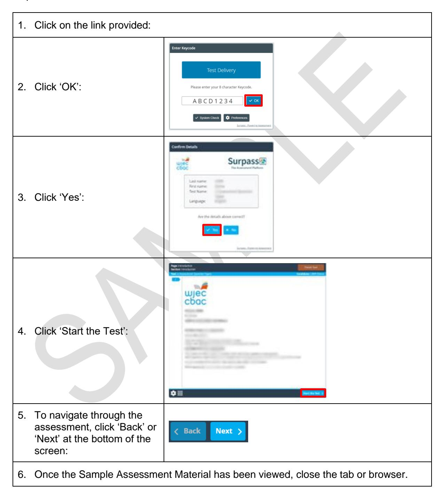

{1}------------------------------------------------


# WJEC GCSE Computer Science

Approved by Qualifications Wales

Sample Assessment Materials

Unit 1: Understanding Computer Science

Teaching from 2025

For award from 2027


Ready for the world. This Qualifications Wales regulated qualification is not available to centres in England.

Made for Wales.

{2}------------------------------------------------


{3}------------------------------------------------

## Contents

| Accessing Sample Assessment Materials | 1  |
|---------------------------------------|----|
| Mark scheme                           | 2  |
| Mapping grid                          | 29 |


{4}------------------------------------------------

#### **UNIT 1: Understanding Computer Science**

Unit 1: Understanding Computer Science is assessed by Digital Examination. The online Sample Assessment Materials can be accessed here:

[https://web.download.wjec.co.uk/surpass/packaged-exams/GCSE-Comp-Sci-E-](https://web.download.wjec.co.uk/surpass/packaged-exams/GCSE-Comp-Sci-E-25/index.html)[25/index.html](https://web.download.wjec.co.uk/surpass/packaged-exams/GCSE-Comp-Sci-E-25/index.html)

Guidance for accessing the online Sample Assessment Materials is detailed in the following steps:



{5}------------------------------------------------

#### **MARK SCHEME**

## **Guidance for examiners**

## **Generic marking principles**

- Marks awarded are always whole marks (not half marks, or other fractions).
- Answers should only be judged on the quality of spelling, punctuation and grammar when these features are specifically assessed by the question as indicated by the mark scheme. The meaning, however, should be unambiguous.
- Marks should be awarded using the full range of marks defined in the mark scheme for the question (however; the use of the full mark range may be limited according to the quality of the candidate responses seen).
- Marks awarded are based solely on the requirements as defined in the mark scheme. Marks should not be awarded with grade thresholds or grade descriptors in mind.

## **Positive marking**

It should be remembered that candidates are writing under examination conditions and credit should be given for what the candidate writes, rather than adopting the approach of penalising him/her for any omissions. It should be possible for a very good response to achieve full marks and a very poor one to achieve zero marks. Marks should not be deducted for a less than perfect answer if it satisfies the criteria of the mark scheme.

For questions that are objective or points-based, the mark scheme should be applied precisely. Marks should be awarded as indicated and no further subdivision made.

Mark schemes often list points which may be included in candidates' answers. The list is not exhaustive. The inclusion of 'Credit any other valid response.' (or similar instruction) within mark schemes allows for the possible variation in candidates' responses. Credit should be given according to the accuracy and relevance of candidates' answers.

Appropriate terminology is reflected in exemplar responses in mark schemes. However, unless there is a specific requirement within a question, candidates may be awarded marks where the answer is accurate but expressed in their own words.

{6}------------------------------------------------

| Question |                            | Answer              |                                                                                                                                                     |                                                                                                                                | AO1                                                                                                                                                              | AO2 | AO3 | Total<br>Mark |  |
|----------|----------------------------|---------------------|-----------------------------------------------------------------------------------------------------------------------------------------------------|--------------------------------------------------------------------------------------------------------------------------------|------------------------------------------------------------------------------------------------------------------------------------------------------------------|-----|-----|---------------|--|
| 1.       | •<br>•                     | CPU:<br>•<br>•<br>• | Ysgol Parc Glyncoed<br>hardware specification.<br>Desktop<br>Quad-core<br>3.2 GHz<br>1 MB cache                                                     | •<br>•<br>Bluetooth 5.3<br>•<br>•<br>USB keyboard                                                                              | is considering purchasing new computers. It is considering the following<br>Gigabit Ethernet port<br>USB 3.0 x 2, USB 2.0 x 4, HDMI<br>x 1, DVI x 1, 3.5 mm jack |     |     |               |  |
|          | •<br>•<br>•<br>•<br>•<br>• |                     | 16 GB DDR4 RAM (2400 MHz)<br>2 TB HDD, 7200 rpm<br>ATX Motherboard<br>116dB Sound Card<br>1080 HDMI PCIe Graphics Card<br>Wireless AC               | •<br>USB mouse<br>•<br>DVD / RW<br>•<br>600W PSU<br>•<br>90 x 344 x 297 mm (H x W x D)<br>•<br>4.3 kg<br>•<br>1 year guarantee |                                                                                                                                                                  |     |     |               |  |
|          | (a)                        |                     | Using the components from the hardware specification, complete the following<br>sentences about the computer system being considered by the school. |                                                                                                                                |                                                                                                                                                                  |     |     |               |  |
|          |                            | (i)                 | Award one<br>mark for the following:<br>•<br>The MOTHERBOARD<br>board of a computer. It holds and connects all<br>other essential components.       | is the primary circuit                                                                                                         | 1                                                                                                                                                                |     |     | 1             |  |
|          |                            | (ii)                | Award one<br>mark for the following:<br>•<br>The PSU<br>provides power to all of the<br>components.                                                 |                                                                                                                                | 1                                                                                                                                                                |     |     | 1             |  |
|          |                            | (iii)               | Award one<br>mark for the following:<br>•<br>The RAM<br>of currently running programs and data.                                                     | will be used for the temporary storage                                                                                         | 1                                                                                                                                                                |     |     | 1             |  |
|          |                            | (iv)                | Award one<br>mark for the following:<br>•<br>The SOUND CARD<br>signals into digital data and reverse this process<br>for output.                    | will convert analogue audio                                                                                                    | 1                                                                                                                                                                |     |     | 1             |  |

{7}------------------------------------------------

| Question | Answer                                                                                                                                                                                                                                                                                                                                                                                                                                                  | AO1 | AO2 | AO3 | Total<br>Mark |
|----------|---------------------------------------------------------------------------------------------------------------------------------------------------------------------------------------------------------------------------------------------------------------------------------------------------------------------------------------------------------------------------------------------------------------------------------------------------------|-----|-----|-----|---------------|
| (b)      | The hardware specification's CPU has four cores and 1 MB cache.<br>Describe how the number of cores and cache size impacts on the performance of a<br>CPU.                                                                                                                                                                                                                                                                                              |     |     |     |               |
|          | Number of cores                                                                                                                                                                                                                                                                                                                                                                                                                                         | 4   |     |     | 4             |
|          | Award one<br>mark for each basic description of how the<br>number of cores impacts on performance, up to a<br>maximum of two<br>marks.                                                                                                                                                                                                                                                                                                                  |     |     |     |               |
|          | A basic description could include one of the following:                                                                                                                                                                                                                                                                                                                                                                                                 |     |     |     |               |
|          | •<br>More cores allow the CPU to execute multiple tasks<br>simultaneously<br>•<br>Tasks like video editing, 3D rendering, and gaming<br>can see significant performance gains with more<br>cores.                                                                                                                                                                                                                                                       |     |     |     |               |
|          | Award two<br>marks for a developed description of how the<br>number of cores impacts on performance.                                                                                                                                                                                                                                                                                                                                                    |     |     |     |               |
|          | A developed<br>description could include one of the<br>following:<br>•<br>More cores allow the CPU to execute multiple tasks<br>simultaneously; applications that are optimised for<br>multi-threading can benefit greatly from a higher<br>number of cores<br>•<br>Tasks like video editing, 3D rendering, and gaming<br>can see significant performance gains with more<br>cores, but not all applications can effectively utilise<br>multiple cores. |     |     |     |               |
|          | Cache size                                                                                                                                                                                                                                                                                                                                                                                                                                              |     |     |     |               |
|          | Award one<br>mark for each basic description of how cache<br>size impacts on performance, up to a maximum of two<br>marks.                                                                                                                                                                                                                                                                                                                              |     |     |     |               |
|          | A basic description could include one of the following:<br>•<br>Larger cache sizes reduce the average memory<br>access time<br>•<br>Faster execution of instructions since the CPU spends                                                                                                                                                                                                                                                               |     |     |     |               |
|          | less time waiting for data to be fetched from slower<br>main memory.                                                                                                                                                                                                                                                                                                                                                                                    |     |     |     |               |
|          | Award two<br>marks for a developed description of how<br>cache size impacts on performance.                                                                                                                                                                                                                                                                                                                                                             |     |     |     |               |
|          |                                                                                                                                                                                                                                                                                                                                                                                                                                                         |     |     |     |               |

{8}------------------------------------------------

|     | A developed description could include one of the<br>following:<br>•<br>Larger cache sizes reduce the average memory<br>access time; more frequently accessed data is stored<br>closer to the CPU cores.<br>•<br>Faster execution of instructions since the CPU spends<br>less time waiting for data to be fetched from slower<br>main memory. This accelerates the overall computing<br>process, enhancing system performance.<br>Credit any other valid response.                                                                                                                                                                                                                                                                                                                                                                                                                                                                                                                                                                                                                                                                                                                                                                                                                                                                                                               |   |   |
|-----|----------------------------------------------------------------------------------------------------------------------------------------------------------------------------------------------------------------------------------------------------------------------------------------------------------------------------------------------------------------------------------------------------------------------------------------------------------------------------------------------------------------------------------------------------------------------------------------------------------------------------------------------------------------------------------------------------------------------------------------------------------------------------------------------------------------------------------------------------------------------------------------------------------------------------------------------------------------------------------------------------------------------------------------------------------------------------------------------------------------------------------------------------------------------------------------------------------------------------------------------------------------------------------------------------------------------------------------------------------------------------------|---|---|
| (c) | Suggest one<br>upgrade to this hardware specification. Explain the impact of this upgrade.<br>Do not use the CPU.                                                                                                                                                                                                                                                                                                                                                                                                                                                                                                                                                                                                                                                                                                                                                                                                                                                                                                                                                                                                                                                                                                                                                                                                                                                                |   |   |
|     | Award one<br>mark for a suitable upgrade and one mark for<br>the impact of the upgrade.<br>Indicative content, examples could include:<br>•<br>Increase RAM (Random Access Memory):<br>•<br>Impact: Increased multitasking capability and<br>faster data access to currently running programs<br>or data.<br>•<br>Upgrading Secondary Storage (HDD to SSD):<br>•<br>Impact: Dramatically improved system speed and<br>responsiveness. SSD significantly reduces boot<br>times, application loading times, and file transfer<br>speeds.<br>SSDs have no moving parts, making<br>them faster and more reliable.<br>•<br>Upgrading Graphics Card:<br>•<br>Impact: Better gaming performance, smoother<br>video playback, and improved graphics rendering.<br>•<br>Upgrading the Motherboard:<br>•<br>Impact: Expanded compatibility, additional<br>features, and better connectivity.<br>•<br>Increase the Power Supply Unit (PSU) wattage:<br>•<br>Impact: A higher-wattage PSU ensures that all<br>components receive sufficient power. Essential for<br>running powerful GPUs, CPUs, and other<br>hardware without stability issues.<br>•<br>Additional Cooling Solutions (CPU Cooler, Case<br>Fans):<br>•<br>Impact: Improved thermal management and<br>system stability, cooling prevents overheating,<br>extends component lifespan, and maintains<br>consistent performance. | 2 | 2 |
|     | Credit any other valid response.                                                                                                                                                                                                                                                                                                                                                                                                                                                                                                                                                                                                                                                                                                                                                                                                                                                                                                                                                                                                                                                                                                                                                                                                                                                                                                                                                 |   |   |

{9}------------------------------------------------

| Question |        | Answer                                                                                                                                                                                                                                                                                                                                  | AO1 | AO2 | AO3 | Total<br>Mark |  |  |  |  |  |
|----------|--------|-----------------------------------------------------------------------------------------------------------------------------------------------------------------------------------------------------------------------------------------------------------------------------------------------------------------------------------------|-----|-----|-----|---------------|--|--|--|--|--|
| 2.       | media. | An organisation needs to make a 400 GB backup of its server files to a secondary storage                                                                                                                                                                                                                                                |     |     |     |               |  |  |  |  |  |
|          | (a)    | State two<br>different types of secondary storage media that would be suitable for this<br>purpose.                                                                                                                                                                                                                                     |     |     |     |               |  |  |  |  |  |
|          |        | Award one<br>mark for each of the following:<br>•<br>Storage Media 1<br>•<br>Storage Media 2                                                                                                                                                                                                                                            |     | 2   |     | 2             |  |  |  |  |  |
|          |        | Suitable examples include:<br>•<br>Flash memory<br>•<br>HDD<br>•<br>SSD<br>•<br>Magnetic tape.                                                                                                                                                                                                                                          |     |     |     |               |  |  |  |  |  |
|          | (b)    | Compare the suitability of the two different types of secondary storage media in terms of<br>durability, read/write speed, and cost per unit of storage.                                                                                                                                                                                |     |     |     |               |  |  |  |  |  |
|          |        | Comparison of<br>•<br>Durability (e.g. Flash memory is more durable than a<br>HDD as it has no moving parts)<br>•<br>Read/write speed (e.g. HDD reads and writes data to<br>disk quicker than magnetic tape)<br>•<br>Cost per unit for storage (e.g. Magnetic tape is<br>cheaper than flash memory, when comparing the cost<br>per bit) |     | 3   |     | 3             |  |  |  |  |  |
|          |        | DO NOT<br>award credit for unsuitable media for 400 GB,<br>e.g. CD / DVD / Blu-ray.                                                                                                                                                                                                                                                     |     |     |     |               |  |  |  |  |  |

{10}------------------------------------------------

| Question |     |                                                                                   | Answer                                                                    |                         |     |      |      |  | AO1 | AO2 | AO3 | Total<br>Mark |  |
|----------|-----|-----------------------------------------------------------------------------------|---------------------------------------------------------------------------|-------------------------|-----|------|------|--|-----|-----|-----|---------------|--|
| 3.       |     |                                                                                   | Numbers are represented by computer systems in digital form.              |                         |     |      |      |  |     |     |     |               |  |
|          | (a) | Use the drop-down lists to identify the binary unit equivalent of each file size. |                                                                           |                         |     |      |      |  |     |     |     |               |  |
|          |     | Award one<br>mark for each of the following:                                      |                                                                           |                         |     |      |      |  |     | 4   |     | 4             |  |
|          |     |                                                                                   | File size                                                                 | 4 GB                    | 2 B | 4 KB | 2 PB |  |     |     |     |               |  |
|          |     |                                                                                   | 16 B                                                                      |                         | P   |      |      |  |     |     |     |               |  |
|          |     |                                                                                   | 4,096 MB                                                                  | P                       |     |      |      |  |     |     |     |               |  |
|          |     |                                                                                   | 2,048 TB                                                                  |                         |     |      | P    |  |     |     |     |               |  |
|          |     |                                                                                   | 4 nibbles                                                                 |                         | P   |      |      |  |     |     |     |               |  |
|          | (b) | Convert the binary number 001100102<br>into hexadecimal.                          |                                                                           |                         |     |      |      |  |     |     |     |               |  |
|          |     | •                                                                                 | Award one<br>3216                                                         | mark for the following: |     |      |      |  |     | 1   |     | 1             |  |
|          | (c) |                                                                                   | Identify how many unique values can be represented by 4 bits in binary.   |                         |     |      |      |  |     |     |     |               |  |
|          |     | •                                                                                 | Award one<br>16                                                           | mark for the following: |     |      |      |  |     | 1   |     | 1             |  |
|          | (d) |                                                                                   | Perform an arithmetic shift 2 places left on the binary number 000011102. |                         |     |      |      |  |     |     |     |               |  |
|          |     | •                                                                                 | Award one<br>001110002                                                    | mark for the following: |     |      |      |  |     | 1   |     | 1             |  |

{11}------------------------------------------------

| Question |     | Answer                                                                                                                                                                                                                                                                                                                                                                       |        |     |      |      |   | AO2 | AO3 | Total<br>Mark |  |
|----------|-----|------------------------------------------------------------------------------------------------------------------------------------------------------------------------------------------------------------------------------------------------------------------------------------------------------------------------------------------------------------------------------|--------|-----|------|------|---|-----|-----|---------------|--|
| 4.       |     | Networks are interconnected systems that enable the exchange and flow of information<br>between computing devices.                                                                                                                                                                                                                                                           |        |     |      |      |   |     |     |               |  |
|          | (a) | Use the drop-down lists to identify the description that matches the protocol.                                                                                                                                                                                                                                                                                               |        |     |      |      |   |     |     |               |  |
|          |     | Award one mark for each of the following:                                                                                                                                                                                                                                                                                                                                    |        |     |      |      |   |     |     | 3             |  |
|          |     | Description                                                                                                                                                                                                                                                                                                                                                                  | HTTPS  | FTP | POP3 | SMTP |   |     |     |               |  |
|          |     | An email retrieval<br>protocol that<br>enables users to<br>download their<br>emails from a<br>remote server                                                                                                                                                                                                                                                                  |        |     |     |      |   |     |     |               |  |
|          |     | Transfers<br>multimedia web<br>pages over the<br>internet securely.                                                                                                                                                                                                                                                                                                          |       |     |      |      |   |     |     |               |  |
|          |     | Copies a file from<br>one location to<br>another via a<br>network.                                                                                                                                                                                                                                                                                                           |        |    |      |      |   |     |     |               |  |
|          | (b) | TCP and IP are two protocols that combine to allow communication between computer<br>systems on a network.<br>Name three<br>items found in a TCP / IP packet.                                                                                                                                                                                                                |        |     |      |      |   |     |     |               |  |
|          |     | Award one<br>mark for each of the following, up to a<br>maximum of three<br>•<br>Source IP address<br>•<br>Destination IP address<br>•<br>Information which enables the data to be reassembled<br>into its original form<br>•<br>Other tracking information<br>•<br>The data itself<br>•<br>A checksum that authenticates the data, i.e. checks it<br>hasn't been corrupted. | marks: |     |      |      | 3 |     |     | 3             |  |

{12}------------------------------------------------

| Question                                                                             |     | Answer                                                                                                       | AO1 | AO2 | AO3 | Total<br>Mark |  |  |
|--------------------------------------------------------------------------------------|-----|--------------------------------------------------------------------------------------------------------------|-----|-----|-----|---------------|--|--|
|                                                                                      | (c) | The following diagram shows the routing cost between each node for data transmitted<br>on a certain network. |     |     |     |               |  |  |
|                                                                                      |     |                                                                                                              |     |     |     |               |  |  |
| below.<br>Award one<br>•<br>7 (B <br>C <br>G <br>K)<br>12 (H <br>B <br>C <br>• |     | Suggest the lowest cost routes between each origin and destination. Complete the table                       |     |     |     |               |  |  |
|                                                                                      |     | mark for each of the following:<br>G <br>K <br>J)                                                          |     | 2   |     | 2             |  |  |

{13}------------------------------------------------

| Question |        | Answer                                                                                                                                                                                  |                                                                                                                                                                                                                                                                                                                       | AO1 | AO2 | AO3 | Total<br>Mark |  |  |  |  |
|----------|--------|-----------------------------------------------------------------------------------------------------------------------------------------------------------------------------------------|-----------------------------------------------------------------------------------------------------------------------------------------------------------------------------------------------------------------------------------------------------------------------------------------------------------------------|-----|-----|-----|---------------|--|--|--|--|
| 5.       | below. | A web-development company allows its users to register for a new account and login to their<br>system with a username and password. An incomplete flowchart of this process can be seen |                                                                                                                                                                                                                                                                                                                       |     |     |     |               |  |  |  |  |
|          | (a)    | Interpret<br>the purpose of the following symbols in the flowchart.                                                                                                                     |                                                                                                                                                                                                                                                                                                                       |     |     |     |               |  |  |  |  |
|          |        | (i)                                                                                                                                                                                     | Award one mark for identifying the correct purpose<br>of the symbol:<br>•<br>Decision                                                                                                                                                                                                                                 |     |     | 1   | 1             |  |  |  |  |
|          |        | (ii)                                                                                                                                                                                    | Award one<br>mark for identifying the correct purpose<br>of the symbol:<br>•<br>Output                                                                                                                                                                                                                                |     |     | 1   | 1             |  |  |  |  |
|          | (b)    | Complete the flowchart by adding the missing details.                                                                                                                                   |                                                                                                                                                                                                                                                                                                                       |     |     |     |               |  |  |  |  |
|          |        | •<br>•<br>•<br>•<br>•<br>•                                                                                                                                                              | Indicative content<br>Award one<br>mark for each of the following:<br>Decision symbol branch: No<br>Store symbol: Store new user details<br>Decision symbol branch: Yes<br>Decision symbol: Check if username and password is<br>correct<br>Output symbol: Message if successful login<br>Stop procedure symbol: End. |     |     | 6   | 6             |  |  |  |  |

{14}------------------------------------------------

| Question |     | Answer                                                                                                                                                                                                              |                               |                                                                                                        |                                                                             | AO1       | AO2           | AO3 | Total<br>Mark |  |  |  |
|----------|-----|---------------------------------------------------------------------------------------------------------------------------------------------------------------------------------------------------------------------|-------------------------------|--------------------------------------------------------------------------------------------------------|-----------------------------------------------------------------------------|-----------|---------------|-----|---------------|--|--|--|
| 6.       |     | The system development lifecycle (SDLC) is a systematic process that ensures efficient and<br>high-quality systems delivery.                                                                                        |                               |                                                                                                        |                                                                             |           |               |     |               |  |  |  |
|          | (a) |                                                                                                                                                                                                                     |                               |                                                                                                        | Use terms from the table below to complete the sentences about the SDLC.    |           |               |     |               |  |  |  |
|          |     |                                                                                                                                                                                                                     | Maintenance                   | Deployment                                                                                             | Extensibility                                                               |           | Implementatio |     |               |  |  |  |
|          |     |                                                                                                                                                                                                                     | Readability<br>Agile          | Scoping and<br>feasibility                                                                             |                                                                             | Iterative |               |     |               |  |  |  |
|          |     | Design                                                                                                                                                                                                              |                               | Testing<br>Analysis                                                                                    |                                                                             |           | Modularity    |     |               |  |  |  |
|          |     | (i)<br>Award one<br>mark for the following:<br>1<br>•<br>Project objectives are defined, alternative<br>solutions are explored, and the project's viability<br>is assessed at the SCOPING AND<br>FEASIBILITY stage. |                               |                                                                                                        |                                                                             |           |               |     | 1             |  |  |  |
|          |     | (ii)                                                                                                                                                                                                                | Award one<br>•<br>TESTING     | mark for the following:<br>evaluated to ensure it meets specified<br>requirements before release.      | verifies that the software is rigorously                                    | 1         |               |     | 1             |  |  |  |
|          |     | (iii)                                                                                                                                                                                                               | Award one<br>•<br>MAINTENANCE | mark for the following:<br>and improved over time.                                                     | entails the ongoing support<br>where the software system is updated, fixed, | 1         |               |     | 1             |  |  |  |
|          |     | (iv)                                                                                                                                                                                                                | Award one<br>•                | mark for the following:<br>The creation of a blueprint for the system's<br>is determined at the DESIGN | architecture, user interface, and data structures<br>stage.                 | 1         |               |     | 1             |  |  |  |

{15}------------------------------------------------

| Question | Answer                                                                                                                                                                                                                         | AO1 | AO2 | AO3 | Total<br>Mark |  |  |  |  |  |
|----------|--------------------------------------------------------------------------------------------------------------------------------------------------------------------------------------------------------------------------------|-----|-----|-----|---------------|--|--|--|--|--|
| (b)      | Describe one<br>strength and one<br>weakness for each of the approaches to system<br>development.                                                                                                                              |     |     |     |               |  |  |  |  |  |
|          | (i)<br>Waterfall.                                                                                                                                                                                                              |     |     |     |               |  |  |  |  |  |
|          | Award a maximum of one<br>mark for a basic<br>description of a strength of the waterfall approach to<br>system development.                                                                                                    | 4   |     |     | 4             |  |  |  |  |  |
|          | A basic description could include one of the<br>following:                                                                                                                                                                     |     |     |     |               |  |  |  |  |  |
|          | Clear and well-defined phases<br>•<br>Each phase is distinct and has specific<br>outcomes, making it easy to understand.                                                                                                       |     |     |     |               |  |  |  |  |  |
|          | Documentation<br>•<br>Keeping detailed documentation at each stage<br>can be beneficial for future reference and<br>maintenance.<br>Easy to manage<br>•<br>Progress can be easily tracked as each phase<br>has set milestones. |     |     |     |               |  |  |  |  |  |
|          | Predictability<br>•<br>Due to its linear nature, it's easier to estimate<br>timelines and costs at the beginning of the<br>project.                                                                                            |     |     |     |               |  |  |  |  |  |
|          | Award two<br>marks for a developed description of a<br>strength of the waterfall approach to system<br>development.                                                                                                            |     |     |     |               |  |  |  |  |  |
|          | A developed description could include one of the<br>following:                                                                                                                                                                 |     |     |     |               |  |  |  |  |  |
|          | Clear and well-defined phases<br>•<br>Each phase is distinct and has specific<br>outcomes, making it easy to understand, so all<br>team members know what to expect and when.                                                  |     |     |     |               |  |  |  |  |  |
|          | Documentation<br>•<br>Keeping detailed documentation at each stage<br>can be beneficial for future reference and<br>maintenance, helping new team members get<br>up to speed quickly.                                          |     |     |     |               |  |  |  |  |  |
|          |                                                                                                                                                                                                                                |     |     |     |               |  |  |  |  |  |

{16}------------------------------------------------

#### Easy to manage

• Progress can be easily tracked as each phase has set milestones providing clear indicators of project status and help spot issues early.

## Predictability

• Due to its linear nature, it's easier to predict timelines and costs at the start of the project, allowing for better budget and resource planning.

Award a maximum of **one** mark for a basic description of a weakness of the waterfall approach to system development.

A basic description could include one of the following:

#### Rigid and inflexible

• Difficult to make changes once a phase is completed.

## Late detection of issues

• Testing is done only at the end of the development process.

## Customer involvement

• Limited opportunities for customer feedback during the development process.

#### Risk of project failure

• High risk if the initial requirements are misunderstood.

Award **two** marks for a developed description of a weakness of the waterfall approach to system development.

A developed description could include one of the following:

#### Rigid and inflexible

• Difficult to make changes once a phase is completed, which can be problematic if requirements change over time.

#### Late detection of issues

• Testing is done only at the end of the development process, which can lead to late identification of issues in the project timeline, potentially causing delays and increased costs.

{17}------------------------------------------------

|  |      | Customer involvement<br>•<br>Limited opportunities for customer feedback<br>during the development process, resulting in a<br>final product that may not fully meet customer<br>needs or expectations.                |   |  |   |
|--|------|-----------------------------------------------------------------------------------------------------------------------------------------------------------------------------------------------------------------------|---|--|---|
|  |      | Risk of project failure<br>•<br>High risk if the initial requirements are<br>misunderstood, as the linear approach doesn't<br>easily allow for changes once development is<br>underway.                               |   |  |   |
|  |      | Credit any other valid response.                                                                                                                                                                                      |   |  |   |
|  | (ii) | Spiral.                                                                                                                                                                                                               |   |  |   |
|  |      | Award a maximum of one<br>mark for a basic<br>description of a strength of the spiral approach to<br>system development.                                                                                              | 4 |  | 4 |
|  |      | A basic description could include one of the<br>following:<br>Iterative development                                                                                                                                   |   |  |   |
|  |      | •<br>Allows for iterations and refinements at each<br>cycle.                                                                                                                                                          |   |  |   |
|  |      | Risk management<br>•<br>Explicitly addresses risk management in each<br>iteration.                                                                                                                                    |   |  |   |
|  |      | Flexibility<br>•<br>Accommodates changes and updates to<br>requirements effectively.                                                                                                                                  |   |  |   |
|  |      | Early prototype development<br>•<br>Provides opportunities for early prototypes or<br>proof-of-concepts.                                                                                                              |   |  |   |
|  |      | Award two<br>marks for a developed description of a<br>strength of the spiral approach to system<br>development.                                                                                                      |   |  |   |
|  |      | A developed description could include one of the<br>following:                                                                                                                                                        |   |  |   |
|  |      | Iterative development<br>•<br>Allows for iterations and refinements at each<br>cycle, allowing for feedback and changes<br>throughout the development process, which<br>helps to meet customer needs more accurately. |   |  |   |
|  |      |                                                                                                                                                                                                                       |   |  |   |

{18}------------------------------------------------

#### Risk management

• Explicitly addresses risk management in each iteration, which helps to prevent potential issues escalating.

#### Flexibility

• Accommodates changes and updates to requirements more effectively than the waterfall model, as it allows for iteration and adaptation, making it more responsive to changing project needs.

## Early prototype development

• Provides opportunities for early prototypes or proof-of-concepts, which can be beneficial for gathering feedback early in the development cycle, reducing the risk of project failure.

Award a maximum of **one** mark for a basic description of a weakness of the spiral approach to system development.

A basic description could include one of the following:

#### Complexity

• Can be more complex to manage due to its iterative nature.

#### Resource intensive

• Requires more resources and time for continuous testing and revisions.

#### Dependency on risk analysis

• Increased risk of scope creep due to ongoing changes and refinements.

## Documentation challenges

• Can lead to less comprehensive documentation.

Award two marks for a developed description of a weakness of the spiral approach to system development.

A developed description could include one of the following:

#### Complexity

• Can be more complex to manage due to its iterative nature, requiring careful planning and coordination to ensure that iterations align with overall project goals.

{19}------------------------------------------------

|     | Resource intensive<br>•<br>Requires more resources and time for<br>continuous testing and revisions, which can lead<br>to higher costs and longer development times<br>compared to more linear approaches.<br>Dependency on risk analysis<br>•<br>Requires a strong dependency on effective risk<br>analysis, as each iteration must identify and<br>mitigate risks, which can be challenging and<br>may impact project timelines and outcomes. |
|-----|-------------------------------------------------------------------------------------------------------------------------------------------------------------------------------------------------------------------------------------------------------------------------------------------------------------------------------------------------------------------------------------------------------------------------------------------------|
|     | Documentation challenges<br>•<br>Can lead to less comprehensive documentation<br>as the focus is on iterative development and<br>rapid prototyping, which may result in<br>incomplete or outdated documentation if not<br>managed carefully.<br>Credit any other valid response.                                                                                                                                                                |
| (c) | Describe one<br>ethical consideration in systems development.                                                                                                                                                                                                                                                                                                                                                                                   |
|     | Award a maximum of one<br>mark for a basic description of<br>2<br>2<br>an ethical consideration in systems development.                                                                                                                                                                                                                                                                                                                         |
|     | A basic description could include one of the following:                                                                                                                                                                                                                                                                                                                                                                                         |
|     | Privacy<br>•<br>Respect user privacy and minimise data collection.<br>Security                                                                                                                                                                                                                                                                                                                                                                  |
|     | •<br>Develop software with strong security measures.<br>Fairness<br>•<br>Avoid bias and ensure fairness for all users.                                                                                                                                                                                                                                                                                                                          |
|     | Accessibility<br>•<br>Make software accessible to users with disabilities.                                                                                                                                                                                                                                                                                                                                                                      |
|     | Transparency<br>•<br>Be clear about software functionality and risks.                                                                                                                                                                                                                                                                                                                                                                           |
|     | Intellectual Property<br>•<br>Respect copyrights and licenses.                                                                                                                                                                                                                                                                                                                                                                                  |
|     | Environmental Impact<br>•<br>Minimise energy consumption and electronic waste.<br>Social Impact<br>•<br>Consider broader societal implications.                                                                                                                                                                                                                                                                                                 |
|     | Informed Consent<br>•<br>Obtain explicit consent for data collection.                                                                                                                                                                                                                                                                                                                                                                           |

{20}------------------------------------------------

#### Accountability

• Take responsibility for ethical issues.

Award **two** marks for a developed description of an ethical consideration in systems development.

A developed description could include one of the following:

## Privacy

• Respect user privacy, minimise data collection, and ensure that any data collected is securely stored and protected from unauthorised access.

## Security

• Develop software with robust security measures, including encryption and regular security audits, to protect against data breaches and cyber-attacks.

#### Fairness

• Avoid bias and discrimination in algorithms and implement measures to ensure that all users are treated fairly, regardless of their background.

#### Accessibility

• Make software accessible to users with disabilities by following accessibility standards and guidelines and providing alternative input and output options.

#### Transparency

• Be transparent about software functionality, limitations, and risks, providing clear and comprehensive information to users about how the software operates and what data it collects.

#### Intellectual Property

• Respect copyrights and licenses, attribute sources correctly, and ensure that all third-party content used in the software is properly licensed.

## Environmental Impact

• Minimise energy consumption and electronic waste by optimising software for energy efficiency and supporting the recycling and proper disposal of electronic devices.

#### Social Impact

• Consider broader societal implications of the software, promoting positive outcomes such as social inclusion, education, and well-being, while mitigating any negative impacts.

{21}------------------------------------------------

#### Informed Consent

• Obtain explicit and informed consent from users for data collection and processing, ensuring that they are fully aware of what data is being collected and how it will be used.

#### Accountability

• Take responsibility for the ethical implications of the software, promptly addressing and rectifying any issues that arise, and ensuring that there are clear processes for users to report concerns.

**Credit any other valid response.**


{22}------------------------------------------------

| Question |     | Answer<br>AO1<br>AO2<br>AO3<br>Mark                                                                | Total |  |  |  |  |  |
|----------|-----|----------------------------------------------------------------------------------------------------|-------|--|--|--|--|--|
| 7.       | (a) | State the logical operator that has been used in the following truth table.                        |       |  |  |  |  |  |
|          |     | Input<br>Output<br>A<br>B<br>C                                                                     |       |  |  |  |  |  |
|          |     | 0<br>0<br>0                                                                                        |       |  |  |  |  |  |
|          |     | 1<br>0<br>1<br>0<br>1<br>1<br>1<br>1<br>1                                                          |       |  |  |  |  |  |
|          |     | Award one<br>mark for the following:<br>1<br>•<br>OR (or +)                                        | 1     |  |  |  |  |  |
|          | (b) | Select one<br>box to identify the Boolean expression represented by each truth table.              |       |  |  |  |  |  |
|          |     | (i)<br>Input<br>Output<br>A<br>B<br>C<br>0<br>0<br>0<br>1<br>0<br>1<br>0<br>1<br>0<br>1<br>1<br>0  |       |  |  |  |  |  |
|          |     | Award one<br>mark for the following:<br>1<br>•<br>𝐶<br>=<br>𝐴.<br>𝐵<br>(or C = A and Not B)        | 1     |  |  |  |  |  |
|          |     | (ii)<br>Input<br>Output<br>P<br>Q<br>R<br>0<br>0<br>1<br>1<br>0<br>0<br>0<br>1<br>0<br>1<br>1<br>0 |       |  |  |  |  |  |
|          |     | Award one<br>mark for the following:<br>1<br>•<br>(or R = Not (P OR Q)<br>𝑅<br>=<br>𝑃<br>+<br>𝑄    | 1     |  |  |  |  |  |

{23}------------------------------------------------

| Question | Answer |                                                                                                                                                                                                                                                                                                                                                                                                                                                                                                                                                                                                                                                                                                                                                                                                                                                                                                                                                                                                                                                                                                                                                                        | AO1 | AO2 | AO3 | Total<br>Mark |  |  |
|----------|--------|------------------------------------------------------------------------------------------------------------------------------------------------------------------------------------------------------------------------------------------------------------------------------------------------------------------------------------------------------------------------------------------------------------------------------------------------------------------------------------------------------------------------------------------------------------------------------------------------------------------------------------------------------------------------------------------------------------------------------------------------------------------------------------------------------------------------------------------------------------------------------------------------------------------------------------------------------------------------------------------------------------------------------------------------------------------------------------------------------------------------------------------------------------------------|-----|-----|-----|---------------|--|--|
| 8.       |        | An Operating System is a software that controls all aspects of running the computer system.                                                                                                                                                                                                                                                                                                                                                                                                                                                                                                                                                                                                                                                                                                                                                                                                                                                                                                                                                                                                                                                                            |     |     |     |               |  |  |
| (a)      |        | Describe how the operating system manages:                                                                                                                                                                                                                                                                                                                                                                                                                                                                                                                                                                                                                                                                                                                                                                                                                                                                                                                                                                                                                                                                                                                             |     |     |     |               |  |  |
|          | (i)    | Interrupts.                                                                                                                                                                                                                                                                                                                                                                                                                                                                                                                                                                                                                                                                                                                                                                                                                                                                                                                                                                                                                                                                                                                                                            |     |     |     |               |  |  |
|          |        | Award one<br>mark for each basic description of how<br>an operating system manages interrupts,<br>up to a<br>maximum of two<br>marks.                                                                                                                                                                                                                                                                                                                                                                                                                                                                                                                                                                                                                                                                                                                                                                                                                                                                                                                                                                                                                                  | 2   |     |     | 2             |  |  |
|          |        | A basic description could include one of the<br>following:                                                                                                                                                                                                                                                                                                                                                                                                                                                                                                                                                                                                                                                                                                                                                                                                                                                                                                                                                                                                                                                                                                             |     |     |     |               |  |  |
|          |        | •<br>External devices signal interrupts to the CPU.<br>•<br>OS identifies interrupt type and calls the<br>corresponding interrupt handler.<br>•<br>CPU switches from the current task to the<br>interrupt handler.<br>•<br>Current task state is saved for later resumption.<br>•<br>Handler executes required actions, such as<br>servicing I/O requests.<br>•<br>CPU restores saved task state and resumes<br>previous execution.<br>Award two<br>marks for a developed description of<br>how an operating system manages interrupts.<br>A developed description could include one of the<br>following:<br>•<br>External devices, like keyboards or printers,<br>signal interrupts to the CPU to indicate they<br>need attention.<br>•<br>The OS identifies the type of interrupt and calls<br>the corresponding interrupt handler, a special<br>routine designed to handle that specific<br>interrupt.<br>•<br>The CPU switches from the current task to the<br>interrupt handler, pausing its current work.<br>•<br>The current task state, including its registers<br>and program counter, is saved so the task can<br>resume later without losing progress.<br>• |     |     |     |               |  |  |
|          |        | The interrupt handler executes the required<br>actions, such as processing data from the<br>external device.<br>•<br>Once the interrupt handler finishes, the CPU<br>restores the saved task state and resumes the<br>previous execution, continuing from where it left<br>off.<br>Credit any other valid response.                                                                                                                                                                                                                                                                                                                                                                                                                                                                                                                                                                                                                                                                                                                                                                                                                                                    |     |     |     |               |  |  |

{24}------------------------------------------------

|     | (ii)<br>Multi-tasking.                                                                                                                                                                                                                                                                                               |   |
|-----|----------------------------------------------------------------------------------------------------------------------------------------------------------------------------------------------------------------------------------------------------------------------------------------------------------------------|---|
|     | Award one<br>mark for each basic description of how<br>2<br>an operating system manages multi-tasking, up to a<br>maximum of two<br>marks.                                                                                                                                                                           | 2 |
|     | A basic description could include one of the<br>following:                                                                                                                                                                                                                                                           |   |
|     | •<br>OS allocates CPU time to multiple tasks.<br>•<br>CPU time is divided among tasks in time slices.<br>•<br>OS performs context switches between tasks.<br>•<br>Some tasks may have higher priority and are<br>executed promptly.<br>•<br>OS manages system resources to support<br>concurrent execution of tasks. |   |
|     | Award two<br>marks for a developed description of<br>how an operating system manages multi-tasking.                                                                                                                                                                                                                  |   |
|     | A developed description could include one of the<br>following:                                                                                                                                                                                                                                                       |   |
|     | •<br>The OS allocates CPU time to multiple tasks,<br>which determine the order and duration each<br>task gets to use the CPU.<br>•<br>CPU time is divided among tasks in small time<br>slices, allowing each task to take turns using<br>the CPU.<br>•<br>The OS performs context switches between                   |   |
|     | tasks, this allows multiple tasks to share the<br>CPU effectively.<br>•<br>Some tasks may have higher priority. The OS<br>uses priority scheduling to make sure important<br>tasks get more CPU time or are executed<br>before lower-priority tasks.                                                                 |   |
|     | •<br>The OS manages system resources, to support<br>the concurrent execution of tasks. This involves<br>allocating memory to tasks, handling input and<br>output operations so tasks do not interfere with<br>each other.                                                                                            |   |
|     | Credit any other valid response.                                                                                                                                                                                                                                                                                     |   |
| (b) | Describe the purpose of three<br>different types of utility software.                                                                                                                                                                                                                                                |   |
|     | Award one<br>mark for each basic description of a purpose<br>6<br>of utility software, up to a maximum of three<br>marks.<br>A basic description could include one of the following:                                                                                                                                 | 6 |
|     | Antivirus software<br>•<br>Protects against and removes malicious software to<br>safeguard the system from security threats.                                                                                                                                                                                         |   |

{25}------------------------------------------------

#### Backup software

• Automatically backs up data to external storage or cloud services to prevent data loss.

#### Disk cleanup

• Optimises disk space usage by removing temporary data to improve system performance.

## Disk defragmenter

• Reorganises fragmented data to improve file access speed and overall system performance.

## File compression/archiving software

• Compresses files and folders into a single archive format to save disk space and facilitate easier file transfer.

## System optimisation tools

• Tweaks system settings, removes unnecessary startup programs, and optimises system resources to enhance performance.

## Disk partitioning software

• Divides a hard drive into multiple partitions for better organisation of data and improved data management.

## Data recovery software

• Recovers lost or deleted files, folders, and partitions from storage devices to restore lost data.

## Network monitoring software

• Monitors network traffic and devices to identify and troubleshoot network issues and optimise performance.

Award **two** marks each developed description of a purpose of utility software, up to a maximum of **six** marks.

A developed description could include one of the following:

#### Antivirus software

• Protects against and removes malicious software, such as viruses, to safeguard the system from security threats. It continuously scans the system and updates virus definitions to counter new threats.

#### Backup software

• Automatically backs up data to external storage to prevent data loss in case of hardware failure, accidental deletion, or other disasters. It ensures that critical data can be restored quickly and efficiently.

{26}------------------------------------------------

#### Disk cleanup

• Optimises disk space usage by removing temporary files, system cache, and other unnecessary data to improve system performance and free up storage space, ensuring the system runs smoothly.

#### Disk defragmenter

• Reorganises fragmented data on the hard drive to improve file access speed and overall system performance. It consolidates fragmented files and frees up contiguous space to enhance read/write efficiency.

## File compression/archiving software

• Compresses files and folders into a single archive format to save disk space and facilitate easier file transfer and storage. It supports various compression formats and can reduce the size of large files significantly.

## System optimisation tools

• Tweaks system settings, removes unnecessary startup programs, and optimises system resources to enhance overall performance. It can also clean the registry and manage system updates.

## Disk partitioning software

• Divides a hard drive into multiple partitions, allowing for better organisation of data. It can also create partitions for different operating systems or for backup purposes.

#### Data recovery software

• Recovers lost or deleted files, folders, and partitions from storage devices to restore data that was accidentally deleted or lost due to hardware failure, formatting, or other issues. It supports various file systems and storage media.

#### Network monitoring software

• Monitors network traffic, bandwidth usage, and network devices to identify and troubleshoot network issues, optimise performance, and ensure network security. It provides real-time insights and alerts for potential problems.

Award marks for a mixture of basic and developed descriptions, as appropriate, for example, two basic description and one developed description would receive four marks (1 + 1 + 2), up to a maximum of **six** marks.

**Credit any other valid response.**

{27}------------------------------------------------

| Question | Answer | AO1 | AO2 | AO3 | Total<br>Mark |
|----------|--------|-----|-----|-----|---------------|
|----------|--------|-----|-----|-----|---------------|

**9.** Below is a program written using a high-level programming language. It is intended to add ten numbers input by a user. The program contains an error. This program is intended to be compiled.

```
1 Start addProc
2 number is integer
3 a is integer
4 total is iteger
5
6 for i = 1 to 10
7 output "Please enter next 
  number"
8 input number
9 a = a + number
10 next i
11
12 total = a
13 output "The total = ", total
14
15 End addProc
```

(a) Use terms from the table below to complete the sentences about the program compilation process.

|     | code<br>optimisation                                                                                                      |                                                                                                                                                        | recursion<br>semantic<br>analysis<br>analysis |                   |  | iteration count  |  |   |
|-----|---------------------------------------------------------------------------------------------------------------------------|--------------------------------------------------------------------------------------------------------------------------------------------------------|-----------------------------------------------|-------------------|--|------------------|--|---|
|     |                                                                                                                           | syntax analysis                                                                                                                                        | code generation                               | construction flow |  | lexical analysis |  |   |
|     | (i)                                                                                                                       | Award one<br>mark for the following:<br>1<br>1<br>•<br>The program is split into tokens and all<br>whitespace is removed during LEXICAL<br>ANALYSIS.   |                                               |                   |  |                  |  |   |
|     | (ii)                                                                                                                      | Award one<br>mark for the following:<br>•<br>The error in this program would be detected<br>during SYNTAX ANALYSIS.                                    |                                               | 1                 |  | 1                |  |   |
|     | (iii)                                                                                                                     | Award one<br>mark for the following:<br>•<br>Line 12<br>creates an inefficient use of memory.<br>The CODE OPTIMISATION<br>stage would<br>address this. |                                               |                   |  |                  |  | 1 |
| (b) |                                                                                                                           | Identify the error detected and suggest a suitable change to this code to address the<br>error.                                                        |                                               |                   |  |                  |  |   |
|     | Award one<br>mark for each of the following:<br>2<br>2<br>•<br>Error: total is iteger<br>•<br>total is integer<br>Change: |                                                                                                                                                        |                                               |                   |  |                  |  |   |

{28}------------------------------------------------

| Question |     | Answer                                                                                                         |                  |                    |           |             | AO1 | AO2 | AO3 | Total<br>Mark |  |  |  |  |  |  |
|----------|-----|----------------------------------------------------------------------------------------------------------------|------------------|--------------------|-----------|-------------|-----|-----|-----|---------------|--|--|--|--|--|--|
| 10.      |     | Computer systems can be vulnerable to various cyber security threats.                                          |                  |                    |           |             |     |     |     |               |  |  |  |  |  |  |
|          | (a) | Use the drop-down lists to identify the description that matches the type of malware.                          |                  |                    |           |             |     |     |     |               |  |  |  |  |  |  |
|          |     |                                                                                                                | 3                |                    |           | 3           |     |     |     |               |  |  |  |  |  |  |
|          |     | Description                                                                                                    | Trojan<br>horses | m<br>ware<br>Ranso | ms<br>Wor | ware<br>Spy |     |     |     |               |  |  |  |  |  |  |
|          |     | Malware that encrypts<br>files, demanding<br>payment for<br>decryption or<br>restoration of access.            |                  |                   |           |             |     |     |     |               |  |  |  |  |  |  |
|          |     | Malicious programs<br>disguised as legitimate<br>software, which when<br>executed, perform<br>harmful actions. |                 |                    |           |             |     |     |     |               |  |  |  |  |  |  |
|          |     | Software that secretly<br>gathers user<br>information without<br>their consent.                                |                  |                    |           |            |     |     |     |               |  |  |  |  |  |  |

{29}------------------------------------------------

| Question |      | Answer                                                                                                                                                                                                                                                                                                                                                                                                                                        | AO1 | AO2 | AO3 | Total<br>Mark |  |  |  |
|----------|------|-----------------------------------------------------------------------------------------------------------------------------------------------------------------------------------------------------------------------------------------------------------------------------------------------------------------------------------------------------------------------------------------------------------------------------------------------|-----|-----|-----|---------------|--|--|--|
| (b)      |      | Describe the types of social engineering given below.                                                                                                                                                                                                                                                                                                                                                                                         |     |     |     |               |  |  |  |
|          | (i)  | Pretexting.                                                                                                                                                                                                                                                                                                                                                                                                                                   |     |     |     |               |  |  |  |
|          |      | Award one<br>mark for each basic description of<br>pretexting, up to a maximum of two<br>marks.                                                                                                                                                                                                                                                                                                                                               | 2   |     |     | 2             |  |  |  |
|          |      | A basic description could include one of the<br>following:                                                                                                                                                                                                                                                                                                                                                                                    |     |     |     |               |  |  |  |
|          |      | •<br>Attacker fabricates a scenario to manipulate<br>someone into divulging sensitive information.<br>•<br>Posing as someone else, such as a trusted<br>authority figure, to gain the victim's trust and<br>obtain sensitive information.                                                                                                                                                                                                     |     |     |     |               |  |  |  |
|          |      | Award two<br>marks for a developed description of<br>pretexting.                                                                                                                                                                                                                                                                                                                                                                              |     |     |     |               |  |  |  |
|          |      | A developed description could include one of the<br>following:                                                                                                                                                                                                                                                                                                                                                                                |     |     |     |               |  |  |  |
|          |      | •<br>An attacker fabricates a convincing scenario,<br>such as a fake emergency, to manipulate<br>someone into divulging sensitive information.<br>This tactic plays on the victim's emotions.<br>•<br>Posing as someone else, such as a trusted<br>authority figure, to gain the victim's trust and<br>obtain sensitive information. This technique,<br>relies on the victim's assumption that the<br>attacker is legitimate and trustworthy. |     |     |     |               |  |  |  |
|          |      | Credit any other valid response.                                                                                                                                                                                                                                                                                                                                                                                                              |     |     |     |               |  |  |  |
|          | (ii) | Baiting.                                                                                                                                                                                                                                                                                                                                                                                                                                      |     |     |     |               |  |  |  |
|          |      | Award one<br>mark for each basic description of<br>baiting, up to a maximum of Award a maximum of<br>two marks.                                                                                                                                                                                                                                                                                                                               | 2   |     |     | 2             |  |  |  |
|          |      | A basic description could include one of the<br>following:                                                                                                                                                                                                                                                                                                                                                                                    |     |     |     |               |  |  |  |
|          |      | •<br>Attacker entices a victim with a false promise to<br>trick them into revealing sensitive information or<br>taking harmful actions.<br>•<br>Leaving infected USB drives in a public place,<br>hoping that someone will pick them up and plug<br>them into their computer out of curiosity.                                                                                                                                                |     |     |     |               |  |  |  |
|          |      | Award two<br>marks for a developed description of<br>baiting.                                                                                                                                                                                                                                                                                                                                                                                 |     |     |     |               |  |  |  |

{30}------------------------------------------------

| A developed description could include one of the<br>following:<br>•<br>An attacker entices a victim with a false promise,<br>such as access to exclusive content, to trick<br>them into revealing sensitive information or<br>taking harmful actions.<br>•<br>Leaving infected USB drives in a public place,<br>hoping that someone will pick them up and plug<br>them into their computer out of curiosity. This<br>can lead to malware installation and<br>unauthorised access to the victim's system.                                                                                                                                                                                                                                                                                                                                                                                                                                                                                                                                     |
|----------------------------------------------------------------------------------------------------------------------------------------------------------------------------------------------------------------------------------------------------------------------------------------------------------------------------------------------------------------------------------------------------------------------------------------------------------------------------------------------------------------------------------------------------------------------------------------------------------------------------------------------------------------------------------------------------------------------------------------------------------------------------------------------------------------------------------------------------------------------------------------------------------------------------------------------------------------------------------------------------------------------------------------------|
| Credit any other valid response.                                                                                                                                                                                                                                                                                                                                                                                                                                                                                                                                                                                                                                                                                                                                                                                                                                                                                                                                                                                                             |
| (iii)<br>Quid pro quo.                                                                                                                                                                                                                                                                                                                                                                                                                                                                                                                                                                                                                                                                                                                                                                                                                                                                                                                                                                                                                       |
| Award two<br>marks for each basic description of Quid<br>2<br>2<br>pro quo, up to a maximum of two<br>marks.<br>A basic description could include one of the<br>following:<br>•<br>Attacker offers a benefit or service in exchange<br>for the victim providing sensitive information or<br>performing a specific action.<br>•<br>Offering technical support in exchange for the<br>victim revealing their login credentials.<br>Award two<br>marks for a developed description of<br>Quid pro quo.<br>A developed description could include one of the<br>following:<br>•<br>An attacker offers a benefit or service, such as<br>troubleshooting help or access to exclusive<br>content, in exchange for the victim providing<br>sensitive information or performing a specific<br>action.<br>•<br>Offering technical support or assistance with a<br>problem in exchange for the victim revealing<br>their login credentials or granting access to their<br>computer. This can lead to unauthorised access<br>and potential data breaches. |
|                                                                                                                                                                                                                                                                                                                                                                                                                                                                                                                                                                                                                                                                                                                                                                                                                                                                                                                                                                                                                                              |
| Credit any other valid response.                                                                                                                                                                                                                                                                                                                                                                                                                                                                                                                                                                                                                                                                                                                                                                                                                                                                                                                                                                                                             |

{31}------------------------------------------------

| (c) | Name one<br>way of protecting against cyber security threats. |    |
|-----|---------------------------------------------------------------|----|
|     | Award one<br>mark for any of the following:<br>1              | 1  |
|     | •<br>Use strong passwords                                     |    |
|     | •<br>Enable multi-factor authentication (MFA)                 |    |
|     | •<br>Keep software updated                                    |    |
|     | •<br>Educate employees                                        |    |
|     | •<br>Encrypt data                                             |    |
|     | •<br>Backup data regularly                                    |    |
|     | •<br>Use firewalls                                            |    |
|     | •<br>Implement access controls                                |    |
|     | •<br>Monitor systems                                          |    |
|     | •<br>Secure Wi-Fi networks                                    |    |
|     | •<br>Implement endpoint protection                            |    |
|     | •<br>Create an incident response plan                         |    |
|     | •<br>Secure supply chains                                     |    |
|     | •<br>Conduct security audits                                  |    |
|     | •<br>Penetration testing                                      |    |
|     | •<br>Network forensics                                        |    |
|     | •<br>Anti-malware software.                                   |    |
|     | TOTAL<br>48<br>24<br>8                                        | 80 |

{32}------------------------------------------------

## Mapping of questions to specification content and assessment objectives: Unit 1

|   |          |       |       | Topic and Section |           |           |               |               |               |           |               |               |               |               |               |               |           |           |               |               |           |           |           |        |                |   |              |
|---|----------|-------|-------|-------------------|-----------|-----------|---------------|---------------|---------------|-----------|---------------|---------------|---------------|---------------|---------------|---------------|-----------|-----------|---------------|---------------|-----------|-----------|-----------|--------|----------------|---|--------------|
|   | Question |       |       | 1.1               |           | 1.2       |               |               | 1.3           |           |               |               |               |               | 1             |               | 1.5       |           | 2             | 2             | 2         | O1        | 2<br>O    | 3<br>O | al<br>ks<br>ot |   |              |
|   |          |       | 1.1.1 | 2<br>1.1.         | 3<br>1.1. | 2.1<br>1. | 2<br>2.<br>1. | 3<br>2.<br>1. | 4<br>2.<br>1. | 3.1<br>1. | 2<br>3.<br>1. | 3<br>3.<br>1. | 4<br>3.<br>1. | 5<br>3.<br>1. | 6<br>3.<br>1. | 7<br>3.<br>1. | 4.1<br>1. | 5.1<br>1. | 2<br>5.<br>1. | 3<br>5.<br>1. | 6.1<br>1. | 7.1<br>1. | 8.1<br>1. | A      | A              | A | ar<br>T<br>M |
|   | (a)      | (i)   | 1     |                   |           |           |               |               |               |           |               |               |               |               |               |               |           |           |               |               |           |           |           | 1      | 0              | 0 | 1            |
|   |          | (ii)  | 1     |                   |           |           |               |               |               |           |               |               |               |               |               |               |           |           |               |               |           |           |           | 1      | 0              | 0 | 1            |
|   |          | (iii) | 1     |                   |           |           |               |               |               |           |               |               |               |               |               |               |           |           |               |               |           |           |           | 1      | 0              | 0 | 1            |
| 1 |          | (iv)  | 1     |                   |           |           |               |               |               |           |               |               |               |               |               |               |           |           |               |               |           |           |           | 1      | 0              | 0 | 1            |
|   | (b)      |       | 4     |                   |           |           |               |               |               |           |               |               |               |               |               |               |           |           |               |               |           |           |           | 4      | 0              | 0 | 4            |
|   | (c)      |       | 2     |                   |           |           |               |               |               |           |               |               |               |               |               |               |           |           |               |               |           |           |           | 0      | 2              | 0 | 2            |
|   | (a)      |       |       |                   | 2         |           |               |               |               |           |               |               |               |               |               |               |           |           |               |               |           |           |           | 0      | 2              | 0 | 2            |
| 2 | (b)      |       |       |                   | 3         |           |               |               |               |           |               |               |               |               |               |               |           |           |               |               |           |           |           | 0      | 3              | 0 | 3            |
|   | (a)      |       |       |                   |           | 4         |               |               |               |           |               |               |               |               |               |               |           |           |               |               |           |           |           | 0      | 4              | 0 | 4            |
|   | (b)      |       |       |                   |           | 1         |               |               |               |           |               |               |               |               |               |               |           |           |               |               |           |           |           | 0      | 1              | 0 | 1            |
| 3 | (c)      |       |       |                   |           | 1         |               |               |               |           |               |               |               |               |               |               |           |           |               |               |           |           |           | 0      | 1              | 0 | 1            |
|   | (d)      |       |       |                   |           | 1         |               |               |               |           |               |               |               |               |               |               |           |           |               |               |           |           |           | 0      | 1              | 0 | 1            |
|   | (a)      |       |       |                   |           |           |               |               |               | 3         |               |               |               |               |               |               |           |           |               |               |           |           |           | 3      | 0              | 0 | 3            |
| 4 | (b)      |       |       |                   |           |           |               |               |               | 3         |               |               |               |               |               |               |           |           |               |               |           |           |           | 3      | 0              | 0 | 3            |
|   | (c)      |       |       |                   |           |           |               |               |               | 2         |               |               |               |               |               |               |           |           |               |               |           |           |           | 0      | 2              | 0 | 2            |
| 5 | (a)      | (i)   |       |                   |           |           |               |               |               |           |               |               |               |               |               |               | 1         |           |               |               |           |           |           | 0      | 0              | 1 | 1            |
|   |          | (ii)  |       |                   |           |           |               |               |               |           |               |               |               |               |               |               | 1         |           |               |               |           |           |           | 0      | 0              | 1 | 1            |

WJEC GCSE Computer Science Unit 1 Sample External Assessment

{33}------------------------------------------------

|    | (b) |       |  |  |  |  |   |  |  | 6 |  |   |   |   |   | 0 | 0 | 6 | 6 |
|----|-----|-------|--|--|--|--|---|--|--|---|--|---|---|---|---|---|---|---|---|
|    |     | (i)   |  |  |  |  |   |  |  |   |  |   |   |   | 1 | 1 | 0 | 0 | 1 |
|    |     | (ii)  |  |  |  |  |   |  |  |   |  |   |   |   | 1 | 1 | 0 | 0 | 1 |
|    | (a) | (iii) |  |  |  |  |   |  |  |   |  |   |   |   | 1 | 1 | 0 | 0 | 1 |
| 6  |     | (iv)  |  |  |  |  |   |  |  |   |  |   |   |   | 1 | 1 | 0 | 0 | 1 |
|    |     | (i)   |  |  |  |  |   |  |  |   |  |   |   |   | 4 | 4 | 0 | 0 | 4 |
|    | (b) | (ii)  |  |  |  |  |   |  |  |   |  |   |   |   | 4 | 4 | 0 | 0 | 4 |
|    | (c) |       |  |  |  |  |   |  |  |   |  |   |   |   | 2 | 2 | 0 | 0 | 2 |
|    | (a) |       |  |  |  |  |   |  |  |   |  |   | 1 |   |   | 0 | 1 | 0 | 1 |
| 7  |     | (i)   |  |  |  |  |   |  |  |   |  |   | 1 |   |   | 0 | 1 | 0 | 1 |
|    | (b) | (ii)  |  |  |  |  |   |  |  |   |  |   | 1 |   |   | 0 | 1 | 0 | 1 |
|    |     | (i)   |  |  |  |  |   |  |  |   |  |   |   | 2 |   | 2 | 0 | 0 | 2 |
| 8  | (a) | (ii)  |  |  |  |  |   |  |  |   |  |   |   | 2 |   | 2 | 0 | 0 | 2 |
|    | (b) |       |  |  |  |  |   |  |  |   |  |   |   | 6 |   | 6 | 0 | 0 | 6 |
|    |     | (i)   |  |  |  |  |   |  |  |   |  | 1 |   |   |   | 0 | 1 | 0 | 1 |
|    | (a) | (ii)  |  |  |  |  |   |  |  |   |  | 1 |   |   |   | 0 | 1 | 0 | 1 |
| 9  |     | (iii) |  |  |  |  |   |  |  |   |  | 1 |   |   |   | 0 | 1 | 0 | 1 |
|    | (b) |       |  |  |  |  |   |  |  |   |  | 2 |   |   |   | 0 | 2 | 0 | 2 |
|    | (a) |       |  |  |  |  | 3 |  |  |   |  |   |   |   |   | 3 | 0 | 0 | 3 |
|    |     | (i)   |  |  |  |  | 2 |  |  |   |  |   |   |   |   | 2 | 0 | 0 | 2 |
|    |     |       |  |  |  |  |   |  |  |   |  |   |   |   |   |   |   |   |   |
| 10 | (b) | (ii)  |  |  |  |  | 2 |  |  |   |  |   |   |   |   | 2 | 0 | 0 | 2 |
|    |     | (iii) |  |  |  |  | 2 |  |  |   |  |   |   |   |   | 2 | 0 | 0 | 2 |
|    | (c) |       |  |  |  |  | 1 |  |  |   |  |   |   |   |   | 1 | 0 | 0 | 1 |

WJEC GCSE Computer Science Unit 1 Sample External Assessment

{34}------------------------------------------------

| Total Section<br>Marks | 10 | 0 | 5 | 7 | 0 | 0 | 0 | 8  | 10 | 0 | 0 | 0 | 0 | 0 | 8 | 0 | 0 | 5 | 3  | 10 | 14 | 48 | 24 | 8 | 80 |
|------------------------|----|---|---|---|---|---|---|----|----|---|---|---|---|---|---|---|---|---|----|----|----|----|----|---|----|
| Total Topic<br>Mark    | 15 |   |   | 7 |   |   |   | 18 |    |   |   |   |   | 8 |   | 5 |   | 3 | 10 | 14 |    |    |    |   |    |

