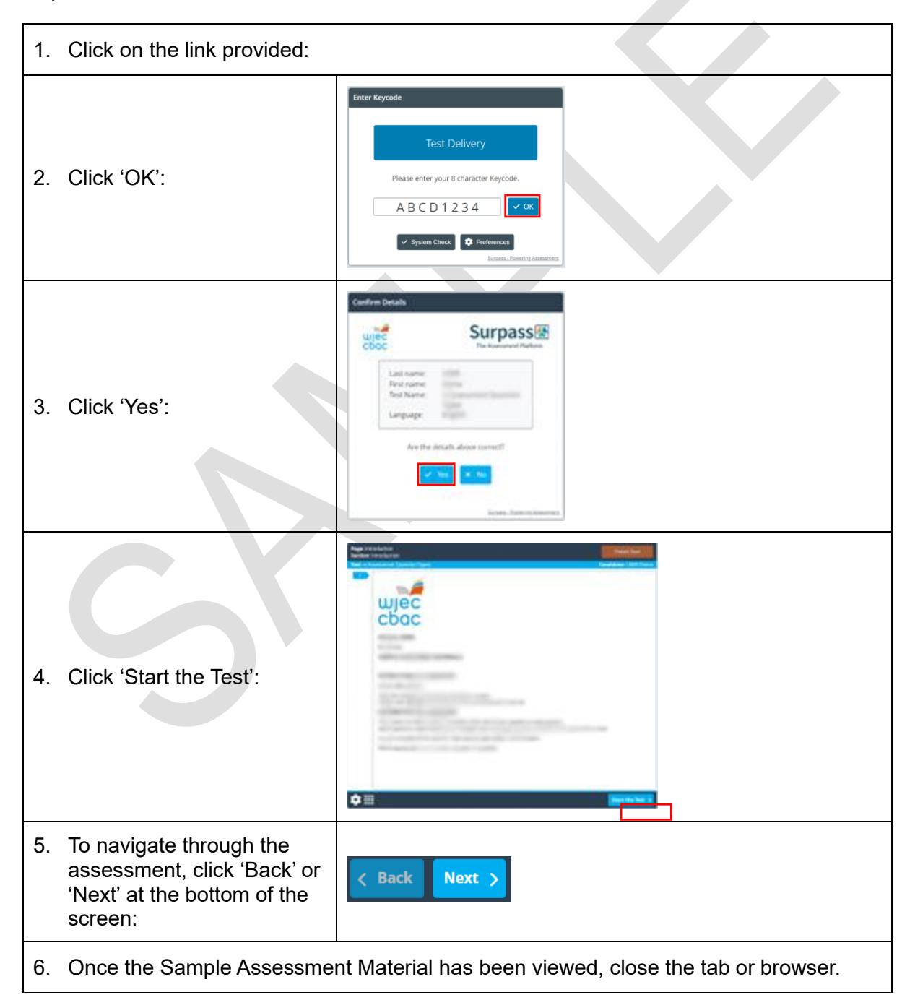
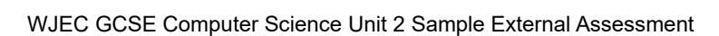

{1}------------------------------------------------

# WJEC GCSE Computer Science

Approved by Qualifications Wales

Sample Assessment Materials

Unit 2: Computer Programming

Teaching from 2025 For award from 2027

Version 3 - July 2025

Ready for the world. This Qualifications Wales regulated qualification is not available to centres in England.

Made for Wales.

{2}------------------------------------------------

{3}------------------------------------------------

## SUMMARY OF AMENDMENTS

| Version | Description                                                                                                                                                                                                                                                                                                                                                                                                                    | Page number |  |
|---------|--------------------------------------------------------------------------------------------------------------------------------------------------------------------------------------------------------------------------------------------------------------------------------------------------------------------------------------------------------------------------------------------------------------------------------|-------------|--|
| 2       | Addition of the online Sample Assessment Administration Materials link. The online Sample Assessment Materials link updated.                                                                                                                                                                                                                                                                                          | 1           |  |
|         | Appendix A - Removal of reference to duration bar on the on screen assessment in response to recommendation 22 in the RF, where we provided our rationale for removing the timer. Therefore, this information was not relevant.                                                                                                                                                                                    | 20          |  |
| 3       | Appendix B - The current On-Screen Assessment – Information to Centres document, on which we based Appendix B of the Unit 2 SAMs, did not account for some differences introduced in the new GCSE Computer Science regarding administration for learners and centres. This was an oversight that, we identified when Qualifications Wales flagged contradictory wording on page 19 of the Unit 2 SAMs. | 21          |  |

{4}------------------------------------------------

## Contents

| Accessing Sample Assessment Materials                                                    | 1  |
|------------------------------------------------------------------------------------------|----|
| Mark scheme                                                                              | 2  |
| Mapping grid                                                                             | 18 |
| Appendix A - WJEC Computer Science Digital Assessment - Information for centres    | 20 |
| Appendix B - WJEC Computer Science On-Screen Assessments - Information for centres | 21 |

{5}------------------------------------------------

#### **UNIT 2: COMPUTER PROGRAMMING**

Unit 2: Computer Programming is assessed by Digital Examination. The online Sample Assessment Administration Materials can be accessed here:

[https://web.download.wjec.co.uk/surpass/packaged-exams/GCSE-Comp-Sci-U2-Admin-](https://web.download.wjec.co.uk/surpass/packaged-exams/GCSE-Comp-Sci-U2-Admin-25/index.html)[25/index.html](https://web.download.wjec.co.uk/surpass/packaged-exams/GCSE-Comp-Sci-U2-Admin-25/index.html)

The online Sample Assessment Materials can be accessed here: [https://web.download.wjec.co.uk/surpass/packaged-exams/GCSE-Comp-Sci-U2-](https://web.download.wjec.co.uk/surpass/packaged-exams/GCSE-Comp-Sci-U2-25/index.html) [25/index.html](https://web.download.wjec.co.uk/surpass/packaged-exams/GCSE-Comp-Sci-U2-25/index.html)

Guidance for accessing the online Sample Assessment Materials is detailed in the following steps:

WJEC GCSE Computer Science Unit 2 Sample External Assessment

{6}------------------------------------------------

{7}------------------------------------------------

#### **MARK SCHEME**

#### **Guidance for examiners**

#### **Generic marking principles**

- Marks awarded are always whole marks (not half marks, or other fractions).
- Answers should only be judged on the quality of spelling, punctuation and grammar when these features are specifically assessed by the question as indicated by the mark scheme. The meaning, however, should be unambiguous.
- Marks should be awarded using the full range of marks defined in the mark scheme for the question (however; the use of the full mark range may be limited according to the quality of the candidate responses seen).
- Marks awarded are based solely on the requirements as defined in the mark scheme. Marks should not be awarded with grade thresholds or grade descriptors in mind.

#### **Positive marking**

It should be remembered that candidates are writing under examination conditions and credit should be given for what the candidate writes, rather than adopting the approach of penalising candidates for any omissions. It should be possible for a very good response to achieve full marks and a very poor one to achieve zero marks. Marks should not be deducted for a less than perfect answer if it satisfies the criteria of the mark scheme.

For questions that are objective or points-based, the mark scheme should be applied precisely. Marks should be awarded as indicated and no further subdivision made.

Mark schemes often list points which may be included in candidates' answers. The list is not exhaustive. The inclusion of *'Credit any other valid response.*' (or similar instruction) within mark schemes allows for the possible variation in candidates' responses. Credit should be given according to the accuracy and relevance of candidates' answers.

Appropriate terminology is reflected in exemplar responses in mark schemes. However, unless there is a specific requirement within a question, candidates may be awarded marks where the answer is accurate but expressed in their own words.

#### **Banded mark schemes**

For band marked questions mark schemes are in two parts; the indicative content and the assessment grid.

The indicative content suggests the range of points and issues which may be included in candidates' answers. It can be used to assess the quality of the candidate's response. As noted above, indicative content is not intended to be exhaustive, and candidates do not have to include all the indicative content to reach the highest level of the mark scheme.

However, to reach the highest level of the mark scheme a candidate must meet the requirements of the highest mark band. Where a response is not creditworthy, that is, it contains nothing of any significance to the mark scheme, or where no response has been provided, no marks should be awarded.

{8}------------------------------------------------

{9}------------------------------------------------

The marking of banded mark questions should always be positive. This means that, for each candidate's response, marks are accumulated for the demonstration of relevant skills, knowledge and understanding: they are not deducted from a maximum on the basis of errors or omissions.

Examiners should first read and annotate the candidate's answer to pick out the evidence that is being assessed in that question. The mark scheme can then be applied. This is done as a two-stage process.

#### **Stage 1 – Deciding on the band**

Beginning at the lowest band, examiners should look at the candidate's answer and check whether it matches the descriptors for that band. If the descriptors at the lowest band are satisfied, examiners should move up to the next band and repeat this process for each band until the descriptors most closely matches the work.

#### **Stage 2 – Deciding on the mark**

Having determined the appropriate band, deciding on the mark within a band will be made on the basis of a 'best fit' procedure, weaknesses in some areas being compensated for by strengths in others.

Examiners should use the full range of marks available to them. Marking should be positive, rewarding achievement rather that penalising failure or omissions. The awarding of marks must be directly related to the marking criteria, and all responses must be marked according to the banded levels provided for each question.

Standardising material that has already been awarded a mark will be provided during standardising and this should be used as a reference material when assessing work. Examiners are reminded of the need to revisit the standardising material as they apply the mark scheme in order to confirm that the band and the mark allocated is appropriate to the work submitted.

This mark scheme instructs examiners to look for and reward valid alternatives where indicative content is suggested for an answer. This is not a checklist for expected content in an answer, or set out as a 'model answer', as responses must be marked in the banded levels of response provided for each question. Where a candidate provides a response that contains aspects or approaches not included in the indicative content, examiners should use their professional judgement to determine the validity of the response in light of the task and reward as directed by the bands. Candidates are free to choose any approach that is relevant to the set task. Candidates can (and will most likely) incorporate ideas other than those mentioned in the mark scheme.

WJEC GCSE Computer Science Unit 2 Sample External Assessment

{10}------------------------------------------------

| Question |                                                                                                                                                                                                      | Answer |                                                                                                                                                                                                                                                                                 | AO1 | AO2 | AO3 | Total Mark |  |  |
|----------|------------------------------------------------------------------------------------------------------------------------------------------------------------------------------------------------------|--------|---------------------------------------------------------------------------------------------------------------------------------------------------------------------------------------------------------------------------------------------------------------------------------|-----|-----|-----|---------------|--|--|
| 1.       | When using the system to calculate pay, the office manager needs to perform the following tasks: • login • select the correct window • enter the data required to calculate pay |        |                                                                                                                                                                                                                                                                                 |     |     |     |               |  |  |
|          | (a)                                                                                                                                                                                                  | (i)    | Award one mark for the message: "Incorrect username and / or password"                                                                                                                                                                                                    |     | 1   |     | 8             |  |  |
|          |                                                                                                                                                                                                      | (ii)   | Award one mark for correct username and password: Username: "admin" Password: "WJEC2024"                                                                                                                                                                            |     | 1   |     |               |  |  |
|          |                                                                                                                                                                                                      | (iii)  | Award one mark, up to a maximum of two for any of the following: • Message box is displayed on-screen. • An error message/error box shows the type of window. • The window displays "Blank username" as a label.                                  |     | 2   |     |               |  |  |
|          | (b)                                                                                                                                                                                                  |        | When the program is first run, the function that is first called is named LoginScreen()                                                                                                                                                                                   |     | 1   |     |               |  |  |
|          | (c)                                                                                                                                                                                                  | (i)    | Award one mark for the complete line of code: NetPay.set(Gross - (Gross * 0.19 + Gross * 0.085 + Gross * 0.1))                                                                                                                                                      |     | 1   |     |               |  |  |
|          |                                                                                                                                                                                                      | (ii)   | Award one mark for each point, up to a maximum of 2 marks: • Error as the '£' sign cannot be calculated (it's text). • Would need to remove text (before converting to a float) All other calculations require gross pay to be a float/number. |     | 2   |     |               |  |  |

{11}------------------------------------------------

| Question |                                                                                                                                                                                                      | Answer                                         | AO1 | AO2 | AO3 | Total Mark |  |
|----------|------------------------------------------------------------------------------------------------------------------------------------------------------------------------------------------------------|------------------------------------------------|-----|-----|-----|---------------|--|
| 2.       | When creating the system, a programmer used data modelling skills to determine the requirements for PBPS. Show one example of each of the following examples of code from the Payroll.py |                                                |     |     |     |               |  |
|          | Award one mark for each code referenced.                                                                                                                                                             |                                                |     |     |     |               |  |
|          | (a)                                                                                                                                                                                                  | Tax.set('0.0') (Or any other line with 0.0) |     | 1   |     | 3             |  |
|          | (b)                                                                                                                                                                                                  | Button code (either line) from python          |     | 1   |     |               |  |
|          | (c)                                                                                                                                                                                                  | Gross = float (GrossPay.get())              |     | 1   |     |               |  |

{12}------------------------------------------------

**Question Answer AO1 AO2 AO3 Total Mark**

- **3.** When starting the development, PBPS set requirements for the initial system. An example of some of the requirements are below:
  - GUI windows must have a title set to identify the purpose of the window.
  - All windows must have a button to allow for navigation.
  - Some text needs to be returned as 50 characters, left justified text strings.
  - When required, error messages are to be displayed.

The original programmer did not annotate the code. As a result, the code is not well documented.

Find the relevant sections of code in the **PBPS.py** file. Save the file once answers have been completed.

Annotate **one** example found in the **PBPS.py** file of each of the following:

|         | Award one mark for each correct annotation placed in a suitable location (1 line above, below or to the right of the line) up to a maximum of four marks. |   | 8 |
|---------|--------------------------------------------------------------------------------------------------------------------------------------------------------------------------|---|---|
| of four | Award one mark for describing each example up to a maximum marks. Indicative content for each example:                                                       |   |   |
| (a)     | #This sets the window to                                                                                                                                                 | 2 |   |
|         |                                                                                                                                                                          |   |   |
| (b)     | # gives you a back button (etc)                                                                                                                                          | 2 |   |
| (c)     | # returns the first left 50 chars of                                                                                                                                     | 2 |   |
| (d)     | #pops up an error message                                                                                                                                                | 2 |   |

{13}------------------------------------------------

| Question |        | Answer                                                                                                                                                                                                                                                                                                                                                                                                                                                                                                                                                                                                                                                                                                                                                                                                                                                                                                                                                                                                                                   | AO1 | AO2 | AO3                        | Total Mark |
|----------|--------|------------------------------------------------------------------------------------------------------------------------------------------------------------------------------------------------------------------------------------------------------------------------------------------------------------------------------------------------------------------------------------------------------------------------------------------------------------------------------------------------------------------------------------------------------------------------------------------------------------------------------------------------------------------------------------------------------------------------------------------------------------------------------------------------------------------------------------------------------------------------------------------------------------------------------------------------------------------------------------------------------------------------------------------|-----|-----|----------------------------|---------------|
| 4.       | Design | PBPS would like you to design additional features for the system.                                                                                                                                                                                                                                                                                                                                                                                                                                                                                                                                                                                                                                                                                                                                                                                                                                                                                                                                                                        |     |     |                            |               |
|          | (a)    | Award one mark for each correct concept designed in pseudo-code (Pseudo-code syntax and examples are provided in the subject specification – flowcharts are not accepted): • declare variables • output string literal • input into variables • Using VAL or other string handling to find value • correct output (error for numeric value) • Fully working algorithm Indicative content Declare Surname is String Declare HasNumeric is Boolean Declare CurrentChar is Character Set HasNumeric = FALSE Output "Enter the surname: " Input Surname /** Check if the input string contains any numeric values */ For i = 1 To Len(Surname) Set CurrentChar = Mid(Surname, i, 1) If Val(CurrentChar) >= 0 AND Val(CurrentChar) <= 9 Then Set HasNumeric = TRUE Exit For End If Next i If HasNumeric = TRUE Then Output "Error: Surname should not contain numbers" Else Output "Surname accepted: " & Surname End If |     |     | 1 1 1 1 1 1 | 11            |

WJEC GCSE Computer Science Unit 2 Sample External Assessment

{14}------------------------------------------------

| Award one mark for each of the following: 1 • Title on window 1 • 4 suitable labels (ignore typos/transcription/order) 1 • 4 suitable text boxes (data entry boxes) 1 • Save / Clear / Back buttons 1 • Sensible GUI layout. |  |
|------------------------------------------------------------------------------------------------------------------------------------------------------------------------------------------------------------------------------------------------------------------------------|--|
| Indicative content:                                                                                                                                                                                                                                                          |  |
|                                                                                                                                                                                                                                                                              |  |
|                                                                                                                                                                                                                                                                              |  |
|                                                                                                                                                                                                                                                                              |  |
|                                                                                                                                                                                                                                                                              |  |
|                                                                                                                                                                                                                                                                              |  |
|                                                                                                                                                                                                                                                                              |  |

{15}------------------------------------------------

**Question Answer AO1 AO2 AO3 Total Mark 5. Implementation** PBPS would like to create a new GUI window programmed to allow entry of the pupil data as designed in question 4. Develop code in the appropriate location in the **PBPS.py** file to satisfy the requirements below. Save the file once answers have been completed. Award **one** mark for each bulleted item listed below: 23 (a) • New window exists (does not require title name or content.) 1 (b) • Title on window reads "Add Pupil Data" (not case sensitive) 1 (c) • Entry or text widget allowing typing for the following: • Pupil ID • First name • Surname • Address 4 (d) • label for each of above • intuitive layout (not overlapping or at random on window) 4 1 (e) • Button on window • Caption for "Save" any valid title/label e.g. • Button initiates saving code (saves to named file) • Message appears on screen (e.g. "Saved" etc) 1 1 1 1 (f) • Main menu displayed when clicked. 2 (g) Annotation within Python file for following: • Creating new window code/GUI has annotation • File handling code has annotation • Back to main menu button/code has annotation • Total calculation has annotation 1 1 1 1

• Labels have annotation • Text boxes have annotation.

© WJEC CBAC Ltd 2024. 11

1 1

{16}------------------------------------------------

| Question |         | Answer                                                                                                                                                                                                                                                                                                                                                                                                                                                                                                                                                                                           | AO1 | AO2 | AO3    | Total Mark |
|----------|---------|--------------------------------------------------------------------------------------------------------------------------------------------------------------------------------------------------------------------------------------------------------------------------------------------------------------------------------------------------------------------------------------------------------------------------------------------------------------------------------------------------------------------------------------------------------------------------------------------------|-----|-----|--------|---------------|
| 6.       | Testing |                                                                                                                                                                                                                                                                                                                                                                                                                                                                                                                                                                                                  |     |     |        |               |
|          |         | Design appropriate typical, extreme and erroneous test data to test the login script PBPS.py file.                                                                                                                                                                                                                                                                                                                                                                                                                                                                                            |     |     | in the |               |
|          | (a)     | Award one mark for an example of each type of test data up to a maximum of three marks: • Typical test data • Extreme test data • Erroneous test data Indicative content: Typical data Username: admin Password: WJEC2024 Extreme test data: Username: a_very_long_username_exceeding_expected_length Password: CorrectPassword123 Erroneous test data: Username: office_manager Password: IncorrectPassword                                                                                                             |     | 3   |        | 8             |
|          |         | Credit any other valid response.                                                                                                                                                                                                                                                                                                                                                                                                                                                                                                                                                                 |     |     |        |               |
|          | (b)     | Award one mark for a basic explanation of an outcome of test data. A maximum of one mark for a basic description of an outcome. A basic description could include one of the following: Typical test data The data has passed the test because the data entered is in lower case. Extreme test data The data has passed the test because the data entered meets the limit for username length. Erroneous test data The data fails the test because the wrong password was entered. Award two marks for a developed explanation of an |     | 2   |        |               |
|          |         | outcome of test data.                                                                                                                                                                                                                                                                                                                                                                                                                                                                                                                                                                            |     |     |        |               |

WJEC GCSE Computer Science Unit 2 Sample External Assessment

{17}------------------------------------------------

|     | A maximum of two marks for a developed description of an outcome.                                                                                                                                                                                                              |   |  |
|-----|--------------------------------------------------------------------------------------------------------------------------------------------------------------------------------------------------------------------------------------------------------------------------------------------|---|--|
|     | A developed description could include one of the following:                                                                                                                                                                                                                             |   |  |
|     | Typical test data The data has passed the test because the data entered is in lowercase and meets the expected format for typical data. The system is designed to accept the username and password in the correct case.                                                        |   |  |
|     | Extreme test data For the extreme data test, the username was made excessively long. The system should have a maximum limit for the username length, and as expected, the login failed. This confirms that the system correctly enforces length restrictions for usernames. |   |  |
|     | Erroneous test data An incorrect password was entered. The system identified the incorrect password and denied access. This shows that the system properly validates the password before granting access.                                                                      |   |  |
|     | Credit any other valid response.                                                                                                                                                                                                                                                           |   |  |
| (c) | Award one mark for the each of the following: • Code added to the correct location • use of string manipulation e.g. upper/lower • annotation of code.                                                                                                                | 3 |  |

{18}------------------------------------------------

| Question |                                                                                                                                 | Answer     |                                                                                                                                                                                                                                                                 | AO1 | AO2 | AO3 | Total Mark |  |
|----------|---------------------------------------------------------------------------------------------------------------------------------|------------|-----------------------------------------------------------------------------------------------------------------------------------------------------------------------------------------------------------------------------------------------------------------|-----|-----|-----|---------------|--|
| 7.       |                                                                                                                                 | Refinement |                                                                                                                                                                                                                                                                 |     |     |     |               |  |
|          | PBPS has asked you to carry out refinements to change the function and improve the accuracy and functionality of its system. |            |                                                                                                                                                                                                                                                                 |     |     |     |               |  |
|          |                                                                                                                                 |            | The legal limit on working hours in a week is 48 hours. PBPS needs to ensure that the number of hours staff work does not exceed 48 hours.                                                                                                                   |     |     |     |               |  |
|          | (a) (i)                                                                                                                      |            | Award one mark for the each of the following: • entry/text widget used (1) • suitable variable name used (1) • suitable location on GUI (1).                                                                                               |     | 3   |     | 8             |  |
|          |                                                                                                                                 | (ii)       | Award one mark for the each of the following up to a maximum of 3 marks for: • calculation of maximum hours permitted per month • if statement used • correct logical operator e.g. < or > • appropriate message displayed. |     | 3   |     |               |  |
|          |                                                                                                                                 | (iii)      | Award one mark for the each of the following: • calculation for average hours worked per week                                                                                                                                                          |     | 2   |     |               |  |

• display result.

{19}------------------------------------------------

| Question                                                                                                                                                                   |                    | Answer                                                                                                    |                                             |                                                                           | AO1 | AO2 | AO3 | Total Mark |  |
|----------------------------------------------------------------------------------------------------------------------------------------------------------------------------|--------------------|-----------------------------------------------------------------------------------------------------------|---------------------------------------------|---------------------------------------------------------------------------|-----|-----|-----|---------------|--|
| 8.                                                                                                                                                                         | Refinement testing |                                                                                                           |                                             |                                                                           |     |     |     |               |  |
|                                                                                                                                                                            |                    | Below are the results of the hours worked per month and the calculated outcomes.                          |                                             |                                                                           |     |     |     |               |  |
|                                                                                                                                                                            | (a)                | Award one                                                                                                 |                                             | mark for each correct comment:                                            |     | 3   |     | 5             |  |
|                                                                                                                                                                            |                    | Hours worked per month                                                                              | Hours worked per week                 | Accuracy of result                                                        |     |     |     |               |  |
|                                                                                                                                                                            |                    | 190                                                                                                       | 47.5                                        | Accurate if assumption is 4 weeks per month                         |     |     |     |               |  |
|                                                                                                                                                                            |                    | 156                                                                                                       | 36.4                                        | Accurate if assumption is 30 days per month.                        |     |     |     |               |  |
|                                                                                                                                                                            |                    | 124                                                                                                       | 28                                          | Accurate if assumption is 31 days per month.                        |     |     |     |               |  |
|                                                                                                                                                                            | (b)                | Award one (abstraction): Indicative content: • calculation based upon: • • Award one | 4 weeks per month 30 days per month etc. | mark for a comment on assumption mark how this assumption could affect |     | 2   |     |               |  |
| accuracy: Indicative content: • each month may have different number of days • some months have more days than others • does not consider leap years. |                    |                                                                                                           |                                             |                                                                           |     |     |     |               |  |

{20}------------------------------------------------

| Question |                            | Answer                                                                                                                                                                                                                                                                                                                                                                                                                        | AO1 | AO2 | AO3 | Total Mark |
|----------|----------------------------|-------------------------------------------------------------------------------------------------------------------------------------------------------------------------------------------------------------------------------------------------------------------------------------------------------------------------------------------------------------------------------------------------------------------------------|-----|-----|-----|---------------|
| 9.       | Evaluate                   | Evaluate how your final program meets PBPS requirements.                                                                                                                                                                                                                                                                                                                                                                      |     |     | 6   | 6             |
|          | • • •                | You should consider: Two refinements that your program succeeds in implementing. The extent to which the code achieves those refinements. Areas for improvement in your final program.                                                                                                                                                                                                                            |     |     |     |               |
|          |                            | Award marks according to the band described below. Candidates could include the following: Indicative content:                                                                                                                                                                                                                                                                                                          |     |     |     |               |
|          | • • • • • • | Two refinements that the candidate states are successful: Creating a new GUI window. Allowing entry for new pupil data. Saving entered data to a file. New widgets added to allow for entry of hours worked per month. Message to display compliance with legal working time limits. Calculation of average hours worked per week. Explanations of the extent of how the code achieves these |     |     |     |               |
|          | • • • • • • | refinements: New GUI window appearance and features used. Ability to enter new pupil data. Success of saving entered data to a file. Success of widgets added to allow for entry of hours worked per month. Ability to display a message to display compliance with legal working time limits. Use of a calculation of average hours worked per week.                                                 |     |     |     |               |
|          | • • • •           | Consideration of how the final program could be improved upon, for example 1 mark for any: Validation added (to either above) User Interface (Percentage Tax or NI visible on screen) Extensibility (changeable value on screen not hard coded) Reuse code for saving data.                                                                                                                                 |     |     |     |               |

{21}------------------------------------------------

| Band | AO3                                                                                                                                                                                                                                                                                                                                                                                                                                                                                           |  |  |  |  |  |  |
|------|-----------------------------------------------------------------------------------------------------------------------------------------------------------------------------------------------------------------------------------------------------------------------------------------------------------------------------------------------------------------------------------------------------------------------------------------------------------------------------------------------|--|--|--|--|--|--|
| 3    | 5 - 6 marks The candidate has: • shown strong understanding of the requirements of the question and a clear knowledge of the indicative content. Clear knowledge is defined as a response that provides five to six relevant detailed points from the indicative content • shown a sustained line of reasoning which is coherent, relevant, substantiated and logically structured • used appropriate computer science terminology.                          |  |  |  |  |  |  |
| 2    | 3 - 4 marks The candidate has: • shown some understanding of the requirements of the question and sound knowledge of the indicative content. Sound knowledge is defined as a response that provides three to four relevant detailed points from the indicative content • shown a line of reasoning which is partially coherent, largely relevant, supported by some evidence and with some structure • used mainly appropriate computer science terminology. |  |  |  |  |  |  |
| 1    | 1 - 2 marks The candidate has: • shown limited understanding of the requirements of the question and superficial knowledge of the indicative content. Superficial knowledge is defined as a response that provides one to two relevant points from the indicative content • shown a basic line of reasoning which is not coherent, largely irrelevant with very little structure • used limited computer science terminology.                                |  |  |  |  |  |  |
| 0    | 0 marks No attempt made or no response worthy of credit.                                                                                                                                                                                                                                                                                                                                                                                                                                   |  |  |  |  |  |  |

{22}------------------------------------------------

|          |     |       |       | Topic and Section |              |       |       |     |     |     |       |
|----------|-----|-------|-------|-------------------|--------------|-------|-------|-----|-----|-----|-------|
| Question |     |       | 2.1   | 2.2               | 2.3 2.3.1 | 2.4   |       | AO1 | AO2 | AO3 | Total |
|          |     |       | 2.1.1 | 2.2.1             |              | 2.4.1 | 2.4.2 |     |     |     | Marks |
| 1        | (a) | (i)   | x     |                   |              |       |       | 0   | 1   | 0   | 1     |
|          |     | (ii)  | x     |                   |              |       |       | 0   | 1   | 0   | 1     |
|          |     | (iii) | x     |                   |              |       |       | 0   | 2   | 0   | 2     |
|          | (b) |       | x     |                   |              |       |       | 0   | 1   | 0   | 1     |
|          | (c) | (i)   | x     |                   |              |       |       | 0   | 1   | 0   | 1     |
|          |     | (ii)  | x     |                   |              |       |       | 0   | 2   | 0   | 2     |
|          | (a) |       | x     |                   |              |       |       | 0   | 1   | 0   | 1     |
| 2        | (b) |       | x     |                   |              |       |       | 0   | 1   | 0   | 1     |
|          | (c) |       | x     |                   |              |       |       | 0   | 1   | 0   | 1     |
|          | (a) |       | x     |                   |              |       |       | 0   | 2   | 0   | 2     |
|          | (b) |       | x     |                   |              |       |       | 0   | 2   | 0   | 2     |
| 3        | (c) |       | x     |                   |              |       |       | 0   | 2   | 0   | 2     |
|          | (d) |       | x     |                   |              |       |       | 0   | 2   | 0   | 2     |
|          | (a) |       |       | x                 |              |       |       | 0   | 0   | 6   | 6     |
| 4        | (b) |       |       | x                 |              |       |       | 0   | 0   | 5   | 5     |
|          | (a) |       |       |                   | x            |       |       | 0   | 0   | 1   | 1     |
| 5        | (b) |       |       |                   | x            |       |       | 0   | 0   | 1   | 1     |

{23}------------------------------------------------

|   | (c)   |       |  | x |   |   | 0 | 0  | 4  | 4  |
|---|-------|-------|--|---|---|---|---|----|----|----|
|   | (d)   |       |  | x |   |   | 0 | 0  | 5  | 5  |
|   | (e)   |       |  | x |   |   | 0 | 0  | 4  | 4  |
|   | (f)   |       |  | x |   |   | 0 | 0  | 2  | 2  |
|   | (g)   |       |  | x |   |   | 0 | 0  | 6  | 6  |
|   | (a)   |       |  |   | x |   | 0 | 3  | 0  | 3  |
| 6 | (b)   |       |  |   | x |   | 0 | 2  | 0  | 2  |
|   | (c)   |       |  |   | x |   | 0 | 3  | 0  | 3  |
|   | (a)   | (i)   |  |   |   | x | 0 | 3  | 0  | 3  |
| 7 |       | (ii)  |  |   |   | x | 0 | 3  | 0  | 3  |
|   |       | (iii) |  |   |   | x | 0 | 2  | 0  | 2  |
|   | (a)   |       |  |   |   | x | 0 | 3  | 0  | 3  |
| 8 | (b)   |       |  |   |   | x | 0 | 2  | 0  | 2  |
| 9 |       |       |  |   |   | x | 0 | 0  | 6  | 6  |
|   | Total |       |  |   |   |   | 0 | 40 | 40 | 80 |

{24}------------------------------------------------

## Appendix A - WJEC Computer Science Digital Assessment - Information for centres

For use with SAM only – will be removed from live Candidate Packs.

The following information relates to Unit 1: Understanding Computer Science and Unit 2: Computer Programming

#### **1. Arrangements and access of the digital examination:**

Digital examinations will be delivered to centres through Surpass software. An application named WJEC SecureClient will need to be installed on candidate's PC within centres so that candidates can complete the exams. The Surpass software will be available throughout the academic year and centres will be encouraged to complete practice exams (e.g. Digital Specimen Assessment Materials and past papers as they become available) using the on-screen assessment software so that candidates can familiarise themselves with the software in readiness for the live exams.

#### **2. Controls within digital examination:**

Centre staff will need to:

• ensure invigilators can log into Surpass to be able to pause and resume exams during the delivery of on-screen exams. Used for candidates who have supervised rest breaks (access arrangements) and for individual or cohort issues that may occur during live exams e.g. disruption.

Candidates will have the ability to:

- change the colour preferences of the on-screen exam
- zoom in/out functionality.

#### **3. Candidate instructions for digital examinations:**

Centres will be provided with a Candidate User Guide for candidates completing onscreen assessments. The Surpass software will be available throughout the academic year and centres will be encouraged to complete practice exams (e.g. Digital Specimen Assessment Materials and past papers as they become available) using the on-screen assessment software so that candidates can familiarise themselves with the software in readiness for the live exams.

#### **4. Digital examination arrangements – clarity over support:**

Live exams will be scheduled by WJEC at least 7 days before the date of the exam. The 'Home' screen of Surpass will contain information to assist with the installation and testing of the software as well as a user guide detailing the administration process of delivering on-screen exams within a centre.

WJEC GCSE Computer Science Unit 2 Sample External Assessment

{25}------------------------------------------------

## Appendix B - WJEC Computer Science On-Screen Assessments - Information for centres

The following information relates to Unit 2: Computer Programming

Each Candidate will need:

- 7-Zip pre-installed and accessible
  - This is free to download from [https://www.7-zip.org](https://www.7-zip.org/)
  - Alternatives for Apple users are available here: [7-Zip Alternatives for Mac](https://alternativeto.net/software/7-zip/?license=free&platform=mac)
  - **WJEC is unable to support centres that do not use the 7-zip program.**  Centres using a solution for Apple computers are strongly advised to test their systems comprehensively prior to the examination.
- The encrypted media files pre-downloaded and available .
- A restricted digital assessment environment which only permits access to the required encrypted media files, necessaryapplications or designated storage device (if required) for saving work.

**NB:** Without compromising the functioning of the workstation, candidates must not have access to the Internet, any shared drives, Virtual Learning Environments (VLEs) or email during the examination.

• A pre-installed functional copy of **Python version 3** matching the version specified on the pre-released brief.

## Network Managers/Technicians

## Encrypted media files

- Encrypted media files will be available on the Surpass system **2 weeks prior to the examination**.
  - An administrative keycode will also be available on the Surpass system. This will enable centres to download the encrypted media files and distribute them for each candidate undertaking the examination.
  - The files will need to be downloaded and distributed before the examination.
- Further details are available in the '**Guidance on Surpass for Examinations Officers**' document on the public website under the '**Key documents**' and '**On Screen Assessment**' Sub-heading:
  - WJEC GCSE: [LINK](https://www.wjec.co.uk/qualifications/computer-science-gcse#tab_keydocuments) Welsh version: [LINK](https://www.cbac.co.uk/cymwysterau/cyfrifiadureg-tgau/#tab_keydocuments)
- As the examination is reliant upon candidates accessing and using the media files WJEC will be contacting those centres who have not downloaded the encrypted media files.
- Candidate keycodes, which will need to be used to upload each candidate 's examination work after the examination has ended, will be available for Examinations Officers to download via Surpass.

The following additional documentation will be available on the home tab of the Surpass system, available to centre staff:

- e-Assessment Live Exams Guide
- e-Assessment Candidate User Guide

WJEC GCSE Computer Science Unit 2 Sample External Assessment

{26}------------------------------------------------

#### Setting up the Examination Room

- The setting up of the examination room may take up to an hour or more depending on the number of candidates involved.
- A computer science teacher/technician may be involved in the setting up of the examination room.

## Persons permitted to be present in the Examination Room

• In addition to the invigilator(s), a technician\* or other suitably qualified person may be in attendance throughout the examination to help with issues related to the functioning of equipment. This person is not an invigilator and must not count as one when determining the number of invigilators required to conduct the examination.

## The Examination Room and its Layout

- The exam must be carried out under formal supervision, i.e. the candidates must be in direct sight of the invigilator at all times.
- The decryption password required for the unzipping of the media files is found on the candidate introduction page in Surpass.
- Copies of instructions for the decryption of zip files should also be available for pupils.
- Use of resources is tightly prescribed and interaction with other candidates and the Internet or any other digital resource is forbidden.
- The JCQ "Instructions for conducting examinations" must be adhered to.

## Uploading of Candidate's Work

• Candidates will be required to upload their program response files to the Surpass system before completing the examination. **Candidates can be supported in this process**.

## Retaining a Copy of Each Candidate's Work

• Each centre must keep an electronic copy of each candidate's work in a secure location in case of loss or damage to the original submission.

#### Prior to the Examination:

- Ensure all candidates are aware they will be required to decrypt files during the examination.
- Centres will be sent a communication document to share with candidates on how to decrypt files, the format this document is shared is down to the discretion of the centre i.e. digitally or hard copy.
- An example communication document can be found [here](https://www.wjec.co.uk/media/jrojgqvm/instructions-for-candidates.pdf)
- It is recommended that centres practice this process with candidate prior to the examination.

#### Before the Examination:

- Ensure that all candidates have logged on and have access to the examination.
- Once all candidates have logged on, they should decrypt their files.
- Candidates can be supported in this process
- Once all candidates have decrypted their media files the examination can start.
- Start the examination: Please note that invigilators are responsible for the timekeeping of the examination. The start time and the end time of the examination should be displayed in the normal way.

\*The computer science teacher may undertake this role.

{27}------------------------------------------------

## During the examination:

- Candidates should work on their answers to the questions for the duration of the examination. The invigilator must inform the candidates of the end time of the examination, in the usual way.
- Invigilators must remind candidates to save their work at regular intervals.

## After the examination:

- Once the examination is complete, designated time should be provided to allow candidates to upload their media files to the Surpass system.
- Candidates must upload all media files used in the examination to the Surpass system. Candidates can be supported in this process.
  - Failure to include all work could have an adverse impact on a candidate's grade.
- If problems are encountered when uploading the candidates' completed examination work then advice can be sought by contacting either:
  - GCSE 02920 265154
  - GCE 02920 265336.
- Centres must keep an electronic copy of each candidate's work in a secure location in case of loss or damage to the original submission.

