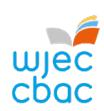
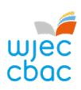
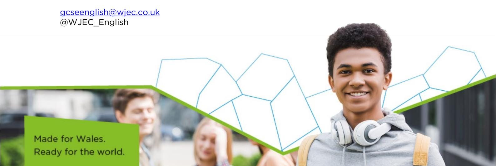

{1}------------------------------------------------

# GCSE English Language and Literature Newsletter April 2025

## Teaching from 2025 - For award from 2027

We hope that you had a relaxing break over the Easter period and that you and your students are feeling prepared for the summer examination series. We have some general and subject-specific updates and information that you may need as you begin this new term.

- 1. [NEW GCSE English Language and Literature Update](#page-0-0)
- 2. [Resources](#page-1-0)
- 3. [Professional Learning](#page-2-0)
- 4. [Have you considered becoming an Examiner?](#page-2-1)
- 5. [Key dates](#page-3-0)
- 6. [Research project](#page-3-1)
- 7. [Contact us](#page-3-2)

# 1. NEW GCSE English Language and Literature Update

We are moving quickly towards the start of the delivery of the new English GCSE qualifications. This is the culmination of years of work beginning with teachers developing and delivering the new curriculum, and co-constructing the new qualifications with WJEC and wider stakeholders. As we work through the early stages of the new GCSE English Language and Literature qualifications, please do keep in touch with the subject team with your queries and observations, telling us what you need and what you like, so we can ensure that you are confident in your delivery and put our resources into making you feel confident and well-supported.

The NEA briefs for Units 2 and 3 will be published on the WJEC Portal from April 2025 so teachers can familiarise themselves with the tasks and start planning and preparation ahead of September. We are aiming to publish the Unit 5 NEA brief in the summer term. Details of the conditions relevant to task-setting, task-taking and task-marking will be published in each unit's brief.

As a reminder, the first examination available to learners will be Unit 1 in summer 2026, with Units 1 and 4b available in November 2026. All examined units will be available in summer 2027 and for each series thereafter.

As explained in Circular 28, from September 2025, learners must not be entered into these legacy GCSEs in Year 10, in subjects where reformed GCSEs are available.

{2}------------------------------------------------

## 2. Resources

For the new qualification, there are a wide range of engaging resources tailored to support you in delivering the WJEC English Language and Literature GCSE. These can be found on the [Digital Resources](https://resources.wjec.co.uk/en) page.

Our Blended Learning Resources and Knowledge Organisers are designed to complement traditional face-to-face teaching with an online learning pack that allows learners to work at their own pace. They can be used as revision tools, as part of catch-up, or for flipped learning.

Our Blended Learning Resources can be accessed here:

[Poetry: Relationships](https://filter.resources.wjec.co.uk/en/English%20Language%20and%20Literature/r/mfw23-24_2-1/BL/MFWGCSE)

[Poetry: Identity](https://filter.resources.wjec.co.uk/en/English%20Language%20and%20Literature/r/mfw23-24_2-2/BL/MFWGCSE) [Poetry: Conflict](https://filter.resources.wjec.co.uk/en/English%20Language%20and%20Literature/r/mfw23-24_2-3/BL/MFWGCSE)

[Poetry: Children and Parents](https://filter.resources.wjec.co.uk/en/English%20Language%20and%20Literature/r/mfw23-24_2-5/BL/MFWGCSE)

[Prose: Animal Farm](https://filter.resources.wjec.co.uk/en/English%20Language%20and%20Literature/r/mfw23-24_2-14/BL/MFWGCSE) [Prose: My Name is Leon](https://filter.resources.wjec.co.uk/en/English%20Language%20and%20Literature/r/mfw23-24_2-12/BL/MFWGCSE)

[Prose: Pigeon](https://filter.resources.wjec.co.uk/en/English%20Language%20and%20Literature/r/mfw23-24_2-12/BL/MFWGCSE)

[Play: An Inspector Calls](https://filter.resources.wjec.co.uk/en/English%20Language%20and%20Literature/r/mfw23-24_2-20/BL/MFWGCSE)

[Play: The Importance of Being Earnest](https://filter.resources.wjec.co.uk/en/English%20Language%20and%20Literature/r/mfw23-24_2-7/BL/MFWGCSE)

[Play: Refugee Boy](https://filter.resources.wjec.co.uk/en/English%20Language%20and%20Literature/r/mfw23-24_2-3/BL/MFWGCSE) [Play: Pygmalion](https://filter.resources.wjec.co.uk/en/English%20Language%20and%20Literature/r/mfw23-24_2-9/BL/MFWGCSE)

[Play: DNA](https://filter.resources.wjec.co.uk/en/English%20Language%20and%20Literature/r/mfw23-24_2-11/BL/MFWGCSE) 

[Play: Leave Taking](https://filter.resources.wjec.co.uk/en/English%20Language%20and%20Literature/r/mfw23-24_2-10/BL/MFWGCSE)

[Play: A Midsummer Night's Dream](https://filter.resources.wjec.co.uk/en/English%20Language%20and%20Literature/r/mfw23-24_2-6/BL/MFWGCSE)

[Non-Fiction: Relationships](https://filter.resources.wjec.co.uk/en/English%20Language%20and%20Literature/r/mfw23-24_2-15/BL/MFWGCSE) [Non-Fiction: Human Rights](https://filter.resources.wjec.co.uk/en/English%20Language%20and%20Literature/r/mfw23-24_2-16/BL/MFWGCSE)

[Non-Fiction: Wales and Global Contexts](https://filter.resources.wjec.co.uk/en/English%20Language%20and%20Literature/r/mfw23-24_2-19/BL/MFWGCSE)

[Creative Writing](https://filter.resources.wjec.co.uk/en/English%20Language%20and%20Literature/r/mfw23-24_2-21/BL/MFWGCSE) [Non-Fiction Writing](https://filter.resources.wjec.co.uk/en/English%20Language%20and%20Literature/r/mfw23-24_2-22/BL/MFWGCSE) 

Our Knowledge Organisers can be accessed here:

[Unit 1: Poetry \(Context and Meaning\)](https://filter.resources.wjec.co.uk/en/English%20Language%20and%20Literature/r/mfw23-24_2-1/KO/MFWGCSE) 

[Unit 4a: Drama \(Motivations\)](https://filter.resources.wjec.co.uk/en/English%20Language%20and%20Literature/r/mfw23-24_2-9/KO/MFWGCSE) 

[Unit 4b: Drama \(Motivations\)](https://filter.resources.wjec.co.uk/en/English%20Language%20and%20Literature/r/mfw23-24-2-13/KO/MFWGCSE)  [Unit 4b: Prose \(Motivations\)](https://filter.resources.wjec.co.uk/en/English%20Language%20and%20Literature/r/mfw23-24_2-13/KO/MFWGCSE) 

[Unit 6: Non-Fiction \(Connections\)](https://filter.resources.wjec.co.uk/en/English%20Language%20and%20Literature/r/mfw23-24_2-16/KO/MFWGCSE) 

[Assessment Packs](https://www.wjec.co.uk/qualifications/gcse-english-language-and-literature-double-and-single-award-teaching-from-2025/#tab_keydocuments) are available within the Key Documents tab on the WJEC GCSE English Language and Literature subject page. These documents contain sample examination papers and detailed marking guidelines.

The [Guidance for Teaching](https://www.wjec.co.uk/media/w2rnp2g2/gcse-english-languagepluslit-gft-e-110225.pdf) is designed to support teachers in the delivery of WJEC GCSE English Language and Literature. It is not intended as a comprehensive reference, but as support for teachers to develop stimulating and exciting courses tailored to the needs and skills of their learners. The guide offers course plans, possible classroom activities and links to useful resources (including our own, freely available digital materials) to provide ideas for immersive and engaging lessons.

{3}------------------------------------------------

### Guidance for Teaching spotlight: The Glossary

The glossary is provided within the Guidance for Teaching as a guide to support teachers and learners. It defines terms that will be useful in preparing learners for the WJEC GCSE English qualification; it is not definitive and it is not a checklist. Learners will not be credited for feature-spotting but should know some of the terms provided to engage better with the construction of meaning and to comment productively on the effects such features create. In turn, they will then be able to deliberately and effectively employ the features in their own writing and/or speaking. The key terms have been grouped to support understanding.

# 3. Professional Learning

The materials from the pan-Wales Preparing to Teach clusters are available on Portal. Included in these materials is the Spoken Language session, with audio, offering an overview of ways to teach the spoken language elements of the new qualification.

Exam Walkthroughs and NEA Walkthroughs will be available in the Summer Term. These resources will offer practical hints and tips on how to effectively approach questions in the examination papers and the NEA. Using questions from the assessment packs, the PowerPoint with audio help and audio script in the notes will walk learners through the assessments, helping them revise and practise useful exam techniques.

Preparing to Assess events will happen next academic year, running in Autumn 2025 and Spring 2026. These will be expert-led online events designed to support you in marking and teaching the new qualification.

During the 2025/26 academic year, our autumn / winter Professional Learning programme will be expert-led, interactive events designed for you to get all the latest information on qualifications and feedback from the summer 2025 examinations.

Details and bookings will be available on the WJEC website later in the summer term.

In the meantime, the materials from our previous courses can be found [here](https://www.wjec.co.uk/qualifications/english-literature-gcse/?sub_nav_level=training-materials#tab_training) for GCSE English Literature.

# 4. Have you considered becoming an Examiner?

We are keen to appoint new examiners for WJEC GCSE English Language and Literature. Examining is an excellent way of learning more about the requirements of the exam and thus supporting your students and developing your skills. It also provides a useful additional income. For further details, please see the [Appointees section](https://www.wjec.co.uk/home/appointees/) of the website.

{4}------------------------------------------------

## 5. Key dates

1 April 2025: Publication of NEA Briefs for Unit 2 and Unit 3 on Portal.

These briefs are intended for learners whose work will be submitted in March 2026 and March 2027. NEA Briefs for learners will be refreshed in April 2027 for those learners entering for Unit 2 and Unit 3 in 2028 and 2029.

The Unit 5 NEA Brief for learners whose work will be submitted in March 2027 and March 2028 – the first availability for this unit to be entered – does not need to be published until April 2026; however, we are keen to support teachers' chosen delivery of the qualification content and aim to publish this brief in the summer term.

# 6. Research project

This is a message from Canterbury Christ Church University and Cardiff Metropolitan University for every secondary teacher in Wales to encourage you to share your experiences

It's so important to understand the experience of teachers and we would love to hear your experience in a new piece of important research. Canterbury Christ Church University and Cardiff Metropolitan University are doing a large-scale survey for a research project, *Cultivating Deeper Interdisciplinary Dialogue*. We're particularly interested in any conversations you're having about what you teach, whether with other English teachers or teachers of other subjects.

The survey should take less than 10 minutes. We would really, really love it if you could get some friends at school to do it too. Any secondary teacher can complete it.

Links to Welsh and English versions of the survey are below:

Welsh [https://cardiffmet.eu.qualtrics.com/jfe/form/SV\\_efKqY7HFixHJfp4](https://url.uk.m.mimecastprotect.com/s/9p8WC86JVSX4E2vCnfXUyv4kP?domain=cardiffmet.eu.qualtrics.com)  English [https://cardiffmet.eu.qualtrics.com/jfe/form/SV\\_7ar0VuH51heB8Fg](https://url.uk.m.mimecastprotect.com/s/42reC9QKWIz7Dl3fEhOUq7F3b?domain=cardiffmet.eu.qualtrics.com) 

Thank you so so much. Dr Mary Woolley, Dr Tom Breeze and Professor Bob Bowie

## 7. Contact us

Kirsten Wilcock - Subject Officer GCSE English Language and Literature

Christelle Bazin - Subject Support Officer GCSE English Language and Literature

