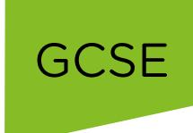
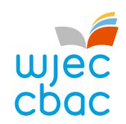
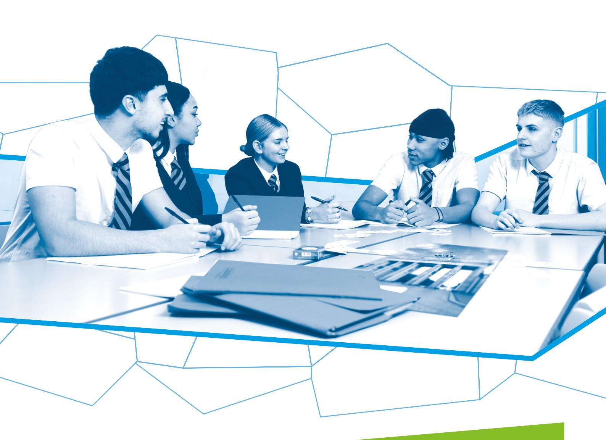
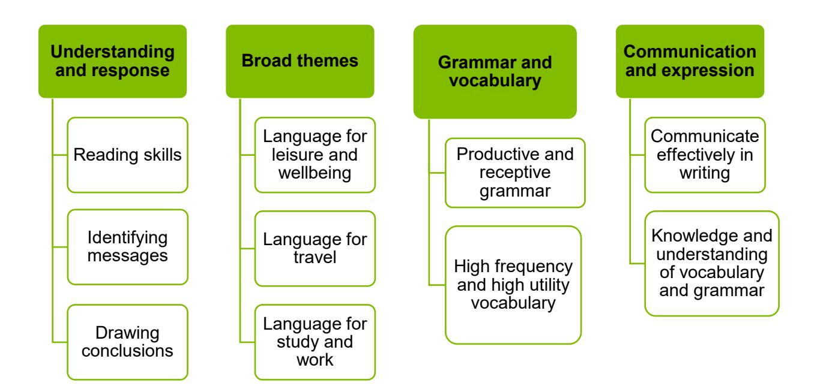

{1}------------------------------------------------

## WJEC GCSE German

Approved by Qualifications Wales

Guidance for Teaching: Unit 2

Teaching from 2025 For award from 2027

Ready for the world. This Qualifications Wales regulated qualification is not available to centres in England.

Made for Wales.

{2}------------------------------------------------

{3}------------------------------------------------

## SUMMARY OF AMENDMENTS

| Version | Description                                                        | Page number |
|---------|--------------------------------------------------------------------|-------------|
| 1       | Add in "until after a date in May specified annually by the WJEC"? | 6           |

{4}------------------------------------------------

## Contents

| Section                                                          | Page Number |
|------------------------------------------------------------------|-------------|
| Introduction                                                     | 1           |
| Aims of the Guidance for Teaching                                | 1           |
| Additional ways that WJEC can offer support:                     | 1           |
| Qualification Structure                                          | 2           |
| Assessment                                                       | 3           |
| Summary of Assessment                                            | 3           |
| Overview of Unit 2                                               | 4           |
| Unit 2 Assessment objectives and weightings                      | 7           |
| Unit 2 Teacher Guidance                                          | 8           |
| Oracy                                                            | 8           |
| Speaking and Listening                                           | 8           |
| Learning Experiences                                             | 12          |
| Opportunities for embedding elements of the Curriculum for Wales | 14          |

{5}------------------------------------------------

## Introduction

The WJEC GCSE German has been approved by Qualifications Wales and is available to all centres in Wales. It will be awarded for the first time in Summer 2027, using grades A\* to G.

### Aims of the Guidance for Teaching

The principal aim of the Guidance for Teaching is to support teachers in the delivery of WJEC GCSE German and to offer guidance on the requirements of the qualification and the assessment process. The Guidance for Teaching is **not intended as a comprehensive reference**, but as support for teachers to develop stimulating and exciting courses tailored to the needs and skills of their learners. The guide offers possible classroom activities and links to useful resources (including our own, freely available digital materials and some from external sources) to provide ideas for immersive and engaging lessons.

### Additional ways that WJEC can offer support:

- sample assessment materials and mark schemes
- professional learning events
- examiners' reports on each unit
- direct access to the subject officer
- free online resources
- Exam Results Analysis
- Online Examination Review

{6}------------------------------------------------

### Qualification Structure

WJEC GCSE German consists of 4 units. The qualification is linear and does not contain tiering. There is no hierarchy to the order the units should be taught.

|        | Unit title          | Type of Assessment             | Weighting |
|--------|---------------------|-----------------------------------|-----------|
| Unit 1 | Oracy               | Non- examination assessment | 30%       |
| Unit 2 | Reading and Writing | Non- examination assessment | 15%       |
| Unit 3 | Listening           | Written examination            | 20%       |
| Unit 4 | Reading and Writing | Written examination            | 35%       |

{7}------------------------------------------------

### Assessment Summary of Assessment

**Unit 2: Reading and Writing Non-examination assessment: 1 hour 15% of qualification** 

**45 marks**

• Written response in German

**Learners are not permitted to use a dictionary in any part of the assessment.**

{8}------------------------------------------------

## Overview of Unit 2

#### **Reading and Writing**

Non-examination assessment (1 hour): Conducted in centre and marked by WJEC 15% of qualification 45 marks

The purpose of this unit is to allow learners to:

- understand and respond to written German
- communicate effectively in writing
- express and justify opinions.

The unit will be based on the following:

{9}------------------------------------------------

### Assessment details

#### **Unit 2 — Reading and Writing**

The assessment lasts for 1 hour 15% of qualification 45 marks

Centres must choose a work in the assessed language from one of the following genres: graphic novel, short story, film script or novel.

Centres must ensure that the work focuses on **one** of the broad themes:

- Language for leisure and wellbeing
- Language for travel
- Language for work and study.

**Learners are not permitted to use a dictionary in any part of the assessment. Assessments must be submitted digitally (they may be written and scanned, or completed digitally).** Where tasks are produced digitally, online dictionaries, spelling and grammar checking programmes and access to internet **must be disabled**.

**Learners must not discuss or share any details of the task until after a date in May specified annually by the WJEC.**

#### **Task (45 marks)**

Learners will complete one task. The task requires learners to complete a response with a maximum of 200 words (task (1a), 70 words and task (1b) 130 words) in the assessed language, based on the study of the chosen work.

The assessment is based on the candidate's ability to understand and respond to written language in writing.

The Rubrics will be in Cymraeg/English. The language of response will be in the assessed language.

**AO2 – 30 marks AO3 – 15 marks**

#### **Task setting**

This assignment has been produced by WJEC and cannot be changed.

The assessment will be carried out at the centre during a one-hour period. The task will be available for download on the WJEC Portal. Centres may download the Unit 2 NEA three working days in advance of the first assessment date at the centre. Centres must keep a record of the date on which the assessments is conducted including the name of the work studied on the Candidate and Centre declaration form. This form is for the centre and candidates to sign and declare that assessments have been conducted according to the requirements in the Assessment Pack and must be submitted to WJEC with the Unit 2 NEA digitally. All work and the Candidate and Centre Declaration Form must be uploaded to the WJEC Portal within 48 hours or two working days of the assessments taking place.

{10}------------------------------------------------

The assessment will take place during an eight-week period between March and May, specified annually by WJEC. Centres may download the task three working days in advance of the first assessment.

The task must be given to the learners **only** at the time of assessment.

Tasks will change each series.

{11}------------------------------------------------

### Unit 2 Assessment objectives and weightings

| AO1 | Understand and respond to spoken language through communication and expression in speaking and writing   | -   |
|-----|----------------------------------------------------------------------------------------------------------------|-----|
| AO2 | Understand and respond to written language through communication and expression in speaking and writing. | 10% |
| AO3 | Demonstrate knowledge of grammar, vocabulary and sound-spelling correspondence.                          | 5%  |

{12}------------------------------------------------

• You can focus on key scenes from the text or film script and

• Learners could create thematic and character vocabulary lists. These could be stored on a virtual learning platform for all

• Quizlet sets could be set up to support regular learning of key vocabulary. [Kahoot](https://kahoot.com/) and [Quizziz](https://quizizz.com/?lng=en) could also be used as part of

• Grammar should be taught in small chunks and learners cshould be encouraged to look for patterns and rules in context before

translate them into English or compare published translations to

## Unit 2 Teacher Guidance

understanding, ideas and opinions.

| Oracy Speaking and Listening |                                                                                                                                                                                                                                                                                                                                                                                                                                     |                                                                                                                                                                                                                                                                                                                                                                                                                                                                          |  |
|---------------------------------|-------------------------------------------------------------------------------------------------------------------------------------------------------------------------------------------------------------------------------------------------------------------------------------------------------------------------------------------------------------------------------------------------------------------------------------|--------------------------------------------------------------------------------------------------------------------------------------------------------------------------------------------------------------------------------------------------------------------------------------------------------------------------------------------------------------------------------------------------------------------------------------------------------------------------|--|
| Content Amplification           |                                                                                                                                                                                                                                                                                                                                                                                                                                     | Teacher Guidance                                                                                                                                                                                                                                                                                                                                                                                                                                                         |  |
| Reading and Writing:      | Learners should be able to: • understand and respond to written language • use their knowledge of grammar and vocabulary to support their understanding of the work • use a variety of language patterns and different verb tenses effectively • use complex structures where appropriate • select relevant vocabulary and grammar to express meaning • express themselves in written German to demonstrate their | • Learners will incrementally be developing the knowledge and skills to be able to write extended answers of 70 and 130 words which respond to the questions set, demonstrate their understanding of the selected literary text and to ensure cultural understanding of aspects of culture and language in German-speaking countries. • To develop their written language, vocabulary gap fill summary tasks could be set after each section of the selected literary |  |

texts.

the original text.

learners to access when revising.

recall and retrieval practice.

the rule is formally explained.

{13}------------------------------------------------

- The different verb tenses in the literary text might not however be the ones needed for the learner to be able to write their response.
- Providing learners with lots of opportunities to give opinions about characters and themes in the literary text is important. This can be done through speaking and writing tasks, incorporating creative activities such as making a social media page for one of the characters or through role play interviewing one of the characters. Learners will need support in extending their opinions, with not just whether they like or dislike the character, but justifying it. This may need extensive work on subordinate clauses using the conjunctions 'weil' and 'dass' - ich mag ihn/sie, weil er immer freundlich ist.
- The introduction of complex structures could be in the form of 'set phrases' such as 'wenn ich die Wahl hätte, würde ich...' , das ist das interessanteste Buch, das ich je gelesen habe.
- Providing learners with lots of opportunities to engage with the selected literary text and respond both orally and in written form will raise confidence and ensure progress is made. Learners may start by writing short responses to questions, using scaffolds and word banks, before developing and refining their work. Learners should also be given the opportunity to redraft written work based on feedback.

{14}------------------------------------------------

Learners will be required to:

- study a work in German
- demonstrate their understanding of the work by responding in German to a task set in Cymraeg/English.
- Teachers can choose a literary text which is appropriate to their context and will engage their learners.
- Learners will be familiar with reading a literary text in English or Welsh, but less familiar in an international language. Therefore, teachers will need to encourage learners to be resilient, not to focus on understanding and translating every word, to use gist and context to understand, use pictures to support understanding if using a graphic novel, use cognates, provide vocabulary lists to support learners in their understanding, etc.
- Chunking the literary text will be important to make it manageable for the learners. After reading each section, comprehension can be checked with tasks such as:
  - putting events in the correct order
  - multiple choice questions
  - true or false questions
  - gap fill tasks
  - comprehension questions.
- Learners will be required in the assessment to respond in German to questions set in English by the WJEC without any support. They will need to be able to provide examples and give opinions and provide reasons too.
- In preparation for the final NEA, individual notes can include the following sub-headings to provide opportunity to introduce and reinforce knowledge of basic core vocabulary (this list is provided as an example only and is not exhaustive):
  - Characters physical appearance, personality
  - Locations weather, places in town, countries
  - Events time, days, food, leisure, activities, routine.

{15}------------------------------------------------

|                                                                                                                                                                             | Consider providing opportunities to discuss the following questions:Can you briefly explain what happens, to someone else?Can you describe the key character(s)/events/location(s)?Can you describe one theme in the book which interested you and explain why?What did you like? Why? What specific example can you give from the text?What didn't you like? Why? What specific example can you give from the text?Would you recommend the book/film and why?Can you summarise the plot?                                                                                                                                                                                                                                                                                                                                                                                                                                                                                                                                                                                                                                                                                                                                                                                                                                                                                                              |
|-----------------------------------------------------------------------------------------------------------------------------------------------------------------------------|--------------------------------------------------------------------------------------------------------------------------------------------------------------------------------------------------------------------------------------------------------------------------------------------------------------------------------------------------------------------------------------------------------------------------------------------------------------------------------------------------------------------------------------------------------------------------------------------------------------------------------------------------------------------------------------------------------------------------------------------------------------------------------------------------------------------------------------------------------------------------------------------------------------------------------------------------------------------------------------------------------------------------------------------------------------------------------------------------------------------------------------------------------------------------------------------------------------------------------------------------------------------------------------------------------------------------------------------------------------------------------------------------------|
| Learning Experience                                                                                                                                                         | Exemplification of Learning Experience                                                                                                                                                                                                                                                                                                                                                                                                                                                                                                                                                                                                                                                                                                                                                                                                                                                                                                                                                                                                                                                                                                                                                                                                                                                                                                                                                                 |
| learn about the culture and society in the countries and communities where the international language is spoken                                                 | • The purpose of Unit 2 is to allow learners to demonstrate their awareness of the culture and society of the countries and communities where German is spoken and make connections with their own languages and culture.                                                                                                                                                                                                                                                                                                                                                                                                                                                                                                                                                                                                                                                                                                                                                                                                                                                                                                                                                                                                                                                                                                                                                                     |
|                                                                                                                                                                             | • By reading a literary text in Unit 2, learners will have the opportunity to explore the cultures and society within the country where the literary text is set. Through a vast range of possible activities, the learner will be able to deepen their understanding of other cultures and communities which go beyond just reading, discussing and writing about the text. Such activities include: • recording a vlog • writing a blog • creating a social media page • creating a digital book • designing infographics • making a promotional video.                                                                                                                                                                                                                                                                                                                                                                                                                                                                                                                                                                                                                                                                                                                                                                                                             |
| explore the cross-cutting themes of human rights and diversity, including Black, Asian and minority ethnic perspectives, identity, culture and contributions | • Centres are free to choose their work for Unit 2. Works may focus on the cross-cutting themes of human rights and diversity including Black, Asian and minority ethnic perspectives, identity, culture and contributions, but this is not compulsory.                                                                                                                                                                                                                                                                                                                                                                                                                                                                                                                                                                                                                                                                                                                                                                                                                                                                                                                                                                                                                                                                                                                                       |
|                                                                                                                                                                             | • Specific themes of migration, immigration, culture and diversity, racism and antisemitism may be chosen by the centre as their selected literary text.                                                                                                                                                                                                                                                                                                                                                                                                                                                                                                                                                                                                                                                                                                                                                                                                                                                                                                                                                                                                                                                                                                                                                                                                                                         |
| have direct or indirect contact with speakers of the language                                                                                                            | • Centres and learners will be able to use initiatives such as MFL Mentoring – Modern Foreign Languages and Llwybrau at Ieithoedd Cymru Routes into Languages Cymru.                                                                                                                                                                                                                                                                                                                                                                                                                                                                                                                                                                                                                                                                                                                                                                                                                                                                                                                                                                                                                                                                                                                                                                                                                             |
|                                                                                                                                                                             | • Both schemes support international languages and multilingualism in the new curriculum for Wales. Centres can request visits from Mentors and Student Language Ambassadors and sessions can be in person or online.                                                                                                                                                                                                                                                                                                                                                                                                                                                                                                                                                                                                                                                                                                                                                                                                                                                                                                                                                                                                                                                                                                                                                                         |
|                                                                                                                                                                             | • Centres can also apply for funding via Taith - Hwb (gov.wales) to take part in educational international exchanges.                                                                                                                                                                                                                                                                                                                                                                                                                                                                                                                                                                                                                                                                                                                                                                                                                                                                                                                                                                                                                                                                                                                                                                                                                                                                               |
|                                                                                                                                                                             | • By watching a film version of the literary text, if there is one, learners can listen to speakers of the language.                                                                                                                                                                                                                                                                                                                                                                                                                                                                                                                                                                                                                                                                                                                                                                                                                                                                                                                                                                                                                                                                                                                                                                                                                                                                                |
| Learning Objectives                                                                                                                                                         | Details/Activities                                                                                                                                                                                                                                                                                                                                                                                                                                                                                                                                                                                                                                                                                                                                                                                                                                                                                                                                                                                                                                                                                                                                                                                                                                                                                                                                                                                     |
| engage with the language from a variety of sources and in a variety of genres and media                                                                            | • Learners will have the opportunity to engage with the language from a variety of sources and in a variety of genres and media throughout the specification. • Learners may have the possibility of reading a literary text which has been made into a film or for which there is a song. • Learners may also take the opportunity to watch other videos or engage with other texts around themes which are presented in the selected literary text.                                                                                                                                                                                                                                                                                                                                                                                                                                                                                                                                                                                                                                                                                                                                                                                                                                                                                                                             |
| demonstrate language strategies and language learning skills, including the use of dictionaries                                                                    | • Learners will have the opportunity to demonstrate language strategies and language learning skills, including the use of dictionaries throughout the specification. • Learners could create key vocabulary lists for themes and characters in the selected text and store them electronically on Quizlet.                                                                                                                                                                                                                                                                                                                                                                                                                                                                                                                                                                                                                                                                                                                                                                                                                                                                                                                                                                                                                                                                             |
| translanguaging                                                                                                                                                             | • Learners will have the opportunity to use their translanguaging skills throughout the specification. • Learners could create multilingual vocabulary lists for key vocabulary. • They may choose to keep notes on the characters and themes in more than one language to support their understanding of the selected literary text.                                                                                                                                                                                                                                                                                                                                                                                                                                                                                                                                                                                                                                                                                                                                                                                                                                                                                                                                                                                                                                                |
| make use of digital technology                                                                                                                                              | • Learners will have the opportunity to make use of digital technology in all units. They may word process their responses for Unit 2 but this is not compulsory. • Learners could use digital technology to make vlogs, produce promotional videos, record interviews, make eBooks, etc. to support their understanding of the selected text.                                                                                                                                                                                                                                                                                                                                                                                                                                                                                                                                                                                                                                                                                                                                                                                                                                                                                                                                                                                                                                       |
| making appropriate connections with other parts of the curriculum to develop and deepen learners' bilingual and multilingual skills                             | • Learners will be encouraged to make connections with other parts of the curriculum throughout their learning of German, in particular in Unit 2, with cross-curricular connections to humanities subjects and of course with the other languages within the LLC Area of Learning Experience. • These connections could be made when reading and discussing their literary text, both in the exploration of themes, but also of characters and relationships.                                                                                                                                                                                                                                                                                                                                                                                                                                                                                                                                                                                                                                                                                                                                                                                                                                                                                                              |
| Curriculum for Wales Strands Cross-cutting Themes                                                                                                                        |                                                                                                                                                                                                                                                                                                                                                                                                                                                                                                                                                                                                                                                                                                                                                                                                                                                                                                                                                                                                                                                                                                                                                                                                                                                                                                                                                                                                        |
| Local, National & International Contexts                                                                                                                                    | There are many opportunities to include Local, National & International Contexts in GCSE German. These opportunities are important to Learners because they will start by making connections with events and experiences with which they are familiar in their local area, before widening this to exploring national and international contexts. Below are some examples of how Local, National & International Contexts can be embedded into teaching and learning: <b>Example</b> In Unit 2 teachers will have the opportunity to use literary texts to draw comparisons between their local context and those in Germany or a German-speaking country.Learners could compare and contrast themes such as migration, environmental issues, history, daily routine, school, etc. by looking at their own area and context and that in the selected text. This could be done in the following ways: Design an infographic to highlight the differences or similarities of the selected theme for the local area and Germany or a German-speaking country. This could also be presented in a Venn Diagram and then discussed.Learners could interview one of the characters and ask questions based on the similarities and differences between the local and international context. Questions could be gathered and written collaboratively in groups using a platform such as Padlet. |
| Relationships and Sexuality Education                                                                                                                                       | There are many opportunities to include Relationships and Sexuality Education (RSE) in GCSE German. These opportunities are important to Learners because learners will build empathy and respect towards others by exploring other cultures. Below are some examples of how RSE can be embedded into teaching and learning:                                                                                                                                                                                                                                                                                                                                                                                                                                                                                                                                                                                                                                                                                                                                                                                                                                                                                                                                                                                                                                                                     |

{16}------------------------------------------------

### Learning Experiences

Learners should be encouraged to consider the following learning experiences and skills to further develop their understanding, appreciation and awareness of the subject content. Information in the table below provides opportunities for teachers to integrate the learning experiences into delivery.

{17}------------------------------------------------

{18}------------------------------------------------

### Opportunities for embedding elements of the Curriculum for Wales

{19}------------------------------------------------

## *Example*

- Teachers could use their chosen text to explore themes relating to relationships, empathy, resilience, emotional well-being, etc.
- Learners could write a diary entry in the first person by imagining that they were one of the characters, describing events and how they felt.
- Learners could have a discussion to explore how different characters felt and why. This could be done through a role play.
- Teachers could encourage learners to explore why a certain character acts or behaves in a certain way. This will encourage them to build empathy with a character. This could require the introduction of more complex language such as Wenn ich \_\_\_\_ wäre.
- Teachers could take the opportunity to explore healthy relationships by creating a 'green flag/red flag' to list the qualities for healthy relationships as a group or in pairs.

Human Rights Education and Diversity

**There are many opportunities to include Human Rights Education and Diversity in GCSE German. These opportunities are important to Learners because they will value and respect the different cultures and communities within their context before broadening their horizons to explore the diverse cultures within Germany or a German speaking country. It is a fundamental right of a democracy to ensure that every citizen is treated with respect and dignity. Learners can express their own views and appreciate the views of others through the study of a variety of topics in German, which reflect a tolerant and diverse society.**

**Below are some examples of how Human Rights Education and Diversity can be embedded into teaching and learning:**

#### *Example*

Teachers could use their chosen literary text to explore themes relating to human rights, migration, antisemitism, identity, stereotypes, beliefs, racism, etc. In teaching it may be important for teachers to highlight that there is no one German culture, but explore the history of Juden in Deutschland or Gastarbeiter in Germany if it is relevant to understanding themes in the selected literary text.

{20}------------------------------------------------

- Learners could write a letter to a newspaper to discuss the theme of antisemitism, for example using the text as a stimulus.
- Learners could write a blog on one of the themes for a school website.
- If you are choosing a text which includes refugees, you may wish to look at the rights of refugees and asylum seekers
- [https://www.unhcr.org/dach/de/was-wir-tun/asyl-in-deutschland/rechte-nach-der-anerkennung.](https://www.unhcr.org/dach/de/was-wir-tun/asyl-in-deutschland/rechte-nach-der-anerkennung)

**There are many opportunities to include Career and Work-Related Experiences (CWRE) in GCSE German. These opportunities are important to Learners because it is essential for learners to understand the connection between learning at school and the world of work.**

**Below are some examples of how CWRE can be embedded into teaching and learning:**

#### *Example*

### Careers and Work-Related Experiences

- Teachers could use their chosen literary text to explore themes relating to school, employment, future careers, Artificial Intelligence, etc.
- Learners could have an interview with one of the characters exploring their job, future aspirations, etc.
- Learners could draw up a list of comparisons between school in the UK and school in Germany or a German-speaking country based on the text if this is relevant.
- Learners could research the background of the author/director or actor from the selected work and prepare a presentation.
- Learners could write a CV for a character from the selected work and discuss in class what is needed in a CV.

{21}------------------------------------------------

| Cross-curricular Skills - Literacy |                                                                                                                                                                                                                                                                                                                                                                                                                                                                                                                                                                                                                                                                                                                                        |
|------------------------------------|----------------------------------------------------------------------------------------------------------------------------------------------------------------------------------------------------------------------------------------------------------------------------------------------------------------------------------------------------------------------------------------------------------------------------------------------------------------------------------------------------------------------------------------------------------------------------------------------------------------------------------------------------------------------------------------------------------------------------------------|
| Reading                            | There are many opportunities to include Literacy in GCSE German. These opportunities are important to Learners because they need opportunities to listen, read, speak and write.                                                                                                                                                                                                                                                                                                                                                                                                                                                                                                                                                       |
|                                    | Below are some examples of how Literacy can be embedded into teaching and learning: <b>Example</b> Although this unit requires the learners to read a selected literary text and write a response to a set question, this unit will require learners to use all skills of literacy.Teachers can use the selected literary text to develop reading skills.Learners could answer comprehension questions on characters, themes or sections of the selected literary text (these could be factual and progress to more interpretive).Learners could answer true or false statements and correct those which are false.Learners could be provided with a text with missing words and asked to fill in key vocabulary or grammar points. |
| Writing                            | <b>Example</b> Writing skills – the learners will be able to write answers to a variety of tasks in the target language demonstrating their understanding of the selected literary text and giving their opinions.Teachers will use the selected literary text to develop writing skills.Learners could write an imagined dialogue between two characters in the selected text.Learners could write character descriptions.Learns could write a letter to one of the characters in the selected text.Teachers could scaffold responses to questions by using word banks and sentence builders.                                                                                                                                         |

{22}------------------------------------------------

• Teachers could do a plenary by asking learners to describe their favourite character using exactly 20 words, or say what they liked about the selected text and why in exactly 30 words. Teachers could make this more challenging with learners having to include a connective which isn't simple or use another tense.

### **Cross-curricular Skills - Numeracy**

**There are many opportunities to include Numeracy in GCSE German. These opportunities are important to Learners because they need to use numbers and solve problems in real life situations.**

**Below are some examples of how Numeracy can be embedded into teaching and learning:**

Understanding the number system helps us to represent and compare relationships between numbers and quantities

#### *Example*

- Teachers could use the selected literary text to develop numeracy skills.
- Learners could construct a timeline to describe and annotate when events took place.
- Learners could gather statistical data on frequency of words, tenses or grammatical points and present the findings as a pie chart or bar chart.

Learners could budget for 'race around the world' type adventure to the destination where the book is set.

{23}------------------------------------------------

# **Cross-curricular Skills — Digital Competence** Citizenship **There are many opportunities to include Digital Competency in GCSE German. These opportunities are important to Learners because they need to be confident in using a range of digital technologies to help them function today and in our changing world. Below are some examples of how Digital Competency can be embedded into teaching and learning:** *Example* • Teachers can use the selected literary text to support digital competency. • If learners are set the task of creating their own version of the text with images (using an audio book app), it is important to explore the legal and ethical debates that surround using other people's creative work and that the learners consider the points of view of the original creator, potential audiences and the broader community when using materials belonging to others. • Teachers could also use the text to identify any stereotypes portrayed in the text and discuss why these can be harmful. If there are not any stereotypes, consider finding a newspaper article or cartoon that does portray stereotypes for example, about the role of women and compare how this differs to the text. You may also highlight that stereotypes differ across cultures. • If the text includes people using phones and social media, this could provide a springboard into discussing the positives and negatives of social media and how we can keep ourselves safe online. • As part of this topic, learners may read online about other peoples' interpretations of the text. You can use this as an opportunity to teach learners how to cite correctly. Or if they include any images in a resource that they create, teach them how to cite where the image has come from and whether it is a reliable source of information. Producing *Example* • Learners could use an app, such as Book Creator, to write their own version of the text with images, write it from the perspective of a different character or write a different ending. • Learners could create a short comic version of the literary text (if it is not a graphic novel) using a platform such as Storyboard That.

{24}------------------------------------------------

| Cross-curricular Skills – Digital Competence                                                                                                                                                                                         |                                                                                                                                                                                                                                                                                                                                                                                                                                                                                                                                                                                                                                                                                                                                                                                                                                                                                      |
|--------------------------------------------------------------------------------------------------------------------------------------------------------------------------------------------------------------------------------------|--------------------------------------------------------------------------------------------------------------------------------------------------------------------------------------------------------------------------------------------------------------------------------------------------------------------------------------------------------------------------------------------------------------------------------------------------------------------------------------------------------------------------------------------------------------------------------------------------------------------------------------------------------------------------------------------------------------------------------------------------------------------------------------------------------------------------------------------------------------------------------------|
| Integral Skills                                                                                                                                                                                                                      |                                                                                                                                                                                                                                                                                                                                                                                                                                                                                                                                                                                                                                                                                                                                                                                                                                                                                      |
| Creativity and Innovation                                                                                                                                                                                                            | There are many opportunities to include Creativity and Innovation in GCSE German. These opportunities are important to Learners because they need space to be curious and explore new ideas.                                                                                                                                                                                                                                                                                                                                                                                                                                                                                                                                                                                                                                                                                         |
|                                                                                                                                                                                                                                      | Below are some examples of how Creativity and Innovation can be embedded into teaching and learning:                                                                                                                                                                                                                                                                                                                                                                                                                                                                                                                                                                                                                                                                                                                                                                                 |
|                                                                                                                                                                                                                                      | Example                                                                                                                                                                                                                                                                                                                                                                                                                                                                                                                                                                                                                                                                                                                                                                                                                                                                              |
|                                                                                                                                                                                                                                      | Teachers can use the selected literary text to encourage learners to be creative and innovative, using the text as a stimulus.Learners could be creative in writing or narrating an alternative end to the selected text.Learners could design a social media profile for one of the characters in the selected literary text by writing posts, creating a bio or memes the character might post.Learners could create a short video trailer for the selected text.Learners could write a poem or song about the selected text.                                                                                                                                                                                                                                                                                                                                                      |
|                                                                                                                                                                                                                                      | Critical Thinking and Problem Solving                                                                                                                                                                                                                                                                                                                                                                                                                                                                                                                                                                                                                                                                                                                                                                                                                                                |
|                                                                                                                                                                                                                                      |                                                                                                                                                                                                                                                                                                                                                                                                                                                                                                                                                                                                                                                                                                                                                                                                                                                                                      |
| Teachers can use the selected literary text to support all learners to develop their critical thinking and problem-solving skills.Learners could make a list of the different tenses used in the text and explore why they are used. |                                                                                                                                                                                                                                                                                                                                                                                                                                                                                                                                                                                                                                                                                                                                                                                                                                                                                      |
| Remember                                                                                                                                                                                                                             |                                                                                                                                                                                                                                                                                                                                                                                                                                                                                                                                                                                                                                                                                                                                                                                                                                                                                      |
| Understand                                                                                                                                                                                                                           | Explain why an event took place or why a particular character acted in a certain way.                                                                                                                                                                                                                                                                                                                                                                                                                                                                                                                                                                                                                                                                                                                                                                                                |
| Apply                                                                                                                                                                                                                                | Make a map of the story.                                                                                                                                                                                                                                                                                                                                                                                                                                                                                                                                                                                                                                                                                                                                                                                                                                                             |
| Analyse                                                                                                                                                                                                                              | Compare the cultural background/political situation/economic situation in the selected text to your local context.                                                                                                                                                                                                                                                                                                                                                                                                                                                                                                                                                                                                                                                                                                                                                             |
| Evaluate                                                                                                                                                                                                                             | How would you feel if you were the central character? How would you act?                                                                                                                                                                                                                                                                                                                                                                                                                                                                                                                                                                                                                                                                                                                                                                                                             |
| Create                                                                                                                                                                                                                               | Create a new character for the story.                                                                                                                                                                                                                                                                                                                                                                                                                                                                                                                                                                                                                                                                                                                                                                                                                                                |
| Planning and Organisation                                                                                                                                                                                                            | There are many opportunities to include Planning and Organisation in GCSE German. These opportunities are important to Learners because they should be able to set goals, make decisions and monitor results in the meantime. Learners also need to manage time and check for accuracy. Below are some examples of how Planning and Organisation can be embedded into teaching and learning:When teachers give feedback, learners could make a list of SMART targets.Teachers could provide a learning journey of what needs to be completed by when.Encourage learners to keep a word bank which is linked to themes and characters.                                                                                                                                                                                                                                             |
| Personal Effectiveness                                                                                                                                                                                                               | There are many opportunities to include Personal Effectiveness in GCSE German. These opportunities are important to Learners because they should develop emotional intelligence and awareness in order to become confident and independent. It is important for learners to be able to evaluate their learning and mistakes and identifying areas for development. Below are some examples of how Personal Effectiveness can be embedded into teaching and learning:In the exploration of the selected literary text learners will have the opportunity to develop their emotional intelligence through thematic and character analysis.Learners will be encouraged to be resilient and show perseverance when reading a literary text. The text may contain unfamiliar vocabulary or idiomatic language and learners should be encouraged to persist through difficult sections. |

{25}------------------------------------------------

### **Cross-curricular Skills — Digital Competence**

- Learners could identify problems faced by the characters and propose different solutions.
- Teachers may wish to use Bloom's Taxonomy to develop critical thinking skills:

{26}------------------------------------------------

