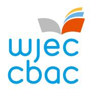
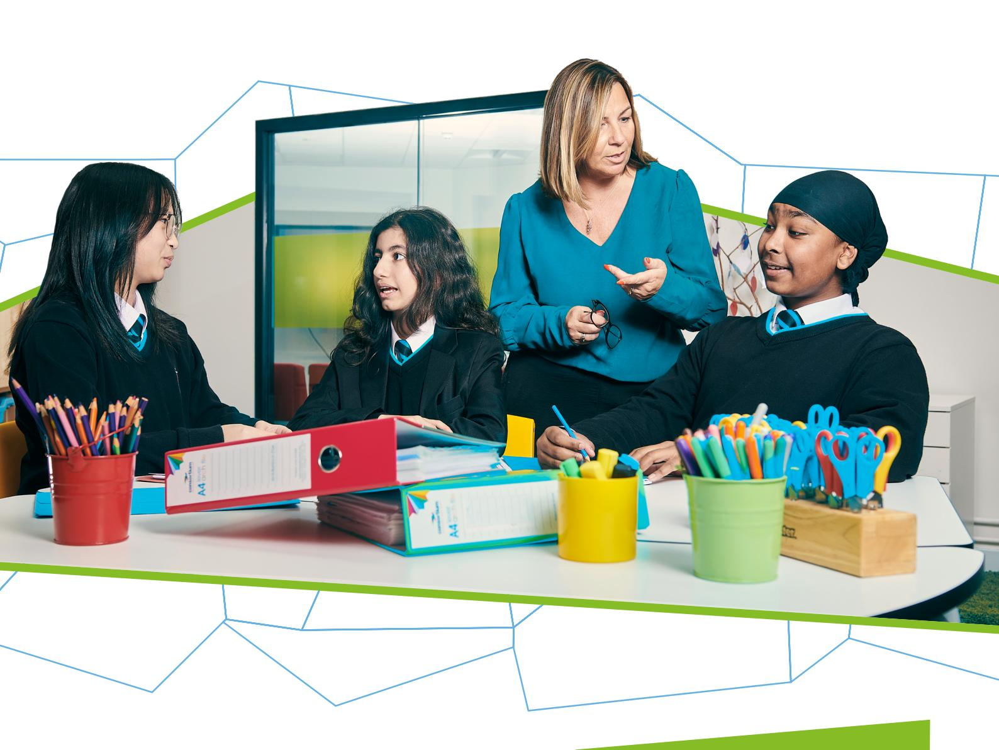

{1}------------------------------------------------

# WJEC GCSE Health and Social Care, and Childcare

Approved by Qualifications Wales

## Specification

Teaching from 2026 For award from 2028

Ready for the world. This Qualifications Wales regulated qualification is not available to centres in England.

Made for Wales.

{2}------------------------------------------------

{3}------------------------------------------------

This specification meets the requirements of the following regulatory documents published by Qualifications Wales:

- [Made for Wales GCSE Qualification Approval Criteria](https://qw-website-prod-master.azurewebsites.net/media/t1lhpbwl/made-for-wales-gcse-qualification-approval-criteria.pdf) which set out requirements for any new GCSE qualification Approved for first teaching from September 2025 and beyond.
- [Standard Conditions of Recognition](https://qualifications.wales/media/p54jkkfe/standard-conditions-of-recognition.pdf) which contains the rules that all awarding bodies and their qualifications must meet when offering qualifications to learners in Wales.
- Approval Criteria for GCSE [Health and Social Care, and Childcare](https://qualifications.wales/media/1tfaaqpt/gcse-health-and-social-care-and-childcare-approval-criteria.pdf) which sets out the subject specific requirements for GCSE Health and Social Care, and Childcare from September 2026 and beyond.

#### **Copyright**

© WJEC CBAC Limited 2025.

{4}------------------------------------------------

#### **CONTENTS**

| SUMMARY OF ASSESSMENT |                       |                                                                              | 4  |
|-----------------------|-----------------------|------------------------------------------------------------------------------|----|
| 1                     | INTRODUCTION          |                                                                              | 6  |
|                       | 1.1                   | Aims                                                                         | 6  |
|                       | 1.2                   | Curriculum for Wales                                                         | 6  |
|                       | 1.3                   | Prior learning and progression                                               | 8  |
|                       | 1.4                   | Guided learning hours                                                        | 8  |
|                       | 1.5                   | Use of language                                                              | 9  |
|                       | 1.6                   | Equality and fair access                                                     | 9  |
| 2                     | SUBJECT CONTENT       |                                                                              | 10 |
|                       |                       | How to read the amplification                                                | 10 |
|                       |                       | Unit Information                                                             | 10 |
|                       |                       | Unit 1                                                                       | 10 |
|                       |                       | Unit 2                                                                       | 19 |
|                       |                       | Unit 3                                                                       | 26 |
|                       |                       | Opportunities for integration of learning experiences                        | 32 |
| 3                     | ASSESSMENT            |                                                                              | 33 |
|                       | 3.1                   | Assessment Objectives and Weightings                                         | 33 |
|                       | 3.2                   | Arrangements for non-examination assessment                                  | 34 |
| 4                     | MALPRACTICE           |                                                                              | 35 |
| 5                     | TECHNICAL INFORMATION |                                                                              | 36 |
|                       | 5.1                   | Entries and awards                                                           | 36 |
|                       | 5.2                   | Grading, awarding and reporting                                              | 38 |
|                       |                       | Appendix A: Opportunities for embedding elements of the Curriculum for Wales | 39 |

{5}------------------------------------------------

## GCSE HEALTH AND SOCIAL CARE, AND CHILDCARE

## SUMMARY OF ASSESSMENT

**Unit 1: Health and Social Care, and Childcare in Wales in the 21st Century**

**Written examination: 1 hour 30 minutes** 

**40% of qualification**

**80 marks**

Set and marked by WJEC. The assessment will include questions requiring objective responses, short and extended answers, with some based around applied situations.

**Unit 2: Adult Health and Social Care Non-examination assessment: 12 hours 30% of qualification** 

**60 marks**

Set by WJEC, marked by the Centre and moderated by WJEC. The assessment brief, which will include a choice of case studies and several tasks, will be available via the WJEC Portal.

**Unit 3: Childcare Non-examination assessment: 12 hours 30% of qualification** 

**60 marks**

Set by WJEC, marked by the Centre and moderated by WJEC. The assessment brief, which will include a case study and several tasks, will be available via the WJEC Portal.

This is a unitised qualification.

It is not tiered.

Aside from Unit 1, which is an introductory unit, there is no hierarchy implied by the order in which the two other units are presented. Therefore, the order does not imply a prescribed teaching order.

Unit 1 examination will be available in June 2027.

Unit 2 and Unit 3 will be assessed through externally set assessments by WJEC. The assessment briefs will be available in September of the second year of study, to be completed by the summer of the final year of study. The units will be first awarded in 2028. Each year, the assessment structure will broadly stay the same for both units.

{6}------------------------------------------------

The first award of the qualification will be 2028.

Qualification Approval Number: C00/5166/8

{7}------------------------------------------------

## GCSE HEALTH AND SOCIAL CARE, AND CHILDCARE

## 1 INTRODUCTION

#### 1.1 Aims

GCSE Health and Social Care, and Childcare supports learners to:

- understand the principles of human development, health and wellbeing
- explore how the health and social care, and childcare sectors support and promote the development, health and wellbeing of individuals
- describe the principles, values and approaches that underpin the work of health and social care, and childcare professionals in Wales
- understand key conditions and illnesses in adulthood and childhood
- explore the cross-cutting theme of human rights and diversity, particularly in relation to service provision in health and social care, and childcare.

#### 1.2 Curriculum for Wales

This GCSE Health and Social Care, and Childcare qualification is underpinned by the Curriculum for Wales framework and has been designed to ensure that learners can continue to make progress towards the four purposes whilst studying for this qualification. Central to this design are the [principles of progression,](https://hwb.gov.wales/curriculum-for-wales/health-and-well-being/principles-of-progression/) along with the [statements of what matters](https://hwb.gov.wales/curriculum-for-wales/health-and-well-being/statements-of-what-matters/) and those [subject specific skills and concepts](https://hwb.gov.wales/curriculum-for-wales/health-and-well-being/designing-your-curriculum/#specific-considerations-for-this-area) outlined in the '[Designing your Curriculum](https://hwb.gov.wales/curriculum-for-wales/health-and-well-being/designing-your-curriculum/)' section of the Health and wellbeing Area of Learning and Experiences.

In developing this qualification, we have considered where there are opportunities to embed the cross-curricular themes and where there are opportunities for integral skills and cross-curricular skills to be developed. Appendix A provides a simple mapping, and information to support teachers will be provided in the Guidance for Teaching.

We have also considered where the qualification can generate opportunities for integrating the learning experiences noted on page 32; the Guidance for Teaching will include further information on integrating these learning experiences into delivery. 

{8}------------------------------------------------

The GCSE Health and Social Care, and Childcare qualification supports the Curriculum for Wales by:

- supporting the statements of what matters[1](#page-7-0) , by giving learners the opportunity to:
  - understand the factors that affect physical health and wellbeing throughout the lifespan including health-promoting behaviours, for example, physical activity, including an understanding of health-harming behaviours
  - develop positive, informed behaviours that encourage learners to care for and respect themselves and others in a health and social care, and childcare context
  - help learners explore the connections between their experiences, mental health and emotional wellbeing
  - create a culture where talking about mental health and emotional wellbeing is normalised in health and social care, and childcare
  - develop the critical-thinking skills necessary to consider their decision-making in terms of possible implications including risks, for themselves and others
  - engage critically with social influences within their own culture, as well as those of others, to understand how norms and values develop
  - understand how decisions and actions impact on themselves, on others, and on wider society, both now and in the future
  - help to understand the factors that influence decision-making, placing them in a better position to make more informed and considered decisions around health and social care, and childcare
  - develop the critical-thinking skills necessary to consider decision-making in terms of possible implications in the health and social care, and childcare sectors.
- supporting the principles of progression[2](#page-7-1) by encouraging learners to:
  - develop their independence and agency in matters relating to health and wellbeing, resulting in a growing responsibility for their own health and wellbeing
  - develop conceptual knowledge and critical understanding in a range of aspects of health and wellbeing and personal behaviour
  - develop connections between aspects of health and wellbeing and a wide range of topics and issues in health and social care, and childcare contexts
  - develop an appreciation for the needs of others in health and social care, and childcare contexts and the impact of decisions, actions and circumstances
  - become more socially responsible
  - develop the understanding of advocacy on behalf of themselves and of others through health and social care, and childcare contexts.

1 <https://hwb.gov.wales/curriculum-for-wales/health-and-well-being/statements-of-what-matters>

© WJEC CBAC Ltd 2025. 2 <https://hwb.gov.wales/curriculum-for-wales/health-and-well-being/principles-of-progression>

{9}------------------------------------------------

- supporting the subject specific considerations for GCSE Health and Social Care, and Childcare[3](#page-8-2) by giving learners the opportunity to:
  - develop literacy skills, being able to organise writing and adapt language confidently, enabling learners to apply for learning pathways and a preferred career, possibly in health and social care and / or childcare
  - support learners to explore and understand in depth, developmental changes across the lifespan, as well as how those changes affect individuals in a range of different ways
  - learn and understand how to assess and manage risk so they can keep themselves and others safe, including safeguarding within a health and social care, and childcare context
  - reflect on the short-term, medium-term and long-term implications of the decisions they make. It should be recognised that learners do not necessarily have responsibility for many of the decisions affecting them and this responsibility grows over time
  - understand the role that social influences can play on learner behaviour and the influences that can promote and encourage healthy prosocial behaviours, as well as those that lead to issues such as discrimination, racism or prejudice throughout the health and social care, and childcare sectors
  - understand the role and importance of relationships such as family and friends, pets/animals, peers, professional, virtual, romantic, sexual, religious and spiritual *–* through health and social care, and childcare contexts, and those relationships which they may not yet be familiar with but are highly likely to encounter in their lives or whilst working in the sectors.

## 1.3 Prior learning and progression

Although there is no specific requirement for prior learning, the qualification is designed primarily for learners between the ages of 14 and 16 and builds on the conceptual understanding learners have developed through their learning from ages 3 – 14.

The qualification allows learners to develop a strong foundation of knowledge, skills and understanding which supports progression to post-16 study and prepares learners for life, learning and work. The qualification provides a suitable foundation for the study of Health and Social Care, and Childcare at either AS or A level, and appropriate Level 2 and Level 3 qualifications in this subject. In addition, the specification provides a coherent, satisfying and worthwhile course of study for learners who do not progress to further study in this subject.

## 1.4 Guided learning hours

GCSE Health and Social Care, and Childcare has been designed to be delivered within 120 – 140 guided learning hours. The qualification has been primarily designed as a 2-year programme for learners in years 10 and 11.

3 <https://hwb.gov.wales/curriculum-for-wales/health-and-well-being/designing-your-curriculum/>

{10}------------------------------------------------

#### 1.5 Use of language

As our understanding of diversity, equity, and inclusion evolves, so must our language. Updated terminology better reflects individual identities and fosters respect and accuracy. Language used should be as specific as possible. Staying informed and adaptable is crucial, as inclusive language promotes dignity and equity. Recognising that language will continue to evolve, we will remain open to further amendments to ensure it accurately represents and supports all individuals. WJEC will inform centres of any amendments and the most up to date version of the specification will always be on the website.

### 1.6 Equality and fair access

The specification may be followed by any learner, irrespective of gender, ethnic, religious or cultural background. It has been designed to avoid, where possible, features that could, without justification, make it more difficult for a learner to access and achieve because they have a particular protected characteristic.

The protected characteristics under the Equality Act 2010 are age, disability, gender reassignment, pregnancy and maternity, race, religion or belief, sex and sexual orientation.

Access arrangements and reasonable adjustments are made for eligible learners to enable them to access the assessments and demonstrate their knowledge and skills without changing the demands of the assessment.

Information on access arrangements and reasonable adjustments is found in the following document from the Joint Council for Qualifications (JCQ): Access Arrangements, Reasonable Adjustments: General and Vocational Qualifications. This document is available on the JCQ website [\(www.jcq.org.uk\)](http://www.jcq.org.uk/).

We will be following the principles set out in this document and, as a consequence of provision for reasonable adjustments, very few learners will encounter a complete barrier to any part of the assessment.

{11}------------------------------------------------

## 2 SUBJECT CONTENT

#### How to read the amplification

The amplification provided in the right-hand column uses the following four stems:

- 'Learners should be aware of' is used when learners do not need to understand all aspects of the specified content in detail. Teachers should refer to Guidance for Teaching documents for further guidance on the depth and breadth to which this content should be taught.
- 'Learners should know' is used when learners are required to demonstrate basic knowledge and understanding.
- 'Learners should understand' is used when learners are required to demonstrate greater depth of knowledge and understanding, application of knowledge to familiar or unfamiliar contexts and analysis and evaluation of information for a given purpose.
- 'Learners should be able to' is used when learners need to apply their knowledge and understanding.

The use of the word 'including' indicates that the specified content must be taught and could be subject to assessment.

The use of the words 'for example' or 'such as' indicates that the specified content is for guidance only, and alternative examples could be chosen.

#### Unit Information

Learners will be given opportunities to explore human rights and diversity throughout the three units, including consideration of:

- access to service provision across health and social care, and childcare
- the impact of service provision and delivery on outcomes in relation to health and social care, and childcare
- Black, Asian and minority ethnic perspectives, identity, culture, experiences and contributions.

#### Unit 1

#### **Health and Social Care, and Childcare in Wales in the 21st Century**

Written examination 40% of qualification 80 marks

#### **Overview of unit**

The purpose of this unit is to develop knowledge and understanding of:

- the life cycle and the factors that affect growth and development
- the promotion and maintenance of health and wellbeing and tools that can be used to measure and support this
- core principles and values, underpinned by legislation and service provision within a Welsh context, across the health and social care, and childcare sectors.

{12}------------------------------------------------

#### This unit will focus on:

- human growth, development and wellbeing across the life cycle
- factors affecting growth, development and wellbeing across the life cycle
- legislation and service provision across health and social care, and childcare
- core principles, values and approaches when working in health and social care, and childcare
- the promotion and maintenance of health and wellbeing of individuals throughout their life
- indicators and tools to measure and support health and wellbeing
- Welsh language and culture in health and social care, and childcare.

#### **Areas of content**

#### **1.1 Growth and Development**

- 1.1.1 The principles of growth and development, and the main life stages across the life cycle
- 1.1.2 Key areas of development across the life cycle
- 1.1.3 The factors that affect growth, development and wellbeing across the life cycle

| Section                                                                                                       | Amplification                                                                                                                                                                                                                                                                                                                                                                                                                                                                                                                                                                                                     |
|---------------------------------------------------------------------------------------------------------------|-------------------------------------------------------------------------------------------------------------------------------------------------------------------------------------------------------------------------------------------------------------------------------------------------------------------------------------------------------------------------------------------------------------------------------------------------------------------------------------------------------------------------------------------------------------------------------------------------------------------|
| 1.1.1 The principles of growth and development, and the main life stages across the life cycle | Learners should know the meaning of growth and development which is the physical, intellectual, language, emotional and social changes that humans experience throughout their lives.                                                                                                                                                                                                                                                                                                                                                                                                                    |
|                                                                                                               | Learners should know: ● that growth and development are processes that begin at conception and continue throughout life ● that growth refers to physical changes, while development refers to changes in functional ability ● the following principles of child development: ● supporting child development ● sequence of child development ● interrelated child development. |
|                                                                                                               | Learners should know the following main life stages of growth and development: ● infancy 0-2 years ● childhood 3-12 years ● adolescence 13-19 years ● adulthood 20-64 years ● later adulthood 65+ years.                                                                                                                                                                                                              |

{13}------------------------------------------------

#### 1.1.2

#### Key areas of development across the life cycle

Learners should understand the key areas and features of development across the life cycle:

- Physical development:
  - body growth
  - strength
  - puberty
  - menopause
  - age and ageing.
- Intellectual development:
  - memory development
  - how children learn
  - peak of intellectual ability in middle adulthood
  - memory may become less efficient in later adulthood.
- Language development:
  - stages of communication
  - difficulties in communication, including language delay.
- Emotional development:
  - development of feelings and empathy
  - bonding and attachment
  - self-esteem, self-confidence and independence.
- Social development:
  - social skills
  - socialisation.

{14}------------------------------------------------

#### 1.1.3

The factors that affect growth, development and wellbeing across the life cycle

Learners should understand the different factors affecting the growth and development of individuals across the lifecycle including:

#### Sociological:

- cultural and racial diversity including the benefits and challenges of living in a multicultural society
- discrimination due to protected characteristics, for example gender and transgender
- environmental, including housing conditions and location, air pollution, availability of health and social care, and childcare services, opportunities for play and resources
- family, including parenting styles, relationships, divorce
- friends: socialisation, isolation, stereotyping, peer pressure
- influence of society, role models and the media
- lifestyle, including nutrition, diet, exercise, lifestyle choices
- socio-economic, including income; poverty and affluence.

#### Psychological:

- abuse, including emotional, physical, sexual, psychological, neglect, controlling or coercive behaviour
- adverse childhood experiences (ACEs)
- educational experiences and transitions
- life experiences and transitions including expected and non-expected
- self-esteem, separation, poor attachment.

#### Biological:

- disabilities, ill-health, disease, injury
- sex
- genetic inheritance
- learning disabilities.

{15}------------------------------------------------

#### **1.2 Legislation and Service Provision**

- 1.2.1 Key legislation underpinning health and social care, and childcare in Wales
- 1.2.2 Core principles, values and approaches when working in health and social care, and childcare sectors in Wales
- 1.2.3 The impact on individuals of service provision and delivery in Wales

| Section                                                                                                                               | Amplification                                                                                                                                                                                                                                                                                                                                                                                                                                                                                                                                                                                                                                                                                                                                                                                                                                                                                                                                                                                                                                                                                                                                     |
|---------------------------------------------------------------------------------------------------------------------------------------|---------------------------------------------------------------------------------------------------------------------------------------------------------------------------------------------------------------------------------------------------------------------------------------------------------------------------------------------------------------------------------------------------------------------------------------------------------------------------------------------------------------------------------------------------------------------------------------------------------------------------------------------------------------------------------------------------------------------------------------------------------------------------------------------------------------------------------------------------------------------------------------------------------------------------------------------------------------------------------------------------------------------------------------------------------------------------------------------------------------------------------------------------|
| 1.2.1 Key legislation underpinning health and social care, and childcare in Wales                                         | Learners should understand that legislation underpins the provision of health and social care, and childcare in Wales and is implemented to support and promote the health and wellbeing of the population. Learners should understand the key principles of the following current legislation: • Mental Health (Wales) Measure 2010 • Social Services and Well-being (Wales) Act 2014 (SSWA) • The Children Act 1989 and 2004 • Declaration of rights of older people in Wales 2014.                                                                                                                                                                                                                                                                                                                                                                                                                                                                                                                                                                                                                   |
| 1.2.2 Core principles, values and approaches when working in health and social care, and childcare sectors in Wales | Learners should understand the core principles, values and approaches when working in the health and social care, and childcare sectors in Wales including: • rights-based approaches: workers must aim to ensure that they provide an inclusive and rights-based approach and that their practice promotes anti-racism, equality, and diversity, does not discriminate, and shows respect for beliefs, choices, cultures, values and preferences • advocacy: how workers contribute to supporting a rights based approach by ensuring an individual's voice is heard, irrespective of their communication needs or abilities • person-centred approaches: learners should understand that person-centred approaches are at the heart of care and support for individuals and that the care and support provided meets their individual needs • active participation: enabling individuals to be included in planning their own care, having a say in how they live their lives and recognising their right to participate in the activities and functions of everyday life. |

{16}------------------------------------------------

#### 1.2.3

The impact on individuals of service provision and delivery in Wales

Learners should know that service provision and delivery aim to ensure equal opportunity for all in Wales including the positive impact on the health and wellbeing of service users. Learners should be able to identify and give examples of the different types of service provision within the sectors and the ways in which these impact positively on individuals in Wales, including:

- statutory care sector: services that are paid for and provided by the Welsh Government, including:
  - childcare: nursery, primary and secondary schools, Flying Start providers
  - health and social care: health boards, hospitals, health centres and local authority services, children's social care, adult social care.
- independent sector: services that are run as a business to make a profit and receive funding from individuals and/or their insurance policies, including:
  - childcare: crèche, day nursery, childminders, nannies
  - health and social care: BUPA, dentists, residential, nursing homes, self-employed practitioners.
- third sector: services that are provided by non-profit making organisations in the voluntary care sector, including:
  - local support groups using volunteers: playgroups, Cylch Meithrin, counselling and bereavement groups and not-for-profit organisations with paid employees, Barnardo's, NSPCC, Childline, Macmillan, hospices
  - registered charities, for example: Save the Children, Action for Children, Mind, Marie Curie, Scope, Stroke Association
- unpaid care: including personal care provided by families and young carers who are entitled to an assessment of their needs.

Learners should know how the following regulatory organisations ensure that health, social care, and childcare services in Wales meet established standards and comply with legislation:

- Care Inspectorate Wales (CIW)
- Healthcare Inspectorate Wales (HIW)
- His Majesty's Inspectorate for Education and Training in Wales (Estyn).

{17}------------------------------------------------

#### **1.3 The Welsh context**

In this topic learners will gain knowledge, understanding and skills in the following areas:

- 1.3.1 Promotion and maintenance of health and wellbeing of individuals throughout their life
- 1.3.2 Welsh language and culture within the context of health, social care, and childcare
- 1.3.3 Cultural perspectives and experiences of Black, Asian and minority ethnic individuals in relation to health and social care, and childcare

| Section                                                                                                  | Amplification                                                                                                                                                                                                                                                                                                                                                                                                                                                                                                                                                                                                                                                                                                                                                                                                                                                                                                                                                                                                                                                                                                                                                                                                                                                                                                                                                                                                                                                                                                                                                                                                                                                                                                                                                                                                                                                                                                                                                                                                              |
|----------------------------------------------------------------------------------------------------------|----------------------------------------------------------------------------------------------------------------------------------------------------------------------------------------------------------------------------------------------------------------------------------------------------------------------------------------------------------------------------------------------------------------------------------------------------------------------------------------------------------------------------------------------------------------------------------------------------------------------------------------------------------------------------------------------------------------------------------------------------------------------------------------------------------------------------------------------------------------------------------------------------------------------------------------------------------------------------------------------------------------------------------------------------------------------------------------------------------------------------------------------------------------------------------------------------------------------------------------------------------------------------------------------------------------------------------------------------------------------------------------------------------------------------------------------------------------------------------------------------------------------------------------------------------------------------------------------------------------------------------------------------------------------------------------------------------------------------------------------------------------------------------------------------------------------------------------------------------------------------------------------------------------------------------------------------------------------------------------------------------------------------|
| 1.3.1 Promotion and maintenance of health and wellbeing of individuals throughout their life | Learners should know that Wales uses several indicators and tools to measure and support health and wellbeing, including: • Well-being of Future Generations (Wales) Act 2015 which is the overarching legislation to improve the social, economic, environmental and cultural wellbeing of Wales which impacts on all health and social care and childcare sectors. Learners should know the seven goals for Wales set by the act. • Public Health Outcomes Framework includes indicators such as: life expectancy at birth, gap in life expectancy between the most and least deprived, school leavers with skills and qualifications, quality of housing, quality of air, smoking in pregnancy.  Learners should understand that wellbeing indicators can include: • statistics: educational attainment, employment, housing, income, child poverty, security, environmental quality • surveys and questionnaires • physiological measurements: height, weight, blood pressure, temperature, peak flow, heart rate, pulse, blood sugar levels • lifestyle data: alcohol consumption, smoking rates, obesity levels.  Learners should know the ways in which individuals can be supported to take responsibility for their own health and wellbeing, including preventative and early intervention measures: • educating: positive lifestyle choices in relation to specific health and wellbeing risks • immunisation • personal and parental responsibilities for health and wellbeing • screening programmes • a strength-based approach.  Learners should be aware of the: • Public Health Wales Act 2017.  Learners should understand the need for promotion campaigns and initiatives targeted at raising awareness of health and wellbeing related issues with specific audiences at both local and national level, such as Public Health |

Wales, local authorities and the third sector.

{18}------------------------------------------------

Learners should understand that the Welsh Government's 'A Healthier Wales' outlines a vision for a health and social care sector that works together to focus on wellbeing and prevent illness, through less intensive clinical interventions, moving services out of hospital into communities and supporting individuals to live healthy, happy lives.

Learners should know that the following Welsh Government initiatives and campaigns promote improvements to the health and wellbeing of the population of Wales:

- Flying Start
- Healthy Weight: Healthy Wales strategy
- Talk to me 2
- Welsh Network of Healthy School Schemes (WNHSS).

#### 1.3.2

Welsh language and culture within the context of health, social care, and childcare

Learners should understand how recognising Welsh language and cultural needs of individuals are essential components in delivering inclusive, person-centred health, social care, and childcare services in Wales.

Learners should understand how recognising and respecting linguistic and cultural identity promotes better outcomes, enhances dignity and supports trust for individuals.

Learners should understand the importance and impact of Welsh language and culture in enhancing the quality of service provision and how The Active Offer:

- ensures that the Welsh language is as visible as the English language, and that individuals can receive services provided in Welsh without having to ask
- links to Welsh Government guidelines and legislation on Welsh language, for example the Welsh Language Strategic Framework (More than just words…) and the role of the Welsh Language Commissioner.

{19}------------------------------------------------

#### 1.3.3

Cultural perspectives and experiences of Black, Asian and minority ethnic individuals in relation to health and social care, and childcare

Learners should understand that racial inequalities exist in health and may affect access to health and social care and childcare including:

- loneliness, isolation, discrimination, and social and economic inequalities
- over-representation of racial and ethnic minorities in lower paid / status health and social care jobs in Wales.

#### Learners should know:

- the Welsh Government has identified actions to tackle racial inequality in health and social care, and childcare, including ways to improve the experiences and outcomes of health and social care staff and racial and ethnic minority service users
- settings have led on:
  - involving children and parents or carers in celebrating diversity, including the creation of inclusive environments, by promoting cultural awareness, creating school diversity and inclusion policies
  - managing and reporting racist incidents within schools.

Learners should know the Welsh Government policy and legislation in health and social care and childcare in relation to equality, diversity and inclusion, including the principles of:

- Human Rights Act 1998
- The Equality Act 2010

Learners should be aware of the on-going Anti-racist Wales Action Plan 2024.

{20}------------------------------------------------

### Unit 2

#### **Adult Health and Social Care**

Non-examination Assessment: 12 hours Marked by the centre and moderated by WJEC 30% of qualification 60 marks

#### **Overview of unit**

The purpose of this unit is to gain knowledge and understanding of:

- individual needs and key conditions and illnesses in adulthood
- how professionals work in adult health and social care to achieve positive outcomes
- the role of health promotion in public health in Wales.

#### This unit will focus on:

- types of care to meet individual needs and achieve positive outcomes
- how professionals work to meet needs in adult health and social care
- public health and health promotion in adult health and social care
- key conditions and illnesses in adulthood.

#### **Areas of content**

#### **2.1 Individual needs and key conditions and illnesses in adulthood**

- 2.1.1 Individual needs
- 2.1.2 Illnesses
- 2.1.3 Conditions affecting the health and wellbeing of adults in Wales

| Section                   | Amplification                                                                                                                                                                                                                                                                                                                                                                                                                                                                                                                                                                                     |
|---------------------------|---------------------------------------------------------------------------------------------------------------------------------------------------------------------------------------------------------------------------------------------------------------------------------------------------------------------------------------------------------------------------------------------------------------------------------------------------------------------------------------------------------------------------------------------------------------------------------------------------|
| 2.1.1 Individual needs | Learners should understand the importance of a range of individual care needs that may arise over the adulthood life stages to ensure they live a healthy fulfilling life including: • Maslow's hierarchy of needs • physical: diet, exercise, hygiene, sleep • intellectual: participating in work, education, training and hobbies • language: fluency, accuracy, meaning, structure, appropriate terminology • emotional: mental health, protection from abuse, self- concept, sense of purpose • social: relationships with others, independence, isolation. |

{21}------------------------------------------------

#### 2.1.2 Illnesses

Learners should understand that adults will face common illnesses over their lifetime, and be able to recognise the possible short-term effects to their health and wellbeing, including:

- respiratory infections: chest infection, sinusitis, tonsillitis
- viral infections: common cold, flu, COVID, fever, sepsis
- bacterial infections: ear infection, pneumonia, meningitis, sepsis
- gastrointestinal infection: norovirus, food poisoning.

#### 2.1.3

Conditions affecting the health and wellbeing of adults in Wales

Learners should understand the key conditions affecting the long-term physical and mental health and wellbeing of adults including the different conditions in the population or communities in Wales.

Learners should be able to recognise and know the key signs, symptoms and the impact on health and wellbeing for the following conditions:

#### Physical:

- asthma
- bowel, breast, lung and prostate cancer
- heart disease
- high blood pressure
- menopause
- type 1 diabetes
- type 2 diabetes

#### Mental:

- anxiety
- depression, (including post-natal)
- Obsessive Compulsive Disorder (OCD)
- Post-Traumatic Stress Disorder (PTSD).

{22}------------------------------------------------

#### **2.2 How professionals work in adult health and social care to achieve positive outcomes**

- 2.2.1 Professionals working in the health and social care sector
- 2.2.2 Partnership working
- 2.2.3 Achieving positive outcomes

| Section                                                                   | Amplification                                                                                                                                                                                                                                                                                                                                                                                                                                                                                 |
|---------------------------------------------------------------------------|-----------------------------------------------------------------------------------------------------------------------------------------------------------------------------------------------------------------------------------------------------------------------------------------------------------------------------------------------------------------------------------------------------------------------------------------------------------------------------------------------|
| 2.2.1 Professionals working in the health and social care sector | Learners should be able to name the different professionals working in the health and social care sector and understand how they can meet the needs of adults, including: Advocacy workerConsultantDentistDieticianGeneral PractitionerNurseOccupational therapist - clinical and communityOpticianPsychologistSocial WorkerSocial Care WorkerWelfare Rights Officer.Learners should be aware of the requirements of each role in terms of:roles and responsibilitiesskills and qualities. |

{23}------------------------------------------------

#### 2.2.2 Partnership working

Learners should understand the different ways that professionals can work together in partnership to streamline and improve collaboration and communication between agencies ensuring individuals receive effective care. Learners should understand how each of the following contribute to partnership working:

- multi-agency working
- multi-disciplinary teams
- multi-agency panels
- integrated services.

Learners should be aware of the codes of practice produced by the regulatory bodies that specify the standards of practice and behaviours expected of health and social care, and childcare workers and their employers when working collaboratively**:**

- Care Inspectorate Wales: to provide the best care and support, care workers follow a set of codes they must:
  - help individuals say and achieve what is important to them
  - respect individuals' dignity, privacy, preferences, culture, language, rights, beliefs, views and wishes
  - support individuals to stay safe
  - be honest, trustworthy and reliable
  - be qualified to do their job properly.
- Healthcare Inspectorate Wales use a rights based approach to inspecting. They consider how service providers promote people's rights by considering how services ensure individuals:
  - have choice and control
  - are safe
  - are treated with respect
  - have a voice
  - are helped to develop their full potential.
- Social Care Wales specifically its role in registration and regulation of social care workers.

{24}------------------------------------------------

#### 2.2.3 Achieving positive outcomes

Learners should understand the importance of personcentred care when professionals work with adults in the health and social care sector.

Learners should understand the importance of identifying personal goals to support adults with achieving positive outcomes, this can be demonstrated by:

- empowering individuals
- encouraging active participation
- What Matters Conversations
- providing advocacy services.

Learners should understand the importance of safeguarding adults when working in the health and social care sector and understand what is meant by the term 'adult at risk', including:

• All Wales safeguarding procedures 2019 and the role of the safeguarding process; identifying concerns and the duty to report these concerns.

{25}------------------------------------------------

#### **2.3 The role of public health, health promotion and promoting equality, diversity and inclusion in adult Health and Social Care in Wales**

- 2.3.1 The role of health promotion
- 2.3.2 Public health
- 2.3.3 Access to service provision

| Section                                  | Amplification                                                                                                                                                                                                                                                                                                                                |
|------------------------------------------|----------------------------------------------------------------------------------------------------------------------------------------------------------------------------------------------------------------------------------------------------------------------------------------------------------------------------------------------|
| 2.3.1 The role of health promotion | Learners should understand the purpose of health promotion and the main focuses for this: healthy eating, quitting smoking, managing stress, safe sex, exercise, hygiene, social isolation and bullying.                                                                                                                            |
|                                          | Learners should understand the role of health promotion in ensuring adults are encouraged to lead a healthy lifestyle.                                                                                                                                                                                                                    |
|                                          | Learners should be aware of the purpose and aims of the different health initiatives or campaigns to support the health and wellbeing of adults in Wales, including: A healthier WalesBeat fluEatwell guideHealth challenge WalesHelp me quitMind Cymru campaignsPrudent healthcareSexual Health Wales.                             |
| 2.3.2 Public health                   | Learners should understand the purpose of public health, the challenges of public health and the benefits of public health for adults living in Wales.                                                                                                                                                                                 |
|                                          | Learners should understand that there are a variety of vaccinations and screening tests available to adults in Wales to assist with promoting good health and reducing any risk of illness or disease, including: Bowel screeningBreast screeningCervical screening WalesCOVID vaccinationDiabetic eye screeningFlu vaccination. |

{26}------------------------------------------------

#### 2.3.3 Access to service provision

Learners should be aware of the seven local health boards in Wales and understand how service providers ensure equality of access for all.

Learners should understand the importance of Equality, Diversity and Inclusion when working with adults in health and social care services now and in the future:

- Equality: based on The Equality Act 2010 and how this embeds equality and diversity in all aspects of health and social care in Wales. Learners should know the nine protected characteristics: age, disability, gender reassignment, marriage and civil partnership, race, religion or belief, pregnancy, sex and sexual orientation.
- Diversity: individuals should feel respected and accepted when accessing services, with health and social care workers, demonstrating a clear understanding of recognising that every individual is unique and valued including the Active Offer.
- Inclusion: this is a human right, all individuals should be included and welcomed into services, treated equally and not discriminated against in any way.

{27}------------------------------------------------

### Unit 3

#### **Childcare**

Non-examination Assessment: 12 hours Marked by the centre and moderated by WJEC 30% of qualification 60 marks

#### **Overview of unit**

The purpose of this unit is to gain knowledge and understanding of:

- life stages, expected milestones, and physical, intellectual, language, emotional and social (PILES) development
- key conditions and illnesses of children
- how professionals work, including play and play work, to meet the needs of children in Wales to achieve positive outcomes.

#### This unit will focus on:

- life stages, expected milestones, and PILES
- play and play work
- types of care and intervention to meet children's needs and achieve positive outcomes
- how professionals work to meet children's needs
- health promotion and early intervention in childcare
- key conditions and illnesses in children.

#### **Areas of content**

#### **3.1 Life stages, expected milestones, and physical, intellectual, language, emotional and social (PILES) development**

- 3.1.1 Life stages and expected milestones
- 3.1.2 Physical development and expected milestones
- 3.1.3 Intellectual development and expected milestones
- 3.1.4 Language development and expected milestones
- 3.1.5 Emotional development and expected milestones
- 3.1.6 Social development and expected milestones

| Section                                                     | Amplification                                                                                                                                                                                                                                                         |
|-------------------------------------------------------------|-----------------------------------------------------------------------------------------------------------------------------------------------------------------------------------------------------------------------------------------------------------------------|
| 3.1.1 Life stages and expected milestones             | Learners should know that children go through the following life stages: infancy 0-2 yearschildhood 3-12 yearsadolescence 13-19 years.Learners should know that each life stage includes expected developmental milestones.                                  |
| 3.1.2 Physical development and expected milestones | Learners should understand the physical development and milestones of children during infancy 0-2 years, childhood 3- 12 years and adolescence 13-19 years including: gross motor skillsfine motor skillsmovement and co-ordinationbody growth and strength. |

{28}------------------------------------------------

| 3.1.3 Intellectual development and expected milestones | Learners should understand intellectual development and milestones of children during infancy 0-2 years, childhood 3- 12 years and adolescence 13-19 years including: • cognitive development • problem solving • creative thinking • mental capacity and mental development.                                                        |
|--------------------------------------------------------------|--------------------------------------------------------------------------------------------------------------------------------------------------------------------------------------------------------------------------------------------------------------------------------------------------------------------------------------------------------|
| 3.1.4 Language development and expected milestones     | Learners should understand language development and milestones of children during infancy 0-2 years, childhood 3- 12 years and adolescence 13-19 years including: • receptive language • vocabulary development • expressive language.                                                                                                  |
| 3.1.5 Emotional development and expected milestones    | Learners should understand emotional development and milestones of children during infancy 0-2 years, childhood 3- 12 years and adolescence 13-19 years including: • self-awareness • empathy • emotional regulation • emotional development • theory of development including John Bowlby's Attachment theory and behaviours. |
| 3.1.6 Social development and expected milestones       | Learners should understand social development and milestones of children during infancy 0-2 years, childhood 3- 12 years and adolescence 13-19 years including: • social skills • peer relationships • cultural awareness • behaviour development • theory of development including Albert Bandura's, Bobo doll experiment.    |

{29}------------------------------------------------

#### **3.2 Common conditions and illnesses of children**

- 3.2.1 Common childhood illnesses
- 3.2.2 Growth and developmental concerns
- 3.2.3 Health promotion, early intervention and types of care
- 3.2.4 Healthy Child Wales Programme (HCWP)

| Section                                       | Amplification                                                                                                                                                                                                                                                                                                                                                                                                                                                                                                                                                                                                                                                                                                                                                                                 |
|-----------------------------------------------|-----------------------------------------------------------------------------------------------------------------------------------------------------------------------------------------------------------------------------------------------------------------------------------------------------------------------------------------------------------------------------------------------------------------------------------------------------------------------------------------------------------------------------------------------------------------------------------------------------------------------------------------------------------------------------------------------------------------------------------------------------------------------------------------------|
| 3.2.1 Common childhood illnesses        | Learners should be able to recognise the following common childhood illnesses and should understand the appropriate care and timely intervention, symptoms, causes and treatment for each illness: respiratory infections: asthma, pneumonia, croup and whooping coughbacterial infections: meningitis, conjunctivitis, ear infections and tonsillitisviral infections: chicken pox, measles, mumps and hand, foot and mouth diseasegastrointestinal infections: bacterial gastroenteritis, viral gastroenteritis, food intolerances and norovirus.Learners should understand the role of Public Health Wales in infection control in childcare settings, including exclusion periods for infection control, notifiable diseases and reporting requirements. |
| 3.2.2 Growth and developmental concerns | Learners should be aware of growth and developmental concerns, including: delayed development and growth concerns: failure to thrive, prenatal and perinatal factors, genetic, hereditary disorders and environmental factors, including organic and non-organic failuresdevelopment disorders: autism spectrum disorder (ASD), including, symptoms and treatment, and the difficulties with social interaction. Attention deficit hyperactivity disorder (ADHD), including, symptoms and treatment including, impulsive behavioursintellectual disabilities and learning disorders: early intervention, adaptive behaviour support and guidance and individual development plans (IDPs).                                                                    |

{30}------------------------------------------------

#### 3.2.3

Health promotion, early intervention and types of care

Learners should understand the role of health promotion and early intervention, including:

- health care education and promotion: prevention and control of diseases in Wales and the UK including raising awareness and hygiene
- immunisation and vaccination: routine immunisation and vaccination programmes recommended by Public Health Wales (PHW) to prevent many childhood illnesses
- prevention, diagnosis**,** treatment and care management: recognising symptoms early, supportive care, seeking medical attention.

Learners should understand types of care and intervention to meet children's needs to achieve positive outcomes, including:

- routine health care: regular medical check-ups, vaccinations and treatments for health care for illnesses and injuries
- nutrition and diet: providing a balanced nutritional diet, suitability for age, supportive for health and positive health and wellbeing
- sleep and rest: including meeting physical care needs and appropriate environments and routines
- early intervention programmes: including parenting skills programmes, family support programmes and social services.

#### 3.2.4

#### Healthy Child Wales Programme (HCWP)

Learners should know the purposes of the Healthy Child Wales Programme (HCWP):

- universal and targeted services: universal health service for all children, support from pregnancy to seven years, targeted interventions for specific health or social needs
- health checks and assessments: key stage health assessments during child development, routine screenings
- support for parents and carers: support including breastfeeding, nutrition, sleep and healthcare and wellbeing information.

{31}------------------------------------------------

#### **3.3 How professionals work, including play and play work, to meet the needs of children in Wales to achieve positive outcomes**

- 3.3.1 Service provision to achieve positive outcomes
- 3.3.2 Partnership working
- 3.3.3 The role of childcare professionals
- 3.3.4 The benefits of play and play work

| Section                                                    | Amplification                                                                                                                                                                                                                                                                                                                                                                                                                                                                                                                                                                                                                                                                                                                                                                                                                                                                                                                                                                                                                                 |
|------------------------------------------------------------|-----------------------------------------------------------------------------------------------------------------------------------------------------------------------------------------------------------------------------------------------------------------------------------------------------------------------------------------------------------------------------------------------------------------------------------------------------------------------------------------------------------------------------------------------------------------------------------------------------------------------------------------------------------------------------------------------------------------------------------------------------------------------------------------------------------------------------------------------------------------------------------------------------------------------------------------------------------------------------------------------------------------------------------------------|
| 3.3.1 Service provision to achieve positive outcomes | Learners should understand that childcare refers to the provision of care and early education for young children, typically from birth to school age, including before / after school care and that it is provided through a range of private and statutory services.                                                                                                                                                                                                                                                                                                                                                                                                                                                                                                                                                                                                                                                                                                                                                                         |
|                                                            | Learners should be aware of access to service provision in the mediums of both Welsh and English, including: types of childcare settings and play services: services managed by local authorities, community organisations and schools including: Cylch Meithrin, Cylch Ti a Fiaccess to childcare and play services in Wales: accessing services for children to experience diverse, enriching accessible play areas and opportunities, including positive health and wellbeing outcomes and barriers to accessing servicesprinciples of inclusion: diversity and equity, promoting fair access to childcare services and ensuring that all children have opportunities for participation.Learners should understand the importance of safeguarding when working in the childcare sector and understand what is meant by the term 'children and young people at risk of harm', including: All Wales safeguarding procedures 2019 and the role of the safeguarding process; identifying concerns and the duty to report these concerns. |
| 3.3.2 Partnership working                               | Learners should be aware of partnership working, including: • key partners in childcare: effective communication and support provision for parents and families, the role of childcare professionals and health professionals • Play Wales: Key areas of Play Wales' work, including support for play workers and childcare practitioners, and collaboration to build partnerships with educational and childcare providers within settings. • Care inspectorate Wales (CIW): benefits of partnership working, provision of quality care and early intervention, CIW being the regulatory body responsible for inspecting and regulating services such as social care, early years and play services in Wales.  Learners should understand the different ways that professionals can work together in partnership to streamline and improve collaboration and communication to meet the needs of children in Wales to achieve positive outcomes.                                                                               |
| 3.3.3 The role of childcare professionals               | Learners should know the role of childcare professionals, in both private and statutory settings, including: • childcare workers: • early education and childcare assistants (nursery assistants) • early education and childcare practitioners (nursery nurses) • childminders • nursery managers and supervisors • teaching assistants • one-to-one support or learning support assistants (LSA) • play workers.                                                                                                                                                                                                                                                                                                                                                                                                                                                                                                                                                                                                    |
| 3.3.4 The benefits of play and play work                | Learners should understand the benefits of play and play work, including: • the importance of play in child development (PILES) • stages of play • play work principles (Play Wales) • indoor and outdoor play • supporting play through enabling strategies and supportive behaviour approaches.                                                                                                                                                                                                                                                                                                                                                                                                                                                                                                                                                                                                                                                                                                                              |

{32}------------------------------------------------

{33}------------------------------------------------

#### Opportunities for integration of learning experiences

GCSE Health and Social Care, and Childcare generates opportunities for the following learning experiences to be developed (experiences will not be directly assessed):

- explore local health and social care, and childcare provision and services to make connections that develop a stronger sense of cynefin
- explore career opportunities within health and social care, and childcare
- hear directly from, and interact with, health and social care, and childcare professionals, either in person or online, to appreciate their experiences of working within the sector
- make appropriate use of digital technology
- develop collaboration and teamwork skills by working with, and learning from, others.

The Guidance for Teaching will include further information on the opportunities provided by the qualification for teachers / centres to integrate these learning experiences and skills into delivery.

For opportunities to develop cross-cutting themes, cross-curricular skills and integral skills please see Appendix A.

{34}------------------------------------------------

## 3 ASSESSMENT

The Assessment Pack will include all detailed information relating to assessment.

## 3.1 Assessment Objectives and Weightings

Below are the assessment objectives for this specification. Learners must:

#### **AO1**

**Demonstrate knowledge and understanding** of concepts, values and issues in health and social care, and childcare.

#### **AO2**

**Apply knowledge and understanding** of concepts, values and issues in health and social care, and childcare.

#### **AO3**

**Investigate, analyse, and evaluate** values, issues and provision in health and social care, and childcare, making reasoned judgements and drawing conclusions.

The table below shows the weighting of each assessment objective for each unit and for the qualification as a whole.

|                      | AO1 | AO2   | AO3   | Total |
|----------------------|-----|-------|-------|-------|
| Unit 1               | 25% | 10%   | 5%    | 40%   |
| Unit 2               | -   | 17.5% | 12.5% | 30%   |
| Unit 3               | -   | 17.5% | 12.5% | 30%   |
| Overall weighting | 25% | 45%   | 30%   | 100%  |

{35}------------------------------------------------

#### 3.2 Arrangements for non-examination assessment

#### **Unit 2**

For this assessment, learners are required to complete an assessment based on a choice of two case studies where they apply knowledge and understanding of adult health and social care. Learners may choose one of two case studies they would like to complete for the non-examination assessment. It is not necessary for the whole cohort to select the same case study.

The assessment will be released during the first week of September for assessment in that academic year. The case studies and tasks will change annually. Learners should not have access to the case studies or tasks until the start of the assessment. Centres have the flexibility to decide when, during the academic year, learners undertake the assessment.

This non-examination assessment contributes to 30% of the overall qualification grade and will take 12 hours to complete. The assessment could be completed in several sittings due to the length of the non-examination assessment. The assessment will be marked out of a total of 60 marks.

This unit will be assessed through an externally set assessment and will be marked by the centre and moderated by WJEC. Assessments must be submitted digitally.

#### **Unit 3**

For this assessment, learners are required to complete:

- an assessment based on a case study
- an investigation

where they apply knowledge and understanding of childcare.

The assessment will be released during the first week of September for assessment in that academic year. The case study and tasks will change annually, and the investigation will remain static. Learners should not have access to the case study or tasks until the start of the assessment. Centres have the flexibility to decide when, during the academic year, learners undertake the assessment.

This non-examination assessment contributes to 30% of the overall qualification grade and will take 12 hours to complete. The assessment could be completed in several sittings due to the length of the non-examination assessment. The assessment will be marked out of a total of 60 marks.

This unit will be assessed through an externally set assessment and will be marked by the centre and moderated by WJEC. Assessments must be submitted digitally.

{36}------------------------------------------------

## 4 MALPRACTICE

Before the course starts, the teacher is responsible for informing candidates of WJEC's regulations concerning malpractice. Candidates must not take part in any unfair practice in the preparation of work for GCSE Health and Social Care, and Childcare.

Information regarding malpractice is available in our [Guide to preventing, reporting and](https://www.wjec.co.uk/media/0pjats1l/guide-to-preventing-reporting-and-investigating-malpractice-april-2022-002.pdf)  [investigating malpractice.](https://www.wjec.co.uk/media/0pjats1l/guide-to-preventing-reporting-and-investigating-malpractice-april-2022-002.pdf)

All cases of suspected or actual malpractice must be reported immediately to WJEC (malpractice@wjec.co.uk). If candidates commit malpractice, they may be penalised or disqualified from the examinations.

In all cases of malpractice, centres are advised to consult the JCQ booklet [Suspected](https://www.jcq.org.uk/exams-office/malpractice)  [Malpractice: Policies and Procedures.](https://www.jcq.org.uk/exams-office/malpractice)

{37}------------------------------------------------

## 5 TECHNICAL INFORMATION

#### 5.1 Entries and awards

This is a unitised qualification. Learners are entered for each unit separately.

Assessment opportunities will be available in the summer assessment period each year, until the end of the life of the specification.

Unit 1 will be available in 2027 (and each year thereafter). Unit 2 and Unit 3 will be available in 2028 (and each year thereafter) and the qualification will be awarded for the first time in summer 2028.

Pre-16 Candidates (i.e. candidates who are 16 or under on 31st August in the academic year in which they were entered).

The terminal rule is set at 40% of the overall qualification for GCSE Health and Social Care, and Childcare.

If the assessment being re-taken contributes to the 40% terminal rule requirement, the mark for the new assessment will count regardless of previous results in that assessment.

Candidates may resit an individual unit once only. The better uniform mark score from the two attempts will be used in calculating the final overall grade subject to the terminal rule being satisfied first i.e. that candidates must complete a minimum amount of the assessment for a qualification in the series in which they are cashing in.

If any unit has been attempted twice and a candidate wishes to enter the unit for the third time, the candidate will have to re-enter all units and the appropriate cash-in(s). This is referred to as a 'fresh start'. When retaking a qualification (fresh start), a candidate may have up to two attempts at each unit. However, no results from examination units taken prior to the fresh start can be used in aggregating the new grade(s).

If a candidate has been entered for but is absent for a unit, the absence does not count as an attempt. The candidate would, however, qualify as a resit candidate in the final resit series.

Marks for non-examination assessment may be used for the life of the specification.

{38}------------------------------------------------

#### Post-16 Candidates (i.e. candidates who are 16 or over on 1st September in the academic year in which they are entered)

There is no terminal rule that applies to Post-16 Candidates for GCSE Heath and Social Care, and Childcare.

There is no limit on the number of times a candidate can resit an individual unit; however, the better uniform mark score from the most two recent attempts will be used in calculating the final overall grade.

The 'fresh start' rule does not apply to post-16 candidates.

If a candidate has been entered for but is absent for a unit, the absence does not count as an attempt. The candidate would, however, qualify as a resit candidate in the final resit series.

Marks for non-examination assessment may be used for the life of the specification.

The entry codes appear below.

|                                                    |                                                                          | Entry codes    |              |
|----------------------------------------------------|--------------------------------------------------------------------------|----------------|--------------|
|                                                    |                                                                          | English medium | Welsh medium |
| Unit 1                                             | Health and Social Care, and Childcare in Wales in the 21st Century | 3910U1         | 3910N1       |
| Unit 2                                             | Adult Health and Social Care                                             | 3910U2         | 3910N2       |
| Unit 3                                             | Childcare                                                                | 3910U3         | 3910N3       |
| WJEC GCSE Health and Social Care, and Childcare |                                                                          | 3910QS         | 3910CS       |

The current edition of our Entry Procedures and Coding Information gives up-to-date entry procedures.

{39}------------------------------------------------

#### 5.2 Grading, awarding and reporting

GCSE qualifications are reported on an eight point scale from A\*-G, where A\* is the highest grade. Results not attaining the minimum standard for the award will be reported as U (unclassified).

Individual unit results are reported on a uniform mark scale (UMS) with the following grade equivalences:

|                  | MAX. | A*  | A   | B   | C   | D   | E   | F  | G  |
|------------------|------|-----|-----|-----|-----|-----|-----|----|----|
| Unit 1           | 120  | 108 | 96  | 84  | 72  | 60  | 48  | 36 | 24 |
| Unit 2           | 90   | 81  | 72  | 63  | 54  | 45  | 36  | 27 | 18 |
| Unit 3           | 90   | 81  | 72  | 63  | 54  | 45  | 36  | 27 | 18 |
| Subject Award | 300  | 270 | 240 | 210 | 180 | 150 | 120 | 90 | 60 |

{40}------------------------------------------------

## Appendix A: Opportunities for embedding elements of the Curriculum for Wales

| Curriculum for Wales Strands                                                                                                             | Unit 1 | Unit 2 | Unit 3 |  |
|------------------------------------------------------------------------------------------------------------------------------------------|--------|--------|--------|--|
| Cross-cutting Themes                                                                                                                     |        |        |        |  |
| Local, National & International Contexts                                                                                                 | ✓      | ✓      | ✓      |  |
| Sustainability aspect of Local, National and International Contexts                                                                   | ✓      | ✓      | ✓      |  |
| Relationships and Sexuality Education                                                                                                    | ✓      | ✓      | ✓      |  |
| Human Rights                                                                                                                             | ✓      | ✓      | ✓      |  |
| Diversity                                                                                                                                | ✓      | ✓      | ✓      |  |
| Careers and Work-Related Experiences                                                                                                     |        | ✓      | ✓      |  |
| Cross-curricular Skills - Literacy                                                                                                       |        |        |        |  |
| Listening                                                                                                                                | ✓      | ✓      | ✓      |  |
| Reading                                                                                                                                  | ✓      | ✓      | ✓      |  |
| Speaking                                                                                                                                 | ✓      | ✓      | ✓      |  |
| Writing                                                                                                                                  | ✓      | ✓      |        |  |
| Cross-curricular Skills – Numeracy                                                                                                       |        |        |        |  |
| Developing Mathematical Proficiency                                                                                                      | ✓      | ✓      | ✓      |  |
| Understanding the number system helps us to represent and compare relationships between numbers and quantities                           | ✓      | ✓      | ✓      |  |
| Learning about geometry helps us understand shape, space and position and learning about measurement helps us quantify in the real world |        |        |        |  |
| Learning that statistics represent data and that probability models chance help us make informed inferences and decisions                | ✓      | ✓      | ✓      |  |
| Digital Competence                                                                                                                       |        |        |        |  |
| Citizenship                                                                                                                              | ✓      | ✓      | ✓      |  |
| Interacting and Collaborating                                                                                                            | ✓      | ✓      | ✓      |  |
| Producing                                                                                                                                | ✓      | ✓      | ✓      |  |
| Data and Computational Thinking                                                                                                          | ✓      | ✓      | ✓      |  |
| Integral Skills                                                                                                                          |        |        |        |  |
| Creativity and Innovation                                                                                                                | ✓      | ✓      | ✓      |  |
| Critical Thinking and Problem Solving                                                                                                    | ✓      | ✓      | ✓      |  |
| Planning and Organisation                                                                                                                | ✓      | ✓      | ✓      |  |
| Personal Effectiveness                                                                                                                   | ✓      | ✓      | ✓      |  |

{41}------------------------------------------------

{42}------------------------------------------------

