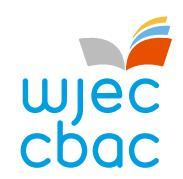
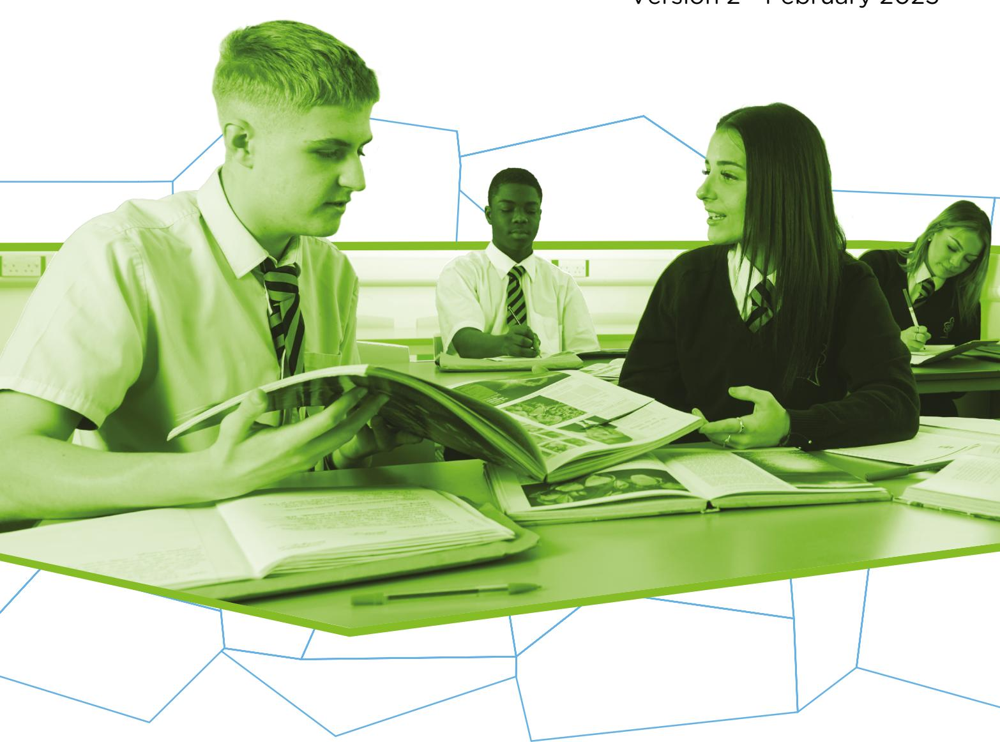

{0}------------------------------------------------

# WJEC GCSE History

Approved by Qualifications Wales

Guidance for Teaching: Unit 1 Option 1.5

Teaching from 2026

For award from 2028

Version 2 - February 2025

Ready for the world. This Qualifications Wales regulated qualification is not available to centres in England.

Made for Wales.

{1}------------------------------------------------

{2}------------------------------------------------

# Contents

| Introduction                                                                                  | 1     |
|-----------------------------------------------------------------------------------------------|-------|
| Aims of the Guidance for Teaching | 1 |
| Additional ways that WJEC can offer support:                                                  | 1     |
| Qualification Structure                                                                       | 2     |
| Assessment | 3 |
| Summary of Assessment - Unit 1 | 3 |
| Unit 1 Assessment objectives and weightings                                                   | 3     |
| Overview of Unit 1 Modern: Option 1.5 Rebellions and Protest in Wales, c.1831 – c.1892 | 4 |
| Scheme of Learning for Option 1.5 Modern: Rebellions and Protest in Wales, c.1831 – c.1892 | 5 |
| Learning Experiences | 29 |
| Opportunities for embedding elements of the Curriculum for Wales | 30 |
| Glossary for Option 1.5 Modern: Rebellions and Protest in Wales, c.1831 - 1892 | 37 |

{3}------------------------------------------------

# SUMMARY OF AMENDMENTS

| Version | Description                                               | Page number |
|---------|-----------------------------------------------------------|-------------|
| 2 | Amended to, awarded for the first time in Summer 2028. | 1 |

{4}------------------------------------------------

# Introduction

The WJEC GCSE History has been approved by Qualifications Wales and is available to all centres in Wales. It will be awarded for the first time in Summer 2028, using grades A\* to G.

#### Aims of the Guidance for Teaching

The principal aim of the Guidance for Teaching is to support teachers in the delivery of WJEC GCSE History and to offer guidance on the requirements of the qualification and the assessment process. The Guidance for Teaching is **not intended as a comprehensive reference**, but as support for teachers to develop stimulating and exciting courses tailored to the needs and skills of their learners. The guide offers possible classroom activities and links to useful resources (including our own, freely available digital materials and some from external sources) to provide ideas for immersive and engaging lessons.

#### Additional ways that WJEC can offer support:

- sample assessment materials and mark schemes
- professional learning events
- examiners' reports on each unit
- direct access to the subject officer
- free online resources
- Exam Results Analysis
- Online Examination Review.

{5}------------------------------------------------

# Qualification Structure

WJEC GCSE History consists of four units. The combination of options selected for Units 1, 2 and 3 must include one medieval, one early modern and one modern unit.

In Unit 4, centres can choose to repeat a time period previously studied in Units 1, 2 or 3. **However, the topics chosen for study in Unit 4 must not replicate or overlap with the content of any of the other selected units.**

The qualification is unitised and does not contain tiering. There is no hierarchy to the order the units should be taught.

|        | Unit title                                            | Type of Assessment            | Weighting |
|--------|-------------------------------------------------------|-------------------------------|-----------|
| Unit 1 | An in-depth study on Welsh history                    | Written examination           | 30%       |
| Unit 2 | An in-depth study on European and/or World history | Non-examination assessment | 20% |
| Unit 3 | A study of a period in World history                  | Written examination           | 30%       |
| Unit 4 | A changing society | Non-examination assessment | 20% |

{6}------------------------------------------------

# Assessment

#### Summary of Assessment - Unit 1

#### **Unit 1: An in-depth study on Welsh history** *Written examination:* **1 hour 30% of qualification**

**60 marks** 

Learners will study one of the following six historical topics to undertake an in-depth study that will provide them with an insight into the development of Wales at a specific point in time.

#### **Medieval**

- **1.1** Rhys ap Gruffudd, Prince of Deheubarth c. 1132–c.1197
- **1.2** Owain Glyndwr c. 1354–c.1416

# **Early Modern**

- **1.3** Wales and the early Tudors c.1485–c.1547
- **1.4** Wales in the era of the Civil War 1603–c.1660

#### **Modern**

- **1.5** Rebellions and Protest in Wales, c.1831–c.1892
- **1.6** Wales in the early to mid-twentieth century, c.1914–c.1959

Each option will be assessed by compulsory questions. These will focus on historical knowledge of the topic, second order historical concepts and the analysis and evaluation of historical sources and interpretations.

# Unit 1 Assessment objectives and weightings

| AO1 | Demonstrate knowledge and understanding of the features and characteristics of the period studied | 10% |
|-----|------------------------------------------------------------------------------------------------------------------------------------------------------------------|-----|
| AO2 | Apply knowledge and understanding to historical concepts such as cause and consequence, continuity and change, similarity and difference, and significance | 10% |
| AO3 | Analyse, evaluate, or make judgements on source material, historical interpretations and historical debates, synthesising these strands where appropriate | 10% |

{7}------------------------------------------------

# Overview of Unit 1 Modern: Option 1.5 Rebellions and Protest in Wales, c.1831 – c.1892

# **An in-depth study on Welsh history**

(30% of the qualification)

The purpose of Unit 1 is to provide an insight into the development of Wales at a specific point in time. The aim of this option is to develop learner understanding of the nature of protest in Wales across the period from c.1831 – c.1892.

| Time period | Option |  |  |  |
|----------------|--------|--------------------------------------------------|--|--|
| Modern         | 1.5    | Rebellions and Protest in Wales, c.1831–c.1892   |  |  |
|                | 1.5.1  | The Merthyr Rising, 1831                         |  |  |
|                | 1.5.2  | The Rebecca Riots, 1839–1843                     |  |  |
|                | 1.5.3  | Chartism in Wales                                |  |  |
|                | 1.5.4  | The Blue Books of 1847 and their impact in Wales |  |  |
|                | 1.5.5  | The Tithe War in Northeast Wales, 1886–1892      |  |  |

{8}------------------------------------------------

# Scheme of Learning for Option 1.5 Modern: Rebellions and Protest in Wales, c.1831 – c.1892

This scheme of learning is provided as an illustrative example. It is designed to offer structure and inspiration but allows for adaptation to meet the unique needs, preferences, and dynamics of individual classes. Teachers are encouraged to modify elements as needed to align with their students' abilities and learning goals.

**For each section of content in this unit, WJEC is also providing blended learning resources and knowledge organisers. These can be found on: <https://resources.wjec.co.uk/>**

#### **1.5 Background: change and discontent in the early nineteenth century**

(Each option begins with a background section. These sections are intended to provide learners with necessary context in order to access the historical topic. **Learners will not be directly assessed on the content of the background sections**).

| Learners should be aware of: | Knowledge | Activities and Outcomes | Resources | Suggested timing (hours) |
|--------------------------------------------------------------------------------------------------------------------------------------------------------------------------------------------|----------------------------------------------------------------------------------------------------------------------------------------------------------|------------------------------------------------------------------------------------------------------------------------------------------------------------------------------------------------------------------------------------------------------------------------------------------------------------------------------------------------------------------------------------------------------------------------------------------------------------------------------------------------------------------------------------------------------|-------------------------------------------------------------------------------------------------------------------------------------------------------------------------------------------------------------------------------------------------------------|-----------------------------|
| <ul><li>the economy and society of Wales at the start of the nineteenth century, demographic change and similarities and differences between rural and industrial areas.</li></ul> | The impact of the Industrial Revolution on settlement in Wales. The impact of the Industrial Revolution on the economy of Wales. | Activities: Look at the settlement map of Wales (Statistical focus Fig. 2.1) and find where you live/learn. Is it urban or rural? What do you notice about the nature of settlement in Wales? Look at the map of Wales and England (Fig. 2.2). What are the similarities and differences between Wales and England? Explain the origins and development of the Industrial Revolution and how it affected Wales. Draw a chart outlining the growth in the population of Wales in the C19th (see census). | Website(s): Industrial Revolution in Wales Merthyr Tydfil Understanding Urban Character_1.pdf 200 years of the census in Wales Industrial Wales Cadw Map(s): Statistical-focus Wales 2008.pdf Outline map of Wales | 1.5 hours |

{9}------------------------------------------------

|  |  | Compare and contrast features of agricultural areas and features of industrial areas. On an outline map of Wales, indicate the location of main industrial areas, noting their economic impact on Wales. Outcome: Learners can demonstrate their understanding of the impact of the Industrial Revolution on the settlement and economy of Wales. Advanced activity: Discuss: Using the resources and the maps, explain how the geographical make-up of Wales changed in the early nineteenth century. | Book(s): Murphy, D. et al. 2003. Britain 1783– 1918, Chapter 1.1–1. 4 Scott-Baumann, M., 2006. Reforming Britain 1815–50, Chapter 1 Wilkes, A., 2014. KS3 Britain 1745– 1901: Industry, Invention and Empire, Chapter 1 |  |
|---------------------------------------------------------------------------------------------------------------------------------------------------------|----------------------------------------------------------------------------------------------------------------------------------------------------------|--------------------------------------------------------------------------------------------------------------------------------------------------------------------------------------------------------------------------------------------------------------------------------------------------------------------------------------------------------------------------------------------------------------------------------------------------------------------------------------------------------------------------------------------------------|----------------------------------------------------------------------------------------------------------------------------------------------------------------------------------------------------------------------------------------------------------------------------|--------------|
|  |  | Advanced Outcome: Learners can synthesise the factors that contributed to demographic change in Wales c.1800 to c.1850. |  |  |
| <ul><li>the reasons for radicalism and discontent in Wales, strikes, protests and wider demands for political reform in the United Kingdom.</li></ul> | An understanding of working conditions in the early C19th. An understanding of the need for political reform in the early C19th. | Activities: Complete the National Archive activity, All Work and No Play, and discuss what you think working life was like at the start of the nineteenth century. In groups, complete one of the three tasks What from the National Archive activity - caused the 1832 Great Reform Act? Summarise your findings and explain them to the rest of the class. | Website(s): All Work and No Play - The National Archives What caused the 1832 Great Reform Act? - The National Archives BBC - The Blackening of Wales | 1.5 hours |

{10}------------------------------------------------

Using your knowledge of working life and the reasons for the demand for political reform, review the Blackening of Wales Document and provide a list of reasons, including examples from Wales, why there was increasing discontent in Wales at the start of the nineteenth century.

#### **Outcome:**

Learners can demonstrate their understanding of the reasons for discontent in the United Kingdom with specific references to Wales.

#### **Advanced activity:**

To what extent was political reform more important than reforms in the working environment in Wales in the early nineteenth century?

#### **Advanced outcome:**

Learners can engage in a debate on the relative importance of social and political reform.

#### **Book(s):**

Murphy, D. et al. 2003. *Britain 1783– 1918,* Chapter 1.1–1. 4

Scott-Baumann, M., 2006. *Reforming Britain 1815–50,* Chapter 1

Martin, D. 2000. *Britain 1815–1851,* Chapter 1

{11}------------------------------------------------

| 1.5.1 The Merthyr Rising, 1831                                                                                                                                                                                                    |                                                                                                                                                                                                                                                                                                                                                            |                                                                                                                                                                                                                                                                                                                                                                                                                                                                                                                                                                                                                                                                                                                                                                                                                                                                                                                                                                                                                    |                                                                                                                                                                                                                                                                                                                                                                                                                                                                                                                 |                             |
|-----------------------------------------------------------------------------------------------------------------------------------------------------------------------------------------------------------------------------------|------------------------------------------------------------------------------------------------------------------------------------------------------------------------------------------------------------------------------------------------------------------------------------------------------------------------------------------------------------|--------------------------------------------------------------------------------------------------------------------------------------------------------------------------------------------------------------------------------------------------------------------------------------------------------------------------------------------------------------------------------------------------------------------------------------------------------------------------------------------------------------------------------------------------------------------------------------------------------------------------------------------------------------------------------------------------------------------------------------------------------------------------------------------------------------------------------------------------------------------------------------------------------------------------------------------------------------------------------------------------------------------|-----------------------------------------------------------------------------------------------------------------------------------------------------------------------------------------------------------------------------------------------------------------------------------------------------------------------------------------------------------------------------------------------------------------------------------------------------------------------------------------------------------------|-----------------------------|
| Learners should understand: | Knowledge | Activities and Outcomes | Resources | Suggested timing (hours) |
| <ul><li>the causes of the rising, including:</li><li>the attitudes and actions of ironmasters including the Crawshays of Cyfartha</li><li>the living and working conditions of the people of Merthyr Tydfil.</li></ul> | Background to Merthyr's development as a centre for iron. The leading ironmasters in Merthyr and their attitudes and actions. The reasons for the poor living and working conditions in Merthyr. The impact of those poor living and working conditions, including in the area known as China. | Activities: Research – Based on the Wales Online article, what were the four ironworks in Merthyr, and which two were the most significant. How significant were they? In groups, review the Crawshay family materials and make a note on each member stating two important facts about each. Discuss: <ul><li>how workers felt about William Crawshay II and Josiah Guest</li><li>the attitudes towards the workers of these two men (use relevant material from the Merthyr's Ironmasters: William Crawshay II and The Merthyr Rising 1831 articles). Class diagram: explain the causes of the Merthyr Rising (e.g., long- and short-term causes, the role of individuals etc.) Identify five features of the living and working conditions of the people of Merthyr Tydfil c.1830. Rank them from worst (1) to least bad (5). Explain your choices. Use BBC Bitesize, the BBC News article and The Melting Pot: 'China'.</li></ul> | Website(s): Merthyr Tydfil was a town with a single purpose to make iron and steel - Wales Online Crawshay family, of Cyfarthfa, Glamorganshire, industrialists Dictionary of Welsh Biography Merthyr's Ironmasters: William Crawshay II The Merthyr Rising 1831: rage, rebellion and the red flag BBC Bitesize - The pressures of industrialisation and urbanisation The Story of Wales: Life in Merthyr Tydfil's 19th Century | 2 hours |

{12}------------------------------------------------

Discussion: look at pages1–8 of the *CADW – Merthyr Rising Comic*. How useful to historians are depictions such as these?

#### **Outcome:**

Learners can demonstrate their understanding of the causes of the Merthyr Riots.

#### **Advanced activity:**

Watch/listen to the first section of *19th Century Welsh insurrection* (up to 18:45) and make notes. Explain why events in Merthyr were the outcome of a "perfect storm" of conditions in Wales during this period.

**Advanced outcome:** Learners can synthesise the various problems and actions that led to the outbreak of the Merthyr Rising.

['Little Hell' -](https://www.bbc.co.uk/news/uk-wales-17291650) BBC [News](https://www.bbc.co.uk/news/uk-wales-17291650)

[The Melting Pot:](https://www.merthyr-history.com/?p=3524)  ['China'](https://www.merthyr-history.com/?p=3524)

[CADW -](https://cadw.gov.wales/sites/default/files/2022-04/Merthyr%20Rising%20-%20English.pdf) Merthyr [Rising Comic](https://cadw.gov.wales/sites/default/files/2022-04/Merthyr%20Rising%20-%20English.pdf)

# **Video(s):**

[It's kicking off in](https://www.youtube.com/watch?v=eLhFKw_t83Y)  [South Wales! The](https://www.youtube.com/watch?v=eLhFKw_t83Y)  [Merthyr Rising of](https://www.youtube.com/watch?v=eLhFKw_t83Y)  [1831](https://www.youtube.com/watch?v=eLhFKw_t83Y) (first 3 minutes)

[19th Century Welsh](https://www.youtube.com/watch?v=fZRrPJ3eDKE)  [insurrection | The](https://www.youtube.com/watch?v=fZRrPJ3eDKE)  [Merthyr Rising | The](https://www.youtube.com/watch?v=fZRrPJ3eDKE)  [Rebecca Riots | The](https://www.youtube.com/watch?v=fZRrPJ3eDKE)  [Chartists Revolt](https://www.youtube.com/watch?v=fZRrPJ3eDKE)

# **Book(s):**

England, J. 2020. *Merthyr: The Crucible of Modern Wales,* Chapter 5

{13}------------------------------------------------

2 hours

- the events of the rising, including:
  - radicalism and the forming of a political union
  - protests at the Court of Requests, Castle Inn and Penydarren House.

The course of the rising.

The demands of the rebels.

The nature and impact of protests at the Court of Requests, the Castle Inn and at Penydarren House.

#### **Activity:**

Watch *Wales and the History of the World - Merthyr Rising* and discuss why the Merthyr Rising is seen as being such an important event in the history of the working class.

Research and devise a timeline of the events of the Merthyr Rising, include at least the following:

- the development of radicalism in the early nineteenth century
- the forming of political unions among workers
- the role of William Crawshay
- the sacking of 'puddlers'
- the role of Lewis Lewis
- raising of the red flag
- events at the Court of Requests (debtors' court)
- events at the Castle Inn
- events at Penydarren House

Learners can use the *Merthyr Rising - Wikipedia* article, pages 9–15 of the *CADW comic*, the *Marxist.com* article and the *It's kicking off in South Wales!* video. Given the complexity of *Marxist.com* article, this could be split into sections and given to different groups.

Examine the demands of the protestors: what were they and what did they hope to achieve?

#### **Article(s):**

[The Merthyr Rising](https://marxist.com/the-merthyr-rising-1831-rage-rebellion-and-the-red-flag.htm)  [1831: rage, rebellion](https://marxist.com/the-merthyr-rising-1831-rage-rebellion-and-the-red-flag.htm)  [and the red flag](https://marxist.com/the-merthyr-rising-1831-rage-rebellion-and-the-red-flag.htm) - [Marxist.com](https://marxist.com/the-merthyr-rising-1831-rage-rebellion-and-the-red-flag.htm)

[Merthyr Rising -](https://en.wikipedia.org/wiki/Merthyr_Rising) [Wikipedia](https://en.wikipedia.org/wiki/Merthyr_Rising)

[CADW -](https://cadw.gov.wales/sites/default/files/2022-04/Merthyr%20Rising%20-%20English.pdf) Merthyr [Rising Comic](https://cadw.gov.wales/sites/default/files/2022-04/Merthyr%20Rising%20-%20English.pdf)

#### **Video(s):**

[Wales and the](https://www.bbc.co.uk/programmes/p08m1jq9)  [History of the World -](https://www.bbc.co.uk/programmes/p08m1jq9) [Merthyr Rising](https://www.bbc.co.uk/programmes/p08m1jq9)

[It's kicking off in](https://www.youtube.com/watch?v=eLhFKw_t83Y)  [South Wales! The](https://www.youtube.com/watch?v=eLhFKw_t83Y)  [Merthyr Rising of](https://www.youtube.com/watch?v=eLhFKw_t83Y)  [1831](https://www.youtube.com/watch?v=eLhFKw_t83Y) (from 3 minutes)

#### **Book(s):**

England, J. 2020. *Merthyr: The Crucible of Modern Wales* Chapter 5

{14}------------------------------------------------

| Outcome: Learners can demonstrate an understanding of the timeline of events of the riots. |  |
|-------------------------------------------------------------------------------------------------------------|--|
| Advanced activity: Identify the turning points in the rising, explaining why they are significant. |  |
| Advanced outcome: Learners can gauge the significance of key parts of the Merthyr Rising. |  |

{15}------------------------------------------------

1 hour

| • | the consequences of the |  |  |
|---|-------------------------|--|--|
|   | rising including:       |  |  |

- the actions of the authorities and ironmasters in Merthyr
- the treatment of rioters including Dic Penderyn.

The long- and short-term results of the Merthyr Rising.

The authorities' response to the rioters, with emphasis on Dic Penderyn (Richard Lewis).

#### **Activities:**

Review your timelines, look at the *Results of the Merthyr Rising* (WJEC Knowledge Organiser), and consider the consequences of the Merthyr Rising. Discuss: how great a threat to the authorities had the Merthyr Rising been?

Examine the evidence against Richard Lewis (Dic Penderyn). Why was he executed for the attack on Private Donald Black? Does the treatment of the protestors change or confirm your opinion on the significance of the Merthyr Rising?

#### **Outcome:**

Learners can demonstrate an understanding of the consequences of the Merthyr Rising.

#### **Advanced activity:**

Continuous text response on a question related to the impact of the Merthyr Rising.

# **Advanced outcome:**

Learners can practice their writing skills, analysing and evaluating the significance of the Merthyr Rising.

#### **Website(s):**

[WJEC Knowledge](https://resource.download.wjec.co.uk/vtc/2020-21/ko20-21_1-17/wjec/ko7.pdf)  [Organiser](https://resource.download.wjec.co.uk/vtc/2020-21/ko20-21_1-17/wjec/ko7.pdf)

[BBC Wales –](https://www.bbc.co.uk/blogs/waleshistory/2011/06/dic_penderyn_the_welsh_martyr.html) Dic [Penderyn](https://www.bbc.co.uk/blogs/waleshistory/2011/06/dic_penderyn_the_welsh_martyr.html)

[CADW -](https://cadw.gov.wales/sites/default/files/2022-04/Merthyr%20Rising%20-%20English.pdf) Merthyr [Rising Comic](https://cadw.gov.wales/sites/default/files/2022-04/Merthyr%20Rising%20-%20English.pdf)

#### **Book(s):**

England, J. 2020. *Merthyr: The Crucible of Modern Wales,* Chapter 6

{16}------------------------------------------------

| 1.5.2 The Rebecca Riots, 1839-1843                                                                                                                                                                        |                                                                                                                                                                                                                                                                                                      |                                                                                                                                                                                                                                                                                                                                                                                                                                                                                                                                                                                                                                                                                                                                                                                                                                                                                   |                                                                                                                                                                                                                                                                                                                                                                                                             |                             |
|-----------------------------------------------------------------------------------------------------------------------------------------------------------------------------------------------------------|------------------------------------------------------------------------------------------------------------------------------------------------------------------------------------------------------------------------------------------------------------------------------------------------------|-----------------------------------------------------------------------------------------------------------------------------------------------------------------------------------------------------------------------------------------------------------------------------------------------------------------------------------------------------------------------------------------------------------------------------------------------------------------------------------------------------------------------------------------------------------------------------------------------------------------------------------------------------------------------------------------------------------------------------------------------------------------------------------------------------------------------------------------------------------------------------------|-------------------------------------------------------------------------------------------------------------------------------------------------------------------------------------------------------------------------------------------------------------------------------------------------------------------------------------------------------------------------------------------------------------|-----------------------------|
| Learners should understand: | Knowledge | Activities and Outcomes | Resources | Suggested timing (hours) |
| <ul><li>the reasons for the Rebecca Riots, including:</li><li>the nature of land ownership in west and mid Wales</li><li>problems for rural communities including tithes and tollgates.</li></ul> | Understand the plight of the tenant farmers in Wales during the Rebecca Riots and the impact this had on their everyday lives. Understand the impact that the payment of tithes to the church and the tollgates had on the lives of the tenant farmers. | Activities: Review the first five paragraphs of the BBC – Rebecca Riots article and create a flow chart that explains: <ul><li>the places where the riots took place</li><li>the underlying tensions in rural communities</li><li>what group in society owned the most farmland</li><li>the process of enclosure</li><li>the payment of tithes</li><li>the impact of the New Poor Law</li><li>the establishment of turnpike trusts. Using the background section of the National Archives. In groups, from the perspective of a tenant farmer, write a letter to one of the following explaining your grievances:</li><li>the landlord</li><li>the local Anglican minister</li><li>the local Member of Parliament. Outcome: Learners can demonstrate an understanding of the social, economic and religious background to the riots.</li></ul> | Website(s): The Rebecca Riots - BBC History The National Archives - Rebecca Riots - What happened during them? Terfysg Beca (Cymraeg/Welsh) - The National Archives Video(s): 19th Century Welsh insurrection   The Merthyr Rising   The Rebecca Riots   The Chartists Revolt Book(s): Williams, D. 1986. The Rebecca Riots, Chapter 3 | 2 hours |

{17}------------------------------------------------

| Advanced activity: Watch/listen to the first section of 19th Century Welsh Insurrection (18:45 to 28:40) and make notes. What do you think was the primary cause of the Rebecca Riots? |  |
|----------------------------------------------------------------------------------------------------------------------------------------------------------------------------------------------------------|--|
| Advanced outcome: Learners can evaluate the various social, economic and religious concerns that contributed to the Rebecca Riots. |  |

{18}------------------------------------------------

2 hours

- the events of the Rebecca Riots, including:
  - the attack on the gates at Efailwen in 1839
  - the Carmarthen Workhouse breakout, 1843.

Understand the events of the attacks on Efailwen and the reasons that the attackers chose to dress up in women's clothes.

Understand the events of the Carmarthen Workhouse breakout and the reasons that the attackers targeted the workhouse.

#### **Activities:**

As a class, using the *BBC, Historic UK* and *Carmarthen workhouse* resources, summarise the main events of the Rebecca Riots.

In groups complete the source activities from the *National Archive's (NA's) Rebecca resource* (a simplified version is available on the Historical Association link if needed). See also the map in the National Archive's PDF version (English only).

Debate: "Efailwen was first, but Carmarthen was worse". What do you think was the key moment in the Rebecca riots – the attack on the gates at Efailwen or the Carmarthen Workhouse breakout?

#### **Outcome:**

Learners can demonstrate an understanding of the events of the Rebecca Riots and apply their skills of analysis and evaluation of contemporary sources to enhance their understanding.

# **Advanced activity:**

Research the origins of the workhouses and explain why they were so hated at this time.

#### **Advanced outcome:**

Learners can understand the socio-economic difficulties of the period and the government's response to these.

#### **Website(s):**

[BBC Wales History -](https://www.bbc.co.uk/wales/history/sites/themes/society/politics_rebecca_riots.shtml) [The Rebecca Riots](https://www.bbc.co.uk/wales/history/sites/themes/society/politics_rebecca_riots.shtml)

[Historic UK -](https://www.historic-uk.com/HistoryUK/HistoryofWales/The-Rebecca-Riots/) The [Rebecca Riots](https://www.historic-uk.com/HistoryUK/HistoryofWales/The-Rebecca-Riots/)

[Rebecca Riots: What](https://cdn.nationalarchives.gov.uk/documents/education/rebecca.pdf#:~:text=The%20Rebecca%20riots%20took%20place%20in%20the%20rural,of%20tolls%20%28fees%29%20charged%20to%20use%20the%20roads.)  [happened during](https://cdn.nationalarchives.gov.uk/documents/education/rebecca.pdf#:~:text=The%20Rebecca%20riots%20took%20place%20in%20the%20rural,of%20tolls%20%28fees%29%20charged%20to%20use%20the%20roads.)  them? - [The National](https://cdn.nationalarchives.gov.uk/documents/education/rebecca.pdf#:~:text=The%20Rebecca%20riots%20took%20place%20in%20the%20rural,of%20tolls%20%28fees%29%20charged%20to%20use%20the%20roads.)  [Archives](https://cdn.nationalarchives.gov.uk/documents/education/rebecca.pdf#:~:text=The%20Rebecca%20riots%20took%20place%20in%20the%20rural,of%20tolls%20%28fees%29%20charged%20to%20use%20the%20roads.)

[Using different](https://www.bing.com/ck/a?!&&p=3dbee3f173651cf9cb96f5aaa6830bd4b45fad4fe0c71cfd9a68534b9200855cJmltdHM9MTczMjQ5MjgwMA&ptn=3&ver=2&hsh=4&fclid=11742389-c1a4-6e67-101f-37c0c0fc6fe9&psq=the+events+of+the+rebecca+riots&u=a1aHR0cHM6Ly93d3cuaGlzdG9yeS5vcmcudWsvZmlsZXMvZG93bmxvYWQvMjI2MDcvMTU4ODY5MDA2OS9QSDg1VGhlUmViZWNjYVJpb3RzQ2xhaXJlSG9ycmllLnBkZg&ntb=1)  [sources to bring a](https://www.bing.com/ck/a?!&&p=3dbee3f173651cf9cb96f5aaa6830bd4b45fad4fe0c71cfd9a68534b9200855cJmltdHM9MTczMjQ5MjgwMA&ptn=3&ver=2&hsh=4&fclid=11742389-c1a4-6e67-101f-37c0c0fc6fe9&psq=the+events+of+the+rebecca+riots&u=a1aHR0cHM6Ly93d3cuaGlzdG9yeS5vcmcudWsvZmlsZXMvZG93bmxvYWQvMjI2MDcvMTU4ODY5MDA2OS9QSDg1VGhlUmViZWNjYVJpb3RzQ2xhaXJlSG9ycmllLnBkZg&ntb=1)  [topic to life: The](https://www.bing.com/ck/a?!&&p=3dbee3f173651cf9cb96f5aaa6830bd4b45fad4fe0c71cfd9a68534b9200855cJmltdHM9MTczMjQ5MjgwMA&ptn=3&ver=2&hsh=4&fclid=11742389-c1a4-6e67-101f-37c0c0fc6fe9&psq=the+events+of+the+rebecca+riots&u=a1aHR0cHM6Ly93d3cuaGlzdG9yeS5vcmcudWsvZmlsZXMvZG93bmxvYWQvMjI2MDcvMTU4ODY5MDA2OS9QSDg1VGhlUmViZWNjYVJpb3RzQ2xhaXJlSG9ycmllLnBkZg&ntb=1)  [Rebecca Riots](https://www.bing.com/ck/a?!&&p=3dbee3f173651cf9cb96f5aaa6830bd4b45fad4fe0c71cfd9a68534b9200855cJmltdHM9MTczMjQ5MjgwMA&ptn=3&ver=2&hsh=4&fclid=11742389-c1a4-6e67-101f-37c0c0fc6fe9&psq=the+events+of+the+rebecca+riots&u=a1aHR0cHM6Ly93d3cuaGlzdG9yeS5vcmcudWsvZmlsZXMvZG93bmxvYWQvMjI2MDcvMTU4ODY5MDA2OS9QSDg1VGhlUmViZWNjYVJpb3RzQ2xhaXJlSG9ycmllLnBkZg&ntb=1)  [Historical Association](https://www.bing.com/ck/a?!&&p=3dbee3f173651cf9cb96f5aaa6830bd4b45fad4fe0c71cfd9a68534b9200855cJmltdHM9MTczMjQ5MjgwMA&ptn=3&ver=2&hsh=4&fclid=11742389-c1a4-6e67-101f-37c0c0fc6fe9&psq=the+events+of+the+rebecca+riots&u=a1aHR0cHM6Ly93d3cuaGlzdG9yeS5vcmcudWsvZmlsZXMvZG93bmxvYWQvMjI2MDcvMTU4ODY5MDA2OS9QSDg1VGhlUmViZWNjYVJpb3RzQ2xhaXJlSG9ycmllLnBkZg&ntb=1)

[The Workhouse in](https://www.workhouses.org.uk/Carmarthen/)  [Carmarthen,](https://www.workhouses.org.uk/Carmarthen/)  [Carmarthenshire](https://www.workhouses.org.uk/Carmarthen/)

#### **Book(s):**

Williams, D. 1986. *The Rebecca Riots,* Chapters 7 and 8

{19}------------------------------------------------

1 hour

- the consequences of the Rebecca Riots, including:
  - how the authorities responded to the riots
  - the Commission of Enquiry and its effects.

The treatment of some of the rioters including transportation and the death penalty.

How Rebecca was perceived by the British press.

The reasons for and outcomes of the Commission of Enquiry.

#### **Activities:**

Use the *Llandeilo History* and *Bangor University History* resources and create a spider diagram that outlines the different ways in which the authorities and the press responded to the riots.

Bullet point reasons why the commission of enquiry was established, and what its chief findings were.

Discussion: How significant was Thomas Campbell Foster of *The Times* to the wider public understanding of the rioters and their motives.

#### **Advanced activity:**

Continuous text practice: explain what was more significant – the Merthyr Rising or the Rebecca Riots.

#### **Advanced outcome:**

Learners can gauge the significance of rural/agricultural disturbance against urban/industrial disturbance in the context of early nineteenth century Wales.

#### **Website(s):**

[Llandeilo History -](https://www.llandeilo.org/dp_rebecca.php) [The Dynevor](https://www.llandeilo.org/dp_rebecca.php)  [Peerage -](https://www.llandeilo.org/dp_rebecca.php) The [Rebecca Riots](https://www.llandeilo.org/dp_rebecca.php)

[Bangor University](https://www.bangor.ac.uk/news/2023-12-01-why-men-in-19th-century-wales-dressed-as-women-to-protest-taxation)  [History](https://www.bangor.ac.uk/news/2023-12-01-why-men-in-19th-century-wales-dressed-as-women-to-protest-taxation)

#### **Archive(s):**

[National Library of](https://newspapers.library.wales/search?rows=10&page=1&sort=score&order=desc&alt=&query=rebecca%20riots&range%5bmin%5d=1804-01-01T00:00:00Z&range%5bmax%5d=1919-12-31T00:00:00Z)  Wales - [Rebecca](https://newspapers.library.wales/search?rows=10&page=1&sort=score&order=desc&alt=&query=rebecca%20riots&range%5bmin%5d=1804-01-01T00:00:00Z&range%5bmax%5d=1919-12-31T00:00:00Z)  [Riots Search Results](https://newspapers.library.wales/search?rows=10&page=1&sort=score&order=desc&alt=&query=rebecca%20riots&range%5bmin%5d=1804-01-01T00:00:00Z&range%5bmax%5d=1919-12-31T00:00:00Z)

#### **Book(s):**

Williams, D. 1986. *The Rebecca Riots,* Chapters 9 and 10

{20}------------------------------------------------

| 1.5.3 Chartism in Wales                                                                                                                                                                                                        |                                                                                                                                                                                                                                |                                                                                                                                                                                                                                                                                                                                                                                                                                                                                                                                                                                                                                                                                                                                                                                                                                                                                                                                                                                             |                                                                                                                                                                                                                                                                                                                                                                                                                                                                                                                |                             |
|--------------------------------------------------------------------------------------------------------------------------------------------------------------------------------------------------------------------------------|--------------------------------------------------------------------------------------------------------------------------------------------------------------------------------------------------------------------------------|---------------------------------------------------------------------------------------------------------------------------------------------------------------------------------------------------------------------------------------------------------------------------------------------------------------------------------------------------------------------------------------------------------------------------------------------------------------------------------------------------------------------------------------------------------------------------------------------------------------------------------------------------------------------------------------------------------------------------------------------------------------------------------------------------------------------------------------------------------------------------------------------------------------------------------------------------------------------------------------------|----------------------------------------------------------------------------------------------------------------------------------------------------------------------------------------------------------------------------------------------------------------------------------------------------------------------------------------------------------------------------------------------------------------------------------------------------------------------------------------------------------------|-----------------------------|
| Learners should understand: | Knowledge | Activities and Outcomes | Resources | Suggested timing (hours) |
| <ul><li>why there was demand for reform in Wales in the 1830s, including:</li><li>levels of unemployment and the impact of the 1834 Poor Law</li><li>radicalism and the outcomes of the Great Reform Act, 1832.</li></ul> | Living and working conditions in the early nineteenth century. The reasons for and outcomes of the Great Reform Act, 1832. The introduction of the Poor Law in 1834 and its immediate impact. | Activities: Watch the BBC Bitesize video Why was reform needed? and then read the sections on Peterloo, 1819 and the 1832 Reform Act. Make notes in preparation to discuss: why was there fear of revolution in Britain up to c.1832? In two groups, learners will complete either The National Archive's 1832 Great Reform Act or 1834 Poor Law resource. They will summarise the reasons for and impact of the respective Act and present their findings to the other group. Use resources to consider life in the workhouses and the impact of the 1834 Poor Law on people in Wales. Watch the video resources and compare the promises of the 1832 Great Reform Act with its outcomes in Wales. Write a paragraph discussing why radical groups may have felt disillusioned. Outcome: Learners can demonstrate an understanding of the failures of attempts to reform up to this point. | Website(s): Why was reform needed? - Pressure for democratic reform up to 1884 - National 5 History Revision - BBC Bitesize What caused the 1832 Great Reform Act? - The National Archives 1834 Poor Law - The National Archives Welfare cuts and crime in 19th-century England and Wales Workhouses in Wales The Workhouse in Carmarthen, Carmarthenshire Book(s): Royle, E and Lockyer, R. 1997. Chartism, Chapters 1 | 2 hours |

{21}------------------------------------------------

{22}------------------------------------------------

{23}------------------------------------------------

2 hours

- the impact of Chartism, including:
  - the Newport Rising, 1839
  - the short-term failures and long-term successes of Chartism.

The events of the march on Newport in 1839 including the long march to Newport and the reaction of the authorities.

The treatment of the Newport Chartists in the months after the march, including John Frost and Zephaniah Williams.

The short-term failures and longterm successes of the Chartist movement.

#### **Activities:**

Use the *BBC Bitesize* resources and the *What was the Newport Rising?* video and develop a flowchart that explains the reasons for and process of the Newport Rising.

Discuss: Why was Newport a particular focus for the Chartist movement?

Watch the *Why did the Second Chartist petition of 1842 fail?* video and make notes. Then watch the *What was the significance of Chartism?* video and supplement those notes. In groups prepare arguments for and against the significance of Chartism. Considering the short-term failure and long-term achievement of most of the People's Charter's aims, to what extent was the Chartist movement a success?

#### **Outcome:**

Learners can demonstrate an understanding of the impact of Chartism on the people of Wales.

#### **Advanced activity:**

Watch/listen to the final section of *19th Century Welsh insurrection* (from 28:43) and make notes. Was the Chartist movement the catalyst for effective electoral reform in the UK?

# **Advanced outcome:**

Learners can debate the long-term impact of Chartism on the voting system today.

#### **Website(s):**

[BBC Bitesize -](https://www.bbc.co.uk/bitesize/guides/z6c6cqt/revision/5) [Working-class](https://www.bbc.co.uk/bitesize/guides/z6c6cqt/revision/5)  [support for Chartism](https://www.bbc.co.uk/bitesize/guides/z6c6cqt/revision/5)

[BBC Bitesize -](https://www.bbc.co.uk/bitesize/guides/z6c6cqt/revision/6) Why [did Chartism fail?](https://www.bbc.co.uk/bitesize/guides/z6c6cqt/revision/6)

[The Newport Rising |](https://archives.blog.parliament.uk/2019/08/05/the-newport-rising/)  [Parliamentary](https://archives.blog.parliament.uk/2019/08/05/the-newport-rising/)  [Archives: Inside the](https://archives.blog.parliament.uk/2019/08/05/the-newport-rising/)  [Act Room](https://archives.blog.parliament.uk/2019/08/05/the-newport-rising/)

#### **Video(s)**

[What was the](https://www.youtube.com/watch?v=OU00m0kSQeU)  [Newport Rising? | A](https://www.youtube.com/watch?v=OU00m0kSQeU)  [brief history of the](https://www.youtube.com/watch?v=OU00m0kSQeU)  [Newport Rising 1839](https://www.youtube.com/watch?v=OU00m0kSQeU)

[Why did the Second](https://www.youtube.com/watch?v=V2-PC7u0dyU)  [Chartist petition of](https://www.youtube.com/watch?v=V2-PC7u0dyU)  [1842 fail? | Why did](https://www.youtube.com/watch?v=V2-PC7u0dyU)  [Chartism fail?](https://www.youtube.com/watch?v=V2-PC7u0dyU)

[What was the](https://www.youtube.com/watch?v=z6BO4niwZxY)  [significance of](https://www.youtube.com/watch?v=z6BO4niwZxY)  [Chartism? | 5 Minute](https://www.youtube.com/watch?v=z6BO4niwZxY)  [History](https://www.youtube.com/watch?v=z6BO4niwZxY)

[19th Century Welsh](https://www.youtube.com/watch?v=fZRrPJ3eDKE)  [insurrection | The](https://www.youtube.com/watch?v=fZRrPJ3eDKE)  [Merthyr Rising | The](https://www.youtube.com/watch?v=fZRrPJ3eDKE)  [Rebecca Riots | The](https://www.youtube.com/watch?v=fZRrPJ3eDKE)  [Chartists Revolt](https://www.youtube.com/watch?v=fZRrPJ3eDKE)

{24}------------------------------------------------

|  | Book(s): Jenkins, G. 2007. A Concise History of Wales, pp.202–4 |
|--|--------------------------------------------------------------------------------|
|  | Royle, E and Lockyer, R. 1997. Chartism, Chapters 4 and 5 |

{25}------------------------------------------------

| 1.5.4 The Blue Books of 1847 and their impact in Wales                                                                                                                                                                                      |                                                                                                                                                                                                                                                      |                                                                                                                                                                                                                                                                                                                                                                                                                                                                                                                                                                                                                                                                                                                                                                                                                                                                                                                                                                                    |                                                                                                                                                                                                                                                                                                                                                                                                                                                                                                              |                             |  |
|---------------------------------------------------------------------------------------------------------------------------------------------------------------------------------------------------------------------------------------------|------------------------------------------------------------------------------------------------------------------------------------------------------------------------------------------------------------------------------------------------------|------------------------------------------------------------------------------------------------------------------------------------------------------------------------------------------------------------------------------------------------------------------------------------------------------------------------------------------------------------------------------------------------------------------------------------------------------------------------------------------------------------------------------------------------------------------------------------------------------------------------------------------------------------------------------------------------------------------------------------------------------------------------------------------------------------------------------------------------------------------------------------------------------------------------------------------------------------------------------------|--------------------------------------------------------------------------------------------------------------------------------------------------------------------------------------------------------------------------------------------------------------------------------------------------------------------------------------------------------------------------------------------------------------------------------------------------------------------------------------------------------------|-----------------------------|--|
| Learners should understand: | Knowledge | Activities and Outcomes | Resources | Suggested timing (hours) |  |
| <ul><li>the reasons for the Inquiry into the State of Education in Wales, including:</li><li>the state of education in Wales in the 1830s and 1840s</li><li>concerns about social unrest in Wales in the 1830s and 1840s.</li></ul> | The development of education in Wales and England c.1800 to 1850. The nature and extent of education in Wales before 1850. The impact of Merthyr, Rebecca and Chartism on government perceptions of Wales. | Activities: Look at the Education in the UK timeline. Focusing on the period from 1800 to 1850, identify ten significant years on the development of education in the UK. Explain your choices. Discuss: what do you think education was like in the mid-nineteenth century? In groups, look at the resources and explain what the government's view of Wales appeared to be in the mid- nineteenth century. Recall previous learning to debate why, at this time, Wales was thought of as a problematic country for the government at Westminster. Outcome: Learners can demonstrate an understanding of how previous years of disorder and discontent had shaped views on education in Wales, including William Williams's speech to MPs in 1846. Advanced activity: Debate William Williams's proposition that children in Wales should learn English as a compulsory language. | Website(s): Education in the UK: a history - Timeline Elementary education in the 19th century - UK Parliament National Library of Wales - Report of the Commissioners of Inquiry into the State of Education in Wales BBC Wales History - Brad y Llyfrau Gleision 1847 (Welsh) NB: can be translated via browser. BBC - Wales History: The Treason of the Blue Books Education in Wales (1848) - background notes | 2 hours |  |

{26}------------------------------------------------

| <ul><li>the findings of the Inquiry into the State of Education</li></ul> | Who were Ralph Wheeler Linger, Jellynger Symons | Advanced outcome: Learners can understand the concerns (from the government and from Welsh speakers) about the Welsh language and its use in Wales in the mid- nineteenth century. Activities: Watch the Al Murray video (from 3:16, there is Welsh-language terminology before this point | Book(s): G. 2007. A Jenkins, Concise History of | 3 hours |
|-------------------------------------------------------------------------------------------------------------------------------------------------------------------------------------------------------------------------------------------------------------------------------------------------------------|----------------------------------------------------------------------------------------------------------------------------------------------------------------------------------------------------------------------------------------------------------------------------------|---------------------------------------------------------------------------------------------------------------------------------------------------------------------------------------------------------------------------------------------------------------------------------------------------------------------------------------------------------------------------------------------------------------------------------------------------------------------------------------------------------------------------------------------------------------------------------------------------------------------------------------------------------------------------------------------------------------------------------------------------------------------------------------------------------------------------------------------------------------------------------------------------------------------------------------------------------------------------------------------|---------------------------------------------------------------------------------------------------------------------------------------------------------------------------------------------------------------------------------------------------------------------------------------------------------------------------------------------------------------------------------------------------------------|---------|
| in Wales, including: <ul><li>the roles of Ralph Wheeler Lingen, Jellynger Symons and Henry Johnson in producing the 1847 Blue Book reports</li><li>criticisms of education in Wales including the use of the Welsh language, levels of participation and religious practices.</li></ul> | and Henry Johnson and what was their role in producing the Inquiry into the State of Education in Wales. The problems with the Inquiry and the truthfulness of its findings. How and why the report went beyond the remit of the Inquiry. | which is inappropriate) and discuss your thoughts about it as a class. Consider the findings of the Inquiry into the State of Education in Wales: create a brief biography of each of Ralph Wheeler Linger, Jellynger Symons and Henry Johnson. Which areas of Wales did each man focus on? Develop a spider diagram and on it and, in two colours, list reasons why they were and were not suitable for the role of commissioners. Listen to the BBC radio broadcast from the Open University Methodism in Wales, 1730– 1850 page and select gobbets from Education in Wales (1848). In two columns, list the positive (fair) and negative (unfair) findings of the Inquiry. Consider issues such as who was interviewed, what questions were asked etc. Use this as the basis for a debate: Overall, the Inquiry into the State of Education in Wales was an accurate reflection of the state of education in Wales. | Wales, pp.215–7 Websites Ralph Lingen, 1st Baron Lingen - Wikipedia Jellynger Cookson Symons - Wikipedia Henry Robert Vaughan Johnson - Wikipedia NB: can be translated via browser. Methodism in Wales, 1730–1850: 8 The Treachery of the Blue Books   Open Learn - Open University Education in Wales (1848) (web version of the reports) |  |

{27}------------------------------------------------

# **Outcome:**

Learners can demonstrate an understanding of the roles of the commissioners and the lack of suitability for the roles they had including methods they used to question children.

#### **Advanced activity:**

Discussion: Do you think the commissioners found what they wanted to find? Given the emotive nature of this subject, is it possible to reach an objective view?

#### **Advanced outcome:**

Learners can demonstrate an understanding of how prejudice and personal feeling can hinder objectivity.

#### **Video(s):**

[What did Charles](https://www.youtube.com/watch?v=zkHr5sttBNQ&t=196s)  [have hidden in his](https://www.youtube.com/watch?v=zkHr5sttBNQ&t=196s)  [crown? | Al Murray:](https://www.youtube.com/watch?v=zkHr5sttBNQ&t=196s)  [Why Does Everyone](https://www.youtube.com/watch?v=zkHr5sttBNQ&t=196s)  [Hate The English?](https://www.youtube.com/watch?v=zkHr5sttBNQ&t=196s)  (from 3:16 **ONLY**)

{28}------------------------------------------------

1 hour

- the impact of the Report of the Commissioners of the Inquiry into the State of Education in Wales, including:
  - its impact on education in Wales, including the Welsh Not
  - Welsh responses to it, including the 1854 play *Brad y Llyfrau Gleision.*

Understand the impact of the report on society and education in Wales, and the implications of the Welsh Not for the Welsh language.

Understand the reaction of the people of Wales to the report.

#### **Activities:**

Using the *Brad y Llyfrau Gleision* resource and your notes, in small groups:

- create a mind map of the main findings of the report and rank their importance
- develop a storyboard detailing he reactions of the people of Wales.

Watch the video and make notes on who was responsible for the Welsh Not, why it was used and how effective it was.

Research – provide a brief biography of Robert Derfel Jones and explain what he wanted to achieve by publishing his play *Brad y Llyfrau Gleision.*

#### **Outcome:**

Learners can demonstrate an understanding of the impact of the report on education in Wales and on the Welsh language.

#### **Advanced activity:**

Continuous text practice: explain the long-term significance of *Education in Wales (1848): Reports of the Commissioners of Inquiry into the State of Education in Wales.*

#### **Advanced outcome:**

Learners can understand the significance and impact of the enquiry on Wales and the Welsh language.

#### **Website(s):**

[Brad y Llyfrau](https://mwyostoririaith.cymru/en/brad-y-llyfrau-gleision/)  [Gleision | Mwy o](https://mwyostoririaith.cymru/en/brad-y-llyfrau-gleision/)  [Stori'r Iaith](https://mwyostoririaith.cymru/en/brad-y-llyfrau-gleision/)  [\(mwyostoririaith.cymr](https://mwyostoririaith.cymru/en/brad-y-llyfrau-gleision/) [u\)](https://mwyostoririaith.cymru/en/brad-y-llyfrau-gleision/)

[DERFEL, ROBERT](https://biography.wales/article/s-DERF-JON-1824#?c=0&m=0&s=0&cv=0&manifest=https%3A%2F%2Fdamsssl.llgc.org.uk%2Fiiif%2F2.0%2F1126590%2Fmanifest.json&xywh=728%2C1262%2C2048%2C1652)  [JONES \(1824 -](https://biography.wales/article/s-DERF-JON-1824#?c=0&m=0&s=0&cv=0&manifest=https%3A%2F%2Fdamsssl.llgc.org.uk%2Fiiif%2F2.0%2F1126590%2Fmanifest.json&xywh=728%2C1262%2C2048%2C1652) [1905\), poet and](https://biography.wales/article/s-DERF-JON-1824#?c=0&m=0&s=0&cv=0&manifest=https%3A%2F%2Fdamsssl.llgc.org.uk%2Fiiif%2F2.0%2F1126590%2Fmanifest.json&xywh=728%2C1262%2C2048%2C1652)  [socialist | Dictionary](https://biography.wales/article/s-DERF-JON-1824#?c=0&m=0&s=0&cv=0&manifest=https%3A%2F%2Fdamsssl.llgc.org.uk%2Fiiif%2F2.0%2F1126590%2Fmanifest.json&xywh=728%2C1262%2C2048%2C1652)  [of Welsh Biography](https://biography.wales/article/s-DERF-JON-1824#?c=0&m=0&s=0&cv=0&manifest=https%3A%2F%2Fdamsssl.llgc.org.uk%2Fiiif%2F2.0%2F1126590%2Fmanifest.json&xywh=728%2C1262%2C2048%2C1652)

[Education in Wales](https://www.education-uk.org/documents/wales1848/wales1848.html#02-09)  [\(1848\)](https://www.education-uk.org/documents/wales1848/wales1848.html#02-09) (web version of the reports)

[Brad y Llyfrau](https://www.library.wales/discover-learn/digital-exhibitions/europeana-rise-of-literacy/the-blue-books-reports/brad-y-llyfrau-gleision/)  [Gleision -](https://www.library.wales/discover-learn/digital-exhibitions/europeana-rise-of-literacy/the-blue-books-reports/brad-y-llyfrau-gleision/) National [Library of Wales](https://www.library.wales/discover-learn/digital-exhibitions/europeana-rise-of-literacy/the-blue-books-reports/brad-y-llyfrau-gleision/)

# **Video(s):**

[Adnoddau | Mwy o](https://mwyostoririaith.cymru/en/adnoddau/)  [Stori'r Iaith](https://mwyostoririaith.cymru/en/adnoddau/) In the video section of this page, select *The Acts of Union and the Welsh Not.*

{29}------------------------------------------------

| 1.5.5 The Tithe War in Northeast Wales, 1886–1892                                                                                                                                                                                                      |                                                                                                                                                                                                                                  |                                                                                                                                                                                                                                                                                                                                                                                                                                                                                                                                                                                                                                                                                                                                                                                                                                                                                                                                                                                                                                      |                                                                                                                                                                                                                                                                                                                                                                                                                                                                |                             |
|--------------------------------------------------------------------------------------------------------------------------------------------------------------------------------------------------------------------------------------------------------|----------------------------------------------------------------------------------------------------------------------------------------------------------------------------------------------------------------------------------|--------------------------------------------------------------------------------------------------------------------------------------------------------------------------------------------------------------------------------------------------------------------------------------------------------------------------------------------------------------------------------------------------------------------------------------------------------------------------------------------------------------------------------------------------------------------------------------------------------------------------------------------------------------------------------------------------------------------------------------------------------------------------------------------------------------------------------------------------------------------------------------------------------------------------------------------------------------------------------------------------------------------------------------|----------------------------------------------------------------------------------------------------------------------------------------------------------------------------------------------------------------------------------------------------------------------------------------------------------------------------------------------------------------------------------------------------------------------------------------------------------------|-----------------------------|
| Learners should understand: | Knowledge | Activities and Outcomes | Resources | Suggested timing (hours) |
| <ul><li>The reasons for the Tithe War in Northeast Wales, including:</li><li>the burden on tenants of paying tithes, the power of the landlords and the threat of evictions</li><li>the fall in prices for livestock in the 1880s</li></ul> | The causes of agricultural depression after 1873. The reasons for the fall in the prices of livestock. The background to tithes. How the tithes were an additional burden on tenant farmers. | Activity: Use Lowe Mastering Modern British History to explain 'Why and with what results was there a depression in agriculture after 1873?' In groups, read the Wikipedia article Great depression of British agriculture and then: Either: look at the maps from Where was the Great Agricultural Depression? Work out what is meant in the key to each map and summarise your findings. Or. look at Table 1 from Livestock prices in Britain and draw a chart showing the fluctuations in the prices of wool, ewes and store cattle. Discuss: how significant was agricultural failure in the later nineteenth century? What do you think the impact was on agricultural communities? Use the Britannica article to prepare a timeline of the history of tithes (NB: Wales is covered by England in this article). Outcome: Learners can demonstrate the economic conditions in agricultural areas and the additional burden of tithes. | Websites Great depression of British agriculture - Wikipedia British Agricultural History Society: Where was the Great Agricultural Depression? British Agricultural History Society: Livestock prices in Britain Tithe   Biblical Origins & Modern Practices Britannica Book(s): Bulaitis, J. 2024. The Tithe War in England and Wales, 1881–1936 A Curious Rural Revolt, Chapters 1–3 | 2 hours |

{30}------------------------------------------------

|  |  | Advanced activity: Discuss: Why was there particular resentment in Wales about the payment of tithes to the Anglican Church? Advanced outcome: Learners can demonstrate an understanding of the resistance of non-conformists to the Anglican Church. | Lowe, N. 2009. Mastering Modern (4th British History ed.), Chapter 15.4a– b |  |
|--------------------------------------------------------------------------------------------------------------------------------------------------------------------------------------------------------------------------|-----------------------------------------------------------------------------------------------------------------------------------------------------|------------------------------------------------------------------------------------------------------------------------------------------------------------------------------------------------------------------------------------------------------------------------------------------------------------------------------------------------------------------------------------------------------------------------------------------------------------------------------------------------------------------------------------------------------------------------------------------------------------------------------------------------------------------------------------------------------------------------------------------------------------------------------------------------------------------------------------------|---------------------------------------------------------------------------------------------------------------------------------------------------------------------------------------------------------------------------------------------------------------------------------------------------------------------------------------------------------------------------------------------------------------------------------------------------------------|------------|
| <ul><li>the main events of the Tithe War, including</li><li>the formation of the Anti-Tithe League in Llanarmon-yn-Iâl</li><li>disturbances in support of farmers including those at Mochdre and Llangwm.</li></ul> | Denbighshire as the headquarters of the Welsh Land League. The events of Llangwm and Mochdre in 1887 and Llanefydd in 1888. | Activities: Devise a diagram that explains the causes and course of the tithe war in North Wales. As a group of citizens from Denbighshire at the time, prepare a campaign leaflet explaining your opposition to the paying the tithe. Explain the key points of The Spectator article. As a representative of the authorities, explain how you would respond to the anti-tithe campaign and justify your decisions. Outcome: Learners can demonstrate an understanding of the events of the tithe wars and their importance. Advanced activity: To what extent do you think religion was the main cause of the anti-tithe movement? Advanced outcome: Learners can demonstrate an understanding of the debates about the origins of the anti tithe movement. | Website(s): The Welsh Tithe War Peoples Collection Wales Thomas Gee - Wikipedia The Anti-Tithe Agitation in Wales. All who desire to understand » 4 Jan 1890 » The Spectator Archive (will need to be summarised) Book(s): Bulaitis, J. 2024. The Tithe War in England and Wales, 1881–1936 A Curious Rural Revolt, Chapters 1–3 Morgan, K. 1982. Wales: Rebirth of a Nation Chapter 2 | 2 hours |

{31}------------------------------------------------

1 hour

- the consequences of the Tithe War, including:
  - the treatment of those who refused to pay tithes or who were involved in disturbances
  - the attempts to solve the tithe problem with the 1891 Tithe Act and the Welsh Land Commission.

The arrests and injuries that followed the protests, including praise of the protesters by the *Baner ac Amserau Cymru*.

The implications of the Tithe Act in 1891, including the transferring of the tithe bill from tenant to landlord.

The implication of this on the disestablishment of the Church in Wales.

#### **Activities:**

Discuss – what were the immediate outcome of the disturbances in North Wales?

Look at the extract from Hansard titled *Welsh Land Commission*. What is going on in this short debate?

Summarise the outcomes to the Tithe War using *Section 1 of the Tithe Act 1891* and research on the origins, actions and findings of the Royal Commission on Land in Wales and Monmouthshire (Welsh Land Commission) 1896.

#### **Outcome:**

Learners can demonstrate an understanding of the impact of the Tithe Wars.

#### **Advanced activity:**

Why was *The Spectator* opposed to the findings of the Welsh Land Commission?

Did the tithe war contribute to the disestablishment of the Church in Wales?

#### **Advanced outcome:**

Learners can begin to develop an understanding of the conflicting wants of different political groups.

# **Website(s):**

[Wales—Anti-Tithe](https://api.parliament.uk/historic-hansard/commons/1887/may/23/wales-anti-tithe-league)  [League. \(Hansard,](https://api.parliament.uk/historic-hansard/commons/1887/may/23/wales-anti-tithe-league)  [23 May 1887\)](https://api.parliament.uk/historic-hansard/commons/1887/may/23/wales-anti-tithe-league)

[Section 1 of the Tithe](https://www.legislation.gov.uk/ukpga/Vict/54-55/8/enacted#:~:text=Liability%20of%20owner,and%20not%20otherwise.)  [Act 1891](https://www.legislation.gov.uk/ukpga/Vict/54-55/8/enacted#:~:text=Liability%20of%20owner,and%20not%20otherwise.)

[The Welsh Land](https://archive.spectator.co.uk/article/7th-november-1896/26/the-welsh-land-commissions-report)  [Commission's](https://archive.spectator.co.uk/article/7th-november-1896/26/the-welsh-land-commissions-report)  [Report. » 7 Nov 1896](https://archive.spectator.co.uk/article/7th-november-1896/26/the-welsh-land-commissions-report)  [» The Spectator](https://archive.spectator.co.uk/article/7th-november-1896/26/the-welsh-land-commissions-report)  [Archive](https://archive.spectator.co.uk/article/7th-november-1896/26/the-welsh-land-commissions-report) (will need to be summarised)

[Welsh Church Act](https://en.wikipedia.org/wiki/Welsh_Church_Act_1914)  1914 - [Wikipedia](https://en.wikipedia.org/wiki/Welsh_Church_Act_1914)

[Welsh Land](https://api.parliament.uk/historic-hansard/commons/1896/mar/30/welsh-land-commission)  [Commission.](https://api.parliament.uk/historic-hansard/commons/1896/mar/30/welsh-land-commission)  [\(Hansard, 30 March](https://api.parliament.uk/historic-hansard/commons/1896/mar/30/welsh-land-commission)  [1896\)](https://api.parliament.uk/historic-hansard/commons/1896/mar/30/welsh-land-commission)

#### **Book(s):**

John Bulaitis, *The Tithe War in England and Wales*, *1881-1936 A Curious Rural Revolt,* Chapters 1-3

{32}------------------------------------------------

# Learning Experiences

Learners should be encouraged to consider the following learning experiences and skills to further develop their understanding, appreciation and awareness of the subject content. Information in the table below provides opportunities for teachers to integrate the learning experiences into delivery.

| Learning Experience                                                                                          | Exemplification of Learning Experience                                                                                                                                                                                                                         |
|--------------------------------------------------------------------------------------------------------------|----------------------------------------------------------------------------------------------------------------------------------------------------------------------------------------------------------------------------------------------------------------|
| participate in educational visits in person or digitally | Amgueddfa Cymru sites, Cardiff Story and Cyfarthfa Castle are all available digitally or in person. Cyfarthfa Castle YouTube channel |
|                                                                                                              | https://museum.wales/learn/                                                                                                                                                                                                                                    |
| develop empathy, tolerance, compassion and curiosity through studying different historical contexts | The study of people and protest will enable learners to develop an understanding of human rights as well as attitude of others towards people's basic needs. |
| engage in collaborative working | There are opportunities for learners to collaborate via engaging in class discussions, group work and debate. This can be done via discussion about the impact of protest in Wales and the wider social impact of the Industrial Revolution. |

{33}------------------------------------------------

# Opportunities for embedding elements of the Curriculum for Wales

| Curriculum for Wales Strands                |                                                                                                                                                                                                                                                                                                                                                                                                                                                                                                                         |  |
|---------------------------------------------|-------------------------------------------------------------------------------------------------------------------------------------------------------------------------------------------------------------------------------------------------------------------------------------------------------------------------------------------------------------------------------------------------------------------------------------------------------------------------------------------------------------------------|--|
| Cross-cutting Themes                        |                                                                                                                                                                                                                                                                                                                                                                                                                                                                                                                         |  |
|  | Unit 1 provides centres with six different historical topics relating to the history of a range of areas within Wales, allowing local or national contexts to be explored with learners. |  |
| Local, National & International Contexts | Option 1.5 Modern: Rebellions and Protest in Wales, c.1831 – c.1892 allows centres and learners to explore rebellions and protest in Merthyr, Rebecca, Newport and the Tithe war in Northeast Wales. It provides opportunity to explore the changes in Wales during the Industrial Revolution and enquire as to how the Welsh dealt with everyday hardships. There is also opportunity throughout to compare Wales with the rest of the world at this point and consider its place globally. |  |
| Sustainability | In this unit, there are opportunities for learners to consider the impact of the Industrial Revolution on the climate. |  |
| Human Rights Education and Diversity | In this unit, learners will be able to explore issues relating to protest and human rights. Topics consider the hardships suffered by people in Wales and the ways in which they believed they could stand up for their rights. |  |
| Careers and Work-Related Experiences | The entirety of this unit explores working life and differences between agriculture and industry. It considers the impact on Welsh people's lives and explores workers' rights and conditions. |  |

{34}------------------------------------------------

#### **Cross-curricular Skills - Literacy**

There are many opportunities to include Literacy in GCSE History. These opportunities include the analysis of source material, extended writing opportunities, vocabulary development, debating and discussion. These opportunities are important to learners because they will develop cross-curricular skills which underpin the four purposes of the Curriculum for Wales, as well as communication skills which can be used across subjects and prepare them for future education or employment.

Below are some examples of how Literacy can be embedded into teaching and learning for GCSE History.

| Below are some examples of how Literacy can be embedded into teaching and learning for GCSE History. |                                                                                                                                                                                                                                                                                                                                 |  |
|------------------------------------------------------------------------------------------------------|---------------------------------------------------------------------------------------------------------------------------------------------------------------------------------------------------------------------------------------------------------------------------------------------------------------------------------|--|
|  | Learners will have the opportunity to assess the accuracy and reliability of source material and share views through discussion and verbal questioning techniques when being taught the specification content. |  |
| Listening                                                                                            | Examples                                                                                                                                                                                                                                                                                                                        |  |
|  | <ul><li>Learners are encouraged to debate and respond to the views of others.</li><li>Learners will have opportunities to listen to podcasts and recordings in order to develop their vocabulary and listening skills.</li><li>Use of oral history and interviews develop listening skills and the ability to respond to others</li></ul> |  |
|  | appropriately. <ul><li>Learners have the opportunity to share and respond to peer presentations.</li></ul> |  |
| Reading | Learners will have the opportunity to read contemporary source material as well as a variety of historical interpretations, before critically evaluating the sources, analysing their content, and comparing and contrasting sources focusing on the interpretation they give on events. |  |
|                                                                                                      | Examples                                                                                                                                                                                                                                                                                                                        |  |
|  | <ul><li>Learners can use a range of reading techniques such as skimming and scanning or reading for a purpose.</li><li>Reading extracts from a wide range of sources such as speeches, articles, diary extracts, historians and newspapers.</li></ul> |  |
|  | <ul><li>Comparing and contrasting the content of historical sources.</li><li>Assessing the reliability and accuracy of the text to develop the skill of critical reading.</li></ul> |  |
| Speaking | Learners will have the opportunity to develop their understanding of viewpoints and content through debate, discussion, presentations and group work. |  |
|                                                                                                      | Examples                                                                                                                                                                                                                                                                                                                        |  |
|  | <ul><li>Debating the most important reason why an event happened</li></ul> |  |

{35}------------------------------------------------

|  | <ul><li>Asking questions for clarification and development of understanding.</li><li>Learners can develop speaking skills through group and pair work.</li></ul> |
|---------|-----------------------------------------------------------------------------------------------------------------------------------------------------------------------------------------------------------------------------------------------------|
| Writing | Learners will have the opportunity to use a range of subject-specific vocabulary, idiomatic language and be able to present their work digitally. They will also have opportunities to reflect on the structure and content of their writing. |
|  | Examples <ul><li>Role modelling of answers through teacher, peer and self-assessment activities.</li><li>Learners have the opportunity to use a wide range of writing styles such as formal, informal and first person.</li></ul> |

{36}------------------------------------------------

#### **Cross-curricular Skills - Numeracy**

There are many opportunities to include Numeracy in GCSE History, for example analysing population change, interpreting statistics in primary and secondary sources, analysing graphs and timelines and engaging with concepts such as chronological awareness. These opportunities are important to learners because it allows them to contextualise events and quantify change. Learners can draw evidencebased conclusions based on statistics and numerical data.

Below are some examples of how Numeracy can be embedded into teaching and learning for GCSE History.

Learning about geometry helps us understand shape, space and position and learning about measurement helps us quantify in the real world

Learners will have opportunities to analyse maps in order to understand the growth and development of empires or the geographical representation of wars.

#### **Examples**

- Learners can analyse maps, structures and artifacts.
- Learners can then analyse land division and urban planning.
- There are opportunities to analyse military strategies and fortifications.

Learning that statistics represent data, and that probability models chance, help us make informed inferences and decisions

Learners will have the opportunities to examine or interpret data and graphs through source analysis.

#### **Examples**

- Learners can analyse data to draw conclusions on statistics such as population growth, costs and land expansion.
- Secondary material such as graphs and charts can be interpreted.
- There are opportunities for learners to create their own numerical representations of data gathered.

{37}------------------------------------------------

#### **Cross-curricular Skills - Digital Competence**

There are many opportunities to include Digital Competence in GCSE History. Learners can make use of digital technology to access a broad range of historical sources and to undertake research of a historical topic. Learners will also have the opportunity to develop their digital skills in preparing and completing their non-examination assessments. These opportunities will allow learners to develop crosscurricular skills which underpin the four purposes of the curriculum, as well as allowing further access to historical information while fostering current and future critical thinking and ethical awareness.

Below are some examples of how Digital Competence can be embedded into teaching and learning for GCSE History.

| Citizenship | Learners will develop an understanding of the importance of attributions, including the use of resources in digital formats such as e-books and online articles. Learners will be required to address attributions when analysing items for their historical enquiry and to think critically about the authors of digital evidence. |
|----------------------------------|-------------------------------------------------------------------------------------------------------------------------------------------------------------------------------------------------------------------------------------------------------------------------------------------------------------------------------------------|
|                                  | Example                                                                                                                                                                                                                                                                                                                                   |
|  | Learners should be made aware of copyright and plagiarism when looking at historical evidence and when developing and presenting their own arguments in relation to a topic. |
| Interacting and Collaborating | Learners can work collaboratively (digitally) on tasks in preparation for the exam. These could include peer assessment, responding to teacher feedback or work creation. |
|                                  | Example                                                                                                                                                                                                                                                                                                                                   |
|                                  | In groups, learners could research and present a topic to introduce an area of study.                                                                                                                                                                                                                                                     |
| Producing | Learners have opportunities to research a variety of sources digitally. |
|                                  | Example                                                                                                                                                                                                                                                                                                                                   |
|  | <ul><li>Use of national and international archives to find source materials that link to the area of study.</li></ul> |

{38}------------------------------------------------

| Integral Skills                          |                                                                                                                                                                                                                                                                                                                                                                                                                                                                                                                                                                                                                                                                                                                                                                                                            |  |
|------------------------------------------|------------------------------------------------------------------------------------------------------------------------------------------------------------------------------------------------------------------------------------------------------------------------------------------------------------------------------------------------------------------------------------------------------------------------------------------------------------------------------------------------------------------------------------------------------------------------------------------------------------------------------------------------------------------------------------------------------------------------------------------------------------------------------------------------------------|--|
| Creativity and Innovation | There are many opportunities to include Creativity and Innovation in GCSE History. These opportunities are important to learners to become more engaged in lessons and enjoy learning through stimulating tasks. Deeper understanding is developed through the encouragement for learners to take an active role in their learning. Examples <ul><li>Learners will demonstrate creativity when developing responses, expressing their opinions about relevant historical issues and critically evaluating sources and evidence within assessments.</li></ul> |  |
|  | <ul><li>Learners have opportunities to be creative and innovative when presenting information and findings.</li></ul> |  |
| Critical Thinking and Problem Solving | There are many opportunities to include critical thinking and problem solving in GCSE History. These opportunities are important to learners because they develop the ability to think analytically, and to collect, reflect and critically evaluate evidence in order to make informed judgements on a range of topics. This skill can be applied to real-life scenarios. |  |
|                                          | Examples                                                                                                                                                                                                                                                                                                                                                                                                                                                                                                                                                                                                                                                                                                                                                                                                   |  |
|  | <ul><li>Learners will have opportunities to ask meaningful questions of source material and historical interpretations, as well as to evaluate them as part of their process of developing relevant critical arguments.</li><li>Learners will develop their ability to see issues from multiple viewpoints.</li><li>Studying continuity and change over time allows learners to develop their problem-solving skills that can be applied in their future lives.</li><li>Learners will evaluate sources and historical interpretations in terms of reliability, bias and purpose.</li><li>Critical thinking and problem solving encourages independent learning and promotes the ability to come to reasoned and informed decisions in other aspects of life such as further education or work.</li></ul> |  |
| Planning and Organisation | There are many opportunities to include Planning and Organisation in GCSE History. These opportunities are important to Learners because these integral skills allow Learners to engage with the past, analyse information and communicate their findings which allow Learners to enhance their academic understanding and prepare them to apply historical knowledge in modern contexts. Below are some examples of how Planning and Organisation can be embedded into teaching and learning of GCSE History. |  |
|                                          | Example                                                                                                                                                                                                                                                                                                                                                                                                                                                                                                                                                                                                                                                                                                                                                                                                    |  |

{39}------------------------------------------------

|  | <ul><li>Learners will have opportunities to plan and then complete their response to an enquiry question.</li></ul> |  |
|------------------------|------------------------------------------------------------------------------------------------------------------------------------------------------------------------------------------------------------------------------------------------------------------------------------------------------------------------------------------------------------------------|--|
| Personal Effectiveness | There are many opportunities to include Personal Effectiveness in GCSE History. These opportunities are important to learners because it develops resilience and the ability to work effectively. This helps to develop learners' time management skills and the ability to prioritise tasks, enhancing learners' ability to become adaptable individuals. |  |
|                        | Examples                                                                                                                                                                                                                                                                                                                                                               |  |
|  | <ul><li>Learning about potentially sensitive topics will allow learners to develop their emotional intelligence and historical awareness.</li></ul> |  |
|  | <ul><li>Opportunities for peer, self and teacher assessment encourage learners to develop effective strategies to improve their work.</li></ul> |  |
|  | <ul><li>Collaborating on a research task or presentation.</li></ul> |  |
|  | <ul><li>Developing resilience through the revision and remodelling of answers.</li></ul> |  |
|  | <ul><li>There are opportunities for learners to express their opinions about relevant historical issues, contemporary source materials and historical interpretations.</li></ul> |  |

{40}------------------------------------------------

# Glossary for Option 1.5 Modern: Rebellions and Protest in Wales, c.1831 - 1892

| Term                  | Definition                                                                                                  |
|-----------------------|-------------------------------------------------------------------------------------------------------------|
| Agrarian              | Refers to something that is related to farming.                                                             |
| Economy | The state of a country in terms of its finances and production of goods. |
| Industrial Revolution | The process of change from an agricultural to industrial economy that occurred between around 1750-1850. |
| Protest               | Expressing an objection to something.                                                                       |
| Radicalism            | People who favour extreme change.                                                                           |
| Society | The make-up of people who live together in a certain community. |
| The Great Reform Act | An act passed in 1832 to address the unequal distribution of seats in parliament. |
| Tithe                 | A fee that was paid to the Church of England.                                                               |