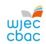
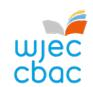

{1}------------------------------------------------

# WJEC Mathematics - Newsletter – April 2025

# NEW MADE FOR WALES GCSE MATHEMATICS AND NUMERACY (DOUBLE AWARD)

We are pleased to report that the Guidance for Teaching for GCSE Mathematics and Numeracy (Double Award) has been published on the subject page for the new GCSE Mathematics and Numeracy (Double Award) qualification, to accompany the specification and the Sample Assessment Materials. The web page for the new GCSE is available here: [GCSE Mathematics and Numeracy \(Double](https://www.wjec.co.uk/qualifications/gcse-mathematics-and-numeracy-double-award-teaching-from-2025/#tab_keydocuments)  [Award\) | Made for Wales \(wjec.co.uk\).](https://www.wjec.co.uk/qualifications/gcse-mathematics-and-numeracy-double-award-teaching-from-2025/#tab_keydocuments)

Please note that updated versions of some documents have been released since their initial publication. Where applicable, a 'Summary of Amendments' page has been added.

The table below provides some information regarding the Professional Learning opportunities designed to support the new GCSE.

## PL Events and Materials

| PL Type                                                                                          | Aims                                                                                          | Format and Notes                                                                                                                                                                                  |
|--------------------------------------------------------------------------------------------------|-----------------------------------------------------------------------------------------------|---------------------------------------------------------------------------------------------------------------------------------------------------------------------------------------------------|
| Your Guide to the new specification module Available now | To support your understanding of the specification document.                            | This asynchronous module can be found on the "Training On Demand" tab of your qualification page on the WJEC website. You will need to register to access a link to view. |
| Parent / Options evening flyers Available now            | To support you to provide information to parents and learners before start of study. | This PDF can be found on your qualification's home page.                                                                                                                                    |

{2}------------------------------------------------

| Recording of the Online Qualification Briefing & Q&A Available now                      | To support your understanding of the new qualification, its content and assessment structure. The recording also answers questions that were put to our Subject Teams and specification experts during the live events.                            | The Online Briefing was presented by the WJEC Mathematics Subject Adviser with support from the WJEC Mathematics Subject Officer. The recording is on the "Training On Demand" tab of your qualification page on the WJEC website. |
|--------------------------------------------------------------------------------------------------|-------------------------------------------------------------------------------------------------------------------------------------------------------------------------------------------------------------------------------------------------------------------------------|---------------------------------------------------------------------------------------------------------------------------------------------------------------------------------------------------------------------------------------------------------------------|
| Preparing to Teach (face-to-face)                                                             | To support teaching the new specification. There will be a focus on understanding the assessments, assessment objectives, content and teaching approaches based on the specification, sample assessment materials and guidance for teaching. | These events take place on designated regional INSET days. They are led by WJEC Subject Adviser and our expert presenting teams. Post event materials will be available on the WJEC Portal secure website.                               |
|                                                                                                  |                                                                                                                                                                                                                                                                               |                                                                                                                                                                                                                                                                     |
| For centres in the Isle of Man – Summer term 2025 For FE colleges – Autumn term 2025 |                                                                                                                                                                                                                                                                               |                                                                                                                                                                                                                                                                     |
| Exam and NEA Walk throughs Available Summer term 2025                                   | To support you and your learners to understand the structure of question papers, question types, assessment objectives and marking methods.                                                                                                                    | These pre-recorded PPT will initially be published on the WJEC Portal secure website only.                                                                                                                                                                 |

# Context Sourcing for GCSE Mathematics and Numeracy (Double Award)

As part of our new GCSE Mathematics and Numeracy, we are looking for suggestions for new contexts that can be utilised within our assessments. We welcome suggestions from across Wales. Submissions are welcomed from all stakeholders, including learners, teachers, lecturers and industry workers. Our team will consider all suggestions, irrespective of background.

For more information, please visit: [Help shape the future of GCSE](https://www.wjec.co.uk/home/help-shape-the-future-of-gcse-mathematics-and-numeracy-double-award-assessments/)  Mathematics [and Numeracy \(Double Award\)](https://www.wjec.co.uk/home/help-shape-the-future-of-gcse-mathematics-and-numeracy-double-award-assessments/) assessments (wjec.co.uk).

{3}------------------------------------------------

## PROFESSIONAL LEARNING TRAINING COURSES

Materials from all of the professional learning events that have taken place this academic year for GCSE Mathematics and GCSE Mathematics-Numeracy are available on [WJEC Portal](https://portal.wjec.co.uk/) (the WJEC secure website). The materials can be accessed by first selecting 'Resources', then 'Subject-Specific Support Materials inc CPD & Exemplars'. You can find the documents that contain the links quickly by putting 'Mathematics', 'WJEC' and 'GCSE' in the first three search boxes.

## PRINCIPAL EXAMINERS' REPORTS

Principal examiners' reports are available for the Autumn 2024 series for GCSE Mathematics and GCSE Mathematics – Numeracy. They can be found under the Key Documents tab on the GCSE Mathematics web page: [GCSE Mathematics and GCSE Mathematics - Numeracy Key Documents](https://www.wjec.co.uk/qualifications/mathematics-gcse/#tab_keydocuments)  [\(wjec.co.uk\)](https://www.wjec.co.uk/qualifications/mathematics-gcse/#tab_keydocuments) 

### FREE ACCESS TO SCRIPTS

WJEC teachers also benefit from access to free marked exam scripts from the Autumn 2024 assessment series.

Scripts are available for 6 months following the publication of results.

Candidates' scripts are available to download from [WJEC Portal.](https://portal.wjec.co.uk/)

## BLENDED LEARNING AND KNOWLEDGE ORGANISERS

Blended learning packages, exam walkthroughs and knowledge organisers are available for GCSE Mathematics and GCSE Mathematics – Numeracy, as well as for the new Made-for-Wales GCSE in Mathematics and Numeracy (Double Award). Visit the [Home Page WJEC Educational Resources Website.](https://resources.wjec.co.uk/)

{4}------------------------------------------------

# LEVEL 2 ADDITIONAL MATHEMATICS

## PROFESSIONAL LEARNING (PL)

Assessment Feedback materials relating to the Summer 2024 series are available on [WJEC Portal.](https://portal.wjec.co.uk/) The materials can be accessed by first selecting 'Resources', then 'Subject-Specific Support Materials inc CPD & Exemplars'.

# MADE FOR WALES QUALIFICATIONS

A subject page for the new Level 2 Additional Mathematics qualification is available [here.](https://www.wjec.co.uk/qualifications/level-2-additional-mathematics-teaching-from-2026/#tab_keydocuments) It is for first teaching from September 2026. The qualification outline is available on this webpage.

# AS/A LEVEL MATHEMATICS AND AS/A LEVEL FURTHER MATHEMATICS

## PROFESSIONAL LEARNING (PL) TRAINING COURSES

Materials from all of the professional learning events that have taken place this academic year for GCE Mathematics and GCE Further Mathematics are available on [WJEC Portal](https://portal.wjec.co.uk/) (the WJEC secure website). The materials can be accessed by first selecting 'Resources', then 'Subject-Specific Support Materials inc CPD & Exemplars'. The documents that contain the links can be found quickly by entering 'Mathematics', 'WJEC' and 'GCE' in the first three search boxes.

#### KNOWLEDGE ORGANISERS AND OTHER RESOURCES

Exam walkthroughs and knowledge organisers are available on the WJEC website. Visit the [Home Page WJEC Educational Resources Website.](https://resources.wjec.co.uk/)