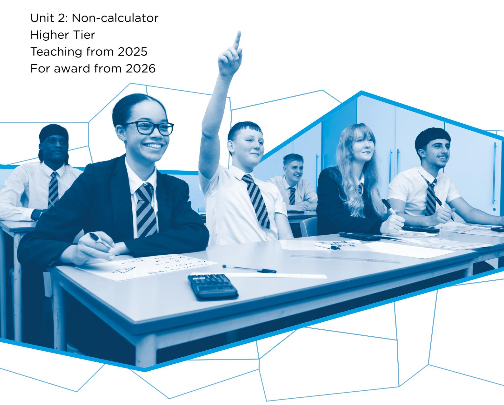
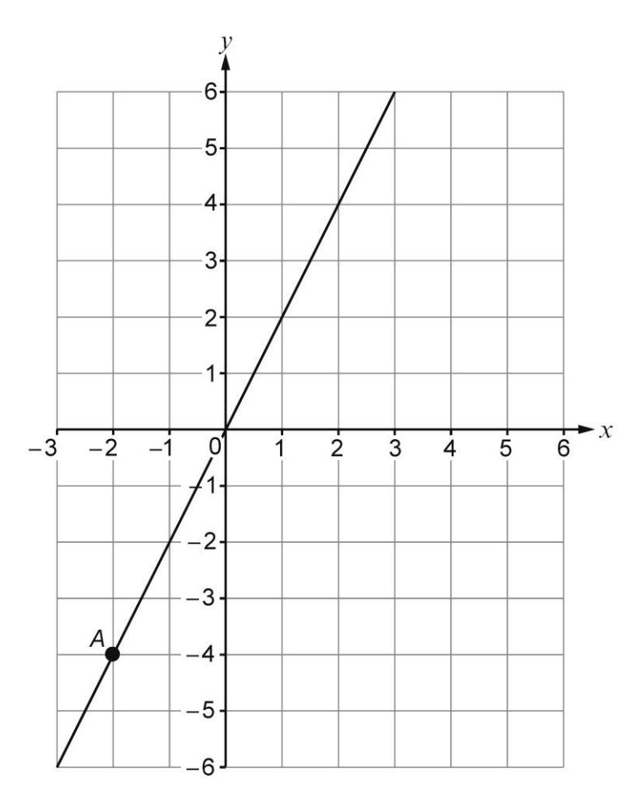
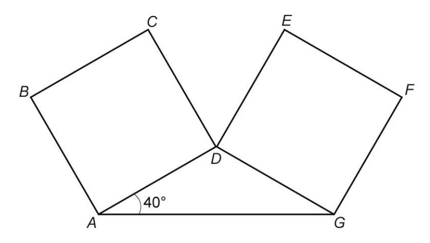
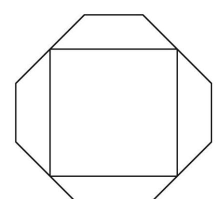
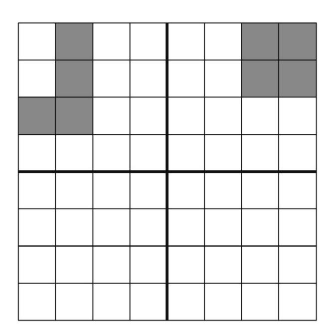
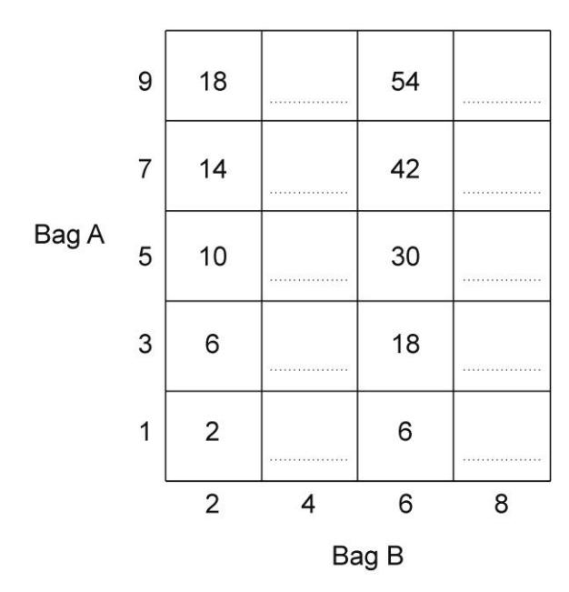
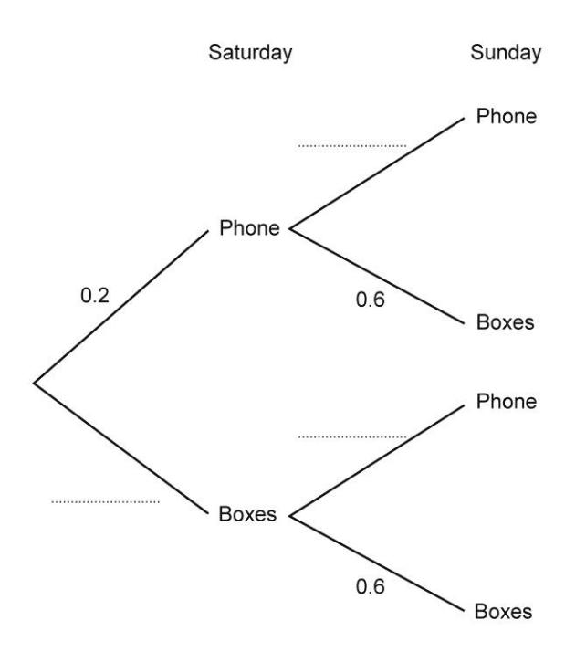

{1}------------------------------------------------

# WJEC GCSE Mathematics and Numeracy (Double Award)

Approved by Qualifications Wales

# Sample Assessment Materials

{2}------------------------------------------------

{3}------------------------------------------------

#### Contents

| Question paper | 1 |
|----------------|---|
| Mark scheme    | 2 |
| Mapping grid   | 2 |

{4}------------------------------------------------

| Surname          |   |
|------------------|---|
| First name(s)    |   |
| Centre number    |   |
| Candidate number | 0 |

## **GCSE 3320U2**

**GCSE Mathematics and Numeracy (Double Award) Unit 2: Non-calculator**

### **Foundation Tier**

### 1 hour 30 minutes **SAMPLE ASSESSMENT MATERIALS**

#### **Additional materials**

The use of a calculator is not permitted in this examination.

A ruler, a protractor and a pair of compasses may be required.

#### **Instructions to candidates**

Use black ink or black ball-point pen. Do **not** use gel pen or correction fluid.

You may use a pencil for graphs and diagrams only.

Write your name, centre number and candidate number in the spaces provided at the top of this page.

Answer **all** the questions in the spaces provided.

If you need more space, use the additional page(s) at the back of this booklet. Number the question(s) correctly.

Take π as 3·14.

#### **Information for candidates**

The number of marks is given in brackets at the end of each question or part-question.

In question 7, the assessment will take into account the quality of your mathematical organisation, communication and accuracy in writing.

| For examiner's use only |                 |              |
|-------------------------|-----------------|--------------|
| Question                | Maximum mark | Mark awarded |
| 1.                      | 4               |              |
| 2.                      | 3               |              |
| 3.                      | 2               |              |
| 4.                      | 3               |              |
| 5.                      | 2               |              |
| 6.                      | 5               |              |
| 7.                      | 6               |              |
| 8.                      | 3               |              |
| 9.                      | 4               |              |
| 10.                     | 4               |              |
| 11.                     | 3               |              |
| 12.                     | 4               |              |
| 13.                     | 3               |              |
| 14.                     | 4               |              |
| 15.                     | 3               |              |
| 16.                     | 3               |              |
| 17.                     | 5               |              |
| 18.                     | 4               |              |
| Total                   | 65              |              |

{5}------------------------------------------------

## Answer **all** questions.

| 1. | (a) | The attendance figures for two rugby matches are shown below.                                                |  |                                                                 |         | Examiner only      |  |     |  |
|----|-----|--------------------------------------------------------------------------------------------------------------------|--|-----------------------------------------------------------------|---------|-----------------------|--|-----|--|
|    |     |                                                                                                                    |  | Match A attendance                                           |         | Match B attendance |  |     |  |
|    |     |                                                                                                                    |  | 30 152                                                          |         | 23 451                |  |     |  |
|    |     | (i)                                                                                                                |  | Write down, in words, the attendance at Match A.             |         |                       |  | [1] |  |
|    |     |                                                                                                                    |  |                                                                 |         |                       |  |     |  |
|    |     | (ii)                                                                                                               |  | Write the attendance at Match B correct to the nearest hundred. |         |                       |  | [1] |  |
|    |     |                                                                                                                    |  |                                                              |         |                       |  |     |  |
|    | (b) | A number has exactly four factors. Its factors are 1, 3, 9 and the number itself. What is the number?  |  |                                                                 | [1]     |                       |  |     |  |
|    | (c) |                                                                                                                    |  |  Write these numbers in order, starting with the lowest      |         | number.               |  | [1] |  |
|    |     |                                                                                                                    |  |                                                                 | –7 0 | –10 11             |  |     |  |
|    |     |                                                                                                                    |  |                                                                 |         |                       |  |     |  |
|    |     |                                                                                                                    |  |                                                                 |         |                       |  |     |  |
|    |     |                                                                                                                    |  |                                                                 |         |                       |  |     |  |
|    |     |                                                                                                                    |  |                                                                 |         |                       |  |     |  |

{6}------------------------------------------------

**2.** Here is a list of some 2-D shapes.

Examiner only

[1]

| Equilateral triangle | Isosceles triangle | Kite             | Parallelogram |
|----------------------|--------------------|------------------|---------------|
| Rhombus              | Rectangle          | Scalene triangle | Trapezium     |

Using only the shapes in the list, write down the special name for:

(a) each of the two shapes whose sides are all of equal length

...................................................................................................................................................................................................................................................................................................................................................................................................................................................................................................................................................................................................................................................................................................................................................................................................................................................................................................................................................................................................................................................................................................................................................................................................................................................................................................................................................................................................................................................................................................................................................................................................................................................................................................................................................................................................................................................................................................................................................................................................................................................................................................................................................................................................................................................................................................................................................................................................................................................................................................................................................................................................................................................................................................................................................................................................................................................................................................................................................................................................................................................................................................................................................................................................................................................................................................................................................................................................................................................................................................................................................................................................................................................................................................................................................................................................................................................................................................................................................................................................................................................................................................................................................................................................................................................................................................................................................................................................................................................................................................................................................................................................................................................................................................................................................................................................................................................................................................................................................................................................................................................................................................................................................................................................................................................................................................................................................................................................................................................................................................................................................................................................................................................................................................................................................................................................................................................................................................................................................................................................................................................................................................................................................................................................................................................................................................................................................................................................................................................................................................................................................................................................................................................................................................................................................................................................................................................................................................................................................................................................................................................................................................................................................................................................................................................................................................................................................................................................................................................................................................................................................................................................................................................................................................................................................................................................................................................................................................................................................................................................................................................................................................................................................................................................................................................................................................................................................................................................................................................................................................................................................................................................................................................................................................................................................................................................................................................................................................................................................................................................................................................................................................................................................................................................................................................................................................................................................................................................................................................................................................................................................................................................................................................................................................................................................................................................................................................................................................................................................................................................................................................................................................................................................................................................................................................................................................................................................................................................................................................................................................................................................................................................................................................................................................................................................................................................................................................................................................................................................................................................................................................................................................................................................................................................................................................................................................................................................................................................................................................................................................................................................................................................................................................................................................................................................................................................................................................................................................................................................................................................................................................................................................................................................................................................................................................................................................................................................................................................................................................................................................................................................................................................................................................................................................................................................................................................................................................................................................................................................................................................................................................................................................................................................................................................................................................................................................................................................................................................................................................................................................................................................................................................................................................................................................................................................................................................................................................................................................................................................................................................................................................................................................................................................................................................................................................................................................................................................................................................................................................................................................................................................................................................................................................................................................................................................................................................................................................................................................................................................................................................................................................................................................................................................................................................................................................................................................................................................................................................................................................................................................................................................................................................................................................................................................................................................................................................................................................................................................................................................................................................................................................................................................................................................................................................................................................................................................................................................................................................................................................................................................................................................................................................................................................................................................................................................................................................................................................................................................................................................................................................................................................................................................................................................................................................................................................................................................................................................................................................................................................................................................................................................................................................................................................................................................................................................................................................................................................................................................................................................................................................................................................................................................................................................................................................................................................................................................................................................................................................................................................................................................................................................................................................................................................................................................................................................................................................................................................................................................................................................................................................................................................................................................................................................................................................................................................................................................................................................................................................................................................................................................................................................................................................................................................................................................................................................................................................................................................................................................................................................................................................................................................................................................................................................................................................................................................................................................................................................................................................................................................................................................................................................................................................................................................................................................................................................................................................................................................................................................................................................................................................................................................................................................................................................................................................................................................................................................................................................................................................................................................................................................................................................................................................................................................................................................................................................................................................................................................................................................................................................................................................................................................................................................................................................................................................................................................................................................................................................................................................................................................................................................................................................................................................................................................................................................................................................................................................................................................................................................................................................................................................................................................................................................................................................................................................................................................................................................................................................................................................................................................................................................................................................................................................................................................................................................................................................................................................................................................................................................................................................................................................................................................................................................................................................................................................................................................................................................................................................................................................................................................................................................................................................................................................................................................................................................................................................................................................................................................................................................................................................................................................................................................................................................................................................................................................................................................................................................................................................................................................................................................................................................................................................................................................................................................................................................................................................................................................................................................................................................................................................................................................................................................................................................................................................................................................................................................................................................................................................................................................................................................................................................................................................................................................................................................................................................................................................................................................................................................................................................................................................................................................................................................................................................................................................................................................................................................................................................................................................................................................................................................................................................................................................................................................................................................................................................................................................................................................................................................................................................................................................................................................................................................................................................................................................................................................................................................................................................................................................................................................................................................................................................................................................................................................................................................................................................................................................................................................................................................................................................................................................................................................................................................................................................................................................................................................................................................................................................................................................................................................................................................................................................................................................................................................................................................................................................................................................................................................................................................................................................................................................................................................................................................................................................................................................................................................................................................................................................................................................................................................................................................................................................................................................................................................................................................................................................................................................................................................................................................................................................................................................................................................................................................................................................................................................................................................................................................................................................................................................................................................................................................................................................................................................................................................................................................................................................................................................................................................................................................................................................................................................................................................................................................................................................................................................................................................................................................................................................................................................................................................................................................................................................................................................................................................................................................................................................................................................................................................................................................................................................................................................................................................................................................................................................................................................................................................................................................................................................................................................................................................................................................................................................................................................................................................................................................................................................................................................................................................................................................................................................................................................................................................................................................................................................................................................................................................................................................................................................................................................................................................................................................................................................................................................................................................................................................................................................................................................................................................................................................................................................................................................................................................................................................................................................................................................................................................................................................................................................................................................................................................................................................................................................................................................................................................................................................................................................................................................................................................................................................................................................................................................................................................................................................................................................................................................................................................................................................................................................................................................................................................................................................................................................................................................................................................................................................................................................................................................................................................................................................................................................................................................................................................................................................................................................................................................................................................................................................................................................................................................................................................................................................................................................................................................................................................................................................................................................................................................................................................................................................................................................................................................................................................................................................................................................................................................................................................................................................................................................................................................................................................................................................................................................................................................................................................................................................................................................................................................................................................................................................................................................................................................................................................................................................................................................................................................................................................................................................................................................................................................................................................................................................................................................................................................................................................................................................................................................................................................................................................................................................................................................................and

  
………………………………………………………………………………………….

………………………………………………………………………………………….

(b) the quadrilateral with four angles of equal size.

{7}------------------------------------------------

**3.** Siôn completes a reading test and a spelling test. His scores are shown in the table below.

| Test     | Score   |
|----------|---------|
| Reading  | 7 10 |
| Spelling | 3 4  |

[2] Examiner only

In which test did Siôn get the greater score?

| Reading | Spelling |
|---------|----------|
|---------|----------|

You must show working to support your answer.

……………………………………………………………………………………........…….

{8}------------------------------------------------

| 4. | (a) | Ceryn and Hywel each have a set of four cards. A card is chosen at random from each set of cards.               |                                                                                                                                |  | Examiner only |     |  |  |  |  |
|----|-----|--------------------------------------------------------------------------------------------------------------------|--------------------------------------------------------------------------------------------------------------------------------|--|------------------|-----|--|--|--|--|
|    |     | (i)                                                                                                                | Write a number on each of Ceryn's four cards so that it is <b>likely</b> that her chosen card will show a 6.                |  |                  | [1] |  |  |  |  |
|    |     |                                                                                                                    | <table><tr><td></td><td></td><td></td><td></td></tr></table>                                                                   |  |                  |     |  |  |  |  |
|    |     |                                                                                                                    |                                                                                                                                |  |                  |     |  |  |  |  |
|    |     | (ii)                                                                                                               | Write a number on each of Hywel's four cards so that it is <b>impossible</b> that his chosen card will show an even number. |  |                  | [1] |  |  |  |  |
|    |     |                                                                                                                    | <table><tr><td></td><td></td><td></td><td></td></tr></table>                                                                   |  |                  |     |  |  |  |  |
|    |     |                                                                                                                    |                                                                                                                                |  |                  |     |  |  |  |  |
|    | (b) | Abdi has a bag containing ten counters. There are five blue counters and five red counters in the bag.          |                                                                                                                                |  |                  | [1] |  |  |  |  |
|    |     | Abdi adds yellow counters to the bag.                                                                              |                                                                                                                                |  |                  |     |  |  |  |  |
|    |     | Now, when Abdi selects a counter at random from the bag, there is an even chance of selecting a yellow counter. |                                                                                                                                |  |                  |     |  |  |  |  |
|    |     | How many yellow counters did Abdi add to the bag?                                                                  |                                                                                                                                |  |                  |     |  |  |  |  |
|    |     | Abdi adds yellow counters to the bag.                                                                              |                                                                                                                                |  |                  |     |  |  |  |  |

{9}------------------------------------------------

(a) What are coordinates of the point *A*?

[1]

(………….. , ………….. )

(b) Bethan thinks that, if the straight line was extended, the line would go through the point (6, 10).

[1]

Is Bethan correct?

YES NO

NO []

Explain your reasoning.

….......................................................................................................................

{10}------------------------------------------------

| 6. (a) | Calculate 13 2 . | [1]                                            |     |
|--------|-----------------------------|------------------------------------------------|-----|
|        | (b)                         | Write down $\sqrt{81}$ .                       | [1] |
|        | (c)                         | Calculate 30 – 5 × 4.                          | [1] |
|        | (d)                         | Write down the prime number between 20 and 28. | [1] |
|        | (e)                         | Calculate 20 ÷ 0⋅4.                            | [1] |

Examiner only

{11}------------------------------------------------

**7.** *In this question, you will be assessed on the quality of your organisation, communication and accuracy in writing.*

Examiner only

In the diagram below, *ABCD* and *DEFG* are two identical squares.

Show that angle C*D*̂*E* is an acute angle.

You must show all your working.

[4 + 2 OCW]

{12}------------------------------------------------

| 8.     | David has three rocks, labelled A, B and C. Rock A has a mass of 6·21 kg. Rock B has a mass of 3·5 kg. | [3]              | Examiner only |     |
|--------|--------------------------------------------------------------------------------------------------------|------------------|---------------|-----|
|        | The three rocks are placed on a weighing scale. The total mass of the three rocks is 12·46 kg.         |                  |               |     |
|        | Calculate the mass of the rock C.                                                                      |                  |               |     |
| 9. (a) | Simplify 2x + 4x - x.                                                                                  | Mass of rock C = | kg            | [1] |
|        | (b) Simplify 8y × 6.                                                                                   |                  |               | [1] |
|        | (c) Find the value of 2t + 4w when t = –5 and w = 8.                                                   |                  |               | [2] |

{13}------------------------------------------------

**10.** (a) Draw all the lines of symmetry on the following diagram. [2] Examiner

only

[2]

(b) Shade the least number of squares so that the grid has rotational symmetry of order 2.

{14}------------------------------------------------

| 11.   | 32 players took part in the Snooker World Championship in 2024. Some players were from Wales, some came from the rest of Great Britain, and the remainder came from the rest of the world. | [3]               | Examiner only |
|-------|--------------------------------------------------------------------------------------------------------------------------------------------------------------------------------------------|-------------------|---------------|
|       | There were three times as many players from the rest of Great Britain as there were from Wales. There were two more players from the rest of the world than there were from Wales.         |                   |               |
|       | Calculate how many players came from each region.                                                                                                                                          |                   |               |
|       |                                                                                                                                                                                            |                   |               |
|       |                                                                                                                                                                                            |                   |               |
|       |                                                                                                                                                                                            |                   |               |
|       |                                                                                                                                                                                            |                   |               |
|       |                                                                                                                                                                                            |                   |               |
|       |                                                                                                                                                                                            |                   |               |
|       |                                                                                                                                                                                            |                   |               |
|       |                                                                                                                                                                                            |                   |               |
|       |                                                                                                                                                                                            |                   |               |
|       |                                                                                                                                                                                            |                   |               |
|       |                                                                                                                                                                                            |                   |               |
| Wales | Rest of Great Britain                                                                                                                                                                      | Rest of the world |               |
|       |                                                                                                                                                                                            |                   |               |
|       |                                                                                                                                                                                            |                   |               |
|       |                                                                                                                                                                                            |                   |               |
|       |                                                                                                                                                                                            |                   |               |
|       |                                                                                                                                                                                            |                   |               |
|       |                                                                                                                                                                                            |                   |               |
|       |                                                                                                                                                                                            |                   |               |
|       |                                                                                                                                                                                            |                   |               |
|       |                                                                                                                                                                                            |                   |               |

{15}------------------------------------------------

Examiner only

Kate plays a game.

In a game, she takes one card from Bag A and one card from Bag B. Her score is found by calculating the **product** of the two numbers.

(a) Complete the table to show all of her possible scores. [2]

[2]

| (b) | Kate wins a prize if she gets a score of 20 or less. What is the probability that she wins a prize? |  |  |  |  |  |
|-----|--------------------------------------------------------------------------------------------------------|--|--|--|--|--|
|     |                                                                                                        |  |  |  |  |  |
|     |                                                                                                        |  |  |  |  |  |
|     |                                                                                                        |  |  |  |  |  |
|     |                                                                                                        |  |  |  |  |  |

{16}------------------------------------------------

| 13. | Solve $13d + 9 = 5d - 31$ .                                           | [3] | Examiner only |
|-----|-----------------------------------------------------------------------|-----|---------------|
|     |                                                                       |     |               |
|     |                                                                       |     |               |
|     |                                                                       |     |               |
|     |                                                                       |     |               |
|     |                                                                       |     |               |
| 14. | A number machine is shown below.                                      |     |               |
|     | $  INPUT → Divide by \frac{3}{8} → Subtract \frac{1}{2^3} → OUTPUT  $ |     |               |
|     | The INPUT number is $2\frac{5}{8}$ .                                  |     |               |
|     | What is the OUTPUT number? Give your answer as a mixed number.     | [4] |               |
|     |                                                                       |     |               |
|     |                                                                       |     |               |
|     |                                                                       |     |               |
|     |                                                                       |     |               |
|     |                                                                       |     |               |
|     |                                                                       |     |               |
|     |                                                                       |     |               |
|     |                                                                       |     |               |

{17}------------------------------------------------

**15.** Find the size of each of the angles marked *a*, *b* and *c*. [3] Examiner

$$a = \dots \circ b = \dots \circ c = \dots \circ$$

only

{18}------------------------------------------------

3] |

To make up these packs, Delyth buys:

- some boxes that contain 14 wooden knives each
- some boxes that contain 16 wooden forks each
- some boxes that contain 10 wooden spoons each.

Delyth wants to buy the **least possible number of boxes** so that, in making up the packs, she uses **all** of the knives, forks and spoons she has bought.

Complete the table below to show the number of boxes of each item that Delyth needs to buy.

You must show all your working.

| Knives (14 in each box) | .......................... boxes |
|-------------------------|----------------------------------|
| Forks (16 in each box)  | .......................... boxes |
| Spoons (10 in each box) | .......................... boxes |

{19}------------------------------------------------

Examiner only

**17.** Rhodri Jones works with his 2 daughters in their family business.

Rhodri is *x* years old, where *x* is a whole number. Megan, his older daughter, is (*x* – 23) years old. Gwenda, his younger daughter is 5 years younger than Megan.

On the Jones family business website, it states the following:

Well-established family business! The total age of our 3 workers is greater than 100 years.

| Form and solve an inequality to find the youngest possible age Rhodri could be for the last statement to be true. | [5] |
|----------------------------------------------------------------------------------------------------------------------|-----|
|                                                                                                                      |     |
|                                                                                                                      |     |
|                                                                                                                      |     |
|                                                                                                                      |     |
|                                                                                                                      |     |
|                                                                                                                      |     |
|                                                                                                                      |     |
|                                                                                                                      |     |
|                                                                                                                      |     |
|                                                                                                                      |     |
|                                                                                                                      |     |
|                                                                                                                      |     |
|                                                                                                                      |     |
|                                                                                                                      |     |

{20}------------------------------------------------

- **18.** Every weekend, Ravi works on Saturday and on Sunday. Ravi is given one job to do on Saturday and one job to do on Sunday. The options for the job he could be given on either day are:
  - answer the phone
  - pack boxes.

On any weekend, the probability that Ravi is given the job to:

- answer the phone on Saturday is 0.2
- pack boxes on Sunday is 0.6.

The job given to Ravi on one day is independent of the job given to him on the other day.

| (a) | Complete the tree diagram below. | [2] |
|-----|----------------------------------|-----|
|     |                                  |     |
|     |                                  |     |
|     |                                  |     |
|     |                                  |     |

{21}------------------------------------------------

| (b) | Calculate the probability that, next weekend, Ravi is given the job to pack boxes on Saturday and on Sunday. | [2] | Examiner only |
|-----|--------------------------------------------------------------------------------------------------------------|-----|---------------|
|-----|--------------------------------------------------------------------------------------------------------------|-----|---------------|

## **END OF QUESTIONS**

{22}------------------------------------------------

| Examiner | only |
|----------|------|
|----------|------|

| Question number | Additional page, if required. Write the question number(s) in the left-hand margin. |  |
|-----------------|-------------------------------------------------------------------------------------|--|
|                 |                                                                                     |  |
|                 |                                                                                     |  |
|                 |                                                                                     |  |
|                 |                                                                                     |  |
|                 |                                                                                     |  |
|                 |                                                                                     |  |
|                 |                                                                                     |  |
|                 |                                                                                     |  |
|                 |                                                                                     |  |
|                 |                                                                                     |  |
|                 |                                                                                     |  |
|                 |                                                                                     |  |
|                 |                                                                                     |  |
|                 |                                                                                     |  |
|                 |                                                                                     |  |
|                 |                                                                                     |  |
|                 |                                                                                     |  |
|                 |                                                                                     |  |
|                 |                                                                                     |  |
|                 |                                                                                     |  |
|                 |                                                                                     |  |
|                 |                                                                                     |  |
|                 |                                                                                     |  |
|                 |                                                                                     |  |

{23}------------------------------------------------

## Mark Scheme

| GCSE Mathematics and Numeracy Unit 2: Foundation Tier SAMS                                                                                                                                                             | Mark           | Comments                                                                                                                                                                                                                                                                                                                                                                                                                                                                                                                                                                                                                                                                                                                                                                                                                                 |
|------------------------------------------------------------------------------------------------------------------------------------------------------------------------------------------------------------------------------|----------------|------------------------------------------------------------------------------------------------------------------------------------------------------------------------------------------------------------------------------------------------------------------------------------------------------------------------------------------------------------------------------------------------------------------------------------------------------------------------------------------------------------------------------------------------------------------------------------------------------------------------------------------------------------------------------------------------------------------------------------------------------------------------------------------------------------------------------------------|
| 1.(a)(i) thirty thousand one hundred (and) fifty-two                                                                                                                                                                         | B1             |                                                                                                                                                                                                                                                                                                                                                                                                                                                                                                                                                                                                                                                                                                                                                                                                                                          |
| 1.(a)(ii) 23 500                                                                                                                                                                                                             | B1             |                                                                                                                                                                                                                                                                                                                                                                                                                                                                                                                                                                                                                                                                                                                                                                                                                                          |
| 1.(b) 27                                                                                                                                                                                                                     | B1             |                                                                                                                                                                                                                                                                                                                                                                                                                                                                                                                                                                                                                                                                                                                                                                                                                                          |
| 1.(c) –10 –7 0 11                                                                                                                                                                                                            | B1             |                                                                                                                                                                                                                                                                                                                                                                                                                                                                                                                                                                                                                                                                                                                                                                                                                                          |
| 2.(a) equilateral triangle (and) rhombus                                                                                                                                                                                     | B2             | B1 for each.                                                                                                                                                                                                                                                                                                                                                                                                                                                                                                                                                                                                                                                                                                                                                                                                                             |
| 2.(b) rectangle                                                                                                                                                                                                              | B1             |                                                                                                                                                                                                                                                                                                                                                                                                                                                                                                                                                                                                                                                                                                                                                                                                                                          |
| 3. Spelling selected, with sight of $14$ AND $15$ $20$ $20$ OR 70% AND 75% OR $0.7(0)$ AND $0.75$ OR Two correct calculations for a common amount.                                             | B2             | Award B2 for Spelling selected and one of the following: • both fractions with a common denominator (could include decimals as numerators denominators). Allow fully correct pictorial representation, e.g. equal split boxes with correct shading. • both correct percentages • both correct decimals • correct work using a common amount. Award B1 for one of the following: • both fractions written with a common denominator, one of which is correct. Allow partially correct pictorial representation, e.g. equal split boxes with one shading correct, one incorrect. • one correct percentage • one correct decimal • two correct conversions but Reading selected or neither box selected. B0 for selecting Spelling with no conversions. |
| 4.(a)(i) Exactly three 6s and any other number                                                                                                                                                                               | B1             | The other number must not be a 6.                                                                                                                                                                                                                                                                                                                                                                                                                                                                                                                                                                                                                                                                                                                                                                                                        |
| 4.(a)(ii) Any four odd numbers.                                                                                                                                                                                              | B1             |                                                                                                                                                                                                                                                                                                                                                                                                                                                                                                                                                                                                                                                                                                                                                                                                                                          |
| 4.(b) 10                                                                                                                                                                                                                     | B1             |                                                                                                                                                                                                                                                                                                                                                                                                                                                                                                                                                                                                                                                                                                                                                                                                                                          |
| 5.(a) ( $-2$ , $-4$ )                                                                                                                                                                                                        | B1             |                                                                                                                                                                                                                                                                                                                                                                                                                                                                                                                                                                                                                                                                                                                                                                                                                                          |
| 5.(b) No indicated with suitable reason e.g. 'the y coordinate is always double the x coordinate' 'it would go through (5,10)' 'it would go through (6,12)'                                                         | E1             | Accept equivalent reasons                                                                                                                                                                                                                                                                                                                                                                                                                                                                                                                                                                                                                                                                                                                                                                                                                |
| 6.(a) 169                                                                                                                                                                                                                    | B1             |                                                                                                                                                                                                                                                                                                                                                                                                                                                                                                                                                                                                                                                                                                                                                                                                                                          |
| 6.(b) 9                                                                                                                                                                                                                      | B1             | Accept ±9.                                                                                                                                                                                                                                                                                                                                                                                                                                                                                                                                                                                                                                                                                                                                                                                                                               |
| 6.(c) 10                                                                                                                                                                                                                     | B1             |                                                                                                                                                                                                                                                                                                                                                                                                                                                                                                                                                                                                                                                                                                                                                                                                                                          |
| 6.(d) 23                                                                                                                                                                                                                     | B1             |                                                                                                                                                                                                                                                                                                                                                                                                                                                                                                                                                                                                                                                                                                                                                                                                                                          |
| 6.(e) 50                                                                                                                                                                                                                     | B1             |                                                                                                                                                                                                                                                                                                                                                                                                                                                                                                                                                                                                                                                                                                                                                                                                                                          |
| 7.                                                                                                                                                                                                                           |                | Check diagram.                                                                                                                                                                                                                                                                                                                                                                                                                                                                                                                                                                                                                                                                                                                                                                                                                           |
| (A𝐺̂D = 40(°))                                                                                                                                                                                                               | B1             |                                                                                                                                                                                                                                                                                                                                                                                                                                                                                                                                                                                                                                                                                                                                                                                                                                          |
| (A𝐷̂G = 180 – 2 × 40 =) 100(°)                                                                                                                                                                                               | B1             |                                                                                                                                                                                                                                                                                                                                                                                                                                                                                                                                                                                                                                                                                                                                                                                                                                          |
| (C𝐷̂E =) 360 – 90 – 90 – 100                                                                                                                                                                                                 | M1             | FT 'their derived/stated A𝐷̂G' provided obtuse.                                                                                                                                                                                                                                                                                                                                                                                                                                                                                                                                                                                                                                                                                                                                                                                          |
| = 80(° < 90°, therefore it's acute)                                                                                                                                                                                          | A1             |                                                                                                                                                                                                                                                                                                                                                                                                                                                                                                                                                                                                                                                                                                                                                                                                                                          |
| Organisation and communication                                                                                                                                                                                               | OC1            | For OC1, candidates will be expected to: • present their response in a structured way • explain to the reader what they are doing at each step of their response • lay out their explanations and working in a clear and logical way • write a conclusion that draws together their results and explains what their answer means                                                                                                                                                                                                                                                                                                                                                                                                                                                                                             |
| Writing                                                                                                                                                                                                                      | W1             | For W1, candidates will be expected to: • show all their working • use correct mathematical form in their working • use appropriate terminology, units, etc.                                                                                                                                                                                                                                                                                                                                                                                                                                                                                                                                                                                                                                                                    |
| 8. (Mass of rock C =) 12.46 – 6.21 – 3.5                                                                                                                                                                                     | M2             | May be seen in stages. Award M1 for any one of the following: • (Mass of rocks A + B =) 6.21 + 3.5 (= 9.71 kg) • (Mass of rocks A + C =) 12.46 – 3.5 (= 8.96 kg) • (Mass of rocks B + C =) 12.46 – 6.21 (= 6.25 kg)                                                                                                                                                                                                                                                                                                                                                                                                                                                                                                                                                                                                          |
| = 2.75 (kg)                                                                                                                                                                                                                  | A1             | CAO                                                                                                                                                                                                                                                                                                                                                                                                                                                                                                                                                                                                                                                                                                                                                                                                                                      |
| 9.(a) 5x                                                                                                                                                                                                                     | B1             | Mark final answer.                                                                                                                                                                                                                                                                                                                                                                                                                                                                                                                                                                                                                                                                                                                                                                                                                       |
| 9.(b) 48y                                                                                                                                                                                                                    | B1             | Mark final answer.                                                                                                                                                                                                                                                                                                                                                                                                                                                                                                                                                                                                                                                                                                                                                                                                                       |
| 9.(c) 22                                                                                                                                                                                                                     | B2             | Mark final answer. Award B2 for an unsupported 22 or not from incorrect working. Award B1 for one of the following: • sight of –10 (not –10t) • sight of 32 (not 32w) • 12 (with additional letters)                                                                                                                                                                                                                                                                                                                                                                                                                                                                                                                                                                                                                      |
| 10.(a)                                                                                                                                                                                                                       | B2             | B1 for either: • 3 or 4 correct lines and no more than 1 incorrect line • 2 correct lines and no incorrect lines                                                                                                                                                                                                                                                                                                                                                                                                                                                                                                                                                                                                                                                                                                                   |
| 10.(b)                                                                                                                                                                                                                       | B2             | B1 for either quadrant correct. Ignore clearly deleted shading.                                                                                                                                                                                                                                                                                                                                                                                                                                                                                                                                                                                                                                                                                                                                                                       |
| 11. Wales = 6 Rest of GB = 18 Rest of world = 8                                                                                                                                                                              | B3             | B2 for satisfying two of the conditions: Rest of GB = 3 × WalesRest of World = Wales + 2Wales + Rest of GB + Rest of world = 32B1 for satisfying one of the conditions. Answer space takes precedence. A condition must be met using non-negative integers, otherwise B0.                                                                                                                                                                                                                                                                                                                                                                                                                                                                                                                                                       |
| 12.(a)                                                                                                                                                                                                                       | B2             | B1 for at least 8 entries correct                                                                                                                                                                                                                                                                                                                                                                                                                                                                                                                                                                                                                                                                                                                                                                                                        |
|                                                                                                                                                                                                                              |                | 36 72 28 56 20 40 12 24 4 8                                                                                                                                                                                                                                                                                                                                                                                                                                                                                                                                                                                                                                                                                                                                                                                                  |
| 12.(b) $rac{11}{20}$ or equivalent.                                                                                                                                                                                         | B2             | F.T. their table B1 for either: a numerator of 11 in a fraction less than 1.a denominator of 20 in a fraction less than 1Penalise –1 for use of incorrect notation.                                                                                                                                                                                                                                                                                                                                                                                                                                                                                                                                                                                                                                                                |
| 13.                                                                                                                                                                                                                          | B1 B1 B1 | $13d - 5d = -31 - 9$ $8d = -40$ $d = -5$ FT until 2nd error Mark final answer Allow an embedded answer If FT leads to a whole number answer, it must be shown as a whole number, otherwise accept a fraction                                                                                                                                                                                                                                                                                                                                                                                                                                                                                                                                                                                                           |
| 14. $rac{21}{8} 	imes rac{8}{3} - rac{1}{8}$                                                                                                                                                                              | M2             | M1 for any one of the following: $2rac{5}{8} rac{21}{8} rac{8}{3}$ $rac{1}{2^3} = rac{1}{8}$                                                                                                                                                                                                                                                                                                                                                                                                                                                                                                                                                                                                                                                                                                                                     |
|                                                                                                                                                                                                                              | A2             | A1 for any one of the following: $rac{21}{8} 	imes rac{8}{3} = 7$ final answer $rac{55}{8}$ 'their $rac{21}{8} 	imes rac{8}{3}$ ' $-rac{1}{8}$ correctly evaluated and given as a mixed number                                                                                                                                                                                                                                                                                                                                                                                                                                                                                                                                                                                                                                  |
| 15. a = 42° b = 65° c = 115°                                                                                                                                                                                        | B1 B1 B1 | Answer spaces take precedence FT 180 ° – 'their b' provided 'their b' $ eq$ 0°, 90° or 180°                                                                                                                                                                                                                                                                                                                                                                                                                                                                                                                                                                                                                                                                                                                                           |
|                                                                                                                                                                                                                              |                |                                                                                                                                                                                                                                                                                                                                                                                                                                                                                                                                                                                                                                                                                                                                                                                                                                          |
| 16. Lowest common multiple of 2 × 5 × 7 × 8 or 560 seen or implied Table completed correctly, or sight of correct number of boxes in working, e.g. Knives 40 boxes Forks 35 boxes Spoons 56 boxes | M2 A1       | M1 for a method looking at factors or multiples, e.g. • sight of 2 × 7, 2 × 8 and 2 × 5 • sight of 2 × 7, 24 and 2 × 5 • sight of 2 × 7, 2 × 2 × 4 and 2 × 5 • (14,) 28, 42, 56 and (16,) 32, 48, 64 and (10,) 20, 30, 40 • a common multiple, not LCM, e.g. 1120 Answers in the table take precedence If no marks, award SC1 for an answer with whole numbers of knives, forks and spoons in correct the ratio, e.g. 80 ; 70 : 112                                                                                                                                                                                                                                                                                                                                                         |
| x + x – 23 + x 17. – 23 – 5 > 100 or equivalent                                                                                                                                                               | M2             | M1 for sight of any one of the following: x + x – 23 + x • – 23 – 5 x + x – 23 (+ ) > 100 •                                                                                                                                                                                                                                                                                                                                                                                                                                                                                                                                                                                                                                                                                                                   |
| 151 or x > 501 x > or x > 50.3(…) 3 3                                                                                                                                                                         | A2             | Possible FT from M1 for A1 only A1 for any one of the following: 3x – • 51 > 100 3x > 151 • • a simplified inequality for 'their x + x – 23 (+ ) > 100'                                                                                                                                                                                                                                                                                                                                                                                                                                                                                                                                                                                                                                                 |
| (Youngest Rhodri could be) 51 (years-old)                                                                                                                                                                                    |                | 151 FT 'their x > ' provided it is not a whole number 3                                                                                                                                                                                                                                                                                                                                                                                                                                                                                                                                                                                                                                                                                                                                                                         |
|                                                                                                                                                                                                                              |                | No marks for trial and improvement or an unsupported answer                                                                                                                                                                                                                                                                                                                                                                                                                                                                                                                                                                                                                                                                                                                                                                           |
| 18(a) Complete tree diagram                                                                                                                                                                                                  | B2             | B1 for any one of the following: • 0.8 or equivalent on the boxes Saturday branch • 0.4 or equivalent on both the phone Sunday                                                                                                                                                                                                                                                                                                                                                                                                                                                                                                                                                                                                                                                                                               |
|                                                                                                                                                                                                                              |                | branches                                                                                                                                                                                                                                                                                                                                                                                                                                                                                                                                                                                                                                                                                                                                                                                                                                 |
|                                                                                                                                                                                                                              |                |                                                                                                                                                                                                                                                                                                                                                                                                                                                                                                                                                                                                                                                                                                                                                                                                                                          |
|                                                                                                                                                                                                                              |                |                                                                                                                                                                                                                                                                                                                                                                                                                                                                                                                                                                                                                                                                                                                                                                                                                                          |
|                                                                                                                                                                                                                              |                |                                                                                                                                                                                                                                                                                                                                                                                                                                                                                                                                                                                                                                                                                                                                                                                                                                          |
|                                                                                                                                                                                                                              |                |                                                                                                                                                                                                                                                                                                                                                                                                                                                                                                                                                                                                                                                                                                                                                                                                                                          |
| 18(b) 0.8  0.6                                                                                                                                                                                                           | M1             | FT 0.8  'their lower branch 0.6' provided 0 < 'their lower branch 0.6 < 1                                                                                                                                                                                                                                                                                                                                                                                                                                                                                                                                                                                                                                                                                                                                                            |
| 0.48 or equivalent                                                                                                                                                                                                           | A1             | Mark final answer                                                                                                                                                                                                                                                                                                                                                                                                                                                                                                                                                                                                                                                                                                                                                                                                                        |

{24}------------------------------------------------

{25}------------------------------------------------

{26}------------------------------------------------

{27}------------------------------------------------

## How to read the mark scheme

- 'M' marks are awarded for any correct method applied to appropriate working, even though a numerical error may be involved. Once earned they cannot be lost.
- 'm' marks are dependant method marks. They are only given if the relevant previous 'M' mark has been earned.
- 'A' marks are given for a numerically correct stage, for a correct result or for an answer lying within a specified range. They are only given if the relevant M/m mark has been earned either explicitly or by inference from the correct answer.
- 'B' marks are independent of method and are usually awarded for an accurate result or statement.
- 'S' marks are awarded for strategy
- 'E' marks are awarded for explanation
- 'U' marks are awarded for units
- 'P' marks are awarded for plotting points
- 'C' marks are awarded for drawing curves
- 'OC' marks are awarded for 'organising and communicating', a strand of OCW (organising, communicating and writing accurately)
- 'W' marks are awarded for 'writing accurately', a strand of OCW (organising, communicating and writing accurately)
- 'SC' marks are awards for special cases
- CAO: correct answer only
- ISW: ignore subsequent working
- FT: follow through

{28}------------------------------------------------

## Assessment mapping

| Q. | Topic                                                        | Max mark | AO1 | AO2 | AO3 | Common Qn (HT) | Common marks (HT) | OCW |
|----|--------------------------------------------------------------|-------------|-----|-----|-----|-------------------|-------------------------|-----|
| 1  | Writing numbers in words; rounding; factors; directed num | 4           | 3   | 1   |     |                   |                         |     |
| 2  | 2D shape properties                                          | 3           | 3   |     |     |                   |                         |     |
| 3  | Fractions problem                                            | 2           |     | 2   |     |                   |                         |     |
| 4  | Language of probability                                      | 3           | 2   | 1   |     |                   |                         |     |
| 5  | First quadrant coordinate problem                            | 2           | 1   | 1   |     |                   |                         |     |
| 6  | Square; Square root; primes; BIDMAS; dividing by decimal  | 5           | 5   |     |     |                   |                         |     |
| 7  | Angles problem - two squares and an isosceles             | 6           |     |     | 6   |                   |                         | *   |
| 8  | Mass of rocks (decimals)                                     | 3           | 3   |     |     |                   |                         |     |
| 9  | Collecting like terms; multiplying; substitution          | 4           | 4   |     |     |                   |                         |     |
| 10 | Lines of symmetry; rotational symmetry                    | 4           | 4   |     |     |                   |                         |     |
| 11 | Snooker players problem                                      | 3           |     |     | 3   |                   |                         |     |
| 12 | Listing outcomes from 2 way table; probability            | 4           | 4   |     |     |                   |                         |     |
| 13 | Solve linear equation with variable both sides            | 3           | 3   |     |     | 1                 | 3                       |     |
| 14 | Number machine with fractions and indices                 | 4           | 4   |     |     | 2                 | 4                       |     |
| 15 | Parallel lines                                               | 3           | 3   |     |     | 3                 | 3                       |     |
| 16 | Wooden cutlery factor and LCM problem                     | 3           |     |     | 3   | 6                 | 3                       |     |
| 17 | Family business age inequality                               | 5           |     | 5   |     | 7                 | 5                       |     |
| 18 | Tree diagram cycle to and from work                       | 4           | 4   |     |     | 10                | 4                       |     |
|    |                                                              | 65          | 43  | 10  | 12  |                   | 22                      |     |