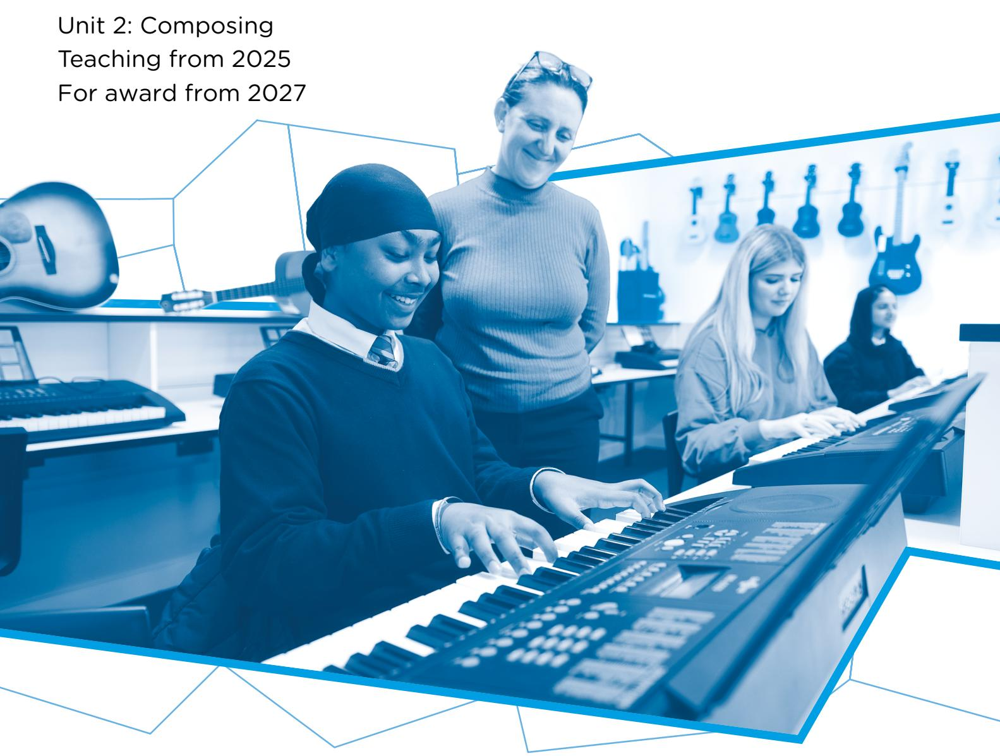

{1}------------------------------------------------

# WJEC GCSE Music

Approved by Qualifications Wales

# Sample Assessment Materials

Ready for the world. This Qualifications Wales regulated qualification is not available to centres in England.

Made for Wales.

{2}------------------------------------------------

{3}------------------------------------------------

# Contents

| Accessing Sample Assessment Materials         | 1  |
|-----------------------------------------------|----|
| Mark scheme                                   | 2  |
| Mapping grid                                  | 27 |
| Appendix A – WJEC Music Digital Assessment | 33 |

{4}------------------------------------------------

## UNIT 3: APPRAISING

Unit 3: Appraising is assessed by Digital Examination. The online Sample Assessment Materials can be accessed here: [http://web.download.wjec.co.uk/surpass/packaged](http://web.download.wjec.co.uk/surpass/packaged-exams/GCSE-Music-EN3/index.html)[exams/GCSE-Music-EN3/index.html](http://web.download.wjec.co.uk/surpass/packaged-exams/GCSE-Music-EN3/index.html)

Guidance for accessing the online Sample Assessment Materials is detailed in the following steps:

{5}------------------------------------------------

## MARK SCHEME

### Guidance for examiners

# **Generic marking principles**

- Marks awarded are always whole marks (not half marks, or other fractions).
- Answers should only be judged on the quality of spelling, punctuation and grammar when these features are specifically assessed by the question as indicated by the mark scheme. The meaning, however, should be unambiguous.
- Marks should be awarded using the full range of marks defined in the mark scheme for the question (however; the use of the full mark range may be limited according to the quality of the candidate responses seen).
- Marks awarded are based solely on the requirements as defined in the mark scheme. Marks should not be awarded with grade thresholds or grade descriptors in mind.

## **Positive marking**

It should be remembered that candidates are writing under examination conditions and credit should be given for what the candidate writes, rather than adopting the approach of penalising candidates for any omissions. It should be possible for a very good response to achieve full marks and a very poor one to achieve zero marks. Marks should not be deducted for a less than perfect answer if it satisfies the criteria of the mark scheme.

For questions that are objective or points-based, the mark scheme should be applied precisely. Marks should be awarded as indicated and no further subdivision made.

Mark schemes often list points which may be included in candidates' answers. The list is not exhaustive. The inclusion of *'Credit any other valid response.*' (or similar instruction) within mark schemes allows for the possible variation in candidates' responses. Credit should be given according to the accuracy and relevance of candidates' answers.

Appropriate terminology is reflected in exemplar responses in mark schemes. However, unless there is a specific requirement within a question, candidates may be awarded marks where the answer is accurate but expressed in their own words.

### **Banded mark schemes**

For band marked questions mark schemes are in two parts; the indicative content and the assessment grid.

The indicative content suggests the range of points and issues which may be included in candidates' answers. It can be used to assess the quality of the candidate's response. As noted above, indicative content is not intended to be exhaustive and candidates do not have to include all the indicative content to reach the highest level of the mark scheme.

However, to reach the highest level of the mark scheme a candidate must meet the requirements of the highest mark band. Where a response is not creditworthy, that is, it contains nothing of any significance to the mark scheme, or where no response has been provided, no marks should be awarded.

{6}------------------------------------------------

The marking of banded mark questions should always be positive. This means that, for each candidate's response, marks are accumulated for the demonstration of relevant skills, knowledge and understanding: they are not deducted from a maximum on the basis of errors or omissions.

Examiners should first read and annotate the candidate's answer to pick out the evidence that is being assessed in that question. The mark scheme can then be applied. This is done as a two-stage process.

#### **Stage 1 – Deciding on the band**

Beginning at the lowest band, examiners should look at the candidate's answer and check whether it matches the descriptors for that band. If the descriptors at the lowest band are satisfied, examiners should move up to the next band and repeat this process for each band until the descriptors most closely matches the work.

#### **Stage 2 – Deciding on the mark**

Having determined the appropriate band, deciding on the mark within a band will be made on the basis of a 'best fit' procedure, weaknesses in some areas being compensated for by strengths in others.

Examiners should use the full range of marks available to them. Marking should be positive, rewarding achievement rather that penalising failure or omissions. The awarding of marks must be directly related to the marking criteria, and all responses must be marked according to the banded levels provided for each question.

Standardising material that has already been awarded a mark will be provided during standardising and this should be used as a reference material when assessing work. Examiners are reminded of the need to revisit the standardising material as they apply the mark scheme in order to confirm that the band and the mark allocated is appropriate to the work submitted.

This mark scheme instructs examiners to look for and reward valid alternatives where indicative content is suggested for an answer. This is not a checklist for expected content in an answer, or set out as a 'model answer', as responses must be marked in the banded levels of response provided for each question. Where a candidate provides a response that contains aspects or approaches not included in the indicative content, examiners should use their professional judgement to determine the validity of the response in light of the task and reward as directed by the bands. Candidates are free to choose any approach that is relevant to the set task. Candidates can (and will most likely) incorporate ideas other than those mentioned in the mark scheme.

{7}------------------------------------------------

# **List A – Set Works**

|    | Question | Answer                                                                                                                                                                                                                                                                                              | AO1 | AO3 | Total Mark |
|----|----------|-----------------------------------------------------------------------------------------------------------------------------------------------------------------------------------------------------------------------------------------------------------------------------------------------------|-----|-----|------------|
| 1. | (a)      | Select the section of Concerto for Two Trumpets heard in the extract.                                                                                                                                                                                                                               |     |     |            |
|    |          | Award one mark for: • Section A.                                                                                                                                                                                                                                                                 | 1   |     | 1          |
|    | (b)      | Select the key in which the Concerto for Two Trumpets is written.                                                                                                                                                                                                                                   |     |     |            |
|    |          | Award one mark for: • C Major.                                                                                                                                                                                                                                                                   | 1   |     | 1          |
|    | (c)      | Select the correct pitch of the note played by the viola at the beginning of bar 2.                                                                                                                                                                                                                 |     |     |            |
|    |          | Award one mark for: • E.                                                                                                                                                                                                                                                                         | 1   |     | 1          |
|    | (d)      | Name the musical device in the 1st violin part in bars 8 to 9.                                                                                                                                                                                                                                      |     |     |            |
|    |          | Award one mark for: • sequence.                                                                                                                                                                                                                                                                  | 1   |     | 1          |
|    | (e)      | Select the statement that is true from the list below.                                                                                                                                                                                                                                              |     |     |            |
|    |          | Award one mark for: • During bars 12-13 the strings are playing in octaves.                                                                                                                                                                                                                      | 1   |     | 1          |
|    | (f)      | Select the correct term used to describe the technique used by the strings during the extract.                                                                                                                                                                                                      |     |     |            |
|    |          | Award one mark for: • arco.                                                                                                                                                                                                                                                                      | 1   |     | 1          |
|    | (g)      | Name the chord heard on the 3rd beat of bar 8.                                                                                                                                                                                                                                                      |     |     |            |
|    |          | Award one mark for: • D Minor 7th                                                                                                                                                                                                                                                                | 1   |     | 1          |
|    | (h)      | Select the type of cadence heard in bar 3.                                                                                                                                                                                                                                                          |     |     |            |
|    |          | Award one mark for: • Imperfect.                                                                                                                                                                                                                                                                 | 1   |     | 1          |
|    | (i)      | Describe the melody played by the first trumpet in bars 1 to 2.                                                                                                                                                                                                                                     |     |     |            |
|    |          | Award one mark for each point, up to a maximum of two marks from the list below: • opens with descending triad of C Major • stepwise/scalic ascending semi quaver pattern • 2 quavers descending by an interval of a (minor) 3rd • repetition of semiquaver figure/first half of bar 2. |     | 2   | 2          |

{8}------------------------------------------------

| (j) | Describe two ways that the 2nd trumpet part in bars 1 to 6 part relates to the first trumpet part.                                                                                                                    |   |   |
|-----|-----------------------------------------------------------------------------------------------------------------------------------------------------------------------------------------------------------------------|---|---|
|     | Award one mark, up to a maximum of two marks from the list below: • imitates first trumpet part / repeats ideas from 1st trumpet part • plays in parallel 3rds / plays a 3rd lower than the first trumpet part. | 2 | 2 |

{9}------------------------------------------------

|     | Question                                                                                                                                                                                                                                                                                                                                                                 | Answer                                                                                                                                                                                                                                                                                                                             | AO1 | AO3 | Total Mark |
|-----|--------------------------------------------------------------------------------------------------------------------------------------------------------------------------------------------------------------------------------------------------------------------------------------------------------------------------------------------------------------------------|------------------------------------------------------------------------------------------------------------------------------------------------------------------------------------------------------------------------------------------------------------------------------------------------------------------------------------|-----|-----|------------|
| 2.  | (a)                                                                                                                                                                                                                                                                                                                                                                      | Select the section of Palladio heard in the extract.                                                                                                                                                                                                                                                                               |     |     |            |
|     |                                                                                                                                                                                                                                                                                                                                                                          | Award one mark for: • Section A.                                                                                                                                                                                                                                                                                                | 1   |     | 1          |
|     | (b)                                                                                                                                                                                                                                                                                                                                                                      | Select the key in which Palladio is written.                                                                                                                                                                                                                                                                                       |     |     |            |
|     |                                                                                                                                                                                                                                                                                                                                                                          | Award one mark for: • D Minor.                                                                                                                                                                                                                                                                                                  | 1   |     | 1          |
|     | (c)                                                                                                                                                                                                                                                                                                                                                                      | Select the correct pitch of the note played by the viola at the beginning of bar 4.                                                                                                                                                                                                                                                |     |     |            |
|     |                                                                                                                                                                                                                                                                                                                                                                          | Award one mark for: • Bb.                                                                                                                                                                                                                                                                                                       | 1   |     | 1          |
|     | (d)                                                                                                                                                                                                                                                                                                                                                                      | What is the meaning of the term div in the second bar of the 2nd violin part?                                                                                                                                                                                                                                                      |     |     |            |
|     |                                                                                                                                                                                                                                                                                                                                                                          | Award one mark for: • divide (some players play the top line and others play the lower line).                                                                                                                                                                                                                                   | 1   |     | 1          |
|     | (e)                                                                                                                                                                                                                                                                                                                                                                      | Name the musical device in the 1st violin part in the first three beats of bar 15.                                                                                                                                                                                                                                                 |     |     |            |
|     |                                                                                                                                                                                                                                                                                                                                                                          | Award one mark for: • (descending) sequence.                                                                                                                                                                                                                                                                                    | 1   |     | 1          |
|     | (f)                                                                                                                                                                                                                                                                                                                                                                      | Select the correct term to describe the rhythm played by the viola, cello and double bass in bar 13.                                                                                                                                                                                                                               |     |     |            |
|     |                                                                                                                                                                                                                                                                                                                                                                          | Award one mark for: • Syncopation.                                                                                                                                                                                                                                                                                              | 1   |     | 1          |
|     | (g)                                                                                                                                                                                                                                                                                                                                                                      | Name the type of chord heard on the 3rd beat of bar 14.                                                                                                                                                                                                                                                                            |     |     |            |
|     |                                                                                                                                                                                                                                                                                                                                                                          | Award one mark for: • diminished 7th.                                                                                                                                                                                                                                                                                           | 1   |     | 1          |
|     | (h)                                                                                                                                                                                                                                                                                                                                                                      | Select the type of cadence heard in the last two beats of bar 12.                                                                                                                                                                                                                                                                  |     |     |            |
|     |                                                                                                                                                                                                                                                                                                                                                                          | Award one mark for: • perfect.                                                                                                                                                                                                                                                                                                  | 1   |     | 1          |
|     | (i)                                                                                                                                                                                                                                                                                                                                                                      | Describe the melody played by the upper strings in bars 5 to 6.                                                                                                                                                                                                                                                                    |     |     |            |
|     |                                                                                                                                                                                                                                                                                                                                                                          | Award one mark for each point, up to a maximum of two marks from the list below: • mostly conjunct / step wise movement • semi quaver pattern phrases begin off the beat • fragmented / contains rests • descending disjunct leap (of 6th) • ascending leap (of a 5th.) • (ends with) descending scalic pattern. |     | 2   | 2          |
| (j) | Describe how the melody develops in bars 15 to 17.                                                                                                                                                                                                                                                                                                                       |                                                                                                                                                                                                                                                                                                                                    |     |     |            |
|     | Award one mark, up to a maximum of two marks from the list below. To award 2 marks there must be reference to different bars: • (in bar 15) conjunct patterns • (in bar 16) the melody has added decoration/ ornamentation / added triplets • (in bar 17/in final repeat) the melody use fast repeated notes// tremolo / demi-semi-quavers/shorter note values. |                                                                                                                                                                                                                                                                                                                                    | 2   | 2   |            |

{10}------------------------------------------------

{11}------------------------------------------------

|    | Question | Answer                                                                                                                                                                                                   | AO1 | AO3 | Total Mark |
|----|----------|----------------------------------------------------------------------------------------------------------------------------------------------------------------------------------------------------------|-----|-----|------------|
| 3. | (a)      | Select the section of Elizabeth Remembered heard in the extract.                                                                                                                                         |     |     |            |
|    |          | Award one mark for: • Section A.                                                                                                                                                                      | 1   |     | 1          |
|    | (b)      | Select the key in which Elizabeth Remembered is written.                                                                                                                                                 |     |     |            |
|    |          | Award one mark for: • F Major.                                                                                                                                                                        | 1   |     | 1          |
|    | (c)      | Select the correct pitch of the note played by the viola at the beginning of bar 3.                                                                                                                      |     |     |            |
|    |          | Award one mark for: • A.                                                                                                                                                                              | 1   |     | 1          |
|    | (d)      | State the meaning of the term gliss on the 4th beat of bar 8.                                                                                                                                            |     |     |            |
|    |          | Award one mark for: • the effect when a harpist quickly runs their fingers over a group of strings to create a very fast scale. • Accept: a continuous slide upward or downward between two notes. | 1   |     | 1          |
|    | (e)      | Name the interval between the first two notes played by the harp in bar 1.                                                                                                                               |     |     |            |
|    |          | Award one mark for: • (perfect) fifth.                                                                                                                                                                | 1   |     | 1          |
|    | (f)      | Select the correct term used to describe the rhythm played by the flute at the start of bar 3.                                                                                                           |     |     |            |
|    |          | Award one mark for: • dotted rhythm.                                                                                                                                                                  | 1   |     | 1          |
|    | (g)      | Name of the chord on the first beat of bar 12.                                                                                                                                                           |     |     |            |
|    |          | Award one mark for: • Bb Major.                                                                                                                                                                       | 1   |     | 1          |
|    | (h)      | Select the type of cadence heard from bar 8 beat 4 to bar 9 beat 1.                                                                                                                                      |     |     |            |
|    |          | Award one mark for: • Perfect.                                                                                                                                                                        | 1   |     | 1          |

{12}------------------------------------------------

| (i) | Describe the melody in bars 5 to 6. Use bar numbers to locate your answers where necessary.                                                                                                                                                                                                                                                                                                                  |   |   |
|-----|--------------------------------------------------------------------------------------------------------------------------------------------------------------------------------------------------------------------------------------------------------------------------------------------------------------------------------------------------------------------------------------------------------------|---|---|
|     | Award one mark for each point, up to a maximum of two marks from the list below: • disjunct • (mostly) ascending (in each bar) • moving in crotchets / crotchet rhythm • bar 5 rising interval of 3rd and 5th • bar 6 rising 4th and pair of rising 3rds /broken second inversion chord.                                                                                                      | 2 | 2 |
| (j) | Describe the melodic material and/or the accompaniment in bars 13 to 15. Refer to instruments in your answer.                                                                                                                                                                                                                                                                                                |   |   |
|     | Award one mark for each point, up to a maximum of two marks from the list below: • solo figure in clarinet • with ascending interval of a 4th • imitated/answered by oboe • with ascending interval of a 7th • lower strings play semibreves, support harmony • horn, harp and viola use same simple rhythm (crochet, dotted minim) • timpani added in bar 15/ at end (roll/tremolando) | 2 | 2 |

{13}------------------------------------------------

## **List B – Set Works**

|                                                                                                                                                                                                                                                                               | Question                                                  | Answer                                                                                                                                                                                                                                                                             | AO1 | AO3 | Total Mark                     |
|-------------------------------------------------------------------------------------------------------------------------------------------------------------------------------------------------------------------------------------------------------------------------------|-----------------------------------------------------------|------------------------------------------------------------------------------------------------------------------------------------------------------------------------------------------------------------------------------------------------------------------------------------|-----|-----|--------------------------------|
| 1.                                                                                                                                                                                                                                                                            | (a)                                                       | Name the lead singer of Fleur De Lys.                                                                                                                                                                                                                                              |     |     |                                |
|                                                                                                                                                                                                                                                                               |                                                           | Award one mark for: • Rhys Edwards.                                                                                                                                                                                                                                             | 1   |     | 1                              |
|                                                                                                                                                                                                                                                                               | (b)                                                       | Select the term that describes the time signature of the song.                                                                                                                                                                                                                     |     |     |                                |
|                                                                                                                                                                                                                                                                               |                                                           | Award one mark for: • simple quadruple.                                                                                                                                                                                                                                         | 1   |     | 1                              |
|                                                                                                                                                                                                                                                                               | (c)                                                       | Select the correct rhythm in line 3.                                                                                                                                                                                                                                               |     |     |                                |
|                                                                                                                                                                                                                                                                               |                                                           | Award one mark for: Image: Rhythm notation with lyrics 'Ga-dael car-tref, ga- dael- gwaed'                                                                                                                                                                                      | 1   |     | 1                              |
|                                                                                                                                                                                                                                                                               | (d)                                                       | Give the term for the type of word-setting in lines 1 to 4.                                                                                                                                                                                                                        |     |     |                                |
|                                                                                                                                                                                                                                                                               |                                                           | Award one mark for: • Syllabic.                                                                                                                                                                                                                                                 | 1   |     | 1                              |
|                                                                                                                                                                                                                                                                               | (e)                                                       | Select the four statements which are true from the list below.                                                                                                                                                                                                                     |     |     |                                |
|                                                                                                                                                                                                                                                                               |                                                           | Award one mark each for: • The piano introduction is two bars long. • The chords in line 1 are repeated in line 2. • The extract begins in a minor key. • The opening melody in line 1 is mainly stepwise and descending.                                              | 4   |     | 4                              |
|                                                                                                                                                                                                                                                                               | (f)                                                       | Describe two ways in which the music builds in line 6.                                                                                                                                                                                                                             |     |     |                                |
|                                                                                                                                                                                                                                                                               |                                                           | Award one mark each, up to a maximum of 2 marks, for each of the following points: • drums, electric guitars and bass added on the word 'goleuni' • vocal line moves to a higher range • vocal dynamics increase. • texture is thicker/more instruments.               |     | 2   | 2                              |
| (g)                                                                                                                                                                                                                                                                           | Describe two features of the vocal part in lines 7 to 13. |                                                                                                                                                                                                                                                                                    |     |     |                                |
|                                                                                                                                                                                                                                                                               |                                                           |                                                                                                                                                                                                                                                                                    | 2   | 2   |                                |
| Award one mark each, up to a maximum of 2 marks, for each of the following points: • syncopation • repetition / first and second line virtually same melody • higher pitch • vocal slides • (some) melismas • accented. • vocal harmonies added at times |                                                           |                                                                                                                                                                                                                                                                                    |     |     |                                |
|                                                                                                                                                                                                                                                                               | Question                                                  | Answer                                                                                                                                                                                                                                                                             | AO1 | AO3 | Total Mark                     |
|                                                                                                                                                                                                                                                                               |                                                           |                                                                                                                                                                                                                                                                                    | 2.  | (a) | Name the lead singer of Calan. |
| Award one mark for: • Bethan Rhiannon.                                                                                                                                                                                                                                     | 1                                                         |                                                                                                                                                                                                                                                                                    |     |     | 1                              |
|                                                                                                                                                                                                                                                                               | (b)                                                       | Select the term that describes the time signature of the song.                                                                                                                                                                                                                     |     |     |                                |
|                                                                                                                                                                                                                                                                               |                                                           | Award one mark for: • simple duple                                                                                                                                                                                                                                              | 1   |     | 1                              |
|                                                                                                                                                                                                                                                                               | (c)                                                       | Select the correct rhythm in line 3.                                                                                                                                                                                                                                               |     |     |                                |
|                                                                                                                                                                                                                                                                               |                                                           | Award one mark for: Image: Musical notation showing a sequence of quavers and crotchets.                                                                                                                                                                                        | 1   |     | 1                              |
|                                                                                                                                                                                                                                                                               | (d)                                                       | Give the term for the type of word-setting in lines 1 to 4.                                                                                                                                                                                                                        |     |     |                                |
|                                                                                                                                                                                                                                                                               |                                                           | Award one mark for: • Syllabic.                                                                                                                                                                                                                                                 | 1   |     | 1                              |
|                                                                                                                                                                                                                                                                               | (e)                                                       | Select the four statements which are true from the list below.                                                                                                                                                                                                                     |     |     |                                |
|                                                                                                                                                                                                                                                                               |                                                           | Award one mark each for: • The introduction opens with a shimmer on the cymbal. • The backing vocals join in line 5. • The melody in lines 3 and 4 are a repeat of lines 1 and 2. • The opening melody in line 1 is mainly stepwise and descending.                    | 4   |     | 4                              |
|                                                                                                                                                                                                                                                                               | (f)                                                       | Describe two features of the accompaniment in lines 1 to 4.                                                                                                                                                                                                                        |     |     |                                |
|                                                                                                                                                                                                                                                                               |                                                           | Award one mark each, up to a maximum of 2 marks, for each of the following points: • chords/broken chords on harps • rhythmic (syncopated) backing on acoustic guitar • drums play quietly at first then louder at the end of line 4. Credit any other valid response. |     |     |                                |

{14}------------------------------------------------

{15}------------------------------------------------

{16}------------------------------------------------

| (g) | Describe two features of the violin parts in the extract.                                                                                                                                       |   |   |
|-----|-------------------------------------------------------------------------------------------------------------------------------------------------------------------------------------------------|---|---|
|     | Award one mark each, up to a maximum of 2 marks, for each of the following points: • double stopping • driving rhythms • syncopated • repetitive patterns/ostinato • wide range. | 2 | 2 |

{17}------------------------------------------------

|    | Question | Answer                                                                                                                                                                                                                                                                      | AO1 | AO3 | Total Mark |
|----|----------|-----------------------------------------------------------------------------------------------------------------------------------------------------------------------------------------------------------------------------------------------------------------------------|-----|-----|------------|
| 3. | (a)      | Name the lead singer of the band Elbow.                                                                                                                                                                                                                                     |     |     |            |
|    |          | Award one mark for: • Guy Garvey                                                                                                                                                                                                                                         | 1   |     | 1          |
|    | (b)      | Select the term that describes the time signature of the song.                                                                                                                                                                                                              |     |     |            |
|    |          | Award one mark for: • Simple quadruple                                                                                                                                                                                                                                   | 1   |     | 1          |
|    | (c)      | Select the correct rhythm in line 3.                                                                                                                                                                                                                                        |     |     |            |
|    |          | Award one mark for:                                                                                                                                                                                                                                                      | 1   |     | 1          |
|    | (d)      | Give the term for the type of word-setting in lines 1 to 4.                                                                                                                                                                                                                 |     |     |            |
|    |          | Award one mark for: • syllabic                                                                                                                                                                                                                                           | 1   |     | 1          |
|    | (e)      | Select the four statements which are true from the list below.                                                                                                                                                                                                              |     |     |            |
|    |          | Award one mark each for: • The piano plays a broken chord at the start of the introduction. • The backing vocals join in line 8. • The extract begins in a major key. • The melody in line 1 includes a leap of a 5th.                                          | 4   |     | 4          |
|    | (f)      | Describe two features of the string accompaniment in lines 9 to 12.                                                                                                                                                                                                         |     |     |            |
|    |          | Award one mark each, up to a maximum of 2 marks, for each of the following points: • String play/echo countermelody • Two lines in harmony/thirds/sixths/octaves • Higher pitch than in the previous lines • Arco/bowed Credit any other valid response.     | 2   | 2   | 2          |
|    | (g)      | Describe two features of the vocal part in lines 8 to 12.                                                                                                                                                                                                                   |     |     |            |
|    |          | Award one mark each, up to a maximum of 2 marks, for each of the following points: • Vocal slide • Disjunct/angular melody/large leaps • Lines 9 and 10 start with an ascending octave leap • Line 10 is a close repeat of line 9 • Sustained note (line 12) | 2   | 2   | 2          |

{18}------------------------------------------------

| Question |     | Answer                                                                                                                                                                                                                 | AO1                                                             | AO3 | Total Mark |  |  |
|----------|-----|------------------------------------------------------------------------------------------------------------------------------------------------------------------------------------------------------------------------|-----------------------------------------------------------------|-----|------------|--|--|
| 4.       | (a) | Name the character who sings this song in the show.                                                                                                                                                                    |                                                                 |     |            |  |  |
|          |     | Award one mark for: • Eliza.                                                                                                                                                                                  | 1                                                               |     | 1          |  |  |
|          | (b) |                                                                                                                                                                                                                        | Select the term that describes the time signature of this song. |     |            |  |  |
|          |     | Award one mark for: • compound duple.                                                                                                                                                                         | 1                                                               |     | 1          |  |  |
|          | (c) | Name the key of this song (for example, C Major).                                                                                                                                                                      |                                                                 |     |            |  |  |
|          |     | Award one mark for: • B minor.                                                                                                                                                                                | 1                                                               |     | 1          |  |  |
|          | (d) | The statements below refer to the introduction and lines 1 and 2. Select the four statements which are true.                                                                                                        |                                                                 |     |            |  |  |
|          |     | Award one mark each for: • the introduction is played on the harp • the introduction is monophonic • the melody in line 1 has four different pitches • the highest pitch is sung in line 1. | 4                                                               |     | 4          |  |  |
|          | (e) | Select the rhythm heard in the vocal line during line 1.                                                                                                                                                               |                                                                 |     |            |  |  |
|          |     | Award one mark for:                                                                                                                                                                                                 | 1                                                               |     | 1          |  |  |
|          |     |                                                                                                                                                                                                                        |                                                                 |     |            |  |  |

{19}------------------------------------------------

| (f) | Describe four ways in which the accompaniment and instrumentation help create a feeling of despair in the extract.                                                                                                                                                                                                                                                                                                                                                                                                                                                                                                                                                                                                                                                                                                                               | 4 | 4 |
|-----|--------------------------------------------------------------------------------------------------------------------------------------------------------------------------------------------------------------------------------------------------------------------------------------------------------------------------------------------------------------------------------------------------------------------------------------------------------------------------------------------------------------------------------------------------------------------------------------------------------------------------------------------------------------------------------------------------------------------------------------------------------------------------------------------------------------------------------------------------|---|---|
|     | Award one mark each, up to a maximum of 4 marks, for each of the following points: • sparse orchestration (harp only) at the start • use of repetition • piano enters with single note bass line when voice begins • piano is quite low in range (bass clef) and builds (to use previous simple ostinato pattern used in introduction) • piano accompaniment gradually rises to mid-range (treble clef) with harp added with sustained notes • builds gradually with bass and drum entry • solo cello counter melody accompaniment added • accompaniment gradually increases in pitch range before suddenly less texture in line 10 • builds back texture through line 13 • Line 13 strings added and accompaniment pattern chords are fuller • violin counter melody added above sustained vocal note on Burn. |   |   |

{20}------------------------------------------------

|                                        | Question                                                                                                                                                                            | Answer                                                                                                                                                                                                                                                                                                                                                                                                                                                  | AO1             | AO3                                                                         | Total Mark |     |            |
|----------------------------------------|-------------------------------------------------------------------------------------------------------------------------------------------------------------------------------------|---------------------------------------------------------------------------------------------------------------------------------------------------------------------------------------------------------------------------------------------------------------------------------------------------------------------------------------------------------------------------------------------------------------------------------------------------------|-----------------|-----------------------------------------------------------------------------|------------|-----|------------|
| 5.                                     | (a)                                                                                                                                                                                 | What role did Mared understudy in the West End                                                                                                                                                                                                                                                                                                                                                                                                          |                 |                                                                             |            |     |            |
|                                        |                                                                                                                                                                                     | Award one mark for: • Eponine                                                                                                                                                                                                                                                                                                                                                                                                                  | 1               |                                                                             | 1          |     |            |
|                                        | (b)                                                                                                                                                                                 | Select the term that describes the time signature of the song.                                                                                                                                                                                                                                                                                                                                                                                          |                 |                                                                             |            |     |            |
|                                        |                                                                                                                                                                                     | Award one mark for: • Simple quadruple                                                                                                                                                                                                                                                                                                                                                                                                         | 1               |                                                                             | 1          |     |            |
|                                        | (c)                                                                                                                                                                                 | Select the correct rhythm in line 3.                                                                                                                                                                                                                                                                                                                                                                                                                    |                 |                                                                             |            |     |            |
|                                        |                                                                                                                                                                                     | Award one mark for:                                                                                                                                                                                                                                                                                                                                                                                                                                  | 1               |                                                                             | 1          |     |            |
|                                        |                                                                                                                                                                                     |                                                                                                                                                                                                                                                                                                                                                                                                                                                         |                 |                                                                             |            |     |            |
|                                        | (d)                                                                                                                                                                                 | Give the term for the type of word-setting in lines 1-4.                                                                                                                                                                                                                                                                                                                                                                                                |                 |                                                                             |            |     |            |
|                                        |                                                                                                                                                                                     | Award one mark for: • syllabic                                                                                                                                                                                                                                                                                                                                                                                                                 | 1               |                                                                             | 1          |     |            |
|                                        | (e)                                                                                                                                                                                 | Select the four statements which are true from the list below.                                                                                                                                                                                                                                                                                                                                                                                       |                 |                                                                             |            |     |            |
|                                        |                                                                                                                                                                                     | Award one mark each for: • At the start the drums enter at the same time as the voice. • The backing vocals are first heard in line 2. • The extract begins with a minor chord. • The melody in line 1 contains 2 different notes.                                                                                                                                                                                     | 4               |                                                                             | 4          |     |            |
|                                        | (f)                                                                                                                                                                                 | Describe two features of the vocal line in lines 8 to 9.                                                                                                                                                                                                                                                                                                                                                                                             |                 |                                                                             |            |     |            |
|                                        |                                                                                                                                                                                     | Award one mark each, up to a maximum of 2 marks, for each of the following points: • Descending Ascending leap of a 7th in both lines • • Mostly stepwise/scalic/conjunct • Repeated but with slightly different ending in line 8.                                                                                                                                                                                     |                 | 2                                                                           | 2          |     |            |
|                                        | (g)                                                                                                                                                                                 | Describe two features of the accompaniment in lines 7 to 11.                                                                                                                                                                                                                                                                                                                                                                                         |                 |                                                                             |            |     |            |
|                                        |                                                                                                                                                                                     | Award one mark each, up to a maximum of 2 marks, for each of the following points: • Chordal accompaniment • Circle of fifths in the chords • Repetitive patterns • Syncopated bass line • Offbeat hi-hat / with bass and snare drums on the beat                                                                                                                                                             |                 | 2                                                                           | 2          |     |            |
| Question                               | Answer                                                                                                                                                                              | Marks                                                                                                                                                                                                                                                                                                                                                                                                                                                   |                 |                                                                             |            |     |            |
|                                        |                                                                                                                                                                                     | AO1                                                                                                                                                                                                                                                                                                                                                                                                                                                     | AO3             | Total Mark                                                                  |            |     |            |
| 6. (a)                                 | Name the 1976 album that features this song.                                                                                                                                        |                                                                                                                                                                                                                                                                                                                                                                                                                                                         |                 |                                                                             |            |     |            |
|                                        |                                                                                                                                                                                     | Award one mark for:Songs in the Key of Life                                                                                                                                                                                                                                                                                                                                                                                                             | 1               |                                                                             | 1          |     |            |
| (b)                                    | Select the term that describes the time signature of the song.                                                                                                                      |                                                                                                                                                                                                                                                                                                                                                                                                                                                         |                 |                                                                             |            |     |            |
|                                        |                                                                                                                                                                                     | Award one mark for:Simple quadruple                                                                                                                                                                                                                                                                                                                                                                                                                     | 1               |                                                                             | 1          |     |            |
| (c)                                    | Select the correct rhythm in line 3.                                                                                                                                                |                                                                                                                                                                                                                                                                                                                                                                                                                                                         |                 |                                                                             |            |     |            |
|                                        |                                                                                                                                                                                     | Award one mark for:                                                                                                                                                                                                                                                                                                                                                                                                                                     | 1               |                                                                             | 1          |     |            |
|                                        |                                                                                                                                                                                     |                                                                                                                                                                                                                                                                                                                                                                                                                                                         |                 |                                                                             |            |     |            |
| (d)                                    | Give the term for the type of word-setting in lines 1 to 4.                                                                                                                         |                                                                                                                                                                                                                                                                                                                                                                                                                                                         |                 |                                                                             |            |     |            |
|                                        |                                                                                                                                                                                     | Award one mark for:syllabic                                                                                                                                                                                                                                                                                                                                                                                                                             | 1               |                                                                             | 1          |     |            |
| (e)                                    | Select the four statements which are true from the list below.                                                                                                                      |                                                                                                                                                                                                                                                                                                                                                                                                                                                         |                 |                                                                             |            |     |            |
|                                        |                                                                                                                                                                                     | Award one mark each for:The melody of the introduction is monophonic.The chords in line 1 are repeated in line 3.The extract begins in a major key.The melody in line 1 begins with an interval of a third.                                                                                                                                                                                                                                             | 4               |                                                                             | 4          |     |            |
| (f)                                    | Describe two features of the vocal line in lines 5 to 8.                                                                                                                            |                                                                                                                                                                                                                                                                                                                                                                                                                                                         |                 |                                                                             |            |     |            |
|                                        |                                                                                                                                                                                     | Award one mark each, up to a maximum of 2 marks, for each of the following points:Descending then ascendingChromatic movementScalic/conjunctLine 7 is a repeat of line 5                                                                                                                                                                                                                                                                                |                 | 2                                                                           | 2          |     |            |
| (g)                                    | Describe two features of the accompaniment in lines 9 to 12.                                                                                                                        |                                                                                                                                                                                                                                                                                                                                                                                                                                                         |                 |                                                                             |            |     |            |
|                                        |                                                                                                                                                                                     | Award one mark each, up to a maximum of 2 marks, for each of the following points:Melodic fillsCrash cymbal prominentSyncopationBrass/horns counter melodyDrum fill end of line 10Strummed guitar chords (sound like a ukulele)Bass outlines the chords                                                                                                                                                                                                 |                 | 2                                                                           | 2          |     |            |
| Question                               | Answer                                                                                                                                                                              | Mark                                                                                                                                                                                                                                                                                                                                                                                                                                                    |                 |                                                                             |            |     |            |
|                                        |                                                                                                                                                                                     | AO1                                                                                                                                                                                                                                                                                                                                                                                                                                                     | AO3             | Total Mark                                                                  |            |     |            |
| 1.                                     | (a)                                                                                                                                                                                 | Select the period in which this music was composed.                                                                                                                                                                                                                                                                                                                                                                                                     | 1               |                                                                             | 1          |     |            |
|                                        |                                                                                                                                                                                     | Award one mark for: • Baroque.                                                                                                                                                                                                                                                                                                                                                                                                                       |                 |                                                                             |            |     |            |
|                                        | (b)                                                                                                                                                                                 | State the name of the solo instrument.                                                                                                                                                                                                                                                                                                                                                                                                                  | 1               |                                                                             | 1          |     |            |
|                                        |                                                                                                                                                                                     | Award one mark for: • flute.                                                                                                                                                                                                                                                                                                                                                                                                                         |                 |                                                                             |            |     |            |
|                                        | (c)                                                                                                                                                                                 | Select the term that best describes the texture of the extract.                                                                                                                                                                                                                                                                                                                                                                                         | 1               |                                                                             | 1          |     |            |
|                                        |                                                                                                                                                                                     | Award one mark for: • homophonic.                                                                                                                                                                                                                                                                                                                                                                                                                    |                 |                                                                             |            |     |            |
|                                        | (d)                                                                                                                                                                                 | Select three musical features heard in the extract from the list below.                                                                                                                                                                                                                                                                                                                                                                                 | 3               |                                                                             | 3          |     |            |
|                                        |                                                                                                                                                                                     | Award one mark each up to a maximum of 3 for: • staccato • sequence • repetition.                                                                                                                                                                                                                                                                                                                                                              |                 |                                                                             |            |     |            |
|                                        | (e)                                                                                                                                                                                 | Describe how the following musical elements are used in the extract.                                                                                                                                                                                                                                                                                                                                                                                    | 4               |                                                                             | 4          |     |            |
|                                        |                                                                                                                                                                                     | Award one mark each up to a maximum of 2 for: Rhythm and Metre: • regular metre / constant throughout • mainly quavers and semiquavers • repeated rhythmic idea/motif/pattern • duple metre. Award one mark each up to a maximum of 2 for: Harmony and Tonality: • diatonic • starts and ends in minor key • modulations (key changes) • quick moving harmonic rhythm/ chords.                                         |                 |                                                                             |            |     |            |
|                                        | Question                                                                                                                                                                            | Answer                                                                                                                                                                                                                                                                                                                                                                                                                                                  | AO1             | AO3                                                                         | Total Mark |     |            |
| 2.                                     | (a)                                                                                                                                                                                 | Select the style that best describes the music at the beginning of Extract 1.                                                                                                                                                                                                                                                                                                                                                                           |                 |                                                                             |            |     |            |
|                                        |                                                                                                                                                                                     | Award one mark for: • rap.                                                                                                                                                                                                                                                                                                                                                                                                                           | 1               |                                                                             | 1          |     |            |
|                                        | (b)                                                                                                                                                                                 | Select the statement that best describes the melody sung by the female vocalist to the words 'Home is where the heart is' in Extract 1.                                                                                                                                                                                                                                                                                                                 |                 |                                                                             |            |     |            |
|                                        |                                                                                                                                                                                     | Award one mark for: • The melody is descending and stepwise.                                                                                                                                                                                                                                                                                                                                                                                         | 1               |                                                                             | 1          |     |            |
|                                        | (c)                                                                                                                                                                                 | Select the tonality of the extract.                                                                                                                                                                                                                                                                                                                                                                                                                     |                 |                                                                             |            |     |            |
|                                        |                                                                                                                                                                                     | Award one mark for: • minor.                                                                                                                                                                                                                                                                                                                                                                                                                         | 1               |                                                                             | 1          |     |            |
|                                        | (d)                                                                                                                                                                                 | Describe two features of the accompaniment when the female vocalist starts to sing.                                                                                                                                                                                                                                                                                                                                                                     |                 |                                                                             |            |     |            |
|                                        |                                                                                                                                                                                     | Award one mark each up to a maximum of 2 for: • ostinato • repeating bass line • electronic • synth • sample sounds • vocal sounds • use of electronic effects • silence • rests • four to the floor beat • bass drum on every beat • offbeat synth sounds                                                                                                                                                          |                 | 2                                                                           | 2          |     |            |
|                                        | (e)                                                                                                                                                                                 | Select the style that best describes the music. Award one mark for: • reggae.                                                                                                                                                                                                                                                                                                                                                                     | 1               |                                                                             | 1          |     |            |
|                                        | (f)                                                                                                                                                                                 | State the tonality of the extract. Award one mark for: • major.                                                                                                                                                                                                                                                                                                                                                                                   | 1               |                                                                             | 1          |     |            |
|                                        | (g)                                                                                                                                                                                 | Describe three features of the accompaniment. Award one mark each up to a maximum of 3 for: • solo drum kit (syncopated) fill at the start • diatonic harmonies I, IV, V • syncopated bass line / riff • off-beat chords on keyboard • chords (brass) • descending string pattern (repeated) • arpeggio /broken chord • drum fills • pizzicato patterns below the vocal • low countermelody (strings) (legato) (arco). |                 | 3                                                                           | 3          |     |            |
| Question                               | Answer                                                                                                                                                                              |                                                                                                                                                                                                                                                                                                                                                                                                                                                         |                 |                                                                             | AO1        | AO3 | Total Mark |
|                                        |                                                                                                                                                                                     | 3.                                                                                                                                                                                                                                                                                                                                                                                                                                                      | (a)             | Select the correct technique played by the violins during the introduction. |            |     |            |
| Award one mark for: • arco          |                                                                                                                                                                                     |                                                                                                                                                                                                                                                                                                                                                                                                                                                         |                 |                                                                             |            |     |            |
| (b)                                    | On the score, complete the melody in bars 4 to 6. The rhythms are provided for you. (This will be updated in Spring 2025).                                                       |                                                                                                                                                                                                                                                                                                                                                                                                                                                         |                 | 4                                                                           |            | 4   |            |
|                                        | The number of marks allocated per correct pitch is in the table below. No credit is awarded for the correct shape of the melody; the pitch needs to be exactly right for each note. |                                                                                                                                                                                                                                                                                                                                                                                                                                                         |                 |                                                                             |            |     |            |
|                                        | Number of correct pitches                                                                                                                                                           |                                                                                                                                                                                                                                                                                                                                                                                                                                                         | Number of marks |                                                                             |            |     |            |
|                                        | 5-6                                                                                                                                                                                 |                                                                                                                                                                                                                                                                                                                                                                                                                                                         | 4               |                                                                             |            |     |            |
|                                        | 3-4                                                                                                                                                                                 |                                                                                                                                                                                                                                                                                                                                                                                                                                                         | 3               |                                                                             |            |     |            |
| 2                                      | 2                                                                                                                                                                                   |                                                                                                                                                                                                                                                                                                                                                                                                                                                         |                 |                                                                             |            |     |            |
| 1                                      | 1                                                                                                                                                                                   |                                                                                                                                                                                                                                                                                                                                                                                                                                                         |                 |                                                                             |            |     |            |
| 0                                      | 0                                                                                                                                                                                   |                                                                                                                                                                                                                                                                                                                                                                                                                                                         |                 |                                                                             |            |     |            |
|                                        | (c)                                                                                                                                                                                 | Name the cadence heard in bars 15 to 16.                                                                                                                                                                                                                                                                                                                                                                                                                |                 |                                                                             | 1          |     | 1          |
|                                        |                                                                                                                                                                                     | Award one mark for: • perfect.                                                                                                                                                                                                                                                                                                                                                                                                                       |                 |                                                                             |            |     |            |
|                                        | (d)                                                                                                                                                                                 | State the time signature.                                                                                                                                                                                                                                                                                                                                                                                                                               |                 |                                                                             | 1          |     | 1          |
| Award one mark for: • 4/4 time / C. |                                                                                                                                                                                     |                                                                                                                                                                                                                                                                                                                                                                                                                                                         |                 |                                                                             |            |     |            |
|                                        | (e)                                                                                                                                                                                 | Name the key of this song (for example A minor.)                                                                                                                                                                                                                                                                                                                                                                                                        |                 |                                                                             | 1          |     | 1          |
| Award one mark for: • C Major.      |                                                                                                                                                                                     |                                                                                                                                                                                                                                                                                                                                                                                                                                                         |                 |                                                                             |            |     |            |
|                                        | (f)                                                                                                                                                                                 | Name the key that the music modulates to at the end of the extract (for example A Minor)                                                                                                                                                                                                                                                                                                                                                                |                 |                                                                             | 1          |     | 1          |
| Award one mark for: • G Major.      |                                                                                                                                                                                     |                                                                                                                                                                                                                                                                                                                                                                                                                                                         |                 |                                                                             |            |     |            |
|                                        | (g)                                                                                                                                                                                 | Name the type of large scale work this is taken from?                                                                                                                                                                                                                                                                                                                                                                                                   |                 |                                                                             | 1          |     | 1          |
| Award one mark for: • musical.      |                                                                                                                                                                                     |                                                                                                                                                                                                                                                                                                                                                                                                                                                         |                 |                                                                             |            |     |            |

{21}------------------------------------------------

{22}------------------------------------------------

## **Unprepared Extracts**

{23}------------------------------------------------

{24}------------------------------------------------

{25}------------------------------------------------

| Question                          | Answer | AO1                                                                                                                                                                                                                                                                                                                    | AO3                                                            | Total Mark |   |
|-----------------------------------|--------|------------------------------------------------------------------------------------------------------------------------------------------------------------------------------------------------------------------------------------------------------------------------------------------------------------------------|----------------------------------------------------------------|------------|---|
| 4.                                | (a)    | Select two of the following statements that you believe to be true.                                                                                                                                                                                                                                                    |                                                                |            |   |
|                                   |        | Award one mark for each of the following up to a maximum of 2:A clarinet plays a descending motif in the introduction.The string accompaniment during the verse is played in a legato style.                                                                                                                           | 2                                                              |            | 2 |
|                                   | (b)    | Select two of the following statements that you believe to be true.                                                                                                                                                                                                                                                    |                                                                |            |   |
|                                   |        | Award one mark for each of the following up to maximum of 2:Version 2 has a shorter introduction than Version 1.Version 2 is written in the same key as Version 1.                                                                                                                                                     | 2                                                              |            | 2 |
|                                   | (c)    | Describe two ways in which Version 2 is different to Version 1. Do not repeat your answers to 8(b).                                                                                                                                                                                                                    |                                                                |            |   |
|                                   |        | Award one mark for each of the following up to a maximum of 2:(female) backing vocalsdifferent instrumentation / acoustic guitar / double bass / drum kit / pianopizzicato bass linefirst one sounds operatic, second is in a jazz styleimprovisatory feel to vocals and pianorepeated words (cotton, and the cotton). |                                                                | 2          | 2 |
|                                   | (d)    | Select two of the following statements that you believe to be true.                                                                                                                                                                                                                                                    |                                                                |            |   |
|                                   |        | Award one mark for each of the following each up to a maximum of 2:Version 3 is written in a lower key than Version 1.The melody in Version 3 is sung by a tenor soloist.                                                                                                                                              | 2                                                              |            | 2 |
|                                   | (e)    | Describe two ways in which Version 3 is different from Version 1. Do not repeat your answers to previous questions.                                                                                                                                                                                                    |                                                                |            |   |
|                                   |        | Award one mark for each of the following up to a maximum of 2:a cappella (voices only)accompanying voices hum/harmonisedifferent/more complex harmoniesrubato/legato (style of) singingbeatbox brushes soundsscat singing.                                                                                             |                                                                | 2          | 2 |
| Question                          | Answer | AO1                                                                                                                                                                                                                                                                                                                    | AO3                                                            | Total Mark |   |
| 5.                                | (a)    | Select the beats of the bar on which hand claps are heard.                                                                                                                                                                                                                                                             | Award one mark for:                                            |            |   |
|                                   |        |                                                                                                                                                                                                                                                                                                                        | • 2 and 4.                                                     | 1          |   |
| (b)                               |        | Select the tonality of the extract.                                                                                                                                                                                                                                                                                    | Award one mark for:                                            |            |   |
|                                   |        |                                                                                                                                                                                                                                                                                                                        | • major                                                        | 1          |   |
| (c)                               |        | Describe three musical features of the piano part in the Introduction.                                                                                                                                                                                                                                                 | Award one mark for each of the following up to a maximum of 3: |            |   |
|                                   |        |                                                                                                                                                                                                                                                                                                                        | • loud/forte dynamics                                          | 3          | 3 |
|                                   |        |                                                                                                                                                                                                                                                                                                                        | • syncopated / off the beat / push rhythms / ahead of the beat |            |   |
|                                   |        |                                                                                                                                                                                                                                                                                                                        | • chordal/homophonic                                           |            |   |
|                                   |        |                                                                                                                                                                                                                                                                                                                        | • anacrusis                                                    |            |   |
|                                   |        |                                                                                                                                                                                                                                                                                                                        | • sequence                                                     |            |   |
|                                   |        |                                                                                                                                                                                                                                                                                                                        | • repetition / ostinato / riff                                 |            |   |
|                                   |        |                                                                                                                                                                                                                                                                                                                        | • medium pitch range / use the centre of the piano             |            |   |
|                                   |        |                                                                                                                                                                                                                                                                                                                        | • triplet figures                                              |            |   |
|                                   |        |                                                                                                                                                                                                                                                                                                                        | • ornaments / acciaccatura                                     |            |   |
| • improvised                      |        |                                                                                                                                                                                                                                                                                                                        |                                                                |            |   |
| • staccato / detached / accented. |        |                                                                                                                                                                                                                                                                                                                        |                                                                |            |   |
| (d)                               |        | Select the chord pattern used during both the first and second lines of Verse 1.                                                                                                                                                                                                                                       | Award one mark for:                                            |            |   |
|                                   |        |                                                                                                                                                                                                                                                                                                                        | • Bb-Gm-Cm-F.                                                  | 1          |   |
| (e)                               |        | State the words within Verse 1 that are sung in harmony.                                                                                                                                                                                                                                                               | Award one mark for:                                            |            |   |
|                                   |        |                                                                                                                                                                                                                                                                                                                        | • This will be. (The first three words of each line).          | 1          |   |
| (f)                               |        | Describe the music played by the trumpets during Verse 2.                                                                                                                                                                                                                                                              | Award one mark for each of the following up to a maximum of 2: |            |   |
|                                   |        |                                                                                                                                                                                                                                                                                                                        | • played in harmony                                            | 2          | 2 |
|                                   |        |                                                                                                                                                                                                                                                                                                                        | • homophonic/chordal/melody and accompaniment                  |            |   |
|                                   |        |                                                                                                                                                                                                                                                                                                                        | • in between the lyrics                                        |            |   |
|                                   |        |                                                                                                                                                                                                                                                                                                                        | • dialogue                                                     |            |   |
|                                   |        |                                                                                                                                                                                                                                                                                                                        | • short phrases / short bursts                                 |            |   |
|                                   |        |                                                                                                                                                                                                                                                                                                                        | • syncopated / off the beat                                    |            |   |
| • on the beat.                    |        |                                                                                                                                                                                                                                                                                                                        |                                                                |            |   |
| (g)                               |        | Select one statement that is true for the end of Verse 2.                                                                                                                                                                                                                                                              | Award one mark for:                                            |            |   |
|                                   |        |                                                                                                                                                                                                                                                                                                                        | • The key changes.                                             | 1          |   |

{26}------------------------------------------------

{27}------------------------------------------------

### **Question Answer**

- **6.** Select **five** musical elements from the list below and explain how the composer uses them to create a feeling of tension and conflict.
  - melody
  - harmony
  - tonality
  - form and structure
  - dynamics
  - timbre
  - texture
  - tempo
  - rhythm
  - metre.

You should use accurate musical vocabulary to support your answer.

# **Indicative Content**

## **Melody:**

- Melodic ideas consist of 3 main ideas opening choral section melody is mostly disjunct and harmonic content is more important than melody.
- Melody of ostinato conjunct /scalic/ ascending/ descending.
- Countermelody is conjunct / scalic / ascending with prominent interval of a falling 5th . Repetitive, ostinato builds with added thirds, changes according to the harmony with some variations.
- Choral setting homophonic and syllabic.

### **Harmony:**

• Choral section based on tonic (E minor) and dominant (B minor) begins with open /parallel chords, but some dissonance added when choral section is added to the ostinato. End of first choral section on C minor chord (adds to the feeling of tension as it is unexpected) – diminished chords.

### **Tonality:**

• Minor (E minor) modulates to G minor.

### **Form and Structure:**

- 3 main sections opening choral section, introduction of 1st theme (Ostinato) then Counter Melody (in Horns).
- Motifs are combined (Choral and Orchestral) for final section, ostinato becomes backbone/signature motive from the outset and builds with added orchestration throughout.

### **Dynamics:**

• Opening Forte, 1st section Piano, gradual build – crescendo as instruments are added to the ostinato, ending is fortissimo and dramatic climax at the end of the excerpt.

{28}------------------------------------------------

### **Timbre:**

- Scored for SATB Choir and Orchestra harp glissandi and brass are increasingly more important.
- Use of timpani adds drama and tam tam.
- Instruments are quite dark in timbre to begin with, clarinet, bass clarinet, Cor Anglais, Basoon.
- Flutes (piccolo later), horns and trumpets are added.
- Some trumpet stabs + fanfare like figures, chimes and glock.

### **Texture:**

- Homophonic unaccompanied choral opening.
- Texture thickens.
- Imitation (polyphonic texture) of 2nd theme between horns and trombones.

### **Tempo:**

- Opening Maestoso (66bpm).
- Gets faster when ostinato is introduced allegro 160bpm.

## **Rhythm:**

• Constant use of orchestral ostinato – opening vocal rhythm is syncopated and syllabic – words are used for dramatic vocal effect and have no meaning.

## **Metre:**

• Constant metre of simple quadruple.

Credit any other valid response.

NB. The response should link the use of the elements of music to the feeling of tension and conflict.

| Band | AO3                                                                                                                                                                                                                                                                                       |
|------|-------------------------------------------------------------------------------------------------------------------------------------------------------------------------------------------------------------------------------------------------------------------------------------------|
| 4    | 9-10 marks5 elements of music are included within the response.An excellent answer which gives a detailed explanation of how the musical elements are used in portraying the feeling of tension and conflict.There is consistently accurate use of specialist vocabulary in the response. |
| 3    | 6-8 marksAt least 4 elements are included within the response.A good answer which gives a competent account of how the musical elements are used in portraying the feeling of tension and conflict.There is mostly accurate use of specialist vocabulary in the response.                 |
| 2    | 3-5 marks2 or 3 elements of music are included within the response.A basic answer, with some identification of how the musical elements are used in portraying the feeling of tension and conflict.There is some accurate use of specialist vocabulary in the response.                   |

{29}------------------------------------------------

| 1 | 1-2 marks • At least 1 element of music is included within the response. • A limited answer, with little detail of how the musical elements are used in portraying the feeling of tension and conflict. • There is little or no accurate use of specialist vocabulary in the response. |
|---|-------------------------------------------------------------------------------------------------------------------------------------------------------------------------------------------------------------------------------------------------------------------------------------------------|
| 0 | No response attempted or nothing worthy of credit.                                                                                                                                                                                                                                              |

{30}------------------------------------------------

# Mapping of questions to specification content and assessment objectives: Music Unit 3

| Question               | Mark allocation   |       |       |       |             |           |           |   |
|------------------------|-------------------|-------|-------|-------|-------------|-----------|-----------|---|
|                        | Topic and Section |       |       |       | Total Marks | AO1 Marks | AO3 Marks |   |
|                        | 1.3.1             | 1.3.2 | 1.3.3 | 1.3.4 |             |           |           |   |
| Q1                     | (a)               |       | ✓     |       |             | 1         | 1         |   |
|                        | (b)               |       | ✓     |       |             | 1         | 1         |   |
|                        | (c)               |       | ✓     |       | ✓           | 1         | 1         |   |
|                        | (d)               |       | ✓     |       | ✓           | 1         | 1         |   |
|                        | (e)               |       | ✓     | ✓     |             | 1         | 1         |   |
|                        | (f)               | ✓     | ✓     |       |             | 1         | 1         |   |
|                        | (g)               |       | ✓     |       | ✓           | 1         | 1         |   |
|                        | (h)               |       | ✓     | ✓     |             | 1         | 1         |   |
|                        | (i)               |       | ✓     | ✓     |             | 2         |           | 2 |
|                        | (j)               |       | ✓     | ✓     |             | 2         |           | 2 |
| Q2                     | (a)               |       | ✓     |       |             | 1         | 1         |   |
|                        | (b)               |       | ✓     |       |             | 1         | 1         |   |
|                        | (c)               |       | ✓     |       | ✓           | 1         | 1         |   |
|                        | (d)               |       | ✓     |       | ✓           | 1         | 1         |   |
|                        |                   |       |       |       |             |           |           |   |
| (e)                    | ✓                 | ✓     |       | 1     | 1           |           |           |   |
| (f)                    | ✓                 |       | ✓     | 1     | 1           |           |           |   |
| (g)                    | ✓                 |       | ✓     | 1     | 1           |           |           |   |
| (h)                    | ✓                 | ✓     |       | 1     | 1           |           |           |   |
| (i)                    | ✓                 | ✓     |       | 2     |             | 2         |           |   |
| (j)                    | ✓                 | ✓     |       | 2     |             | 2         |           |   |
| Q3                     | (a)               | ✓     |       |       | 1           | 1         |           |   |
|                        | (b)               | ✓     |       |       | 1           | 1         |           |   |
|                        | (c)               | ✓     |       |       | 1           | 1         |           |   |
|                        | (d)               | ✓     |       |       | 1           | 1         |           |   |
|                        | (e)               | ✓     |       |       | 1           | 1         |           |   |
|                        | (f)               | ✓     |       |       | 1           | 1         |           |   |
|                        | (g)               | ✓     |       |       | 1           | 1         |           |   |
| (h)                    | ✓                 |       |       | 1     | 1           |           |           |   |
| (i)                    | ✓                 |       |       | 2     |             | 2         |           |   |
| (j)                    | ✓                 |       |       | 2     |             | 2         |           |   |
| List B                 |                   |       |       |       |             |           |           |   |
|                        | Q1                | (a)   | ✓     |       |             | 1         | 1         |   |
| (b)                    |                   | ✓     |       | ✓     | 1           | 1         |           |   |
| (c)                    |                   | ✓     |       |       | 1           | 1         |           |   |
| (d)                    | ✓                 | ✓     |       | 1     | 1           |           |           |   |
| (e)                    | ✓                 |       | ✓     | 4     | 4           |           |           |   |
| (f)                    | ✓                 | ✓     |       | 2     |             | 2         |           |   |
| (g)                    | ✓                 | ✓     |       | 2     |             | 2         |           |   |
| Q2                     | (a)               | ✓     |       |       | 1           | 1         |           |   |
|                        | (b)               | ✓     |       |       | 1           | 1         |           |   |
|                        | (c)               | ✓     |       | ✓     | 1           | 1         |           |   |
|                        | (d)               | ✓     |       |       | 1           | 1         |           |   |
|                        | (e)               | ✓     | ✓     |       | 4           | 4         |           |   |
|                        | (f)               | ✓     | ✓     |       | 2           |           | 2         |   |
|                        | (g)               | ✓     | ✓     |       | 2           |           | 2         |   |
| Q3                     | (a)               | ✓     |       |       | 1           | 1         |           |   |
|                        | (b)               | ✓     |       |       | 1           | 1         |           |   |
|                        | (c)               | ✓     |       |       | 1           | 1         |           |   |
|                        | (d)               | ✓     |       |       | 1           | 1         |           |   |
|                        | (e)               | ✓     |       |       | 4           | 4         |           |   |
|                        | (f)               | ✓     |       |       | 2           |           | 2         |   |
|                        | (g)               | ✓     |       |       | 2           |           | 2         |   |
| Q4                     | (a)               | ✓     | ✓     |       | 1           | 1         |           |   |
|                        | (b)               | ✓     | ✓     |       | 1           | 1         |           |   |
|                        |                   |       |       |       |             |           |           |   |
|                        | (c)               |       |       |       |             | 1         | 1         |   |
|                        | (d)               |       |       |       | ✓           | 4         | 4         |   |
|                        | (e)               |       |       |       | ✓           | 1         | 1         |   |
|                        | (f)               |       |       |       | ✓           | 4         |           | 4 |
| Q5                     | (a)               |       |       | ✓     | ✓           | 1         | 1         |   |
|                        | (b)               |       |       | ✓     |             | 1         | 1         |   |
|                        | (c)               |       |       |       | ✓           | 1         | 1         |   |
|                        | (d)               |       |       |       | ✓           | 1         | 1         |   |
|                        | (e)               |       |       |       | ✓           | 4         | 4         |   |
|                        | (f)               |       |       |       | ✓           | 2         |           | 2 |
|                        | (g)               |       |       |       | ✓           | 2         |           | 2 |
| Q6                     | (a)               |       |       | ✓     | ✓           | 1         | 1         |   |
|                        | (b)               |       |       |       | ✓           | 1         | 1         |   |
|                        | (c)               |       |       | ✓     |             | 1         | 1         |   |
|                        | (d)               |       |       |       | ✓           | 1         | 1         |   |
|                        | (e)               |       |       |       | ✓           | 4         | 4         |   |
|                        | (f)               |       |       |       | ✓           | 2         |           | 2 |
|                        | (g)               |       |       |       | ✓           | 2         |           | 2 |
| Unprepared Extracts |                   |       |       |       |             |           |           |   |
| Q1                     | (a)               |       | ✓     |       |             | 1         | 1         |   |

{31}------------------------------------------------

{32}------------------------------------------------

{33}------------------------------------------------

{34}------------------------------------------------

| (b)         |     | ✓ |   | 1 | 1  |    |    |
|-------------|-----|---|---|---|----|----|----|
| (c)         |     | ✓ |   | 1 | 1  |    |    |
| (d)         | ✓   | ✓ |   | 3 | 3  |    |    |
| (e)         | ✓   | ✓ |   | 4 |    | 4  |    |
| Q2          | (a) | ✓ | ✓ | 1 | 1  |    |    |
|             | (b) | ✓ | ✓ | 1 | 1  |    |    |
|             | (c) |   | ✓ | 1 | 1  |    |    |
|             | (d) |   | ✓ | 2 |    | 2  |    |
|             | (e) | ✓ | ✓ | 1 | 1  |    |    |
|             | (f) |   | ✓ | 1 | 1  |    |    |
|             | (g) | ✓ |   | 3 |    | 3  |    |
| Q3          | (a) | ✓ |   | 1 | 1  |    |    |
|             | (b) |   | ✓ | 1 | 1  |    |    |
|             | (c) | ✓ |   | 1 | 1  |    |    |
|             | (d) |   | ✓ | 1 | 1  |    |    |
|             | (e) | ✓ |   | 1 | 1  |    |    |
|             | (f) | ✓ |   | 1 | 1  |    |    |
|             | (g) | ✓ |   | 1 | 1  |    |    |
| Q4          | (a) | ✓ |   | 2 | 2  |    |    |
|             | (b) | ✓ | ✓ | 2 | 2  |    |    |
|             |     |   |   |   |    |    |    |
|             | (c) | ✓ |   |   | 2  |    | 2  |
|             | (d) | ✓ | ✓ |   | 2  | 2  |    |
|             | (e) | ✓ | ✓ |   | 2  |    | 2  |
| Q5          | (a) | ✓ |   |   | 1  | 1  |    |
|             | (b) | ✓ |   |   | 1  | 1  |    |
|             | (c) |   | ✓ |   | 3  |    | 3  |
|             | (d) | ✓ |   |   | 1  |    |    |
|             | (e) | ✓ |   |   | 1  | 1  |    |
|             | (f) | ✓ |   |   | 2  |    | 2  |
|             | (g) | ✓ |   |   | 1  | 1  |    |
| Q6          |     | ✓ |   | ✓ | 10 |    | 10 |
| Total Marks |     |   |   |   | 84 | 48 | 36 |

{35}------------------------------------------------

## **List A**

**Candidates select one question from List A.**

## **List B**

**Candidates select one question from List B.**

### **Unprepared Extracts**

**Candidates complete all questions within this section.**

{36}------------------------------------------------

# Appendix A – WJEC Music Digital Assessment

# Digital Assessment Information

### **1. Arrangements and access of the digital examination:**

Digital examinations will be delivered to centres through Surpass software. An application named WJEC SecureClient will need to be installed on candidate's PC's within centres so that candidates can complete the exams. The Surpass software will be available throughout the academic year and centres will be encouraged to complete practice exams (e.g. Digital Specimen Assessment Materials and past papers as they become available) using the on-screen assessment software so that candidates can familiarise themselves with the software in readiness for the live exams.

## **2. Controls within digital examination:**

Centre staff will need to:

- modify the duration of on-screen exams for candidates that require additional time (access arrangements)
- ensure invigilators can log into Surpass to be able to pause and resume exams during the delivery of on-screen exams. Used for candidates who have supervised rest breaks (access arrangements) and for individual or cohort issues that may occur during live exams e.g. disruption.

Candidates will have the ability to:

- change the colour preferences of the on-screen exam.
- zoom in/out functionality.

### **3. Candidate instructions for digital examinations:**

Centres will be provided with a Candidate User Guide for candidates completing onscreen assessments. The Surpass software will be available throughout the academic year and centres will be encouraged to complete practice exams (e.g. Digital Specimen Assessment Materials and past papers as they become available) using the on-screen assessment software so that candidates can familiarise themselves with the software in readiness for the live exams.

### **4. Digital examination arrangements – clarity over support:**

Live exams will be scheduled by WJEC at least 7 days before the date of the exam. The 'Home 'screen of Surpass will contain information to assist with the installation and testing of the software as well as a user guide detailing the administration process of delivering on-screen exams within a centre.